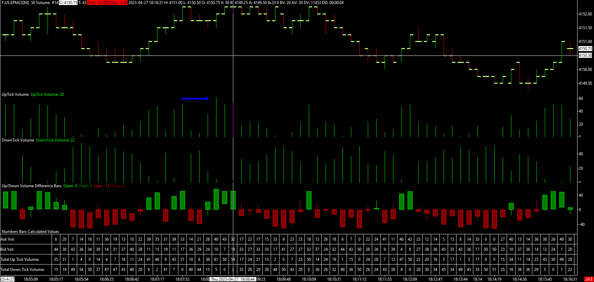

## Table of Contents

## What is downtick volume?

Downtick volume is a term used in stock trading. It refers to the total number of shares traded when the price of a stock goes down. When a stock's price drops from one trade to the next, that's called a downtick. The volume during these downticks is what we call downtick volume.

This measure is important for traders because it helps them understand how much selling pressure there is on a stock. If the downtick volume is high, it means a lot of people are selling the stock, which can push the price down even more. Traders use this information to make decisions about buying or selling stocks.

## How is downtick volume calculated?

Downtick volume is calculated by adding up all the shares that are traded when a stock's price goes down. Imagine you're watching the stock market and you see that a stock's price was $10 for the last trade, but the next trade happens at $9. That's a downtick. If 100 shares were traded during that downtick, those 100 shares are added to the downtick volume.

To keep track of downtick volume, you need to watch every trade of the stock throughout the day. Every time the price goes down from one trade to the next, you add the number of shares traded to the downtick volume. At the end of the day, you have the total downtick volume, which shows how many shares were sold when the stock's price was falling.

## Why is downtick volume important in trading?

Downtick volume is important in trading because it shows how many people are selling a stock when its price is going down. When a lot of shares are traded during downticks, it means there is a lot of selling pressure on the stock. This can make the price go down even more because more people want to sell than buy.

Traders use downtick volume to make smart choices about buying or selling stocks. If they see high downtick volume, they might decide to sell their shares before the price drops too much. On the other hand, if they think the stock is a good buy and the high downtick volume is just a temporary dip, they might buy more shares, hoping the price will go back up.

## Can downtick volume be used to predict market trends?

Downtick volume can help traders guess what might happen next in the market. When a lot of shares are traded while the price is going down, it shows that many people are selling. This can mean the price might keep going down because there are more sellers than buyers. Traders look at this to decide if they should sell their shares before the price drops more or if it's a good time to buy because the price might go back up soon.

But, downtick volume is just one piece of the puzzle. It's not perfect for predicting the future because the market can change quickly. Other things like news, company reports, and what other traders are doing also affect the market. So, while downtick volume can give clues about what might happen, it's best used with other information to make smarter guesses about market trends.

## How does downtick volume differ from uptick volume?

Downtick volume and uptick volume are two sides of the same coin in stock trading. Downtick volume is the total number of shares traded when a stock's price goes down from one trade to the next. It shows how much selling is happening when the price is falling. On the other hand, uptick volume is the total number of shares traded when a stock's price goes up from one trade to the next. It shows how much buying is happening when the price is rising.

Traders use both downtick and uptick volume to understand the market better. If downtick volume is high, it means a lot of people are selling, which can push the price down even more. If uptick volume is high, it means a lot of people are buying, which can push the price up. By looking at both, traders can see if the market is leaning more towards buying or selling and make their decisions based on that.

## What are the common tools used to measure downtick volume?

Traders use special computer programs to keep track of downtick volume. These programs watch every trade of a stock and add up the shares traded when the price goes down. They show this information in real-time on charts or tables, so traders can see how much selling is happening right away. Some popular trading platforms like Bloomberg Terminal, Thinkorswim, and TradeStation have tools that can measure downtick volume easily.

These tools also let traders compare downtick volume with other things like uptick volume or the total volume of shares traded. This helps them understand the market better. For example, if the downtick volume is much higher than the uptick volume, it might mean the stock's price could keep going down. By using these tools, traders can make smarter choices about when to buy or sell stocks.

## How can downtick volume be integrated into a trading strategy?

Downtick volume can be a big help in making a trading plan. Traders can use it to see when a lot of people are selling a stock. If the downtick volume is high, it means more people want to sell than buy, and the price might go down even more. So, a trader might decide to sell their shares before the price drops too much. Or, if they think the stock is still a good buy and the high downtick volume is just a short-term thing, they might buy more shares, hoping the price will go back up.

To use downtick volume in a trading strategy, traders often look at it with other information. They might compare it to uptick volume to see if more people are buying or selling. They could also look at the overall volume of shares traded to understand how busy the market is. By putting all this information together, traders can make better guesses about where the stock price might go next and decide when to buy or sell. Using tools like trading platforms helps them see this information quickly and make decisions on the spot.

## What are the limitations of using downtick volume as a sole indicator?

Downtick volume can be helpful, but it's not perfect to use it all by itself. It only shows how many people are selling when the price goes down, but it doesn't tell the whole story. For example, if the market is busy and a lot of shares are being traded, a high downtick volume might not mean as much because it's just part of a bigger picture. Also, sometimes the market can change quickly because of news or other things, and downtick volume alone can't predict those changes.

Because of these reasons, it's better to use downtick volume with other information. Traders often look at uptick volume too, to see if more people are buying or selling. They might also check the overall volume of shares traded and other things like stock charts and news. By looking at all these together, traders can make better guesses about what might happen next and make smarter choices about buying or selling stocks.

## How does downtick volume correlate with other market indicators?

Downtick volume can tell us a lot about what's happening in the market, but it works best when we look at it with other indicators. For example, when we compare downtick volume with uptick volume, we can see if more people are selling or buying a stock. If the downtick volume is much higher than the uptick volume, it means more people are selling, and the stock price might keep going down. But if the uptick volume is higher, it means more people are buying, and the price might go up.

Another important thing to look at is the total volume of shares traded. If the market is very busy and a lot of shares are being traded, a high downtick volume might not mean as much because it's just part of a bigger picture. Traders also use other tools like stock charts, moving averages, and news to understand the market better. By putting all this information together, traders can make better guesses about where the stock price might go next and make smarter choices about buying or selling stocks.

## What historical examples illustrate the impact of downtick volume on market movements?

One clear example of how downtick volume can affect market movements happened during the 2008 financial crisis. As the crisis unfolded, many people started selling their stocks because they were worried about losing money. This caused a lot of downtick volume, which pushed stock prices down even more. The high downtick volume showed that the market was under a lot of selling pressure, and it helped traders understand that the market was likely to keep going down until something changed.

Another example is the "Flash Crash" of May 6, 2010. On that day, the stock market suddenly dropped a lot in just a few minutes. One of the reasons this happened was because of high downtick volume. A lot of people started selling their stocks quickly, which caused the prices to fall fast. Traders who were watching the downtick volume could see that something unusual was happening and it helped them decide what to do next. These examples show how important it is to pay attention to downtick volume because it can give clues about what the market might do next.

## How do different market conditions affect the interpretation of downtick volume?

Different market conditions can change how we look at downtick volume. In a busy market, where a lot of shares are being traded, a high downtick volume might not mean as much because it's just part of the bigger picture. But in a quiet market, where not many shares are being traded, a high downtick volume can be a big warning sign that a lot of people are selling and the price might go down a lot.

During times of big news or events, like a financial crisis or a company's earnings report, downtick volume can be even more important. If there's bad news, more people might want to sell their stocks, which makes the downtick volume go up. Traders need to look at the news and the downtick volume together to understand if the selling is because of the news or something else. By thinking about all these things, traders can make better guesses about what the market might do next.

## What advanced techniques can be used to analyze downtick volume data for expert traders?

Expert traders can use advanced techniques like volume-weighted average price (VWAP) to analyze downtick volume. VWAP takes into account the price and the volume of trades to give a better picture of how the stock is doing. By comparing the downtick volume to the VWAP, traders can see if the selling is happening at prices that are higher or lower than the average. This can help them decide if the stock is being sold off because it's overvalued or if it's a good time to buy because the price might go back up.

Another technique is using technical indicators like the On-Balance Volume (OBV). OBV adds up the volume on days when the price goes up and subtracts it on days when the price goes down. By looking at how the OBV changes along with downtick volume, traders can see if the selling is part of a bigger trend or just a short-term thing. This can help them predict if the stock price will keep going down or if it's time to buy because the selling might stop soon.

## What is Downtick Volume and How Can We Understand It?

Downtick volume is a concept utilized in stock trading to gauge the selling pressure within a market. This metric reflects the volume of shares traded at a price lower than the previous trade, indicating a shift towards selling interest. The magnitude and frequency of downtick volume can be indicative of bearish market sentiment, as increased selling pressure typically suggests that investors are offloading shares, potentially in anticipation of further price declines.

Monitoring downtick volume is crucial for assessing market sentiment and anticipating potential price movements. A surge in downtick volume might signal an impending downturn, serving as a warning to traders about negative sentiment prevailing in the market. Conversely, a decline or absence of significant downtick volume could suggest stabilization or a potential reversal in the downtrend, as selling pressure diminishes. Investors and traders often compare downtick volume with uptick volume—the volume of shares traded at a price higher than the previous trade—to gauge the overall market direction and sentiment more accurately.

Calculating downtick [volume](/wiki/volume-trading-strategy) is straightforward. For every transaction executed at a price lower than the previous trade, the number of shares traded constitutes the downtick volume. This can be expressed as:

$$
\text{Downtick Volume} = \sum \text{Volume of Trades Executed at Downward Prices}
$$

To interpret downtick volume data effectively, traders might visualize it alongside overall market volume or within specific time frames to identify patterns. High downtick volume, for instance, in conjunction with declining stock prices and increased [volatility](/wiki/volatility-trading-strategies), typically signals a strong bearish trend. Analyzing this data helps traders determine whether the current market trend is likely to continue or reverse.

Incorporating downtick volume analysis into trading strategies can enhance understanding of market dynamics and improve trade timing. It serves as a vital component for traders who aim to capitalize on short-term price movements and manage risk effectively. By combining downtick volume with other technical indicators, traders can formulate comprehensive strategies to navigate the complexities of the stock market.

## Can Downtick Volume be used as a Market Indicator?

Downtick volume serves as a pivotal market indicator, providing investors with insights into potential market trends and reversals. By tracking the volume of shares sold at a lower price compared to the previous transaction, traders can gauge selling pressure and market sentiment. This data is instrumental in predicting bearish market trends where increased downtick volume may signal impending price declines or reversals. 

Comparatively, uptick volume refers to the volume of shares sold at a higher price than the preceding trade. Together, downtick and uptick volumes inform the calculation of the Tick Index, a valuable metric for assessing overall market sentiment. The Tick Index is defined as the difference between the number of stocks trading on an uptick versus those trading on a downtick at any given time:

$$
\text{Tick Index} = \text{Number of Uptick Stocks} - \text{Number of Downtick Stocks}
$$

A positive Tick Index suggests bullish sentiment, while a negative value indicates bearish sentiment.

Consider the case of a high-frequency trading environment where rapid fluctuations in downtick volume occur. For instance, during the COVID-19 pandemic's initial onset, specific stocks exhibited pronounced downtick volumes as investors anticipated economic disruption. These downtick volumes, coupled with macroeconomic indicators, acted as precursors to significant market downturns. 

Analyzing downtick volume alongside other technical indicators, such as moving averages or the Relative Strength Index (RSI), can yield more comprehensive insights. By identifying periods of heightened downtick activity, traders can implement strategic buying during anticipated market corrections, thereby capitalizing on lower entry points.

In practice, the strategic application of downtick volume analysis can resemble the following Python approach for [backtesting](/wiki/backtesting) a simple trading strategy:

```python
import pandas as pd
import numpy as np

# Assuming df is a DataFrame containing stock data with columns: 'Close', 'Volume', 'Tick'
def downtick_strategy(df):
    # Calculate Tick Index
    df['Tick Index'] = df['Uptick'] - df['Downtick']

    # Signal: Buy when Tick Index is significantly negative and downtick volume exceeds a threshold
    df['Signal'] = np.where((df['Tick Index'] < -100) & (df['Downtick'] > df['Downtick'].rolling(window=5).mean() * 1.5), 1, 0)

    # Calculate returns based on signals
    df['Daily Return'] = df['Close'].pct_change()
    df['Strategy Return'] = df['Signal'].shift(1) * df['Daily Return']

    # Return cumulative strategy performance
    return (1 + df['Strategy Return']).cumprod() - 1

# Example data and execution
# df = pd.read_csv('stock_data.csv')
# performance = downtick_strategy(df)
# print(performance)
```

This code snippet illustrates how traders might assess downtick volume against historical benchmarks to derive signals that guide market entry points. Understanding and leveraging downtick volume empowers traders to navigate market complexities more adeptly, especially in volatile environments.

## How can one develop a trading strategy using downtick volume?

Creating a trading strategy based on downtick volume involves a systematic approach where the key objective is to understand the nuances of selling pressure and price movement. By effectively interpreting downtick volume, traders can gain significant insights into market sentiment and potential trend reversals or continuations.

### Step-by-Step Guide to Creating a Trading Strategy

1. **Data Collection and Preparation**
   - Gather historical stock data, focusing on tick-by-tick data that captures each trade and its associated volume.
   - Extract downtick volume data, which represents the volume of trades executed at a price lower than the previous trade. This information is crucial in determining selling pressure.

   ```python
   import pandas as pd

   # Load your tick data
   data = pd.read_csv('historical_tick_data.csv')

   # Calculate downtick volume
   data['DowntickVolume'] = data.apply(lambda row: row['Volume'] if row['Price'] < row['PrevPrice'] else 0, axis=1)
   ```

2. **Indicator Calculation**
   - Calculate the Downtick/Uptick Ratio (D/U Ratio), a common indicator contrasting downtick volume with uptick volume:
$$
   \text{D/U Ratio} = \frac{\text{Downtick Volume}}{\text{Uptick Volume}}

$$

   This ratio aids in understanding whether the market is under more selling or buying pressure.

3. **Technical Analysis Integration**
   - Combine downtick volume with other technical indicators, such as the Moving Average (MA) or the Relative Strength Index (RSI), to enhance predictive reliability.
   - For example, integrating a short-term moving average with the D/U Ratio can help confirm trends:

   ```python
   data['Short_MA'] = data['Price'].rolling(window=5).mean()

   # Conditional strategy based on MA and D/U Ratio
   data['Signal'] = (data['Short_MA'] < data['Price']) & (data['DowntickVolume'] > data['UptickVolume'])
   ```

4. **Backtesting the Strategy**
   - Test the strategy over historical data to evaluate its performance. Assess how it would have reacted during different market conditions, especially during known periods of high volatility.

5. **Risk Management and Optimization**
   - Implement risk management techniques such as stop-loss and take-profit limits.
   - Optimize the strategy by adjusting parameters (e.g., the lookback period for moving averages) to balance between overfitting and underfitting on historical data.

### Tips on Integrating Technical Analysis with Downtick Volume

- **Divergence Analysis**: Look for divergences between downtick volume trends and price action. A strong downtick trend without a corresponding price drop can signal potential reversals.
- **Volume Profile**: Use downtick volume to enhance volume profile analysis, identifying significant price levels where there is noticeable selling pressure.
- **Combining with Market Sentiment**: Augment downtick volume analysis with sentiment indicators like the Put/Call Ratio to gauge broader market sentiment beyond simple trade data.

### Examples of Successful Trading Strategies

1. **Contrarian Strategy**: Capitalize on instances where downtick volume spikes in an uptrend. Such spikes often precede short-term corrections, providing opportunities for profit through short-selling.

2. **Breakout Strategy**: Use persistent downtick volume in consolidation phases to predict downward breakouts. This strategy can be particularly useful in trading ranges that lack clear price direction but show volume asymmetry.

By following these structured steps and leveraging the right integrations and analyses, traders can craft robust trading strategies that harness the power of downtick volume for better decision-making and potentially improved trading outcomes.

## References & Further Reading

[1]: ["Advances in Financial Machine Learning"](https://www.amazon.com/Advances-Financial-Machine-Learning-Marcos/dp/1119482089) by Marcos Lopez de Prado

[2]: Bergstra, J., Bardenet, R., Bengio, Y., & Kégl, B. (2011). ["Algorithms for Hyper-Parameter Optimization."](https://dl.acm.org/doi/10.5555/2986459.2986743) Advances in Neural Information Processing Systems 24.

[3]: ["Evidence-Based Technical Analysis: Applying the Scientific Method and Statistical Inference to Trading Signals"](https://www.amazon.com/Evidence-Based-Technical-Analysis-Scientific-Statistical/dp/0470008741) by David Aronson

[4]: ["Quantitative Trading: How to Build Your Own Algorithmic Trading Business"](https://www.amazon.com/Quantitative-Trading-Build-Algorithmic-Business/dp/1119800064) by Ernest P. Chan

[5]: ["Machine Learning for Algorithmic Trading"](https://github.com/stefan-jansen/machine-learning-for-trading) by Stefan Jansen