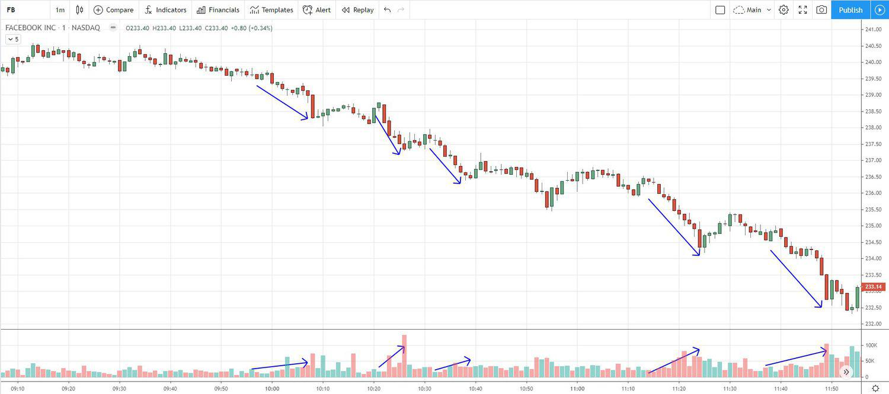

Stock trading market analysis is an essential component in understanding market trends and making informed trading decisions. It involves a comprehensive examination of historical data, statistical analyses, and various indicators to forecast future price movements. This analysis is crucial for investors and traders as it supports the development of strategies aimed at maximizing returns while minimizing risks. 

Among the myriad concepts that underpin market analysis is downtick volume, which plays a pivotal role in assessing price trends and market sentiment. Downtick volume refers to the total number of shares traded at a price lower than the last different price, thereby representing selling pressure in the stock market. By monitoring downtick volume, traders can gauge the intensity of selling activity, which is critical for predicting potential price declines or reversals. For example, a significant surge in downtick volume might suggest an imminent downtrend, often prompting traders to reassess their positions.



Simultaneously, the landscape of stock trading is undergoing a profound transformation with the rise of algorithmic trading. Algorithmic trading involves the use of computer programs to execute trades based on predefined criteria. This method enhances trading efficiency by reducing the impact of human emotions and errors while optimizing the speed of execution. Algorithms increasingly incorporate volume analysis, including downtick volume, to automate trading decisions. By analyzing patterns in downtick volume, these systems can predict market movements more reliably, allowing for the optimization of buy and sell strategies.

The aim of this article is to explore the intricacies of downtick volume and its application as a market indicator. Additionally, it will examine the integration of downtick volume within algorithmic trading strategies. This exploration will provide readers with deeper insights into the utility of downtick volume metrics and equip them with knowledge to develop or refine their trading strategies in the dynamically evolving stock markets.

## Table of Contents

## Understanding Downtick Volume

Downtick volume is a concept utilized in stock trading to gauge the selling pressure within a market. This metric reflects the volume of shares traded at a price lower than the previous trade, indicating a shift towards selling interest. The magnitude and frequency of downtick volume can be indicative of bearish market sentiment, as increased selling pressure typically suggests that investors are offloading shares, potentially in anticipation of further price declines.

Monitoring downtick volume is crucial for assessing market sentiment and anticipating potential price movements. A surge in downtick volume might signal an impending downturn, serving as a warning to traders about negative sentiment prevailing in the market. Conversely, a decline or absence of significant downtick volume could suggest stabilization or a potential reversal in the downtrend, as selling pressure diminishes. Investors and traders often compare downtick volume with uptick volume—the volume of shares traded at a price higher than the previous trade—to gauge the overall market direction and sentiment more accurately.

Calculating downtick [volume](/wiki/volume-trading-strategy) is straightforward. For every transaction executed at a price lower than the previous trade, the number of shares traded constitutes the downtick volume. This can be expressed as:

$$
\text{Downtick Volume} = \sum \text{Volume of Trades Executed at Downward Prices}
$$

To interpret downtick volume data effectively, traders might visualize it alongside overall market volume or within specific time frames to identify patterns. High downtick volume, for instance, in conjunction with declining stock prices and increased [volatility](/wiki/volatility-trading-strategies), typically signals a strong bearish trend. Analyzing this data helps traders determine whether the current market trend is likely to continue or reverse.

Incorporating downtick volume analysis into trading strategies can enhance understanding of market dynamics and improve trade timing. It serves as a vital component for traders who aim to capitalize on short-term price movements and manage risk effectively. By combining downtick volume with other technical indicators, traders can formulate comprehensive strategies to navigate the complexities of the stock market.

## Downtick Volume as a Market Indicator

Downtick volume serves as a pivotal market indicator, providing investors with insights into potential market trends and reversals. By tracking the volume of shares sold at a lower price compared to the previous transaction, traders can gauge selling pressure and market sentiment. This data is instrumental in predicting bearish market trends where increased downtick volume may signal impending price declines or reversals. 

Comparatively, uptick volume refers to the volume of shares sold at a higher price than the preceding trade. Together, downtick and uptick volumes inform the calculation of the Tick Index, a valuable metric for assessing overall market sentiment. The Tick Index is defined as the difference between the number of stocks trading on an uptick versus those trading on a downtick at any given time:

$$
\text{Tick Index} = \text{Number of Uptick Stocks} - \text{Number of Downtick Stocks}
$$

A positive Tick Index suggests bullish sentiment, while a negative value indicates bearish sentiment.

Consider the case of a high-frequency trading environment where rapid fluctuations in downtick volume occur. For instance, during the COVID-19 pandemic's initial onset, specific stocks exhibited pronounced downtick volumes as investors anticipated economic disruption. These downtick volumes, coupled with macroeconomic indicators, acted as precursors to significant market downturns. 

Analyzing downtick volume alongside other technical indicators, such as moving averages or the Relative Strength Index (RSI), can yield more comprehensive insights. By identifying periods of heightened downtick activity, traders can implement strategic buying during anticipated market corrections, thereby capitalizing on lower entry points.

In practice, the strategic application of downtick volume analysis can resemble the following Python approach for [backtesting](/wiki/backtesting) a simple trading strategy:

```python
import pandas as pd
import numpy as np

# Assuming df is a DataFrame containing stock data with columns: 'Close', 'Volume', 'Tick'
def downtick_strategy(df):
    # Calculate Tick Index
    df['Tick Index'] = df['Uptick'] - df['Downtick']

    # Signal: Buy when Tick Index is significantly negative and downtick volume exceeds a threshold
    df['Signal'] = np.where((df['Tick Index'] < -100) & (df['Downtick'] > df['Downtick'].rolling(window=5).mean() * 1.5), 1, 0)

    # Calculate returns based on signals
    df['Daily Return'] = df['Close'].pct_change()
    df['Strategy Return'] = df['Signal'].shift(1) * df['Daily Return']

    # Return cumulative strategy performance
    return (1 + df['Strategy Return']).cumprod() - 1

# Example data and execution
# df = pd.read_csv('stock_data.csv')
# performance = downtick_strategy(df)
# print(performance)
```

This code snippet illustrates how traders might assess downtick volume against historical benchmarks to derive signals that guide market entry points. Understanding and leveraging downtick volume empowers traders to navigate market complexities more adeptly, especially in volatile environments.

## Algorithmic Trading and Downtick Volume

Algorithmic trading refers to the use of computer algorithms to facilitate trading decisions. These algorithms analyze a wide array of data, including stock prices, technical indicators, and trading volumes, to execute trades at optimal times and prices. Volume analysis, a crucial component in this process, helps traders understand the market's [liquidity](/wiki/liquidity-risk-premium), trend direction, and potential reversals. Downtick volume, specifically, is pivotal in gauging selling pressure within the market.

Downtick volume represents the number of shares traded at a lower price than the previous trade. In [algorithmic trading](/wiki/algorithmic-trading), downtick volume data can be integrated into algorithms to automate trading decisions. By doing so, traders can react swiftly to market changes that suggest increasing selling pressure. Algorithms that incorporate downtick volume aim to recognize patterns indicative of price declines or bearish trends, allowing traders to [exit](/wiki/exit-strategy) positions or short-sell securities before significant price drops.

The ability to process large volumes of data quickly and execute trades instantly is one of the primary benefits of using algorithms based on downtick volume. Algorithms can detect minuscule shifts in trading patterns that humans might overlook, ensuring traders respond to market movements promptly. For instance, if a high downtick volume is detected, an algorithm might automatically execute sell orders to capitalize on anticipated price decreases.

However, there are inherent risks. Algorithms are only as good as the models they are based on. Inaccuracies in downtick volume calculations or misinterpretations of its significance could lead to incorrect trading decisions, potentially resulting in financial losses. Furthermore, the market's dynamic nature means that algorithms need continuous refinement and adaptation to remain effective, as strategies that work well under certain conditions may fail in others.

To leverage the potential of downtick volume in algorithmic trading, traders should meticulously backtest their algorithms using historical data. This process involves running the algorithm through past market data to see how it would have performed, allowing refinements before deploying it in live trading. Despite the risks, when used judiciously, algorithms analyzing downtick volume offer a sophisticated method for navigating the complexities of modern stock markets.

## Developing a Trading Strategy Using Downtick Volume

Creating a trading strategy based on downtick volume involves a systematic approach where the key objective is to understand the nuances of selling pressure and price movement. By effectively interpreting downtick volume, traders can gain significant insights into market sentiment and potential trend reversals or continuations.

### Step-by-Step Guide to Creating a Trading Strategy

1. **Data Collection and Preparation**
   - Gather historical stock data, focusing on tick-by-tick data that captures each trade and its associated volume.
   - Extract downtick volume data, which represents the volume of trades executed at a price lower than the previous trade. This information is crucial in determining selling pressure.

   ```python
   import pandas as pd

   # Load your tick data
   data = pd.read_csv('historical_tick_data.csv')

   # Calculate downtick volume
   data['DowntickVolume'] = data.apply(lambda row: row['Volume'] if row['Price'] < row['PrevPrice'] else 0, axis=1)
   ```

2. **Indicator Calculation**
   - Calculate the Downtick/Uptick Ratio (D/U Ratio), a common indicator contrasting downtick volume with uptick volume:
$$
   \text{D/U Ratio} = \frac{\text{Downtick Volume}}{\text{Uptick Volume}}

$$

   This ratio aids in understanding whether the market is under more selling or buying pressure.

3. **Technical Analysis Integration**
   - Combine downtick volume with other technical indicators, such as the Moving Average (MA) or the Relative Strength Index (RSI), to enhance predictive reliability.
   - For example, integrating a short-term moving average with the D/U Ratio can help confirm trends:

   ```python
   data['Short_MA'] = data['Price'].rolling(window=5).mean()

   # Conditional strategy based on MA and D/U Ratio
   data['Signal'] = (data['Short_MA'] < data['Price']) & (data['DowntickVolume'] > data['UptickVolume'])
   ```

4. **Backtesting the Strategy**
   - Test the strategy over historical data to evaluate its performance. Assess how it would have reacted during different market conditions, especially during known periods of high volatility.

5. **Risk Management and Optimization**
   - Implement risk management techniques such as stop-loss and take-profit limits.
   - Optimize the strategy by adjusting parameters (e.g., the lookback period for moving averages) to balance between overfitting and underfitting on historical data.

### Tips on Integrating Technical Analysis with Downtick Volume

- **Divergence Analysis**: Look for divergences between downtick volume trends and price action. A strong downtick trend without a corresponding price drop can signal potential reversals.
- **Volume Profile**: Use downtick volume to enhance volume profile analysis, identifying significant price levels where there is noticeable selling pressure.
- **Combining with Market Sentiment**: Augment downtick volume analysis with sentiment indicators like the Put/Call Ratio to gauge broader market sentiment beyond simple trade data.

### Examples of Successful Trading Strategies

1. **Contrarian Strategy**: Capitalize on instances where downtick volume spikes in an uptrend. Such spikes often precede short-term corrections, providing opportunities for profit through short-selling.

2. **Breakout Strategy**: Use persistent downtick volume in consolidation phases to predict downward breakouts. This strategy can be particularly useful in trading ranges that lack clear price direction but show volume asymmetry.

By following these structured steps and leveraging the right integrations and analyses, traders can craft robust trading strategies that harness the power of downtick volume for better decision-making and potentially improved trading outcomes.

## Conclusion and Future Outlook

The examination of downtick volume provides key insights into understanding market dynamics and sentiment shifts. Downtick volume, reflecting selling pressure, is a significant indicator of potential market directions. By analyzing downtick volume, traders can gauge prevailing sentiment and identify potential turning points in market trends. This metric, when compared with uptick volume, can be instrumental in predicting market reversals and trend continuations, offering traders a nuanced perspective on market behavior.

Algorithmic trading has fundamentally reshaped the landscape of stock markets, incorporating complex data sets and rapid decision-making processes. Algorithms utilize downtick volume data to automate trades with precision, maximizing efficiency and often capitalizing on minute market fluctuations. This automation, while offering substantial benefits in terms of speed and accuracy, also introduces risks associated with over-reliance on quantitative models without human oversight. As algorithms evolve, the integration of downtick volume analysis becomes increasingly sophisticated, enabling more nuanced and adaptive trading strategies.

Looking to the future, the role of downtick volume in algorithmic trading is poised to grow. As [machine learning](/wiki/machine-learning) and [artificial intelligence](/wiki/ai-artificial-intelligence) continue to advance, algorithms will likely become adept at interpreting downtick volume in conjunction with other indicators, refining their ability to predict market movements. Traders are encouraged to experiment with downtick volume strategies, incorporating them into broader analytical frameworks to enhance trading outcomes. The blend of human intuition and algorithmic precision may offer the most effective path forward, providing a robust basis for navigating the complexities of modern financial markets. As technology and data accessibility improve, downtick volume may become a cornerstone in developing adaptive and resilient trading strategies.

## References & Further Reading

[1]: ["Advances in Financial Machine Learning"](https://www.amazon.com/Advances-Financial-Machine-Learning-Marcos/dp/1119482089) by Marcos Lopez de Prado

[2]: Bergstra, J., Bardenet, R., Bengio, Y., & Kégl, B. (2011). ["Algorithms for Hyper-Parameter Optimization."](https://dl.acm.org/doi/10.5555/2986459.2986743) Advances in Neural Information Processing Systems 24.

[3]: ["Evidence-Based Technical Analysis: Applying the Scientific Method and Statistical Inference to Trading Signals"](https://www.amazon.com/Evidence-Based-Technical-Analysis-Scientific-Statistical/dp/0470008741) by David Aronson

[4]: ["Quantitative Trading: How to Build Your Own Algorithmic Trading Business"](https://www.amazon.com/Quantitative-Trading-Build-Algorithmic-Business/dp/1119800064) by Ernest P. Chan

[5]: ["Machine Learning for Algorithmic Trading"](https://github.com/stefan-jansen/machine-learning-for-trading) by Stefan Jansen