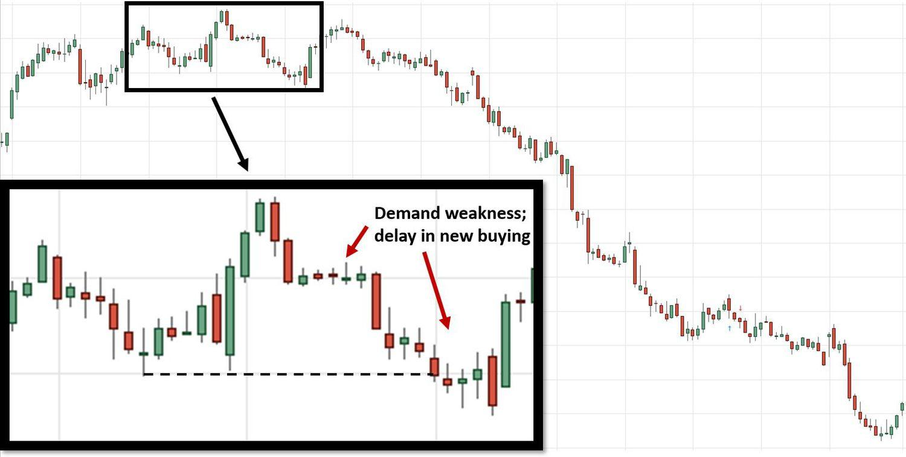

Understanding market trends is a fundamental aspect of successful trading, particularly during downtrends where market values steadily decline. A downtrend is characterized by a series of lower highs and lower lows, creating a challenging environment for traders aiming to sustain profitability. The ability to anticipate and adapt to these downward movements is crucial for minimizing losses and potentially capitalizing on favorable trading opportunities.

In this article, we explore the distinctive patterns that signify downtrend conditions and examine the role of algorithmic trading in these contexts. Algorithmic trading involves using computer algorithms to execute trades based on predetermined criteria, offering speed and precision that are indispensable in swiftly changing market scenarios. Through algorithmic methods, traders can efficiently navigate downtrends, identifying shorting opportunities or executing exit strategies that minimize losses.



We will consider various trading strategies vital for effectively addressing downtrends. By employing technical analysis, traders can recognize the onset of a downtrend through patterns and indicators. These techniques provide a systematic approach to detect changes in market sentiment and price movement.

Moreover, our discussion will expand on practical strategies that leverage the automated capabilities of algorithmic trading systems. These systems allow traders to implement complex strategies beyond traditional techniques, reacting swiftly to price shifts without the emotional biases that often accompany manual trading.

This exploration will not only provide insights into identifying and understanding market downtrends but also reveal the instrumental role of technology and strategy in navigating these financial shifts effectively.

## Table of Contents

## Understanding Downtrends

A downtrend signifies a period in which the market persistently declines in value, characterized by a series of lower highs and lower lows. Recognizing these patterns early is vital for traders, as it allows them to take preemptive actions to either safeguard their investments or capitalize on short-selling opportunities.

### Technical Aspects of Downtrends

In technical analysis, a downtrend is observed when the price of an asset moves lower over successive periods. The graphical representation often depicts a descending trajectory on a price chart. An initial sign of a downtrend may be when the asset fails to reach previous highs, indicating a weakening of market strength. Subsequently, the establishment of lower lows further confirms the trend's bearish nature.

To quantify a downtrend, traders often utilize trendlines and moving averages. A trendline is drawn by connecting the highs in the market, providing a visual cue of the downward trajectory. Similarly, moving averages, such as the 50-day or 200-day moving average, smooth out price data to highlight the prevailing market direction. When the price consistently remains below these averages, it often reinforces the presence of a downtrend.

### Key Indicators Signaling a Downtrend

Technical indicators also offer valuable insights into potential downtrend formations. For instance, the Relative Strength Index (RSI) can indicate overbought or oversold conditions in the market, with values typically below 30 suggesting a bearish trend. Additionally, the Moving Average Convergence Divergence (MACD) is often used to predict changes in the direction, with a crossover below the signal line frequently forecasting a new downtrend phase.

Another approach is using [volume](/wiki/volume-trading-strategy) as an indicator. In a healthy downtrend, declining prices are typically accompanied by increasing volume. This suggests increasing selling pressure and reinforces the validity of the downward movement.

### Early Recognition for Strategic Advantage

Early identification of a downtrend empowers traders to make informed decisions, like reducing exposure to risky positions or initiating short positions to profit from the declining market. Tools such as stop-loss orders can also be employed to limit potential losses.

Ultimately, understanding and identifying the technical aspects and indicators of downtrends enhances a trader's ability to navigate changing market environments efficiently. Recognizing these patterns not only aids in minimizing financial losses but also opens opportunities to capitalize on declining market conditions.

## Identifying Downtrend Patterns

In trading, identifying downtrend patterns is vital for anticipating market movements and optimizing trading strategies. Key chart patterns, such as the "head and shoulders" and "double top," are commonly observed when markets are poised for a decline.

The "head and shoulders" pattern is characterized by a peak (shoulder), followed by a higher peak (head), and then another lower peak (shoulder). This pattern indicates a reversal of an uptrend and suggests a potential downtrend. The "neckline" connects the lows following each shoulder. A break below this line confirms the pattern, signaling traders to consider short positions. For quantitative identification, traders often use the Relative Strength Index (RSI) or Moving Average Convergence Divergence (MACD) as technical indicators to validate the pattern.

The "double top" pattern signals a potential market reversal after a bullish phase. It features two peaks at roughly the same price level, separated by a trough. The level of support is drawn at the trough between the two peaks. When the price breaks below this level, it confirms the pattern and suggests a bearish move. Traders frequently reference historical data to reinforce the pattern's validity by analyzing price movements. Integrating the Bollinger Bands can help in understanding [volatility](/wiki/volatility-trading-strategies) around these peaks, providing further validation.

Utilizing historical data enhances pattern identification. Traders can employ libraries like Python's pandas and matplotlib to analyze and visualize historical price data, aiding in the recognition of these patterns. A sample code snippet for identifying a double top might look like this:

```python
import pandas as pd
import matplotlib.pyplot as plt

# Load historical price data
data = pd.read_csv('historical_prices.csv')
prices = data['Close']

# Calculate rolling max/min for detecting peaks
rolling_max = prices.rolling(window=20).max()
rolling_min = prices.rolling(window=20).min()

# Plot price data with identified tops
plt.plot(prices, label='Price')
plt.plot(rolling_max, label='Rolling Max', linestyle='--')
plt.plot(rolling_min, label='Rolling Min', linestyle='--')
plt.scatter(prices.index[prices == rolling_max], rolling_max.dropna(), color='red')
plt.title('Double Top Identification')
plt.xlabel('Time')
plt.ylabel('Price')
plt.legend()
plt.show()
```

Understanding these chart formations through a combination of pattern recognition and technical indicators enables traders to predict potential downtrend conditions more accurately. Calculating and visualizing past market data provides tangible insights into the reliability of these patterns, thus aiding the development of better-informed trading decisions.

## Algorithmic Trading in Downtrends

Algorithmic trading, commonly referred to as algo trading, has become increasingly prominent in navigating downtrending markets. It leverages the power of automated systems to execute trades rapidly and efficiently, making it particularly valuable in fast-paced market conditions characterized by declining asset values. 

One of the primary advantages of [algorithmic trading](/wiki/algorithmic-trading) in downtrends is its ability to recognize and capitalize on market patterns that signal a continuation of a downtrend. By employing sophisticated algorithms, traders can predefine conditions based on technical indicators such as moving averages, relative strength index (RSI), and Bollinger Bands. These algorithms can be calibrated to automatically execute buy or sell orders when specific conditions are met, reducing the time delay associated with manual trading.

For example, an algorithm might be designed to short sell an asset when its 50-day moving average crosses below its 200-day moving average, a classic signal of a downtrend. The pseudocode for such an algorithm might look like this:

```python
def moving_average(prices, days):
    return sum(prices[-days:]) / days

def trading_signal(prices):
    ma_short = moving_average(prices, 50)
    ma_long = moving_average(prices, 200)
    if ma_short < ma_long:
        return 'Sell'
    else:
        return 'Hold'

trade_action = trading_signal(price_data)
```

Beyond execution speed, algo trading enhances strategic decisions by removing emotional biases that can lead to suboptimal trading choices, especially during volatile market conditions inherent in downtrends. Algorithms act strictly according to logical parameters, ensuring consistent application of a trading strategy.

Another critical benefit is risk management. Algorithms provide traders with tools to set stop-loss orders and other risk mitigation techniques automatically. This capability is essential in downtrending markets where quick price movements can potentially expose traders to significant losses. Predefined risk management strategies embedded within the algorithm ensure that trades are automatically adjusted to limit exposure to unfavorable market movements.

Furthermore, the [backtesting](/wiki/backtesting) feature of algorithmic trading allows strategies to be tested on historical data to evaluate their effectiveness in past market conditions before they are deployed live. This practice supports the refinement of strategies, ensuring they are robust and effective in managing downtrend risks.

In conclusion, algorithmic trading provides substantial benefits in downtrending markets by offering consistent execution, enhanced strategic decision-making, and improved risk management. Adopting algo trading strategies can give traders an edge in responding to rapid market changes and optimizing their trading outcomes effectively.

## Trading Strategies for Downtrending Markets

In downtrending markets, traders often employ specific strategies to capitalize on declining prices or protect their portfolios from losses. One of the most common strategies is short selling, which involves borrowing shares of a stock and selling them, hoping to repurchase them later at a lower price. This approach, while potentially highly profitable, carries significant risk, especially if the market moves against the trader's position, leading to unlimited potential losses.

Another strategy involves using options, particularly put options. A put option gives the holder the right, but not the obligation, to sell a specified amount of an underlying asset at a predetermined price before the option expires. This strategy can be used both for speculation, to profit from a decline in the asset's price, and for hedging, to protect against potential downside in an existing portfolio.

Inverse Exchange-Traded Funds (ETFs) are also popular tools in downtrending markets. These ETFs are designed to produce returns that are inversely proportional to the index or benchmark they track. By investing in an inverse [ETF](/wiki/etf-trading-strategies), a trader can gain from market declines without engaging in short selling. However, due to daily rebalancing, these ETFs are typically better suited for short-term strategies rather than long-term holding.

Implementing these strategies requires a thorough understanding of their mechanisms and potential pitfalls. Short selling, for example, necessitates a margin account and may incur interest costs on margin loans. Additionally, traders must be wary of short squeezes, where a rapid increase in a stock's price can force short sellers to cover their positions at a loss. 

Options trading involves understanding complex pricing models, such as the Black-Scholes model, and requires knowledge of concepts like implied volatility and the Greeks (delta, gamma, theta, and vega), which measure the sensitivity of an option's price to various factors. 

Inverse ETFs, while accessible, come with their own set of risks, particularly related to tracking errors and the compounding effects of daily returns. Traders should carefully consider these factors and conduct thorough research before engaging in any strategy during downtrending markets. 

In Python, traders can use libraries such as NumPy and pandas to model and simulate potential outcomes of these strategies. For example, calculating the potential profit from short selling or the value of an option contract can be supported by using real-time data and computational models to inform decision-making. 

Overall, while downtrends present opportunities for profit, they require traders to execute strategies with precision, awareness of risks, and a robust understanding of market dynamics.

## Case Study: Historical Downtrend Examples

Examining historical downtrend markets, such as the 2008 financial crisis, provides valuable insights into pattern formation and market psychology. One notable aspect of the 2008 crisis was the rapid decline in market confidence, which led to a significant global financial downturn. This period was marked by widespread fear and a [liquidity](/wiki/liquidity-risk-premium) crunch, resulting from the collapse of major financial institutions like Lehman Brothers. The cascading effects were indicative of a classic downtrend, characterized by persistent lower highs and lower lows visible on various financial charts.

During this crisis, several key factors contributed to the pronounced downtrend. The housing market bubble burst, leading to massive defaults on subprime mortgages. This rippled through the financial system, affecting mortgage-backed securities and related derivatives. The contagion effect was amplified by high leverage and inadequate risk management practices among financial institutions. These macroeconomic factors combined with technical signals created a formidable downtrend pattern.

Investors and traders during the 2008 downturn utilized various strategies to mitigate losses or capitalize on the declining market. One common approach was short selling, where traders borrowed shares to sell at a high price and repurchase them at a lower price as the market fell. Another strategy involved using options, specifically purchasing put options, which allowed investors to profit from the decrease in underlying asset prices. For more risk-averse participants, inverse exchange-traded funds (ETFs) offered a mechanism to gain from falling markets without directly engaging in high-risk shorts.

Algorithmic trading also played a crucial role during the 2008 crisis, as algorithms could swiftly analyze vast amounts of data to identify potential downtrend signals. By leveraging pre-set trading conditions, algorithms executed trades rapidly, optimizing entry and [exit](/wiki/exit-strategy) points which human traders might miss due to emotional biases or slower reaction times.

Analyzing the strategies that were effective during the 2008 downtrend reveals common themes that are applicable to navigating future financial downturns. Maintaining a diversified portfolio with hedging instruments like options and inverse ETFs can mitigate risk. Additionally, employing algorithmic trading techniques can enhance the precision and timing of trades. As history illustrates, understanding both the technical aspects and the underlying economic conditions is essential for successfully managing downtrending markets.

## Conclusion

Navigating downtrend markets can indeed be challenging, yet these periods also offer substantial opportunities for traders who are equipped with the right tools and strategies. Recognizing the signs of a downtrend early is pivotal in reducing potential losses and positioning oneself for profitable trades. 

Technical analysis remains one of the most valuable approaches for understanding market movements during downtrends. By analyzing price patterns and employing technical indicators, traders can make informed predictions about future market behavior. Tools such as moving averages, Relative Strength Index (RSI), and trend lines can help identify whether prices are likely to continue falling or if a reversal might occur. Algorithmic trading, or algo trading, supplements these efforts by enabling automated execution of trading strategies based on pre-set rules, helping traders respond swiftly to shifting market conditions. These algorithms can be designed to recognize specific downtrend patterns, execute trades at optimal moments, and manage risks more effectively. This is particularly beneficial in fast-paced markets where human traders might struggle to keep up with the rapid pace of change.

A trader's success in downtrend markets is significantly enhanced by ongoing learning and flexibility. Markets are dynamic and influenced by various factors, from geopolitical events to economic policies; thus, staying informed and adapting strategies accordingly is crucial. 

For instance, continually backtesting strategies against historical data ensures their viability across different market conditions. This practice helps traders refine their approaches and gain confidence in their decision-making processes. Moreover, engaging with educational resources and community forums can provide additional insights and contribute to a deeper understanding of market trends.

In conclusion, while downtrend markets may appear intimidating, they present unique opportunities for those prepared to leverage technical analysis and algorithmic trading effectively. The key lies in continuous learning and the ability to adjust strategies in response to ever-evolving market scenarios, which can make the difference between making losses and securing gains in such market environments.

## References & Further Reading

[1]: Bergstra, J., Bardenet, R., Bengio, Y., & Kégl, B. (2011). ["Algorithms for Hyper-Parameter Optimization."](https://papers.nips.cc/paper/4443-algorithms-for-hyper-parameter-optimization) Advances in Neural Information Processing Systems 24.

[2]: ["Advances in Financial Machine Learning"](https://www.amazon.com/Advances-Financial-Machine-Learning-Marcos/dp/1119482089) by Marcos Lopez de Prado

[3]: ["Evidence-Based Technical Analysis: Applying the Scientific Method and Statistical Inference to Trading Signals"](https://www.amazon.com/Evidence-Based-Technical-Analysis-Scientific-Statistical/dp/0470008741) by David Aronson

[4]: ["Machine Learning for Algorithmic Trading"](https://github.com/stefan-jansen/machine-learning-for-trading) by Stefan Jansen

[5]: ["Quantitative Trading: How to Build Your Own Algorithmic Trading Business"](https://www.amazon.com/Quantitative-Trading-Build-Algorithmic-Business/dp/1119800064) by Ernest P. Chan