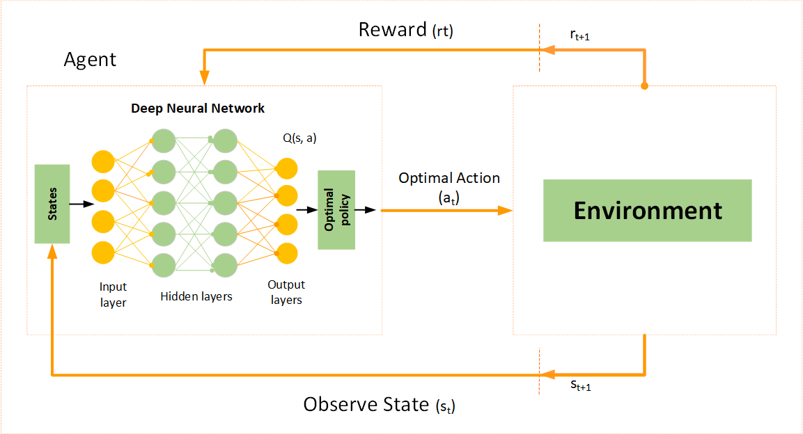

## Table of Contents

## What is DQN and what does it stand for?

DQN stands for Deep Q-Network. It's a type of artificial intelligence that helps machines learn to make decisions by themselves. Imagine you're playing a video game and you need to decide which move to make next. DQN helps the computer figure out the best move by learning from past games. It does this by using something called a neural network, which is like a brain for the computer, to predict how good each move will be.

In DQN, the computer uses a method called Q-learning. Q-learning is a way for the computer to learn what actions will lead to the best results. The computer keeps track of these results using something called a Q-value, which is a number that tells how good an action is in a certain situation. The formula for updating the Q-value is $$Q(s, a) = Q(s, a) + \alpha (r + \gamma \max_{a'} Q(s', a') - Q(s, a))$$, where $$s$$ is the current state, $$a$$ is the action taken, $$r$$ is the reward received, $$s'$$ is the next state, $$\alpha$$ is the learning rate, and $$\gamma$$ is the discount factor. By using this formula, the computer can improve its decisions over time, getting better at the game or task it's learning.

## How does DQN differ from traditional reinforcement learning methods?

DQN differs from traditional reinforcement learning methods mainly because it uses a neural network to estimate the Q-values instead of using a table. In traditional methods, like Q-learning, you keep a table that lists all possible states and actions, and you update the Q-values in this table as you learn. This works well for simple problems with few states and actions, but it becomes hard to manage when the number of states and actions grows large. DQN solves this problem by using a neural network, which can handle much larger and more complex problems. The neural network learns to predict Q-values for any given state and action, which means it can work with environments that have a huge number of possible states and actions.

Another key difference is how DQN handles the issue of correlated data and the stability of learning. In traditional methods, the learning can be unstable because the data used to update the Q-values is often closely related, or correlated. DQN addresses this by using a technique called experience replay. It stores the experiences (state, action, reward, next state) in a memory buffer and then samples from this buffer randomly when it's time to learn. This randomness helps break the correlation between experiences, making the learning process more stable. Additionally, DQN uses two neural networks: one for making decisions and another, called the target network, for calculating the target Q-values. The target network is updated less frequently, which also helps stabilize the learning process. The formula for updating the Q-values in DQN remains the same as in traditional Q-learning: $$Q(s, a) = Q(s, a) + \alpha (r + \gamma \max_{a'} Q(s', a') - Q(s, a))$$, but now the Q-values are estimated by the neural network.

## What are the key components of a DQN architecture?

The key components of a DQN architecture include a [neural network](/wiki/neural-network) that estimates Q-values, a memory buffer for experience replay, and a target network for stable learning. The neural network is at the heart of DQN. It takes in the current state of the environment and outputs Q-values for all possible actions. This allows the DQN to handle complex environments with many states and actions. The memory buffer stores experiences, which are tuples of state, action, reward, and next state. By randomly sampling from this buffer, DQN can break the correlation between experiences, making the learning process more stable and efficient.

Another important component is the target network, which is a copy of the main neural network used for calculating target Q-values. The target network helps stabilize learning by being updated less frequently than the main network. When updating the Q-values, DQN uses the formula $$Q(s, a) = Q(s, a) + \alpha (r + \gamma \max_{a'} Q(s', a') - Q(s, a))$$, where $$s$$ is the current state, $$a$$ is the action taken, $$r$$ is the reward received, $$s'$$ is the next state, $$\alpha$$ is the learning rate, and $$\gamma$$ is the discount [factor](/wiki/factor-investing). The target network provides the values for $$\max_{a'} Q(s', a')$$, ensuring that the updates are based on a more stable estimate of future rewards.

## How does the experience replay mechanism work in DQN?

Experience replay in DQN is like a memory trick that helps the computer learn better. When the DQN is playing a game or doing a task, it keeps track of everything it does. Every time it takes an action, it remembers the state it was in, the action it took, the reward it got, and the new state it ended up in. All these memories are stored in a big list called a memory buffer. Instead of learning from these experiences right away, the DQN waits and then picks some of these memories randomly from the buffer to learn from. This randomness helps the DQN learn in a more stable way because it doesn't always see the same kind of experiences one after the other.

When the DQN is ready to learn, it uses a formula to update its Q-values. The formula is $$Q(s, a) = Q(s, a) + \alpha (r + \gamma \max_{a'} Q(s', a') - Q(s, a))$$. Here, $$s$$ is the current state, $$a$$ is the action taken, $$r$$ is the reward received, $$s'$$ is the next state, $$\alpha$$ is the learning rate, and $$\gamma$$ is the discount factor. By using the experiences from the memory buffer, the DQN can improve its predictions of how good different actions are. This way, it gets better at choosing the best actions over time, making it smarter at playing the game or doing the task.

## What is the role of the Q-network in DQN?

The Q-network in DQN is like the brain of the system. It's a special kind of computer program called a neural network that helps the DQN figure out how good different actions are in different situations. When the DQN is playing a game or doing a task, it looks at the current state of things and asks the Q-network, "What should I do next?" The Q-network then tells the DQN which action is likely to be the best by giving it a score, called a Q-value, for each possible action. This helps the DQN choose the action that will lead to the best outcome.

The Q-network learns to predict these Q-values better over time by using a formula called Q-learning. The formula is $$Q(s, a) = Q(s, a) + \alpha (r + \gamma \max_{a'} Q(s', a') - Q(s, a))$$, where $$s$$ is the current state, $$a$$ is the action taken, $$r$$ is the reward received, $$s'$$ is the next state, $$\alpha$$ is the learning rate, and $$\gamma$$ is the discount factor. Every time the DQN does something, it remembers what happened and uses this formula to update the Q-values. By doing this again and again, the Q-network gets better at guessing which actions will lead to the best results, helping the DQN become smarter at the game or task it's working on.

## How is the target network used in DQN and why is it important?

The target network in DQN is like a helpful friend that keeps the learning process steady. When the DQN is trying to figure out how good different actions are, it uses a special formula called Q-learning. The formula is $$Q(s, a) = Q(s, a) + \alpha (r + \gamma \max_{a'} Q(s', a') - Q(s, a))$$. In this formula, the DQN needs to know the Q-value of the next state to update the current Q-value. The target network helps by giving these next state Q-values, but it does this less often than the main network updates. This makes the learning process more stable because the target values don't change too quickly.

The reason the target network is important is that it helps avoid a problem called instability. When the DQN is learning, if the Q-values change too fast, the learning can become chaotic and the DQN might not learn well. By using the target network, which updates more slowly, the DQN gets a more reliable estimate of future rewards. This slow updating helps the DQN learn in a smoother and more consistent way, making it better at figuring out the best actions over time.

## What are the typical hyperparameters used in DQN and how do they affect performance?

In DQN, there are several important settings called hyperparameters that affect how well the DQN learns. One of these is the learning rate, often written as $$\alpha$$. This setting controls how quickly the DQN updates its Q-values. If the learning rate is too high, the DQN might change its mind too fast and miss out on finding the best actions. If it's too low, the DQN might learn very slowly and take a long time to get good at the task. Another important hyperparameter is the discount factor, written as $$\gamma$$. This setting tells the DQN how much it should care about future rewards compared to immediate rewards. A high discount factor means the DQN will focus more on long-term rewards, while a low one means it will focus more on short-term rewards.

Other hyperparameters include the size of the memory buffer and the frequency of updating the target network. The memory buffer size affects how many experiences the DQN can store and learn from. A larger buffer can help the DQN learn from a wider range of experiences, but it also takes up more computer memory. The frequency of updating the target network, often called the target network update interval, affects how stable the learning process is. If the target network is updated too often, the learning can become unstable. If it's updated too rarely, the DQN might not learn as quickly as it could. By tweaking these hyperparameters, you can help the DQN learn better and perform well at its task.

## Can you explain the concept of epsilon-greedy exploration in the context of DQN?

Epsilon-greedy exploration is a way to help the DQN learn better by trying out new things. Imagine you're playing a game and you always choose the move that you think is the best. You might miss out on finding even better moves if you never try something different. In DQN, epsilon-greedy exploration means that sometimes, instead of always choosing the action with the highest Q-value, the DQN will pick a random action. This is controlled by a setting called epsilon, which decides how often the DQN should explore new actions instead of sticking with what it thinks is best.

The value of epsilon starts high, so the DQN tries out lots of different actions at first. Over time, epsilon slowly gets smaller, so the DQN starts to rely more on what it has learned. This way, the DQN can explore the game or task and find good actions early on, and then focus on using those good actions more often as it gets better. The formula for choosing an action using epsilon-greedy exploration can be written as: if a random number is less than epsilon, choose a random action; otherwise, choose the action with the highest Q-value. This balance between exploring and exploiting what's been learned helps the DQN improve its performance over time.

## How does DQN handle the problem of overestimation in Q-values?

DQN can sometimes think that certain actions are better than they really are, which is called overestimation. This happens because the Q-network might guess too high on the Q-values for some actions. To fix this, a special kind of DQN called Double DQN was created. Double DQN uses two Q-networks instead of one. One network picks the best action, and the other network tells how good that action is. This way, the DQN doesn't always trust its own guesses and can get a more accurate idea of how good different actions are. The formula for updating the Q-values in Double DQN is $$Q(s, a) = Q(s, a) + \alpha (r + \gamma Q(s', \text{argmax}_{a'} Q(s', a'; \theta)) - Q(s, a))$$, where $$\theta$$ is the parameters of the main Q-network and the target Q-values are calculated using a different network.

By using two networks, Double DQN can reduce the problem of overestimation. The first network decides which action to take, and the second network, which is updated less often, checks how good that action really is. This helps the DQN learn more accurately and make better choices over time. The idea is to make sure the DQN doesn't get too excited about actions that seem good but might not be the best in the long run. By balancing the guesses from two networks, Double DQN can improve its performance and make smarter decisions in games or tasks.

## What are some common challenges and limitations when implementing DQN?

One of the main challenges when implementing DQN is dealing with the large amount of computer power and memory it needs. DQN uses a neural network to guess how good different actions are, and this neural network can be very big and complicated. It also needs to store lots of experiences in a memory buffer to learn from. If the game or task has many different states and actions, the DQN might need even more power and memory. This can make it hard to use DQN on smaller computers or for tasks that change a lot over time.

Another challenge is making sure the DQN learns the right things. Sometimes, the DQN might think some actions are better than they really are, which is called overestimation. To fix this, people use a special kind of DQN called Double DQN. Double DQN uses two Q-networks to make better guesses about how good actions are. The formula for updating the Q-values in Double DQN is $$Q(s, a) = Q(s, a) + \alpha (r + \gamma Q(s', \text{argmax}_{a'} Q(s', a'; \theta)) - Q(s, a))$$, where $$\theta$$ is the parameters of the main Q-network. This helps the DQN learn more accurately, but it also makes the system more complicated to set up and run.

Lastly, choosing the right settings, or hyperparameters, for DQN can be tricky. Things like the learning rate, the discount factor, and how often to update the target network can all affect how well the DQN learns. If these settings are not right, the DQN might learn too slowly, too quickly, or not at all. Finding the best settings often takes a lot of trying different things and seeing what works best for the specific game or task you're working on.

## How can DQN be extended or modified to improve performance, such as Double DQN or Dueling DQN?

One way to improve DQN is by using Double DQN. Double DQN helps fix a problem where DQN might think some actions are better than they really are, called overestimation. It does this by using two Q-networks instead of one. One network picks the best action, and the other network tells how good that action is. This way, Double DQN can get a more accurate idea of how good different actions are. The formula for updating the Q-values in Double DQN is $$Q(s, a) = Q(s, a) + \alpha (r + \gamma Q(s', \text{argmax}_{a'} Q(s', a'; \theta)) - Q(s, a))$$, where $$\theta$$ is the parameters of the main Q-network. By using two networks, Double DQN can learn more accurately and make better choices over time.

Another way to improve DQN is by using Dueling DQN. Dueling DQN changes the Q-network to make it better at figuring out which actions are good and which ones are not so good. It does this by splitting the Q-network into two parts: one part that guesses how good the current state is, and another part that guesses how much better or worse each action is compared to the average. This helps the DQN learn more about the overall value of being in a certain state and how different actions change that value. By understanding the state and action values separately, Dueling DQN can make smarter decisions and improve its performance in games or tasks.

## What are some real-world applications where DQN has been successfully applied?

DQN has been successfully used in video games, especially in the game of Atari. Researchers used DQN to train a computer to play many different Atari games, like Breakout and Space Invaders, just by watching the screen and getting scores. The DQN learned to play these games better than many human players by using a special kind of computer program called a neural network. This neural network helped the DQN figure out the best moves to make by guessing how good different actions would be. The formula for updating the Q-values in DQN is $$Q(s, a) = Q(s, a) + \alpha (r + \gamma \max_{a'} Q(s', a') - Q(s, a))$$, where $$s$$ is the current state, $$a$$ is the action taken, $$r$$ is the reward received, $$s'$$ is the next state, $$\alpha$$ is the learning rate, and $$\gamma$$ is the discount factor. By using this formula, the DQN could improve its game-playing skills over time.

Another real-world application of DQN is in robotics. DQN has been used to help robots learn how to do tasks like [picking](/wiki/asset-class-picking) up objects or navigating through a room. For example, a robot might use DQN to learn how to move its arm to grab a cup. The robot would try different movements, and the DQN would help it figure out which movements work best by using the same Q-learning formula. This way, the robot can get better at doing the task without being told exactly what to do. DQN helps the robot learn from its experiences and make smarter decisions, making it more useful in real-world situations.

## References & Further Reading

[1]: Mnih, V., Kavukcuoglu, K., Silver, D., Rusu, A. A., Veness, J., Bellemare, M. G., ... & Hassabis, D. (2015). ["Human-level control through deep reinforcement learning."](https://www.nature.com/articles/nature14236) Nature, 518(7540), 529-533.

[2]: Van Hasselt, H., Guez, A., & Silver, D. (2016). ["Deep reinforcement learning with double Q-learning."](https://arxiv.org/abs/1509.06461) Proceedings of the AAAI Conference on Artificial Intelligence, 30(1).

[3]: Schaul, T., Quan, J., Antonoglou, I., & Silver, D. (2016). ["Prioritized Experience Replay."](https://arxiv.org/abs/1511.05952) arXiv preprint arXiv:1511.05952.

[4]: Wang, Z., Schaul, T., Hessel, M., van Hasselt, H., Lanctot, M., & de Freitas, N. (2016). ["Dueling Network Architectures for Deep Reinforcement Learning."](https://proceedings.mlr.press/v48/wangf16.html) Proceedings of the 33rd International Conference on Machine Learning, Vol. 48.

[5]: Sutton, R. S., & Barto, A. G. (2018). ["Reinforcement Learning: An Introduction."](https://web.stanford.edu/class/psych209/Readings/SuttonBartoIPRLBook2ndEd.pdf) (2nd edition). MIT Press.