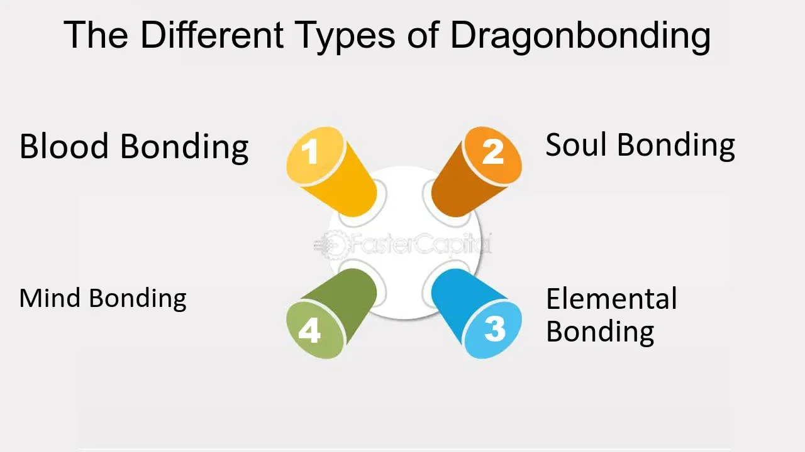

## Table of Contents

## What is a Dragon Bond?

A Dragon Bond is a type of bond that is issued in a foreign currency, but it is sold in the country where the currency is from. For example, a bond issued in US dollars but sold in Japan would be a Dragon Bond. The name comes from the idea that these bonds are strong and powerful, like dragons.

These bonds are often used by companies and governments to raise money from international investors. They can be attractive because they offer a way to invest in foreign markets without having to deal with currency exchange. Dragon Bonds can help spread financial risk and give investors more options for where to put their money.

## How does a Dragon Bond form?

A Dragon Bond forms when a company or a government decides to borrow money from people in another country. They do this by creating a bond, which is like a promise to pay back the money with interest. The special thing about a Dragon Bond is that it's made in the currency of the country where it's being sold. For example, if a company from the United States wants to borrow money from people in Japan, they would make a bond in Japanese yen and sell it in Japan.

Once the bond is created, it's offered to investors in the foreign country. These investors buy the bond because they believe they will get their money back with interest. The company or government that issued the bond uses the money they get from selling the bond for their projects or other needs. Over time, they pay back the investors according to the terms of the bond, usually in the same foreign currency. This way, both the issuer and the investors can benefit from the arrangement.

## What are the basic elements required for a Dragon Bond?

To create a Dragon Bond, you need a few basic things. First, you need someone who wants to borrow money, like a company or a government. They decide to borrow money from people in another country. Second, you need the currency of that other country. For example, if they want to borrow from people in Japan, they will use Japanese yen to make the bond. 

The third thing you need is the bond itself, which is like a promise to pay back the money with interest. This bond is sold to investors in the foreign country. The investors buy the bond because they trust that they will get their money back, plus some extra money as interest. So, the main elements are the borrower, the foreign currency, and the bond that promises to pay back the money.

## What are the benefits of forming a Dragon Bond?

Forming a Dragon Bond has several benefits for the company or government that issues it. One big benefit is that it lets them borrow money from people in another country. This can be helpful if they need a lot of money for big projects. It also helps them spread out their financial risk. Instead of borrowing all their money in one place, they can get money from different countries. This can make it easier to manage their money and plan for the future.

Investors also find Dragon Bonds attractive. They get to invest in a foreign market without having to deal with changing their money into another currency. This can save them time and money. Plus, Dragon Bonds can offer good interest rates, which means investors can earn more money on their investment. This makes Dragon Bonds a good choice for people looking to grow their savings in a new way.

## Can anyone form a Dragon Bond, or are there specific requirements?

Not just anyone can form a Dragon Bond. Usually, it's companies or governments that create them. They need to be able to borrow a lot of money and have a good plan for how they will pay it back. They also need to work with banks or other financial experts to set up the bond and make sure it follows the rules of the country where it will be sold.

The process of making a Dragon Bond can be complicated. The company or government has to decide on the amount of money they want to borrow, the [interest rate](/wiki/interest-rate-trading-strategies) they will offer, and how long it will take to pay back the money. They also need to make sure that people in the foreign country will want to buy the bond. This means they might need to do some advertising or work with local banks to make the bond attractive to investors.

## How does the strength of a Dragon Bond affect its users?

The strength of a Dragon Bond can make a big difference for the people who use it. If the bond is strong, it means that the company or government that made it is trusted and likely to pay back the money on time. This makes investors feel safe and happy to buy the bond. They know they will get their money back with some extra interest. A strong bond can also help the company or government that made it. They can borrow money more easily and use it for important projects.

On the other hand, if a Dragon Bond is weak, it can cause problems. A weak bond means that people are not sure if the company or government will pay back the money. This can scare investors away, and they might not want to buy the bond. If the bond is already sold and it becomes weak, the investors could lose money. For the company or government, a weak bond can make it harder to borrow money in the future. They might have to offer higher interest rates to convince people to buy their bonds.

## What are the common rituals or practices associated with forming a Dragon Bond?

When a company or government wants to form a Dragon Bond, they usually start by talking with banks or financial experts. These experts help them figure out how much money they need to borrow and what interest rate they should offer. They also make sure the bond follows the rules of the country where it will be sold. Once everything is planned, they create the bond and start telling people about it. They might use ads or work with local banks to let investors know about the bond and why it's a good choice.

After the bond is ready, the company or government holds a special event called a bond issuance. This is when they officially offer the bond to investors in the foreign country. During this event, they explain all the details about the bond, like how much money it's for, the interest rate, and when it will be paid back. Investors can then decide if they want to buy the bond. If a lot of people want to buy it, it means the bond is strong and trusted. After the bond is sold, the company or government uses the money for their projects, and they start paying back the investors over time.

## What are the historical origins of the Dragon Bond concept?

The idea of Dragon Bonds started a long time ago, but they became more popular in the 1980s. Back then, companies and governments wanted to borrow money from people in different countries. They thought it would be a good idea to make bonds in the currency of the country where they wanted to borrow the money. This way, they could reach more investors and spread out their financial risk.

The name "Dragon Bond" comes from the idea that these bonds are strong and powerful, like dragons. The term was first used in Asia, where dragons are seen as symbols of strength and good luck. Over time, Dragon Bonds became a common way for companies and governments to borrow money from foreign investors. They helped connect different parts of the world and gave people more ways to invest their money.

## How do different cultures interpret the significance of a Dragon Bond?

In many Asian cultures, dragons are seen as symbols of strength, power, and good luck. So, when people hear about Dragon Bonds, they might think of them as strong and trustworthy. They believe that a Dragon Bond can help bring good fortune and stability to both the company or government that makes it and the people who invest in it. This positive view can make investors feel more confident about buying Dragon Bonds, especially in countries where dragons are respected and admired.

In Western cultures, dragons can have a different meaning. Sometimes, they are seen as dangerous or scary creatures. But even in these cultures, the idea of a Dragon Bond can still be appealing. People might see the strength and power of a dragon as a good thing when it comes to money. They understand that a Dragon Bond is a strong financial tool that can help companies and governments borrow money from different countries. This can make them feel more secure about investing in Dragon Bonds, even if they don't see dragons the same way as people in Asia do.

## What are the advanced techniques for maintaining and strengthening a Dragon Bond?

To keep a Dragon Bond strong, the company or government that made it needs to make sure they pay back the money on time. They can do this by keeping good records and having a solid plan for how they will use the money they borrowed. They might also work with banks or financial experts to make sure they are doing everything right. Another way to keep the bond strong is by being open and honest with investors. If something changes, like a new project or a problem, they should tell the investors right away. This helps build trust and makes people feel more confident about the bond.

To make a Dragon Bond even stronger, the company or government can use advanced techniques like offering better interest rates or making the bond last longer. This can make the bond more attractive to investors, who might be willing to pay more for it. They can also use something called a credit rating, which is like a score that shows how trustworthy the bond is. A good credit rating can make the bond seem safer and more appealing. Finally, they might use special tools to manage the risk of the bond, like insurance or other financial products. These tools can protect the bond from problems and help it stay strong over time.

## What scientific theories or studies explain the mechanism behind Dragon Bonds?

Dragon Bonds work because of how people think about money and trust. When a company or government makes a Dragon Bond, they are borrowing money from people in another country. They promise to pay back the money with interest. The idea is that investors will trust the company or government to keep their promise. Studies in behavioral finance show that people are more likely to invest in something if they think it is strong and trustworthy. Since dragons are seen as powerful and strong in many cultures, calling a bond a "Dragon Bond" can make it seem more appealing and reliable.

Economists also study how Dragon Bonds help spread out financial risk. When a company or government borrows money from different countries, it's like putting all their eggs in different baskets. This can make it easier to handle problems that might come up in one country. Research in international finance explains that this kind of borrowing can make the global economy more stable. By using different currencies and reaching investors in different places, Dragon Bonds can help keep the financial system strong and balanced.

## How have Dragon Bonds been portrayed in literature and media, and what impact has this had on public perception?

In [books](/wiki/algo-trading-books) and movies, Dragon Bonds are often shown as powerful and mysterious. They might be used by heroes to fight dragons or as magical items that help solve big problems. These stories make Dragon Bonds seem exciting and important. People who read these stories or watch these movies might start to think of Dragon Bonds as something special and strong. This can make them more interested in learning about real Dragon Bonds and maybe even investing in them.

The way Dragon Bonds are shown in literature and media can also change how people feel about them in real life. If a movie shows a Dragon Bond as a key to winning a battle, people might see real Dragon Bonds as a way to win in the financial world. This can make them feel more confident about buying Dragon Bonds. But it's important to remember that real Dragon Bonds are not magic. They are just a way for companies and governments to borrow money. Still, the exciting stories can make people more curious and interested in Dragon Bonds.

## References & Further Reading

[1]: ["Machine Learning for Algorithmic Trading"](https://github.com/stefan-jansen/machine-learning-for-trading) by Stefan Jansen

[2]: Bergstra, J., Bardenet, R., Bengio, Y., & Kégl, B. (2011). ["Algorithms for Hyper-Parameter Optimization."](https://dl.acm.org/doi/10.5555/2986459.2986743) Advances in Neural Information Processing Systems 24.

[3]: ["Advances in Financial Machine Learning"](https://www.amazon.com/Advances-Financial-Machine-Learning-Marcos/dp/1119482089) by Marcos Lopez de Prado

[4]: ["Quantitative Trading: How to Build Your Own Algorithmic Trading Business"](https://www.amazon.com/Quantitative-Trading-Build-Algorithmic-Business/dp/1119800064) by Ernest P. Chan

[5]: Asian Development Bank (1991). ["Key Indicators for Asia and the Pacific."](https://www.adb.org/publications/series/key-indicators-for-asia-and-the-pacific)