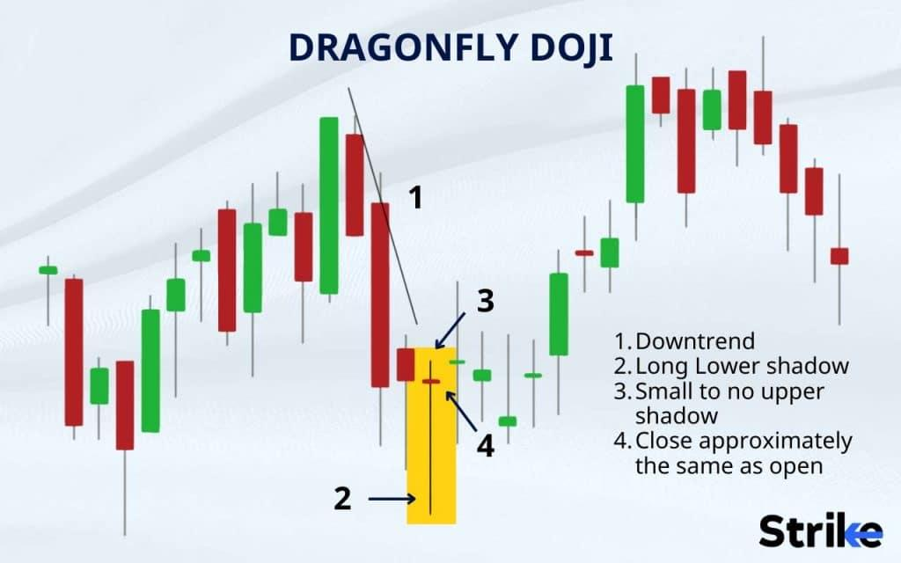

## Table of Contents

## What is a Dragonfly Doji candlestick pattern?

A Dragonfly Doji is a type of candlestick pattern that you might see on a chart used for trading stocks, forex, or other financial instruments. It looks like a "T" shape and happens when the opening and closing prices of an asset are the same or very close to each other. The long lower shadow, or "tail," of the Dragonfly Doji shows that during the trading period, the price dropped a lot but then came back up to near the opening price by the end.

This pattern is important because it can signal that the market might be about to change direction. If you see a Dragonfly Doji after a period where prices have been going down, it could mean that the sellers are losing control and buyers are starting to push the price up. Traders often look for this pattern as a sign to buy, hoping to catch the start of an upward trend. However, it's always a good idea to use other tools and indicators to confirm the signal before making a trading decision.

## How does a Dragonfly Doji form on a chart?

A Dragonfly Doji forms on a chart when the price of a stock, currency, or other financial asset opens at a certain level, then drops significantly during the trading period, but finally closes back at or very near the opening price. This creates a candle that looks like a "T" with a long lower shadow or tail. The long tail shows that sellers pushed the price down a lot, but buyers stepped in and managed to push the price back up to the opening level by the end of the period.

Traders watch for this pattern because it can signal a possible change in the market's direction. If a Dragonfly Doji appears after a downtrend, it might mean that the sellers are losing control and the buyers are starting to take over. This could be a sign that the price might start going up soon. However, it's important to look at other signs and indicators too, not just rely on one pattern, to make a smart trading decision.

## What does a Dragonfly Doji indicate about market sentiment?

A Dragonfly Doji shows that the market's feelings might be changing. When you see this pattern, it means that during the trading time, the price went down a lot but then came back up to where it started. This tells us that even though sellers were strong at first, buyers stepped in and pushed the price back up. It's like the sellers tried to take control but couldn't keep it.

If a Dragonfly Doji happens after prices have been falling for a while, it can be a sign that the market might start going up. It shows that the sellers are losing power and the buyers are getting stronger. But, it's important to not just look at this one pattern. You should also check other signs on the chart to make sure before you decide to buy or sell.

## In what types of markets can a Dragonfly Doji be observed?

A Dragonfly Doji can be seen in different kinds of markets where people trade things like stocks, [forex](/wiki/forex-system), commodities, and cryptocurrencies. This pattern can show up on charts for any of these markets because it's all about how the price moves during a trading period, no matter what is being traded.

The key thing to remember is that a Dragonfly Doji tells us about a change in who is in control of the market. If you see this pattern after prices have been going down, it might mean that the people who want to sell are losing power and the people who want to buy are getting stronger. This can happen in any market where there's a lot of trading going on.

## What are the key components that make up a Dragonfly Doji?

A Dragonfly Doji is made up of a few simple parts that you can see on a trading chart. The first part is the body of the candlestick, which is very small or sometimes just a line. This shows that the price at the start and end of the trading time was almost the same. The second part is the long lower shadow, or tail, which goes down from the body. This tail shows that during the trading time, the price dropped a lot but then came back up to near where it started.

These parts together make the Dragonfly Doji look like a "T" shape on the chart. The small body and the long tail tell us that even though sellers pushed the price down, buyers were strong enough to bring it back up. This pattern can be a sign that the market might be about to change direction, especially if it happens after prices have been falling for a while.

## How can a Dragonfly Doji be distinguished from other Doji patterns?

A Dragonfly Doji is special because it has a long lower shadow, or tail, and a very small body. The long tail means the price dropped a lot during the trading time but then came back up to near where it started. The small body shows that the price at the start and end of the trading time was almost the same. This makes the Dragonfly Doji look like a "T" shape on a chart.

Other Doji patterns might look different. For example, a Gravestone Doji has a long upper shadow instead of a lower one, showing that the price went up a lot but then came back down. A Long-Legged Doji has both a long upper and lower shadow, meaning the price moved a lot in both directions during the trading time but ended up back where it started. A regular Doji might not have any long shadows at all, just a small body showing that the opening and closing prices were very close. By looking at the shape and the shadows, you can tell a Dragonfly Doji apart from these other patterns.

## What is the significance of a Dragonfly Doji appearing at the bottom of a downtrend?

When a Dragonfly Doji shows up at the bottom of a downtrend, it can be a big sign that the market might be about to change direction. This pattern means that during the trading time, the price dropped a lot but then came back up to where it started. It shows that even though sellers were strong at first, buyers stepped in and pushed the price back up. This can mean that the sellers are losing control and the buyers are starting to take over.

Seeing a Dragonfly Doji at the bottom of a downtrend can make traders think that it's a good time to buy. They might believe that the price is going to start going up soon. But, it's important not to just look at this one pattern. Traders should also check other signs on the chart to make sure before they decide to buy or sell.

## Can a Dragonfly Doji signal a potential reversal, and if so, how reliable is it?

A Dragonfly Doji can signal that the market might be about to change direction, especially if it shows up after prices have been going down for a while. This pattern means that during the trading time, the price dropped a lot but then came back up to where it started. It shows that even though sellers were strong at first, buyers stepped in and pushed the price back up. This can mean that the sellers are losing control and the buyers are starting to take over, which could lead to a price increase.

However, the Dragonfly Doji is not always a sure sign of a reversal. It's just one piece of information that traders look at. To make a good decision, traders should also check other signs on the chart, like other patterns or indicators. Using the Dragonfly Doji along with other tools can help traders figure out if the market is really about to change direction. So, while it can be a helpful signal, it's not always 100% reliable on its own.

## What are the best practices for trading based on a Dragonfly Doji?

When you see a Dragonfly Doji on a chart, it can be a sign that the market might be about to change direction. This pattern shows that the price dropped a lot during the trading time but then came back up to where it started. If you see this after prices have been going down, it might mean that the sellers are losing control and the buyers are getting stronger. This could be a good time to think about buying, hoping that the price will start going up soon.

But, it's important not to just look at the Dragonfly Doji by itself. You should also check other signs on the chart to make sure. Look at other patterns or indicators to see if they also suggest that the market might change direction. Using the Dragonfly Doji along with other tools can help you make a smarter trading decision. Remember, no single pattern is always right, so it's good to use more than one thing to help you decide when to buy or sell.

## How should one confirm a Dragonfly Doji signal before making a trading decision?

When you see a Dragonfly Doji on a chart, it's a good idea to look at other things on the chart too before you decide to buy or sell. The Dragonfly Doji shows that the price dropped a lot during the trading time but then came back up to where it started. This can mean that the sellers are losing control and the buyers are getting stronger. But, it's not always a sure sign that the market will change direction, so you need to check other signs to be sure.

You can use other patterns or indicators to help confirm what the Dragonfly Doji is telling you. For example, if the Dragonfly Doji shows up after prices have been going down and you also see other signs that the market might go up, like a bullish divergence on the RSI or a support level being tested, it can make you more confident that the market might change direction. By looking at more than just the Dragonfly Doji, you can make a smarter trading decision and feel more sure about when to buy or sell.

## What are common mistakes traders make when interpreting a Dragonfly Doji?

One common mistake traders make when interpreting a Dragonfly Doji is relying on it too much by itself. They see the pattern and think it's a sure sign that the market will change direction, but they don't check other signs on the chart. The Dragonfly Doji is just one piece of information, and it's not always right. Traders should also look at other patterns or indicators to see if they agree with what the Dragonfly Doji is saying. This helps them make a smarter decision about when to buy or sell.

Another mistake is not paying attention to where the Dragonfly Doji shows up on the chart. The pattern is more likely to mean a change in direction if it appears after prices have been going down for a while. If it shows up during a time when prices are moving sideways or already going up, it might not mean as much. Traders need to think about the bigger picture and not just focus on the Dragonfly Doji alone. By understanding the context, they can better decide if the pattern is a good sign to act on.

## How does the Dragonfly Doji pattern interact with other technical indicators for more advanced analysis?

When traders see a Dragonfly Doji on a chart, they often look at other technical indicators to get a better idea of what might happen next. For example, if the Dragonfly Doji shows up after prices have been going down and the Relative Strength Index (RSI) is also showing a bullish divergence, it can make traders feel more sure that the market might start going up. The RSI measures how fast prices are changing, and a bullish divergence means the price is going down but the RSI is going up, which can be a sign that the market might change direction. By looking at both the Dragonfly Doji and the RSI, traders can feel more confident about their decision to buy.

Another way to use the Dragonfly Doji with other indicators is to check if it appears near a support level. A support level is a price where the market has stopped going down before, and it can be a sign that the price might start going up again. If a Dragonfly Doji shows up right at a support level, it can be a strong sign that the market might change direction. Traders might also look at moving averages, which show the average price over a certain time. If the Dragonfly Doji appears and the price is also above a key moving average, it can add to the evidence that the market might start going up. By combining the Dragonfly Doji with these other tools, traders can make more informed decisions about when to buy or sell.

## What are common mistakes and how can they be managed in terms of risk?

One prevalent mistake among traders is the overreliance on a single technical pattern such as the dragonfly doji without considering broader market contexts. While the dragonfly doji is a potent signal, especially as a potential bullish reversal in a downtrend, its effectiveness is amplified when examined alongside other factors like market trends, economic indicators, and geopolitical events. Ignoring these broader conditions can lead to misinterpretation and suboptimal trading decisions.

Effective risk management is crucial in mitigating the risks associated with relying solely on the dragonfly doji. One fundamental strategy involves setting appropriate stop-loss orders to limit potential losses. A stop-loss order is set below the low of the dragonfly doji in a bullish context, ensuring that if the market continues to move downward, losses are contained. For instance, if a trader identifies a dragonfly doji with a low of 100, they may place a stop-loss order at 98 to protect against further downside.

Incorporating position sizing is another vital risk management measure. This involves determining the amount of capital to allocate to a particular trade based on the pattern's potential and the trader's overall risk tolerance. Position size can be calculated using the formula:

$$
\text{Position Size} = \frac{\text{Account Risk} \times \text{Account Equity}}{\text{Risk per Trade}}
$$

where "Account Risk" is the percentage of equity a trader is willing to risk, "Account Equity" is the total capital available, and "Risk per Trade" is the difference between the entry point and stop-loss.

Beyond individual risk management tactics, leveraging the dragonfly doji as part of a diversified strategy helps manage potential risks. This includes integrating multi-faceted analyses by combining dragonfly dojis with additional technical indicators like moving averages or the Relative Strength Index (RSI). Such combinations reduce the likelihood of false signals and improve the robustness of trading strategies.

Overall, a well-rounded approach that combines the dragonfly doji with comprehensive risk management and additional contextual analysis can lead to enhanced trading success and profitability, reducing exposure to market [volatility](/wiki/volatility-trading-strategies) by relying on multiple confirmation signals rather than a single indicator.

## References & Further Reading

[1]: Nison, S. (1991). ["Japanese Candlestick Charting Techniques: A Contemporary Guide to the Ancient Investment Techniques of the Far East."](https://www.amazon.com/Japanese-Candlestick-Charting-Techniques-Contemporary/dp/0139316507) Prentice Hall Press.

[2]: Elder, A. (1993). ["Trading for a Living: Psychology, Trading Tactics, Money Management."](https://www.amazon.com/Trading-Living-Psychology-Tactics-Management/dp/0471592242) John Wiley & Sons.

[3]: Chan, E. (2009). ["Quantitative Trading: How to Build Your Own Algorithmic Trading Business."](https://rickorford.com/quantitative-trading/) John Wiley & Sons.

[4]: Aronson, D. R. (2006). ["Evidence-Based Technical Analysis: Applying the Scientific Method and Statistical Inference to Trading Signals."](https://www.amazon.com/Evidence-Based-Technical-Analysis-Scientific-Statistical/dp/0470008741) John Wiley & Sons.

[5]: Jansen, S. (2018). ["Machine Learning for Algorithmic Trading: Predictive models to extract signals from market and alternative data for systematic trading strategies with Python."](https://www.amazon.com/Machine-Learning-Algorithmic-Trading-alternative/dp/1839217715) Packt Publishing.

[6]: Pring, M. J. (2002). ["Technical Analysis Explained: The Successful Investor's Guide to Spotting Investment Trends and Turning Points."](https://www.amazon.com/Technical-Analysis-Explained-Fifth-Successful/dp/0071825177) McGraw-Hill Education.