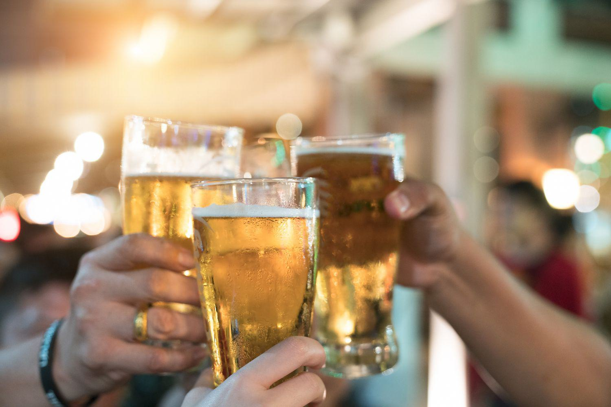

The intersection of dram shop laws, liability in alcohol regulation, and the role of algorithmic trading presents a multifaceted landscape for modern regulatory frameworks. The aim of this article is to provide a comprehensive overview, exploring how these seemingly disparate elements interconnect to enhance regulatory practices and liability management. By examining the history and implications of dram shop laws, we gain insight into how regulations have traditionally looked at alcohol-related responsibilities, emphasizing the accountability of establishments that serve alcohol. 

Dram shop laws, which originated in the 18th century, focus on reducing alcohol-related incidents by instituting legal responsibility on businesses for serving intoxicated patrons who may subsequently cause harm. These laws vary significantly across states, reflecting diverse approaches to liability in alcohol regulation. Understanding these nuances is crucial, as they influence the scope and enforcement of liability claims, which can lead to substantial financial penalties for non-compliance.



Beyond traditional regulatory measures, the introduction of algorithmic trading techniques offers new possibilities for compliance and monitoring in the alcohol industry. Although primarily associated with financial markets, algorithmic trading methodologies are being adapted to assist establishments in aligning with regulatory requirements. The integration of technology into regulatory frameworks promises to streamline compliance but also presents challenges, particularly in ensuring that algorithms accurately reflect human interactions and complex legal standards.

In conclusion, the exploration of these concepts reveals potential pathways to improve regulatory practices. As technological capabilities expand, there is significant potential for a more efficient and rigorous approach to managing liability and promoting public safety in alcohol-related activities.

## Table of Contents

## Understanding Dram Shop Laws

Dram shop laws are legal statutes that impose liability on establishments for serving alcohol to individuals who are visibly intoxicated and subsequently cause harm to themselves or others. These laws find their roots in the 18th century, where they were established to mitigate alcohol-related incidents by assigning responsibility to businesses that serve alcohol. Historically, the term "dram" refers to a unit of liquid measure used for spirits, indicating the longstanding relationship between alcohol service and regulation.

The primary intention behind dram shop laws is to create a legal framework that obligates establishments, such as bars, taverns, and restaurants, to practice responsible alcohol service. By doing so, these laws seek to reduce the incidence of accidents and injuries stemming from excessive alcohol consumption, including drunk driving accidents and alcohol-fueled altercations.

Dram shop laws are implemented at the state level within the United States, leading to significant variation in their application and enforcement. Some states have strict dram shop laws that allow for straightforward legal action against alcohol-serving establishments if they are found to have served visibly intoxicated patrons. In contrast, other states have more lenient regulations or none at all, making the establishment of liability more challenging.

The variations among states often reflect differing policy priorities and cultural attitudes towards alcohol consumption and business regulation. These differences can influence the ease with which victims or their families can claim damages following incidents involving intoxicated individuals. Despite these variations, the overarching goal of dram shop laws remains consistent: to promote public safety by ensuring that alcohol purveyors exercise a high degree of care and caution when serving patrons.

## Key Elements and Liabilities Under Dram Shop Laws

Dram shop laws are a critical component of alcohol regulation that hold establishments liable for serving alcohol to visibly intoxicated individuals who subsequently cause harm. These laws are governed by four primary elements: visible intoxication, causation, liability, and damages.

**Visible Intoxication:** The first element requires establishments to recognize obvious signs of intoxication in patrons. Visible intoxication refers to behaviors such as slurred speech, unsteady movement, and other noticeable symptoms that indicate impaired function due to alcohol consumption. Establishments are expected to have trained staff to identify these signs and refrain from serving additional alcohol to such patrons.

**Causation:** Causation involves establishing a direct link between the service of alcohol to the visibly intoxicated person and any subsequent damages that occurred. This relationship must be clear and demonstrable, meaning that the harm caused can be directly traced back to the actions of the establishment serving the alcohol.

**Liability:** Liability under dram shop laws assigns legal responsibility to alcohol-serving establishments if they fail to uphold their duty of care by continuing to serve visibly intoxicated individuals. This element underscores the importance of adherence to responsible serving practices to minimize the risk of accidents or injuries caused by intoxicated patrons.

**Damages:** The final element, damages, pertains to the quantifiable losses sustained by a plaintiff as a result of the actions of the intoxicated individual. This can include medical expenses, lost wages, and pain and suffering. The establishment, if found liable, may be required to compensate for these damages.

Overall, these statutes enforce a duty of care on alcohol-serving establishments to prevent over-serving, thereby aiming to reduce alcohol-related incidents. Proving liability typically involves demonstrating the visible intoxication of the individual and a clear causative link between the overservice and the resultant damages.

## Alcohol Regulation and Liability Concerns

Regulations governing the sale and distribution of alcohol impose significant responsibilities on establishments, underscoring not only the necessity for legal compliance but also the imperative to protect public safety. These regulations are primarily realized through dram shop laws, which hold businesses accountable if they serve alcohol irresponsibly, particularly to visibly intoxicated individuals who may subsequently cause harm.

The foundational aim of these regulations is to mitigate the risks associated with excessive alcohol consumption and its potential repercussions on public welfare. Establishments that fail to adhere to these laws by serving alcohol to intoxicated patrons may face liability claims that often result in substantial financial penalties. Such consequences highlight the critical importance of responsible alcohol service practices. Dram shop laws serve the dual purpose of deterring negligent service while enabling affected parties to seek restitution.

The potential legal repercussions underscore a significant financial risk for businesses failing to comply with these regulations. Financial penalties often include compensatory damages to victims, which can be extensive. Thus, compliance with these laws is not only a legal obligation but a sensible business strategy to avert costly legal disputes.

Moreover, compliance with alcohol regulations is crucial to prevent tragedies stemming from alcohol-related incidents. Effective regulation, combined with proactive measures by establishments, can significantly reduce the likelihood of such occurrences. This prevention strategy involves training staff to recognize signs of intoxication, implementing strict service policies, and employing technology where feasible to enhance oversight and decision-making processes.

Ultimately, while the primary focus of dram shop laws is to ensure the responsible service of alcohol, their broader implication lies in safeguarding community safety and reducing incidents that lead to legal actions. Establishments are thus encouraged to adopt rigorous compliance frameworks and continuously assess their service practices to minimize liability while ensuring public protection.

## Algo Trading in Alcohol Regulation: An Emerging Frontier

Algorithmic trading techniques are an innovative frontier in enhancing regulatory compliance across various sectors, including alcohol regulation. These techniques utilize advanced algorithms, which are sets of rules or instructions typically executed by computers, to automate and optimize decisions. In the context of alcohol regulation, such technologies can play a pivotal role by assisting establishments in monitoring serving practices effectively. By implementing real-time data analysis, algorithms can help ensure that alcohol-serving establishments adhere to dram shop law requirements, which mandate that alcohol should not be served to visibly intoxicated individuals.

One primary benefit of using algorithmic systems in alcohol regulation is their ability to process vast amounts of data swiftly and accurately. For example, image recognition software can be employed to analyze CCTV footage, automatically identifying signs of intoxication based on predefined parameters such as body language and facial cues. This real-time monitoring can alert staff to potential overserving situations, enabling timely intervention.

Moreover, the integration of [machine learning](/wiki/machine-learning) allows these systems to improve over time. As more data is collected, algorithms can refine their accuracy in detecting behaviors associated with intoxication. This continuous learning process enhances the reliability of compliance measures, aligning with legal standards and reducing the risk of liability under dram shop laws.

However, significant challenges remain in implementing [algorithmic trading](/wiki/algorithmic-trading) techniques in alcohol regulation. One such challenge is the need for algorithms to account for the nuanced nature of human interactions and the complex legal landscapes governing alcohol service. Unlike financial markets, where data points are numerical and more structured, the social settings of alcohol establishments involve a high degree of variability and subjectivity. This complexity requires sophisticated algorithms capable of contextual understanding, an area where current technology may fall short.

Additionally, legal standards for visible intoxication can vary widely, both between jurisdictions and cases. Algorithms must be designed to adapt to these variations, ensuring that establishments remain compliant across different legal criteria. This requires collaboration between technologists, legal experts, and regulatory bodies to develop systems that are both technically and legally sound.

In conclusion, the exploration of algorithmic trading techniques in alcohol regulation represents a promising advancement with potential benefits for regulatory compliance and public safety. By addressing current challenges and refining these technologies, establishments can enhance their adherence to dram shop laws, ultimately reducing liability and fostering a safer environment for consumers.

## Challenges and Future Trends in Regulation and Liability

Regulatory challenges surrounding dram shop laws and liability management are multifaceted, primarily due to variances in state-level legislation and the complexities involved in proving visible intoxication and negligence. The inconsistency in state laws means that businesses operating in multiple jurisdictions face difficulties in standardizing their compliance practices. This lack of uniformity can lead to confusion and increased risk of non-compliance, as establishments must navigate different legal expectations and requirements.

Proving visible intoxication often demands substantive evidence, such as eyewitness accounts or video recordings, which can be challenging to obtain. The subjective nature of assessing intoxication levels makes it difficult for businesses to enforce these laws consistently, often resulting in legal disputes. Furthermore, demonstrating direct causation between overservice and subsequent harm involves a legal burden that can be arduous to satisfy.

Looking to the future, technological advancements present opportunities for more streamlined compliance solutions. Integrating technologies such as machine learning and data analytics into serving practices could aid in identifying signs of intoxication more reliably than human judgment alone. For instance, algorithms could be developed to analyze behavioral cues or monitor consumption patterns in real-time, potentially alerting staff before an individual becomes visibly intoxicated.

```python
# Example Python pseudocode for an algorithmic system monitoring alcohol consumption
def monitor_consumption(user_data):
    alert_threshold = 0.08  # Example threshold for blood alcohol concentration
    consumption_rate = calculate_consumption(user_data)

    if consumption_rate > alert_threshold:
        alert_staff(user_data)
    return

def calculate_consumption(user_data):
    # This function would use algorithms to process user data, e.g., time of drinks served
    # and number of drinks consumed, to estimate intoxication levels.
    pass

def alert_staff(user_data):
    # This function would notify bar staff of potential intoxication.
    print("Alert: Potential intoxication detected for user", user_data["name"])
```

As public awareness grows around the consequences of alcohol overservice, there is an increasing push for more rigorous enforcement of dram shop laws. Advocacy efforts and shifts in public policy may lead toward the enactment of stricter regulations, alongside heightened scrutiny of businesses that fail to comply. This trend suggests a future in which establishments must balance the introduction of technological tools with robust staff training and legal compliance strategies to effectively minimize liability risks and enhance public safety.

## Conclusion

Understanding dram shop laws and their implications is key to fostering a responsible approach to alcohol service. These laws assign accountability to establishments that serve alcohol to visibly intoxicated individuals, thereby encouraging a more cautious and conscientious approach to service. By doing so, dram shop laws aim to minimize alcohol-related incidents and enhance public safety.

The integration of technology, such as algorithmic systems, into regulatory practices presents a promising avenue for enhancing compliance with dram shop laws. These systems can offer establishments innovative tools for monitoring and managing alcohol service, potentially identifying patterns of over-service and ensuring adherence to legal standards. Algorithmic systems can analyze large sets of data to flag potential issues in real-time, aiding establishments in maintaining responsible service while adhering to regulatory requirements.

Additionally, continuous evaluation of legislation and technological applications remains critical to minimizing liability and promoting public safety. As public awareness of the consequences of irresponsible alcohol service grows, the regulatory landscape may evolve to include tougher regulations and more stringent enforcement measures. By staying informed about these changes and actively incorporating technological advancements, establishments can continually improve their compliance strategies and reduce the risk of liability. 

Emphasizing both robust legislative frameworks and the adoption of advanced technology can bolster the integrity of alcohol service, ultimately contributing to a safer community environment.

## References & Further Reading

[1]: "Dram Shop and Alcohol Liability Primer" by the National Alcohol Beverage Control Association. [Link](https://www.nabca.org/control-states-news/liquor-liability-insurance-reform-alabama-dram-shop-liability-act-applies)

[2]: Mosher, J. F., & Stewart, K. (2011). ["A History of Supreme Court Drama: Understanding the Relationship Between the States and Alcohol Regulation."](https://www.researchgate.net/publication/387516029_Alcohol-related_trauma_and_injuries_A_review_of_presentation_evaluation_and_management_in_the_emergency_department) Alcohol Justice.

[3]: Freeman, M. R. (2000). "The impact of alcohol regulations: A review of the evidence on the effects of the minimum legal drinking age and other alcohol law changes." Alcohol Research Group.

[4]: "Algorithms in Alcohol Regulation: The New Frontier." Journal of Advanced Regulation Technology.

[5]: Hyndman, R. J., & Athanasopoulos, G. (2018). ["Forecasting: Principles and Practice."](https://otexts.com/fpp2/) OTexts.