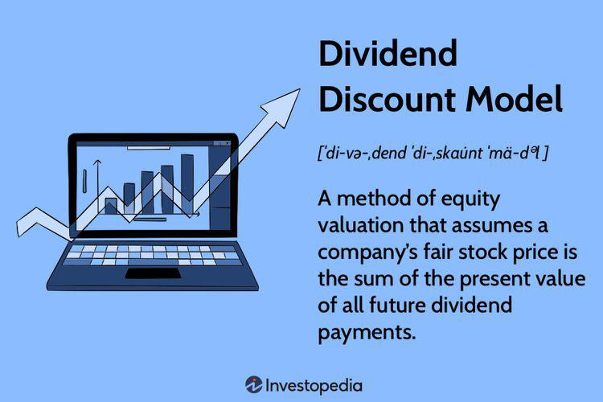

The Dividend Discount Model (DDM) is a fundamental financial tool for valuing dividend-paying stocks by calculating the present value of predicted future dividends. The essence of the DDM lies in the concept of the time value of money, which asserts that a dollar received today is worth more than a dollar received tomorrow due to its potential earning capacity. By modeling dividends as cash inflows, investors can derive a stock's intrinsic value, offering a structured approach to stock valuation.

However, the application of DDM is not without its challenges. The model inherently assumes that dividends are the main source of a stock’s value, which may not always hold true, especially in cases where companies have alternative ways of returning value to shareholders, such as stock buybacks. Moreover, DDM is largely dependent on precise estimates of future dividends, the dividend growth rate, and the required rate of return. Inaccuracies in these estimations can lead to significant valuation errors, thus posing a risk in investment analysis or algorithmic trading scenarios.



This article will explore the limitations of the DDM, such as its exclusion of non-dividend-paying companies and sensitivity to changes in model assumptions. Additionally, it discusses the incorporation of the DDM into algorithmic trading systems, emphasizing the necessity for real-time adaptation and accuracy in dividend projections. Investors and analysts looking to utilize the DDM must understand these constraints and consider alternative valuation methods to enhance their evaluation processes and make well-informed investment decisions. By addressing these issues, investors can better navigate the complexities involved when leveraging the DDM in their trading strategies, ultimately leading to more refined and successful investment outcomes.

## Table of Contents

## Understanding the Dividend Discount Model (DDM)

The Dividend Discount Model (DDM) is a pivotal tool in finance used to determine the intrinsic value of a dividend-paying stock. This model is grounded in the principle that a stock's value is equivalent to the present value of its expected future dividends. These dividends are posited as the primary avenue of returns for investors, making the model particularly relevant for companies with a history of stable dividend payments.

The foundational concept underlying the DDM is the time value of money, which posits that a dollar today holds more value than a dollar in the future due to its potential [earning](/wiki/earning-announcement) capacity. Consequently, in the DDM, future dividends are discounted back to their present value, providing an estimation of the stock's intrinsic value.

The most basic form of the DDM is the Gordon Growth Model, which applies when dividends are expected to grow at a constant rate indefinitely. The formula is expressed as:

$$
V_0 = \frac{D_1}{r - g}
$$

Where:
- $V_0$ is the current intrinsic value of the stock.
- $D_1$ represents the expected dividend in the next period.
- $r$ is the required rate of return.
- $g$ is the growth rate of dividends.

This equation presumes that the growth rate $g$ of dividends is less than the required rate of return $r$, ensuring the model's mathematical viability.

While the DDM is effective for valuing steadily dividend-paying entities such as utilities or large-cap companies with consistent earnings, it is less applicable to entities with unpredictable dividend payments or those that do not pay dividends at all. The model's reliance on the consistency and predictability of dividends and their growth rate is a crucial limitation when applied to companies in dynamic sectors or growth-focused firms that reinvest earnings rather than disburse them as dividends. Thus, for firms that fall outside stable dividend payouts, alternative valuation models may offer more accurate assessments.

## Limitations of the Dividend Discount Model

The Dividend Discount Model (DDM) is a widely used method for valuing dividend-paying stocks, but it comes with several notable limitations that can affect its applicability and accuracy in investment analysis.

Primarily, the DDM is applicable only to stocks that pay dividends, inherently excluding non-dividend-paying entities from its valuation framework. This poses a significant constraint as many companies, especially in their growth phases, choose to reinvest profits rather than distribute them as dividends. Furthermore, the model presumes that dividends grow at a consistent rate indefinitely. Such an assumption can lead to inaccuracies, especially for companies in industries with volatile or unpredictable dividend distributions. In reality, dividend growth rates can fluctuate due to various factors like economic cycles, changes in company policy, or shifts in market conditions.

The DDM heavily relies on accurate projections for dividends, the growth rate of those dividends, and the required rate of return. Even minor deviations in these assumptions can result in substantial valuation errors. For instance, misjudging the dividend growth rate could lead to either an overvaluation or undervaluation of the stock. The formula for the Gordon Growth Model, a popular version of the DDM, is:

$$
P_0 = \frac{D_1}{r - g}
$$

where $P_0$ is the current stock price, $D_1$ is the expected dividend next period, $r$ is the required rate of return, and $g$ is the growth rate of dividends. Here, small inaccuracies in $r$ or $g$ can have pronounced impacts on the calculated $P_0$.

Additionally, the DDM does not account for stock buybacks, which have become a significant mechanism for companies to return value to shareholders. Stock buybacks reduce the number of shares outstanding, often increasing the value of remaining shares, a [factor](/wiki/factor-investing) that the DDM overlooks. This oversight can lead to undervaluation for companies that utilize buybacks as a component of their capital return strategy.

Finally, the inherently conservative nature of the DDM can result in undervaluation of companies that have high growth potential but lack consistent dividend policies. Such companies might choose to reinvest earnings into expansion and development rather than paying out dividends, which contradicts the DDM's central tenant that dividends are the primary driver of a stock's intrinsic value.

In conclusion, while the DDM is a valuable tool for valuing dividend-paying stocks, its reliance on consistent dividends and certain assumptions means it may not always provide accurate valuations. Adjustments or supplementary valuation methods should be considered to fully capture a company's financial worth, especially in a complex and rapidly evolving market environment.

## Integrating DDM with Algorithmic Trading

Algorithmic trading involves using computer algorithms to execute trades based on predefined criteria, and it can effectively utilize the Dividend Discount Model (DDM) to automate investment decisions driven by dividend valuation metrics. The DDM’s framework allows traders to identify potentially undervalued stocks by assessing the present value of expected future dividends, facilitating timely execution of buy or sell orders.

By integrating DDM calculations into trading algorithms, traders can automatically evaluate stocks in real-time based on projected dividend payouts. Here’s a simplified Python example highlighting how DDM can be integrated within an [algorithmic trading](/wiki/algorithmic-trading) system:

```python
def calculate_ddm_value(dividend, growth_rate, required_return):
    if required_return <= growth_rate:
        raise ValueError("Required return must be greater than growth rate.")
    return dividend / (required_return - growth_rate)

# Example usage
dividend = 2.00
growth_rate = 0.05
required_return = 0.10

try:
    intrinsic_value = calculate_ddm_value(dividend, growth_rate, required_return)
    print(f"Intrinsic Stock Value: ${intrinsic_value:.2f}")
except ValueError as e:
    print(e)
```

In this scenario, the algorithm updates its DDM inputs—such as dividends, growth rates, and required return rates—with real-time market data. This adaptability ensures that trading decisions remain relevant amid constant market fluctuations. For instance, automated systems can adjust for new dividend announcements or changes in macroeconomic conditions that might affect the required return.

However, the integration of DDM into algorithmic systems presents challenges that must be addressed to improve robustness. Key issues include ensuring data accuracy, maintaining realistic assumptions about growth rates, and accounting for the model’s limitations, such as its focus solely on dividend-paying stocks. Overcoming these requires the development of sophisticated error-checking mechanisms and possibly incorporating inputs from multiple valuation models to validate findings.

Furthermore, algorithms must be equipped with the ability to recognize when model outputs deviate significantly from market values, potentially indicating erroneous assumptions. This can be achieved by establishing thresholds for deviations, after which manual review or additional model recalibrations are triggered.

Overall, combining DDM with algorithmic trading offers the advantage of speed and precision in identifying undervalued stocks. However, traders must exercise caution by implementing comprehensive checks and validations to minimize the impact of the DDM's inherent limitations on trading outcomes.

## Alternative Valuation Methods

To address the limitations of the Dividend Discount Model (DDM), investors may turn to alternative valuation methods to better capture a company's value. Two commonly employed approaches include the discounted cash flow (DCF) analysis and the price-to-earnings (P/E) ratio.

**Discounted Cash Flow (DCF) Analysis**: Unlike the DDM, which focuses on dividends, the DCF model provides a more holistic view by estimating the present value of a company's expected future cash flows. DCF takes into account all cash inflows and outflows attributable to an investment, making it a versatile tool for valuing both dividend-paying and non-dividend-paying companies. The fundamental formula for DCF is:

$$
\text{DCF} = \sum_{t=1}^{N} \frac{CF_t}{(1+r)^t}
$$

where $CF_t$ represents the expected cash flows in each period $t$, $r$ is the discount rate, and $N$ is the total number of periods considered. By encompassing comprehensive cash projections, DCF accounts for varying growth rates and business models, offering a thorough valuation framework.

**Price-to-Earnings (P/E) Ratio**: This method evaluates a company's current share price relative to its per-share earnings. The P/E ratio provides investors with a quick snapshot of market expectations about a company’s future growth and profitability. It is widely used for comparing companies within the same industry or sector. The formula is straightforward:

$$
\text{P/E Ratio} = \frac{\text{Market Price per Share}}{\text{Earnings per Share (EPS)}}
$$

A high P/E ratio might indicate that a stock is overvalued, or that investors are expecting high earnings growth in the future. Conversely, a low P/E might suggest undervaluation or lesser growth expectations.

**Multi-Model Approach**: Employing a combination of valuation methods allows investors to triangulate a company’s true worth. This approach mitigates the risks associated with relying on a single model, particularly when individual assumptions may not hold true under varying economic scenarios. By synthesizing insights from diverse models like DCF and P/E ratios, investors can gain a more nuanced and comprehensive view, thus making more informed investment decisions.

Integrating these valuation methods can enhance stock analysis, particularly amidst volatile market conditions, enabling investors to construct a balanced perspective that accounts for both quantitative metrics and qualitative factors.

## Conclusion

The Dividend Discount Model (DDM) continues to be a valuable tool for evaluating dividend-paying stocks. It offers a straightforward approach to determine the intrinsic value of a stock based on the present value of its expected future dividends. However, users must exercise caution due to the model's inherent assumptions. The DDM hinges on expectations of consistent dividend payments and growth rates, which, if inaccurately projected, can lead to significant valuation errors.

Incorporating the DDM within algorithmic trading systems provides advantages, such as enhanced efficiency and rapid decision-making. By automating investment decisions based on dividend valuation metrics, traders can quickly capitalize on perceived discrepancies between a stock's market price and its projected intrinsic value. Nonetheless, it is essential to recognize and mitigate the DDM's limitations, including its assumptions about dividend consistency and growth.

To bolster investment strategies, investors should consider supplementing the DDM with alternative valuation methods. Models such as discounted cash flow (DCF) analysis or price-to-earnings ratios can offer additional perspectives and help counterbalance the shortcomings of relying solely on the DDM. A multi-model approach empowers investors to develop a more nuanced understanding of a company's value, particularly in volatile or uncertain market conditions.

Ultimately, a thorough understanding of both the DDM and alternative valuation methodologies is crucial for successful investment decision-making. Investors and traders who can effectively combine these tools can better navigate dynamic financial markets, adapting to new information and conditions to enhance their analysis and strategy development. While the DDM provides a structured method for appraising dividend-paying companies, its integration with other models ensures a more comprehensive and resilient investment approach.

## References & Further Reading

[1]: Damodaran, A. (2006). ["Damodaran on Valuation: Security Analysis for Investment and Corporate Finance"](https://onlinelibrary.wiley.com/doi/book/10.1002/9781119201786). Wiley.

[2]: Gordon, M. J. (1959). ["Dividends, Earnings, and Stock Prices,"](http://piketty.pse.ens.fr/files/Gordon1959.pdf) The Review of Economics and Statistics, 99-105.

[3]: ["Valuation: Measuring and Managing the Value of Companies"](https://www.amazon.com/Valuation-Measuring-Managing-Companies-Finance/dp/1119610885) by McKinsey & Company Inc.

[4]: Jacobs, B. I., & Levy, K. N. (1988). ["Disentangling Equity Return Regularities: New Insights and Investment Opportunities."](https://papers.ssrn.com/sol3/papers.cfm?abstract_id=1608012) The Journal of Portfolio Management, 18-30.

[5]: ["Financial Modeling and Valuation: A Practical Guide to Investment Banking and Private Equity"](https://books.google.com/books/about/Financial_Modeling_and_Valuation.html?id=lf7WAgAAQBAJ) by Paul Pignataro