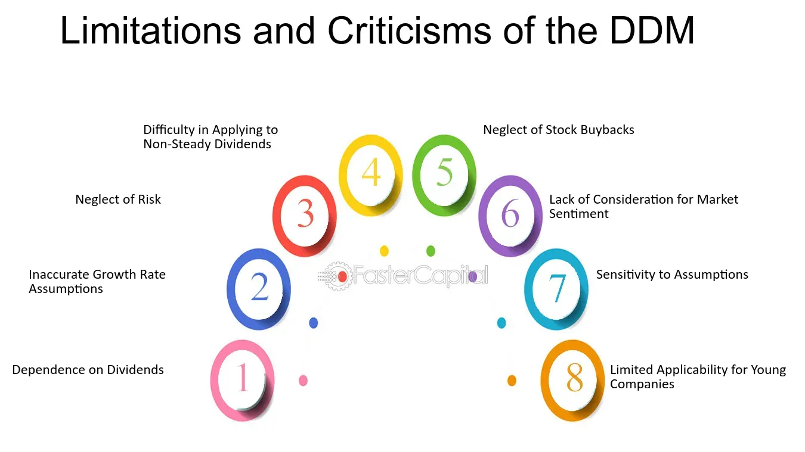

## Table of Contents

## What is the Dividend Discount Model (DDM)?

The Dividend Discount Model (DDM) is a way to figure out how much a stock is worth by looking at the money it pays out to its shareholders, called dividends. The basic idea is that the value of a stock today is the sum of all the future dividends it will pay, but you have to adjust those future dividends to what they're worth today. This is done using a discount rate, which is kind of like an interest rate that reflects how risky the stock is.

To use the DDM, you start by guessing what dividends the company will pay in the future. Then, you use the discount rate to figure out what those future dividends are worth right now. If you add up all these discounted future dividends, you get the stock's value according to the DDM. This model is especially useful for companies that regularly pay dividends, but it can be tricky to use because it relies a lot on your guesses about future dividends and the right discount rate to use.

## Why is the Dividend Discount Model used in stock valuation?

The Dividend Discount Model (DDM) is used in stock valuation because it helps investors figure out what a stock is really worth by looking at the dividends it pays out. Dividends are payments companies make to their shareholders, and they represent a part of the company's profits. By using the DDM, investors can estimate the value of a stock today based on the idea that the stock's value comes from the dividends it will pay in the future. This approach makes sense for companies that regularly pay dividends, as it gives a clear picture of what investors can expect to receive over time.

The DDM works by taking the expected future dividends and adjusting them to their present value. This adjustment is done using a discount rate, which reflects how risky the stock is. If a stock is seen as riskier, the discount rate will be higher, which means future dividends are worth less today. By summing up all these adjusted future dividends, the DDM provides a way to compare the calculated value of the stock with its current market price. If the calculated value is higher than the market price, the stock might be a good buy. This makes the DDM a useful tool for investors looking to make informed decisions about which stocks to invest in.

## What are the basic assumptions of the Dividend Discount Model?

The Dividend Discount Model (DDM) makes some basic guesses about how companies and stocks work. One big guess is that dividends are the main reason people buy stocks. This means the model thinks that the value of a stock comes from the money it will pay out to shareholders in the future. Another guess is that these future dividends can be predicted well enough to use in the model. This is a big deal because if you can't guess the dividends right, the whole model might not work well.

Another important guess is that there's a right discount rate to use. The discount rate is like an interest rate that shows how risky the stock is. If you guess the discount rate wrong, the value you come up with for the stock will be off. The DDM also assumes that the company will keep going forever, or at least for a long time, so you can keep adding up future dividends. This is called the "going concern" assumption. It's a big part of the model because it lets you look far into the future.

Putting it all together, the DDM works best for companies that pay out steady dividends and where you can make good guesses about the future. It's a useful tool, but it depends a lot on these assumptions being right. If they're not, the model might not give you a good picture of what the stock is really worth.

## How does the accuracy of dividend forecasts affect the Dividend Discount Model?

The accuracy of dividend forecasts is really important for the Dividend Discount Model (DDM). If you guess the dividends wrong, the whole model can be off. The DDM works by adding up all the future dividends a company will pay, but it adjusts those dividends to what they're worth today. So, if your guesses about future dividends are too high or too low, the value you come up with for the stock will be wrong too. This can make a big difference in whether you think a stock is a good buy or not.

It's hard to predict dividends because a lot of things can change, like how well the company does, what's happening in the economy, or new rules and laws. If a company does better than expected, it might pay out more dividends, making the stock worth more than you thought. But if the company runs into trouble, it might cut dividends, making the stock worth less. So, the DDM is only as good as your guesses about the future. If you can make good guesses, the DDM can be a helpful tool. But if your guesses are way off, it might lead you to make bad investment choices.

## What are the limitations of the Dividend Discount Model for companies that do not pay dividends?

The Dividend Discount Model (DDM) has a big problem when it comes to companies that don't pay dividends. The whole idea behind the DDM is that the value of a stock comes from the money it pays out to shareholders as dividends. If a company doesn't pay any dividends, then using the DDM to figure out its value doesn't really work. You can't add up dividends that don't exist, so the model can't give you a good answer for these kinds of companies.

This limitation means the DDM isn't very useful for a lot of companies, especially newer ones or those in fast-growing industries. These companies often choose to reinvest their profits back into the business instead of paying out dividends. They might be growing quickly and think that using the money to expand will make the company more valuable in the long run. For these companies, other ways of figuring out stock value, like looking at their earnings or cash flows, might be better.

## How does the growth rate assumption impact the results of the Dividend Discount Model?

The growth rate assumption in the Dividend Discount Model (DDM) is really important because it helps guess how much the dividends will grow over time. If you think the dividends will grow fast, you'll use a higher growth rate. This makes the stock seem more valuable because you're expecting bigger dividends in the future. But if you guess the growth rate wrong, it can mess up your whole calculation. A small change in the growth rate can make a big difference in the final value of the stock. So, getting the growth rate right is key to using the DDM well.

On the other hand, if you think the dividends won't grow much or will stay the same, you'll use a lower growth rate. This makes the stock seem less valuable because the future dividends won't be as big. The DDM is sensitive to the growth rate, which means it's really important to have a good reason for the number you pick. If you're too optimistic or too pessimistic about the company's future, your guess on the growth rate could lead you to think the stock is worth more or less than it really is. This is why it's so important to think carefully about the growth rate when using the DDM.

## What challenges arise when applying the Dividend Discount Model to companies with unstable dividend histories?

Using the Dividend Discount Model (DDM) can be tricky when a company's dividends go up and down a lot. The DDM works by adding up all the future dividends a company will pay, but it's hard to guess what those dividends will be if they keep changing. If a company has a history of not paying steady dividends, it's tough to predict what they'll do next. This makes it hard to use the DDM because the model relies on your guesses about future dividends being pretty close to right.

When dividends are unstable, you might think they'll grow a lot one year and then drop the next. This kind of guessing can mess up the DDM's calculations a lot. If you guess too high or too low, the value you come up with for the stock won't be very accurate. It's like trying to hit a moving target. Because of this, the DDM might not be the best tool for figuring out the value of stocks from companies with unstable dividends. Other ways of looking at a company's value, like looking at its earnings or cash flows, might be better in these cases.

## How does the required rate of return influence the valuation in the Dividend Discount Model?

The required rate of return is a big deal when you use the Dividend Discount Model (DDM) to figure out how much a stock is worth. It's like an interest rate that shows how risky the stock is. If you think the stock is risky, you'll use a higher required rate of return. This makes the future dividends worth less today because you're adjusting them down more. So, if you use a high required rate of return, the stock's value will be lower because the present value of those future dividends goes down.

On the flip side, if you think the stock is not very risky, you'll use a lower required rate of return. This makes the future dividends worth more today because you're not adjusting them down as much. So, if you use a low required rate of return, the stock's value will be higher because the present value of those future dividends goes up. Getting the required rate of return right is really important because it can change the stock's value a lot. If you guess it wrong, you might think a stock is worth more or less than it really is.

## What are the implications of using the Dividend Discount Model in different economic environments?

Using the Dividend Discount Model (DDM) can be tricky because it depends a lot on what's happening in the economy. When the economy is doing well, companies usually make more money and might pay out bigger dividends. This can make stocks seem more valuable when you use the DDM because you're expecting bigger future dividends. But if the economy is not doing so well, companies might cut back on dividends, which makes stocks seem less valuable. So, the DDM can give you different answers depending on whether you think the economy will be good or bad in the future.

The required rate of return also changes with the economy, and this can affect the DDM a lot. In good economic times, people might feel safer about investing, so they might use a lower required rate of return. This makes the future dividends worth more today, which can make stocks seem more valuable. But in tough economic times, people might want a higher return to take on the extra risk, so they'll use a higher required rate of return. This makes the future dividends worth less today, which can make stocks seem less valuable. So, using the DDM means you have to think carefully about what the economy might do next.

## How can errors in estimating the terminal value affect the Dividend Discount Model's reliability?

The terminal value is a big part of the Dividend Discount Model (DDM) because it guesses what all the dividends after a certain point will be worth. If you make a mistake when figuring out the terminal value, it can really mess up your whole calculation. The DDM adds up the value of all future dividends, and the terminal value is often a big chunk of that total. So, if you guess too high or too low, the value you come up with for the stock can be way off. This can make you think a stock is worth more or less than it really is, which can lead to bad investment choices.

Getting the terminal value right is tricky because it depends on a lot of guesses about the future, like how fast the company will grow and what the discount rate should be. If the economy changes or the company does better or worse than expected, the terminal value you picked might not be right anymore. Because the terminal value is such a big part of the DDM, even small mistakes can have a big impact on the final value of the stock. This means you have to be really careful when using the DDM and think hard about what might happen in the future.

## What alternative valuation models should be considered alongside the Dividend Discount Model, and why?

When figuring out how much a stock is worth, you might want to look at other models besides the Dividend Discount Model (DDM). One good option is the Discounted Cash Flow (DCF) model. This model looks at all the money a company will make in the future, not just the dividends. It's useful for companies that don't pay dividends because it still gives you a way to guess their value. Another model to consider is the Price/Earnings (P/E) ratio. This one compares the price of a stock to how much money the company makes. It's simple to use and can help you see if a stock is a good deal compared to others.

You might also want to use the Price/Book (P/B) ratio, which compares the stock price to the company's net worth. This can be helpful for figuring out if a company is undervalued, especially in industries like banking. The Economic Value Added (EVA) model is another choice. It looks at how much money a company makes above what it costs to run the business. This can give you a good idea of how well a company is using its money. Each of these models has its own way of looking at a company's value, so using them together with the DDM can give you a fuller picture and help you make better investment choices.

## How can advanced statistical methods improve the accuracy of the Dividend Discount Model?

Advanced statistical methods can help make the Dividend Discount Model (DDM) more accurate by better guessing future dividends and the right discount rate to use. One way to do this is by using time series analysis to look at past dividend data and find patterns. This can help you make better guesses about what dividends will be in the future. Another way is by using regression analysis to see how different things, like the economy or company earnings, affect dividends. This can help you come up with a more accurate model for predicting future dividends. Also, using Monte Carlo simulations can help you see how different guesses about the future might change the stock's value. This lets you see a range of possible outcomes instead of just one guess.

Another thing advanced statistics can do is help you pick the right discount rate. This rate is important because it shows how risky the stock is. Using methods like the Capital Asset Pricing Model (CAPM) or other risk models can help you come up with a better discount rate. These methods look at things like how the stock moves with the market or how risky the company's business is. By using these advanced tools, you can make the DDM more reliable and get a better idea of what a stock is really worth.

## What is the Dividend Discount Model (DDM) and how does it work?

The Dividend Discount Model (DDM) is a pivotal tool in finance used to determine the intrinsic value of a dividend-paying stock. This model is grounded in the principle that a stock's value is equivalent to the present value of its expected future dividends. These dividends are posited as the primary avenue of returns for investors, making the model particularly relevant for companies with a history of stable dividend payments.

The foundational concept underlying the DDM is the time value of money, which posits that a dollar today holds more value than a dollar in the future due to its potential [earning](/wiki/earning-announcement) capacity. Consequently, in the DDM, future dividends are discounted back to their present value, providing an estimation of the stock's intrinsic value.

The most basic form of the DDM is the Gordon Growth Model, which applies when dividends are expected to grow at a constant rate indefinitely. The formula is expressed as:

$$
V_0 = \frac{D_1}{r - g}
$$

Where:
- $V_0$ is the current intrinsic value of the stock.
- $D_1$ represents the expected dividend in the next period.
- $r$ is the required rate of return.
- $g$ is the growth rate of dividends.

This equation presumes that the growth rate $g$ of dividends is less than the required rate of return $r$, ensuring the model's mathematical viability.

While the DDM is effective for valuing steadily dividend-paying entities such as utilities or large-cap companies with consistent earnings, it is less applicable to entities with unpredictable dividend payments or those that do not pay dividends at all. The model's reliance on the consistency and predictability of dividends and their growth rate is a crucial limitation when applied to companies in dynamic sectors or growth-focused firms that reinvest earnings rather than disburse them as dividends. Thus, for firms that fall outside stable dividend payouts, alternative valuation models may offer more accurate assessments.

## What are the limitations of the Dividend Discount Model?

The Dividend Discount Model (DDM) is a widely used method for valuing dividend-paying stocks, but it comes with several notable limitations that can affect its applicability and accuracy in investment analysis.

Primarily, the DDM is applicable only to stocks that pay dividends, inherently excluding non-dividend-paying entities from its valuation framework. This poses a significant constraint as many companies, especially in their growth phases, choose to reinvest profits rather than distribute them as dividends. Furthermore, the model presumes that dividends grow at a consistent rate indefinitely. Such an assumption can lead to inaccuracies, especially for companies in industries with volatile or unpredictable dividend distributions. In reality, dividend growth rates can fluctuate due to various factors like economic cycles, changes in company policy, or shifts in market conditions.

The DDM heavily relies on accurate projections for dividends, the growth rate of those dividends, and the required rate of return. Even minor deviations in these assumptions can result in substantial valuation errors. For instance, misjudging the dividend growth rate could lead to either an overvaluation or undervaluation of the stock. The formula for the Gordon Growth Model, a popular version of the DDM, is:

$$
P_0 = \frac{D_1}{r - g}
$$

where $P_0$ is the current stock price, $D_1$ is the expected dividend next period, $r$ is the required rate of return, and $g$ is the growth rate of dividends. Here, small inaccuracies in $r$ or $g$ can have pronounced impacts on the calculated $P_0$.

Additionally, the DDM does not account for stock buybacks, which have become a significant mechanism for companies to return value to shareholders. Stock buybacks reduce the number of shares outstanding, often increasing the value of remaining shares, a [factor](/wiki/factor-investing) that the DDM overlooks. This oversight can lead to undervaluation for companies that utilize buybacks as a component of their capital return strategy.

Finally, the inherently conservative nature of the DDM can result in undervaluation of companies that have high growth potential but lack consistent dividend policies. Such companies might choose to reinvest earnings into expansion and development rather than paying out dividends, which contradicts the DDM's central tenant that dividends are the primary driver of a stock's intrinsic value.

In conclusion, while the DDM is a valuable tool for valuing dividend-paying stocks, its reliance on consistent dividends and certain assumptions means it may not always provide accurate valuations. Adjustments or supplementary valuation methods should be considered to fully capture a company's financial worth, especially in a complex and rapidly evolving market environment.

## What are Alternative Valuation Methods?

To address the limitations of the Dividend Discount Model (DDM), investors may turn to alternative valuation methods to better capture a company's value. Two commonly employed approaches include the discounted cash flow (DCF) analysis and the price-to-earnings (P/E) ratio.

**Discounted Cash Flow (DCF) Analysis**: Unlike the DDM, which focuses on dividends, the DCF model provides a more holistic view by estimating the present value of a company's expected future cash flows. DCF takes into account all cash inflows and outflows attributable to an investment, making it a versatile tool for valuing both dividend-paying and non-dividend-paying companies. The fundamental formula for DCF is:

$$
\text{DCF} = \sum_{t=1}^{N} \frac{CF_t}{(1+r)^t}
$$

where $CF_t$ represents the expected cash flows in each period $t$, $r$ is the discount rate, and $N$ is the total number of periods considered. By encompassing comprehensive cash projections, DCF accounts for varying growth rates and business models, offering a thorough valuation framework.

**Price-to-Earnings (P/E) Ratio**: This method evaluates a company's current share price relative to its per-share earnings. The P/E ratio provides investors with a quick snapshot of market expectations about a company’s future growth and profitability. It is widely used for comparing companies within the same industry or sector. The formula is straightforward:

$$
\text{P/E Ratio} = \frac{\text{Market Price per Share}}{\text{Earnings per Share (EPS)}}
$$

A high P/E ratio might indicate that a stock is overvalued, or that investors are expecting high earnings growth in the future. Conversely, a low P/E might suggest undervaluation or lesser growth expectations.

**Multi-Model Approach**: Employing a combination of valuation methods allows investors to triangulate a company’s true worth. This approach mitigates the risks associated with relying on a single model, particularly when individual assumptions may not hold true under varying economic scenarios. By synthesizing insights from diverse models like DCF and P/E ratios, investors can gain a more nuanced and comprehensive view, thus making more informed investment decisions.

Integrating these valuation methods can enhance stock analysis, particularly amidst volatile market conditions, enabling investors to construct a balanced perspective that accounts for both quantitative metrics and qualitative factors.

## References & Further Reading

[1]: Damodaran, A. (2006). ["Damodaran on Valuation: Security Analysis for Investment and Corporate Finance"](https://onlinelibrary.wiley.com/doi/book/10.1002/9781119201786). Wiley.

[2]: Gordon, M. J. (1959). ["Dividends, Earnings, and Stock Prices,"](http://piketty.pse.ens.fr/files/Gordon1959.pdf) The Review of Economics and Statistics, 99-105.

[3]: ["Valuation: Measuring and Managing the Value of Companies"](https://www.amazon.com/Valuation-Measuring-Managing-Companies-Finance/dp/1119610885) by McKinsey & Company Inc.

[4]: Jacobs, B. I., & Levy, K. N. (1988). ["Disentangling Equity Return Regularities: New Insights and Investment Opportunities."](https://papers.ssrn.com/sol3/papers.cfm?abstract_id=1608012) The Journal of Portfolio Management, 18-30.

[5]: ["Financial Modeling and Valuation: A Practical Guide to Investment Banking and Private Equity"](https://books.google.com/books/about/Financial_Modeling_and_Valuation.html?id=lf7WAgAAQBAJ) by Paul Pignataro