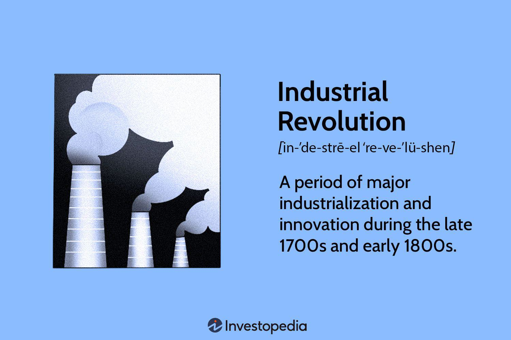

Economic development, industrialization, and the introduction of algorithmic trading have significantly reshaped societies over the past few centuries. Each of these elements has played a pivotal role in transforming economic landscapes and societal structures, contributing to both advancements and challenges.

Economic development has traditionally been viewed as a process of wealth creation and improved living standards. It often involves the implementation of policies and structures aimed at enhancing productivity and innovation. Industrialization marked a critical juncture in this trajectory, initiating a shift from agrarian economies towards industrial powerhouses. This transformation was characterized by mechanization and the establishment of factory systems, which revolutionized production processes. The effects of this shift extended beyond economic output; they included job creation, technological advancements, and increased living standards.

As industrialization progressed, it prompted urbanization—a major societal shift where populations moved from rural areas to cities in search of better economic opportunities. Urban centers became nodes of commerce, exchange, and technological innovation, further accelerating economic development. However, this rapid urban growth also introduced numerous challenges, particularly in resource management and environmental sustainability. Socio-economic divides became pronounced as resources and opportunities were often unevenly distributed.

In recent decades, algorithmic trading has emerged as a significant driver of change within financial markets. By using complex algorithms and high-frequency trading techniques, algorithmic trading enhances market liquidity and efficiency. Despite its benefits, the introduction of such advanced trading systems also raises concerns over volatility and potential market manipulation, highlighting the need for updated regulatory frameworks that can keep pace with technological innovations.

This article will explore how these interrelated phenomena—economic development, industrialization, urbanization, and algorithmic trading—have historically evolved and interact in contemporary societies. The examination of their benefits, drawbacks, and underlying challenges provides valuable insights for crafting policies that aim for sustainable and inclusive economic growth.

## Table of Contents

## Economic Development and Industrialization

Industrialization marked a pivotal shift from agrarian economies to industrial powerhouses, fundamentally altering production processes worldwide. This transformation began in the late 18th century, gaining significant [momentum](/wiki/momentum) in the 19th and early 20th centuries. During this period, economies transitioned from being predominantly agricultural, where the majority of the populace was engaged in farming, to systems dominated by machine-oriented manufacturing industries.

The transition was catalyzed by numerous factors, most notably advancements in technology and the development of mechanized systems. Innovations such as the steam engine, power loom, and spinning jenny revolutionized production methods, enabling the mass production of goods at unprecedented scales. This shift not only increased productivity but also vastly improved the efficiency of labor, allowing for more goods to be produced in less time and with fewer resources.

As industrialization unfolded, it spurred significant job creation, particularly in urban centers where factories were located. This led to the migration of workers from rural to urban areas, fostering urban growth and contributing to the development of major cities. The increase in employment opportunities also contributed to a rise in living standards, as people were able to earn wages and access better housing, healthcare, and education.

The introduction of mechanization and factory systems became central to optimizing labor and promoting economic growth. Factory systems enabled the systematic organization of labor, whereby workers followed a specific sequence of tasks, thereby enhancing efficiency and productivity. This approach not only reduced production costs but also decreased the time required to manufacture goods.

One notable outcome of industrialization was the significant technological advancement it brought about. The newfound focus on innovation and efficiency prompted continuous improvements and discoveries across various sectors, from transportation to communication. These advancements not only bolstered economic development but also laid the groundwork for further technological evolution.

Despite its myriad benefits, industrialization also presented challenges, especially concerning labor conditions in factories. Long working hours, low wages, and unsafe working environments were prevalent. Nevertheless, this era set the stage for labor reforms and movements that eventually led to improved working conditions and labor rights.

Overall, industrialization played a crucial role in shaping modern economies, transitioning them from agrarian-based systems to industrial powerhouses that continue to evolve today. This historical period exemplifies the profound impact technological and mechanical advancements can have on economic structures and societies at large.

## The Role of Urbanization

Urbanization, a process characterized by the movement of people from rural to urban areas, fundamentally alters economic structures and social dynamics. This migration is primarily motivated by the quest for improved economic opportunities, enhanced living standards, and access to better services. Cities, as hubs of economic activity, provide a fertile ground for innovation, entrepreneurship, and cultural exchange. These urban centers historically arose around industrial hubs, catalyzing their growth into pivotal areas of commerce and technological advancement.

Migration to urban areas is often associated with increased economic productivity, driven by the agglomeration effect—where proximity facilitates shared knowledge, resources, and infrastructure, leading to increased efficiency and innovation. The urban environment fosters a setting where businesses thrive on economies of scale and where cultural diversity can stimulate creative solutions to complex problems. 

However, the rapid pace of urban growth presents significant challenges, requiring effective strategies for resource management to ensure sustainable development. Urban sprawl can lead to issues such as traffic congestion, water management inefficiencies, and inadequate waste disposal systems. These problems necessitate the development of sophisticated infrastructures and planning initiatives to manage resources efficiently. 

Environmental sustainability within urban areas is another pressing concern. The concentration of industrial and human activities leads to elevated greenhouse gas emissions, air and water pollution, and a larger ecological footprint per capita compared to rural areas. Urban planners and policymakers must implement green technologies and smart city solutions to mitigate these environmental impacts and enhance urban resilience.

Furthermore, urbanization can exacerbate socio-economic divides. The influx of diverse populations into cities often leads to economic stratification, where the affluent experience growth and prosperity while marginalized groups might face limited access to opportunities, housing, and essential services. This economic inequality can spur social tensions and calls for comprehensive social policies to ensure inclusive growth and equitable distribution of resources.

In summary, urbanization is a complex phenomenon with both promising opportunities and significant challenges. By driving economic growth and fostering innovation, cities play essential roles in modern economic landscapes. Nonetheless, achieving a balance between growth and sustainability requires careful planning and policy interventions to address the socio-economic, environmental, and resource management challenges posed by rapid urbanization.

## Industrial Drawbacks and Challenges

Industrialization, while a pivotal driver of economic growth, has also been accompanied by significant drawbacks and challenges. A primary concern is environmental pollution, which has intensified with the rise of industrial activities. Factories and manufacturing processes release pollutants into the air, water, and soil, contributing to global issues such as air quality degradation and climate change. The combustion of fossil fuels by industries remains a leading cause of greenhouse gas emissions, which has implications for global warming. 

In addition to pollution, industrialization has led to resource depletion. The extensive extraction of natural resources, such as minerals, forests, and water, to fuel industrial demands has resulted in their significant reduction. This depletion not only endangers ecosystems and biodiversity but also raises concerns about the sustainable management of resources for future generations.

Socio-economic inequalities have also been exacerbated by industrialization. The separation of labor and capital has led to widening income disparities. Owners of capital, such as factory proprietors and shareholders, often accrue substantial wealth, while laborers face relatively stagnant wages. This has heightened issues of wealth distribution, sparking debates on equitable economic policies and practices.

Urban settings face further environmental challenges due to industrial waste production and poor resource management. Industrial operations generate large quantities of waste, necessitating effective waste management systems. However, inadequate infrastructure often results in improper waste disposal, leading to urban pollution and health hazards. 

Efficient resource management in cities is also a pressing concern. Rapid urbanization, driven by industrial activities, increases the demand for energy, water, and land. Balancing industrial growth with sustainable resource use is critical to mitigating environmental impacts and ensuring long-term ecological and human welfare. 

Addressing these industrial drawbacks requires comprehensive policies that integrate economic, environmental, and social considerations. Progressive approaches should aim at reducing emissions, fostering sustainable resource use, and promoting fair wealth distribution to balance industrial growth with its associated challenges.

## Algorithmic Trading in Modern Financial Dynamics

Algorithmic trading, the use of computer algorithms to automate trading decisions, has revolutionized modern financial markets. By executing high-frequency trades, these algorithms enhance market [liquidity](/wiki/liquidity-risk-premium) and operational efficiency. High-frequency trading ([HFT](/wiki/high-frequency-trading-strategies)), a subset of [algorithmic trading](/wiki/algorithmic-trading), allows for numerous transactions in fractions of a second, creating tighter bid-ask spreads and reducing transaction costs for traders.

The key advantage of algorithmic trading lies in its ability to process vast amounts of market data at speeds unattainable by human traders. Algorithms can incorporate multiple factors, such as price, [volume](/wiki/volume-trading-strategy), and time, to execute trades based on pre-set instructions, maximizing gain from infinitesimal price movements. This efficiency contributes to increased market turnover, benefiting investors with more accurate price information and improved market access.

Despite these benefits, algorithmic trading introduces considerable risks. One significant risk is market manipulation, where algorithms can exacerbate price [volatility](/wiki/volatility-trading-strategies) through practices such as spoofing or layering—techniques involving the placement and quick cancellation of orders to mislead market participants about supply and demand dynamics. Additionally, the complexity of algorithms can result in unintended consequences, such as flash crashes—rapid and deep market decline followed by an equally swift recovery—highlighting the fragility of automated systems.

To manage these inherent risks, adapting regulatory frameworks is imperative. Regulations such as the European Union’s Markets in Financial Instruments Directive II (MiFID II) focus on increased transparency and operational control over automated trading environments. Measures include stringent requirements for order-to-trade ratios, mandatory system testing, and algorithmic audit trails. Furthermore, risk controls like circuit breakers and kill switches have been implemented to temporarily halt trading under extreme volatility, allowing markets to stabilize.

The continued evolution of algorithmic trading demands a balance between fostering innovation and ensuring robust systemic risk management. Financial institutions, regulators, and technology developers must collaborate to address the multifaceted challenges posed by algorithmic systems, safeguarding market integrity while capitalizing on technological advancements.

## Balancing Opportunities and Risks

Balancing the opportunities and risks inherent in the intersecting domains of economic development, industrialization, urbanization, and algorithmic trading requires comprehensive and forward-thinking policy-making. These domains, while offering significant prospects for growth and innovation, also present challenges that necessitate a structured approach to policy development.

Policies centered on sustainable growth are essential to ensure that economic development does not compromise the environment or exhaust finite resources. Sustainable growth can be pursued through incentivizing clean energy initiatives, integrating green technologies across industries, and promoting circular economy practices to reduce waste and increase resource efficiency. These measures can help maintain ecological balance while fostering economic expansion.

The equitable distribution of wealth is another critical policy goal. Industrialization and urbanization have historically led to economic inequalities, as wealth tends to concentrate in urban centers and among those who control capital. To address this, progressive tax policies, social welfare programs, and investments in education and skills training can be implemented to redistribute wealth more fairly and provide equal opportunities for all societal members.

Technological integration, particularly in the context of algorithmic trading, is crucial for maintaining competitiveness in the global market. However, this integration must be carefully managed to prevent systemic risks such as market manipulation and excessive volatility. Regulatory frameworks need to be adapted to monitor and control algorithmic trading activities, ensuring they enhance market efficiency and liquidity without endangering financial stability.

Collaboration among governments, industries, and educational institutions is vital for optimizing the benefits of these intersecting domains. Governments can create conducive environments for sustainable industrial practices and technological advancements through supportive legislation and funding for research and development. Industries can drive innovation and implement sustainable practices, while educational institutions can prepare future generations with the skills necessary to thrive in a rapidly evolving economic landscape.

In conclusion, balancing the opportunities and risks associated with economic development, industrialization, urbanization, and algorithmic trading calls for well-crafted policies that promote sustainability, equity, and technological advancement. By fostering collaboration across sectors, it is possible to leverage the benefits of these dynamics while mitigating their adverse impacts, thus paving the way for a more sustainable and inclusive future.

## Conclusion

Industrialization and urbanization have dramatically reshaped the economic landscapes globally, influencing how societies develop and operate. These processes have transitioned economies from agrarian bases to industrial powerhouses, enhancing productivity and living standards. However, they also present critical challenges, such as resource management and socio-economic divides, which need careful consideration. The evolution of industrial practices provides valuable insights into the complexities of transforming economies, helping us formulate strategies for future advancements.

Algorithmic trading illustrates the modern technological advancements impacting financial markets. It brings efficiencies such as improved market liquidity and the capacity for high-frequency transactions, yet also comes with considerable risks. These involve potential market manipulation and increased volatility, issues that necessitate careful regulatory oversight. As algorithmic trading continues to grow, designing nuanced regulatory frameworks becomes crucial to mitigate risks while fostering innovation.

A comprehensive understanding of historical industrial and urban transitions informs the development of effective policies aimed at sustainable and inclusive economic growth. By examining past socio-economic transformations, policymakers can craft strategies that address contemporary challenges, promote equitable wealth distribution, and encourage technological integration. This involves collaboration among governments, economic institutions, and educational sectors to ensure that future advancements benefit wider society while minimizing negative impacts.

## References & Further Reading

Allen, R.C. (2009). 'The British Industrial Revolution in Global Perspective.' Cambridge University Press. This book provides a comprehensive analysis of the British Industrial Revolution, highlighting its global significance and transformations. It delves into the economic and technological advancements that defined the era, providing context for understanding the broader implications of industrialization.

Glaeser, E. (2012). 'Triumph of the City.' Penguin Books. Glaeser's work examines the powerful role cities play in fostering economic innovation, cultural exchange, and technological advancements. It details the benefits of urbanization, while also addressing the challenges associated with rapid city growth, such as socio-economic divides and environmental sustainability.

Polanyi, K. (1944). 'The Great Transformation.' Beacon Press. In this influential text, Polanyi explores the development of modern market economies within the context of historical and social changes. His analysis of the economic and societal shifts during and after the Industrial Revolution offers insights into contemporary economic development and the tensions between market forces and social needs.

Harvey, D. (2009). 'Social Justice and the City.' University of Georgia Press. Harvey investigates the intersection of urban environments and social justice, addressing issues such as resource distribution, socio-economic inequality, and environmental concerns. His work underscores the importance of equitable policy-making in the context of rapid urban and industrial growth.

