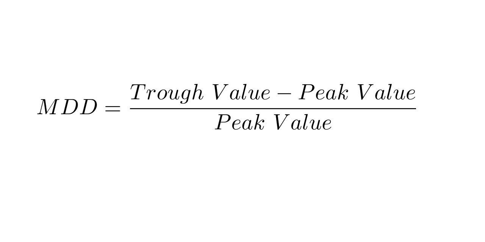

In the fast-evolving world of algorithmic trading, performance metrics are crucial for evaluating the efficiency of a trading strategy. Among these metrics, drawdown is a widely used term. Drawdown is a measure of the decline from a historical peak in some variable, typically the cumulative profit/loss. This metric provides insights into the risk profile of trading strategies by quantifying the extent of financial loss from a peak until a new peak is reached. Understanding drawdown is essential because it helps traders and investors assess the risk and volatility associated with a particular trading approach. It also informs decisions related to capital allocation and the evaluation of risk-adjusted returns.

Drawdown can be particularly informative when managing trading strategies because it highlights the worst-case scenarios traders might encounter. By examining drawdown, one can gauge the endurance required to weather tough market conditions and determine the robustness of a trading system. Effective drawdown analysis supports traders in optimizing their strategies by refining their risk management practices, thereby mitigating potential losses.



This article will explore the concept of drawdown in detail, specifically focusing on its role and significance in algorithmic trading. Additionally, it will address how understanding and implementing drawdown analysis can lead to more informed trading decisions and improved risk management practices.

## Table of Contents

## What is Drawdown in Trading?

Drawdown represents the peak-to-trough decline during a specific period of an investment or trading strategy. In trading, this metric is crucial for understanding the level of risk associated with a particular strategy. Drawdowns can indicate the potential loss an investor might experience before the trading strategy recovers. This insight is vital for risk management and setting expectations for investors.

To comprehensively assess the risk associated with a trading strategy, it is essential to understand the concepts of 'max drawdown' and 'mean drawdown.' Max drawdown is the largest single drop from peak to trough during a trading period. It highlights the most significant potential loss, serving as a critical indicator of the worst-case scenario for the investment. Calculating max drawdown involves identifying historical peaks and subsequent troughs, taking the largest percentage drop as a critical risk metric.

Mean drawdown, on the other hand, provides an averaged perspective of the drawdowns experienced during a trading period. By calculating the average of all drawdowns, this metric offers insight into the regularity and severity of declines. The formula for calculating mean drawdown can be expressed as:

$$
\text{Mean Drawdown} = \frac{\sum_{i=1}^{N} \text{Drawdown}_i}{N}
$$

where $\text{Drawdown}_i$ represents each individual drawdown event, and $N$ is the total number of drawdown events within the period under analysis.

Both max drawdown and mean drawdown are essential for evaluating the risk profile of a trading system. Max drawdown provides insight into the most severe loss, while mean drawdown investigates more typical losses experienced. Understanding these metrics allows traders to balance the pursuit of high returns with the tolerance for investment risk, ultimately aiding in the construction of robust trading strategies that align with individual risk appetites.

## Types of Drawdown in Algo Trading

In [algorithmic trading](/wiki/algorithmic-trading), drawdown is used as a performance metric to evaluate the risk characteristics of a trading strategy. Understanding different types of drawdowns can aid traders in managing risk effectively.

**Max Drawdown** refers to the maximum observed loss from a peak to a trough of a portfolio, before a new peak is achieved. It is calculated as the largest percentage drop in portfolio value from a peak during the entire period under analysis. Max drawdown is a measure of the largest potential capital loss a trading strategy has experienced historically. Identifying and calculating max drawdown helps traders understand the worst-case scenario, providing insights into the potential risks associated with a trading strategy. 

Mathematically, max drawdown ($D_{\text{max}}$) is given by:

$$

D_{\text{max}} = \max_{1 \leq i < j \leq T} \left( \frac{P_i - P_j}{P_i} \right)
$$

where $P_i$ is the peak value before a decline, $P_j$ is the lowest point within that decline, and $T$ is the total time period analyzed.

**Mean Drawdown**, on the other hand, provides an average measure of all observed drawdowns over the period under consideration. Unlike max drawdown, which focuses on the most significant loss, mean drawdown gives a holistic picture of the regularity and severity of drawdowns, providing insights into the volatility and risk consistency of a trading strategy.

The formula for calculating mean drawdown ($D_{\text{mean}}$) can be represented as:

$$

D_{\text{mean}} = \frac{1}{N} \sum_{k=1}^{N} D_k 
$$

where $N$ is the number of drawdown periods, and $D_k$ is the drawdown value for each period $k$.

By assessing max and mean drawdowns, traders gain both a broad and granular understanding of potential losses, enabling them to optimize their risk management strategies.

## Using Drawdown as a Performance Metric

In algorithmic trading, the drawdown is an essential performance metric that aids in understanding the risk and resilience of trading strategies. Many traders evaluate the efficacy of a trading system using the Compound Annual Growth Rate (CAGR) to Max Drawdown ratio. This ratio provides insights into how well a system performs relative to its risk, represented by its largest observed drop from a peak in historical data. A higher ratio is typically indicative of a more efficient trading system, as it suggests a good balance between returns and risk exposure.

Despite the popularity of the CAGR/Max Drawdown ratio, many experts propose that mean drawdown offers a more comprehensive and informative view. Mean drawdown calculates the average decline from peak values over a set period, which can be instrumental in assessing the consistency of drawdowns across time. It accounts for the regularity and severity of smaller losses, providing a more nuanced understanding of potential risks compared to reliance solely on maximum observed historical declines.

The CAGR/Mean Drawdown ratio becomes particularly useful for traders aiming to optimize their strategies by ensuring stable, consistent performance rather than a focus solely on surviving extreme events. By using this ratio, traders can better understand how various parameter settings influence the trading outcome. A stable trading strategy often features lower mean drawdowns, indicating regular efficiency, resilience to market [volatility](/wiki/volatility-trading-strategies), and reduced likelihood of large capital losses over sustained trading periods.

In Python, traders can calculate the mean drawdown for a strategy over historical data using libraries such as NumPy or Pandas. The following pseudo-example demonstrates a basic approach to calculate mean drawdown:

```python
import pandas as pd

# Assume `equity_curve` is a Pandas Series representing the portfolio's balance over time
def calculate_mean_drawdown(equity_curve):
    drawdowns = (equity_curve.cummax() - equity_curve) / equity_curve.cummax()
    mean_drawdown = drawdowns.mean()
    return mean_drawdown

# Example usage
equity_curve = pd.Series([1000, 1020, 1005, 1010, 995, 1008])  # Sample data
print("Mean Drawdown:", calculate_mean_drawdown(equity_curve))
```

By calculating and utilizing the mean drawdown metrics, traders are better equipped to implement strategies that prioritize consistent performance and mitigate risk, consequently leading to more informed decision-making in algorithmic trading environments.

## Impact of Drawdown on Trading Decisions

A high drawdown serves as a clear warning signal of excessive risk within a trading strategy. It represents a substantial percentage decline from the peak to the trough in asset value, showcasing potential vulnerabilities in the trading system that may lead to significant capital loss. Consequently, traders must exercise caution when confronted with high drawdown levels, as they indicate the possibility of deeper financial risks and unanticipated setbacks.

To minimize risk, analyzing drawdown patterns is crucial. By meticulously examining these patterns, traders gain valuable insights into the behavior of their strategies under various market stress conditions. For instance, identifying recurrent drawdown occurrences can point towards systemic issues within the trading model, such as flawed algorithm logic or inadequate risk management protocols. 

In refining trading strategies, a focus on reducing drawdown magnitudes can lead to enhanced performance. This can be achieved by adjusting stop-loss levels, diversifying asset classes, or employing algorithmic improvements like volatility-based scaling. Additionally, optimizing position sizes plays a pivotal role in managing drawdowns effectively. Traders may adopt position-sizing methods such as the Kelly Criterion, which adapts position sizes based on historical drawdown experiences, ensuring a more calculated risk management approach.

Overall, the comprehensive analysis of drawdowns aids traders not only in mitigating excessive risks but also in refining strategies to withstand adverse periods. As a result, a more balanced approach to position sizes and strategy adjustments grounded in drawdown analysis contributes significantly to enhanced risk management and potentially more stable returns.

## Optimizing Strategy with Drawdown Analysis

Backtesting with a focus on drawdown metrics is essential for optimizing trading strategies to perform effectively across diverse market conditions. By analyzing historical data, traders can simulate their strategies under different scenarios to anticipate potential losses and assess risk exposure. This process enables the identification of weaknesses within a strategy, allowing traders to make data-driven adjustments that minimize drawdown impacts. 

When conducting backtests, attention to drawdown, particularly maximum drawdown, reveals periods of significant capital reduction, guiding traders in understanding the boundaries of risk exposure. For instance, a strategy with a high historical max drawdown suggests that it could result in substantial losses during adverse market phases. Therefore, traders can adjust asset allocations or reconsider strategy parameters to mitigate such risks.

Furthermore, strategies that consistently maintain low drawdown levels are generally more robust and appealing to investors. A low drawdown strategy demonstrates resilience by recovering quickly from losses, which is crucial for maintaining investor confidence. From a quantitative perspective, incorporating both mean and maximum drawdown metrics into performance evaluation offers insights into regular drawdown patterns and extreme loss events. This dual approach ensures a more comprehensive risk assessment.

To facilitate optimization, traders can employ programming languages such as Python for [backtesting](/wiki/backtesting) and simulation. For example:

```python
import numpy as np
import pandas as pd

def calculate_max_drawdown(cumulative_returns):
    running_max = np.maximum.accumulate(cumulative_returns)
    drawdown = (cumulative_returns - running_max) / running_max
    return drawdown.min()

# Simulated example of cumulative returns
cumulative_returns = pd.Series([1.0, 0.95, 1.05, 0.9, 1.1, 0.85, 1.15])
max_drawdown = calculate_max_drawdown(cumulative_returns)
print(f"Max Drawdown: {max_drawdown:.2%}")
```

In this example, the function calculates the maximum drawdown by comparing a strategy's simulated cumulative returns against its peak. Tools like these empower traders to quantify drawdown impacts accurately and refine their strategies accordingly.

Ultimately, a careful analysis centered on drawdown metrics not only assists in strategy refinement but also enhances investor confidence by demonstrating a methodical approach to managing potential losses. Strategies with optimized drawdown management are better positioned to deliver stable and attractive returns.

## Conclusion

Drawdown is a fundamental aspect of risk assessment in algorithmic trading that provides a deeper understanding of strategy resilience and potential losses. A clear comprehension of drawdown metrics equips traders with the ability to make informed decisions, balancing the pursuit of returns with the management of risk. By understanding max drawdown and mean drawdown, traders can gauge the extent of losses that could occur during adverse market movements, thus allowing them to evaluate the reliability and consistency of their trading strategies.

The utilization of drawdown metrics aids in optimizing trading strategies, ensuring that they are robust enough to withstand various market conditions. Backtesting strategies with an emphasis on drawdown metrics can reveal weaknesses in current approaches, thereby allowing for significant improvements. Furthermore, traders can refine their strategies to maintain lower drawdown levels, which generally makes these strategies more appealing to investors by highlighting their stability and reduced risk.

In conclusion, an enhanced focus on drawdown analysis contributes greatly to the success of algorithmic trading strategies. By carefully evaluating drawdown metrics, traders can enhance their strategies and achieve more stable returns, ensuring that the potential for significant capital loss is minimized while maintaining a path towards sustainable profitability.

## References & Further Reading

[1]: Chandler, J. (2014). ["Quantitative Technical Analysis: An Integrated Approach to Trading System Development and Trading Management"](https://resources.caih.jhu.edu/form-library/publication/_pdfs/quantitative_technical_analysis_an_integrated_approach_to_trading_system_development_and_trading_management.pdf) by Howard B. Bandy

[2]: ["Trading and Exchanges: Market Microstructure for Practitioners"](https://www.amazon.com/Trading-Exchanges-Market-Microstructure-Practitioners/dp/0195144708) by Larry Harris

[3]: Rosenberg, B., & Engle, R. (1982). ["Empirical Equity Return Relationships of Macroeconomic Importance."](https://papers.ssrn.com/sol3/papers.cfm?abstract_id=393020) Management Science, 34(9).

[4]: ["Inside the Black Box: The Simple Truth About Quantitative Trading"](https://www.amazon.com/Inside-Black-Box-Quantitative-Trading/dp/0470432063) by Rishi K. Narang

[5]: Carver, R. (2019). ["Systematic Trading: A Unique New Method for Designing Trading and Investing Systems"](https://www.amazon.com/Systematic-Trading-designing-trading-investing/dp/0857194453) by Robert Carver