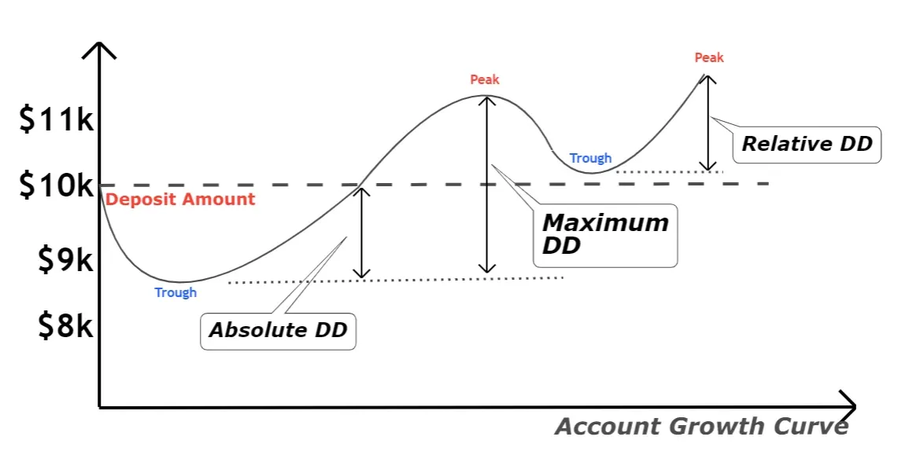

## Table of Contents

## What is Drawdown (DD) in simple terms?

Drawdown, or DD, is a term used to describe how much an investment or a trading account loses from its highest point to its lowest point before it starts to recover. Imagine you have $100 and it grows to $150. If it then drops to $100, the drawdown is $50 because that's how much you lost from the highest point of $150.

This concept is important because it helps investors and traders understand the risk involved in their investments. A big drawdown means a big drop in value, which can be scary and stressful. By knowing the drawdown, people can make better decisions about whether an investment is too risky for them or if they should change their strategy to avoid big losses.

## How is Drawdown calculated?

To calculate drawdown, you need to find the highest value of your investment or trading account at any point in time. Then, you look for the lowest value that happens after that high point, but before the account starts to go up again. The drawdown is the difference between that highest value and the lowest value. For example, if your account went from $100 to $150 and then dropped to $120, the drawdown would be $30 because that's the drop from $150 to $120.

Drawdown is usually shown as a percentage. To find the percentage, you take the drawdown amount and divide it by the highest value, then multiply by 100. Using the same example, you would take $30 (the drawdown) and divide it by $150 (the highest value), which gives you 0.2. Multiply that by 100, and you get a 20% drawdown. This percentage helps you see how big the drop was compared to the peak value, making it easier to understand and compare the risk of different investments.

## What is the significance of Drawdown in trading and investing?

Drawdown is really important in trading and investing because it shows how much money you can lose before things get better. It's like a warning sign that tells you how risky an investment might be. If you know the drawdown, you can decide if you're okay with that level of risk. For example, if you see that an investment can drop by 50%, you might think twice before putting all your money into it, especially if you can't handle such a big loss.

Understanding drawdown also helps you manage your money better. Traders often use drawdown to set rules for how much they're willing to lose. This helps them avoid losing too much money at once. By keeping an eye on drawdown, investors can make smarter choices about when to buy or sell, and how to spread their money across different investments to lower their risk. In short, knowing the drawdown helps you sleep better at night because you're more prepared for the ups and downs of the market.

## Can you explain the difference between maximum Drawdown and average Drawdown?

Maximum drawdown is the biggest drop in value that an investment or trading account has ever experienced from its highest point to its lowest point before it starts to recover. It's like the worst-case scenario of how much you could lose. For example, if your account goes from $100 to $200 and then drops to $50, the maximum drawdown is $150 because that's the biggest drop from the peak of $200 to the lowest point of $50. Knowing the maximum drawdown helps you understand the biggest risk you're taking with an investment.

Average drawdown, on the other hand, is the average of all the drops in value that happen over time. It's not just about the worst drop but about all the ups and downs. If your account goes through several smaller drops, like from $100 to $80, then back up to $120, and then down to $90, you would calculate the average of those drops. The average drawdown gives you a sense of how often and how much your investment might go down on average, which can be useful for understanding the typical risk you face over time.

## How does Drawdown affect portfolio management?

Drawdown is a big deal in managing a portfolio because it shows how much money you might lose before things get better. If you know the drawdown, you can decide if you're okay with that risk. For example, if your portfolio can drop by 30%, you might want to think about how that would make you feel. If it's too scary, you might choose to put your money in less risky investments. By understanding drawdown, you can pick the right mix of investments that match how much risk you're willing to take.

Also, drawdown helps you keep your portfolio in check. If you see that your investments are dropping too much, you might decide to sell some and buy others that are doing better. This way, you can keep your losses under control. Drawdown also helps you set rules for yourself, like deciding you'll only let your portfolio drop by a certain amount before you do something about it. This can help you stick to your plan and not panic when the market goes down.

## What are some common strategies to manage or minimize Drawdown?

One common way to manage drawdown is by spreading your money across different types of investments. This is called diversification. If you put all your money in one thing and it goes down, you could lose a lot. But if you spread your money around, some of your investments might go up while others go down, which can help keep your losses smaller. Another strategy is to use stop-loss orders. These are like safety nets that automatically sell your investment if it drops to a certain price. This can stop a small loss from turning into a big one.

Another way to minimize drawdown is by setting clear rules for yourself about how much risk you're willing to take. This is called risk management. For example, you might decide you'll never let your portfolio drop more than 10% before you do something about it. This can help you stay calm and make smart choices, even when the market is going crazy. Also, it's important to keep checking your investments and making changes if needed. This is called rebalancing. By selling some of what's doing well and buying more of what's not, you can keep your portfolio balanced and reduce the chance of big losses.

## How does Drawdown relate to risk management?

Drawdown is a key part of risk management because it shows how much money you could lose before things start to get better. When you know the drawdown, you can decide if you're okay with that risk. For example, if an investment can drop by 40%, you might think twice before putting all your money into it. By understanding drawdown, you can choose investments that match how much risk you're willing to take. This helps you make better decisions and feel more confident about your choices.

Using drawdown in risk management also helps you set rules for yourself. You can decide how much of a drop you're willing to accept before you take action, like selling some investments or buying others. This way, you can keep your losses under control and avoid big surprises. Keeping an eye on drawdown helps you stay calm and make smart choices, even when the market is going up and down a lot.

## What is the psychological impact of Drawdown on investors?

Drawdown can make investors feel worried and stressed. When you see your money going down, it's normal to feel scared, especially if the drop is big. This fear can make you want to sell your investments quickly, even if it's not the best time. It's hard to stay calm and stick to your plan when you're watching your money lose value. But if you understand that drawdowns are a normal part of investing, it can help you handle your feelings better and make smarter choices.

On the other hand, knowing about drawdown can also help you feel more in control. When you know how much your investments might drop, you can prepare for it and set rules for yourself. This can make you feel more confident and less likely to panic. By understanding drawdown, you can build a plan that matches how much risk you're okay with, which can help you sleep better at night and stay focused on your long-term goals.

## Can Drawdown be used as a performance metric? If so, how?

Yes, drawdown can be used as a performance metric because it shows how much an investment can lose from its highest point to its lowest point before it starts to go back up. This tells you about the risk of losing money. If an investment has a big drawdown, it means it can lose a lot of value, which is not good. But if the drawdown is small, it means the investment is less risky. By looking at the drawdown, you can see how safe or risky an investment might be compared to others.

Investors and traders use drawdown to see how well they are doing at managing risk. A smaller drawdown means they are doing a good job at not losing too much money. This is important because it helps them make choices about which investments to keep or change. By keeping drawdowns small, they can feel more confident that their money is safer, even when the market goes up and down. So, drawdown is a helpful way to measure how well an investment or a trading strategy is working in terms of risk.

## How do different asset classes typically experience Drawdown?

Different types of investments, or asset classes, can have very different drawdowns. Stocks, for example, can go up and down a lot. During bad times, like a big market crash, stocks might lose a lot of value quickly. This means they can have big drawdowns. On the other hand, bonds are usually less risky. They don't go up and down as much as stocks, so their drawdowns are usually smaller. But even bonds can lose value if interest rates go up a lot.

Real estate is another type of investment. It can also have drawdowns, but they might not be as fast as stocks. If the housing market goes down, property values can drop, but it usually happens more slowly than with stocks. Commodities, like gold or oil, can be very up and down too. Their prices can change a lot because of things like weather or world events, so they can have big drawdowns. Each type of investment has its own way of behaving, and understanding their drawdowns can help you pick the right mix for your portfolio.

## What historical examples illustrate significant Drawdowns in financial markets?

One big example of a drawdown happened during the Great Depression in the 1930s. The stock market crashed in 1929, and stocks lost a lot of value. From the highest point in September 1929 to the lowest point in July 1932, the Dow Jones Industrial Average dropped by about 89%. That means if you had $100 in stocks, it would be worth just $11. This huge drop made a lot of people lose their money and jobs, and it took years for the market to start going back up.

Another famous drawdown happened during the 2008 Financial Crisis. It started with problems in the housing market and spread to the whole economy. From its highest point in October 2007 to its lowest in March 2009, the S&P 500 lost about 57% of its value. If you had $100 in the S&P 500, it would be worth just $43. This crisis affected people all over the world and led to big changes in how banks and financial markets work.

## How can advanced statistical models predict or mitigate Drawdown?

Advanced statistical models can help predict drawdowns by looking at past data and finding patterns. These models use math to guess how likely it is that an investment will lose value and by how much. For example, they might look at how often big drops happen and what usually causes them. By understanding these patterns, investors can get ready for possible drawdowns and make better choices about when to buy or sell. This can help them avoid big losses or at least be ready for them.

These models can also help mitigate drawdowns by suggesting ways to manage risk. They can tell investors how to spread their money across different types of investments to lower the chance of big drops. For example, if a model shows that stocks are likely to go down a lot, it might suggest putting some money into bonds or other safer investments. By following these suggestions, investors can keep their losses smaller and feel more confident about their money, even when the market is going up and down a lot.

## What is Drawdown in Trading?

Drawdown represents the peak-to-trough decline during a specific period of an investment or trading strategy. In trading, this metric is crucial for understanding the level of risk associated with a particular strategy. Drawdowns can indicate the potential loss an investor might experience before the trading strategy recovers. This insight is vital for risk management and setting expectations for investors.

To comprehensively assess the risk associated with a trading strategy, it is essential to understand the concepts of 'max drawdown' and 'mean drawdown.' Max drawdown is the largest single drop from peak to trough during a trading period. It highlights the most significant potential loss, serving as a critical indicator of the worst-case scenario for the investment. Calculating max drawdown involves identifying historical peaks and subsequent troughs, taking the largest percentage drop as a critical risk metric.

Mean drawdown, on the other hand, provides an averaged perspective of the drawdowns experienced during a trading period. By calculating the average of all drawdowns, this metric offers insight into the regularity and severity of declines. The formula for calculating mean drawdown can be expressed as:

$$
\text{Mean Drawdown} = \frac{\sum_{i=1}^{N} \text{Drawdown}_i}{N}
$$

where $\text{Drawdown}_i$ represents each individual drawdown event, and $N$ is the total number of drawdown events within the period under analysis.

Both max drawdown and mean drawdown are essential for evaluating the risk profile of a trading system. Max drawdown provides insight into the most severe loss, while mean drawdown investigates more typical losses experienced. Understanding these metrics allows traders to balance the pursuit of high returns with the tolerance for investment risk, ultimately aiding in the construction of robust trading strategies that align with individual risk appetites.

## What are the types of drawdown in algo trading?

In [algorithmic trading](/wiki/algorithmic-trading), drawdown is used as a performance metric to evaluate the risk characteristics of a trading strategy. Understanding different types of drawdowns can aid traders in managing risk effectively.

**Max Drawdown** refers to the maximum observed loss from a peak to a trough of a portfolio, before a new peak is achieved. It is calculated as the largest percentage drop in portfolio value from a peak during the entire period under analysis. Max drawdown is a measure of the largest potential capital loss a trading strategy has experienced historically. Identifying and calculating max drawdown helps traders understand the worst-case scenario, providing insights into the potential risks associated with a trading strategy. 

Mathematically, max drawdown ($D_{\text{max}}$) is given by:

$$

D_{\text{max}} = \max_{1 \leq i < j \leq T} \left( \frac{P_i - P_j}{P_i} \right)
$$

where $P_i$ is the peak value before a decline, $P_j$ is the lowest point within that decline, and $T$ is the total time period analyzed.

**Mean Drawdown**, on the other hand, provides an average measure of all observed drawdowns over the period under consideration. Unlike max drawdown, which focuses on the most significant loss, mean drawdown gives a holistic picture of the regularity and severity of drawdowns, providing insights into the volatility and risk consistency of a trading strategy.

The formula for calculating mean drawdown ($D_{\text{mean}}$) can be represented as:

$$

D_{\text{mean}} = \frac{1}{N} \sum_{k=1}^{N} D_k 
$$

where $N$ is the number of drawdown periods, and $D_k$ is the drawdown value for each period $k$.

By assessing max and mean drawdowns, traders gain both a broad and granular understanding of potential losses, enabling them to optimize their risk management strategies.

## References & Further Reading

[1]: Chandler, J. (2014). ["Quantitative Technical Analysis: An Integrated Approach to Trading System Development and Trading Management"](https://resources.caih.jhu.edu/form-library/publication/_pdfs/quantitative_technical_analysis_an_integrated_approach_to_trading_system_development_and_trading_management.pdf) by Howard B. Bandy

[2]: ["Trading and Exchanges: Market Microstructure for Practitioners"](https://www.amazon.com/Trading-Exchanges-Market-Microstructure-Practitioners/dp/0195144708) by Larry Harris

[3]: Rosenberg, B., & Engle, R. (1982). ["Empirical Equity Return Relationships of Macroeconomic Importance."](https://papers.ssrn.com/sol3/papers.cfm?abstract_id=393020) Management Science, 34(9).

[4]: ["Inside the Black Box: The Simple Truth About Quantitative Trading"](https://www.amazon.com/Inside-Black-Box-Quantitative-Trading/dp/0470432063) by Rishi K. Narang

[5]: Carver, R. (2019). ["Systematic Trading: A Unique New Method for Designing Trading and Investing Systems"](https://www.amazon.com/Systematic-Trading-designing-trading-investing/dp/0857194453) by Robert Carver