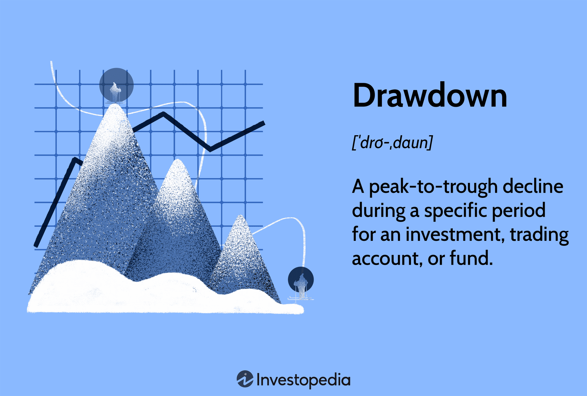

## Table of Contents

## What is Drawdown?

Drawdown is a term used in finance and investing to describe the peak-to-trough decline in the value of an investment, portfolio, or fund. It measures how much an investment has lost from its highest point to its lowest point over a specific period. For example, if an investment starts at $100, reaches a high of $150, and then drops to $120, the drawdown is calculated as the percentage drop from $150 to $120, which is 20%.

Understanding drawdown is important for investors because it helps them assess the risk of an investment. A large drawdown means the investment can lose a lot of value quickly, which might be scary for some investors. By knowing the drawdown, investors can make better decisions about whether an investment fits their comfort level with risk. It also helps them plan how long it might take to recover from losses and get back to the highest value.

## How is Drawdown measured in financial markets?

Drawdown in financial markets is measured by looking at how much an investment's value drops from its highest point to its lowest point over a certain time. Let's say you have an investment that starts at $100, grows to $150, and then falls to $120. The drawdown is the percentage decrease from the peak of $150 to the trough of $120. To find the percentage, you subtract the lowest value from the highest value, divide that by the highest value, and then multiply by 100. In this case, the drawdown would be (($150 - $120) / $150) * 100, which equals 20%.

This measure is important because it helps investors understand the risk of losing money. A bigger drawdown means the investment could lose a lot of value, which might make some investors nervous. By knowing the drawdown, investors can decide if an investment matches their comfort with risk. It also helps them figure out how long it might take for the investment to recover and reach its highest value again.

## What causes a Drawdown in an investment portfolio?

A drawdown in an investment portfolio happens when the value of the investments goes down from its highest point. This can be caused by many things. One common reason is when the overall market goes down. If lots of people start selling their investments because they're worried about the economy, the prices of stocks and other investments can drop a lot. Another reason can be if something bad happens to a specific company or industry that you've invested in. For example, if a company you own stock in gets bad news or has a problem, the value of that stock can fall, which can lead to a drawdown in your portfolio.

Sometimes, drawdowns can also happen because of things that affect the whole world, like a global financial crisis or a big event like a war or a natural disaster. These events can make people nervous and lead them to sell their investments, which can cause the value of many investments to drop. Also, changes in interest rates or inflation can affect how much people are willing to pay for investments, leading to a drawdown. Understanding what causes drawdowns can help investors prepare for them and maybe even see them as chances to buy investments at lower prices.

## Can Drawdown be used to assess the risk of an investment?

Yes, drawdown can be used to assess the risk of an investment. It shows how much an investment might lose from its highest value to its lowest value. A big drawdown means the investment can lose a lot of value, which might make some people worried. By looking at the drawdown, investors can understand if an investment is too risky for them. It helps them see if they are okay with how much the investment might go down.

Drawdown also helps investors think about how long it might take for an investment to get back to its highest value after a drop. If an investment has big drawdowns often, it might take a long time to recover. This can be important for people who might need their money soon. By knowing about drawdowns, investors can make smarter choices about which investments match their comfort with risk and their plans for their money.

## How does Drawdown differ from volatility?

Drawdown and volatility are both ways to measure how risky an investment is, but they look at different things. Drawdown measures how much an investment has lost from its highest point to its lowest point. For example, if you buy a stock at $100, it goes up to $150, and then drops to $120, the drawdown is 20%. This tells you the biggest drop you might see in your investment, which helps you understand how much you could lose at any time.

Volatility, on the other hand, looks at how much an investment's price goes up and down over time. It's often measured using something called standard deviation, which shows how much the price moves around its average. If an investment's price changes a lot every day, it has high volatility. This means the investment can be risky because it might go up or down a lot in a short time, but it doesn't tell you about the biggest drop like drawdown does.

Both drawdown and volatility are important for understanding risk, but they give different information. Drawdown helps you see the worst-case scenario for your investment, while volatility helps you understand how much the investment might change day to day. By looking at both, you can get a better picture of how risky an investment might be for you.

## What is the maximum Drawdown and why is it important?

The maximum drawdown is the biggest drop an investment has ever had from its highest point to its lowest point. For example, if an investment goes from $100 to $150 and then falls to $100 again, the maximum drawdown is 33.33%. This number tells you the worst loss you could have seen if you had bought at the peak and sold at the bottom.

Knowing the maximum drawdown is important because it helps you understand the risk of losing money. If an investment has a big maximum drawdown, it means it can lose a lot of value, which might make you nervous. By knowing this, you can decide if an investment is too risky for you or if you're okay with how much it might go down. It also helps you plan how long it might take for the investment to recover and get back to its highest value.

## How can investors manage or mitigate Drawdown?

Investors can manage or mitigate drawdown by spreading their money across different types of investments. This is called diversification. When you invest in different things like stocks, bonds, and real estate, it's less likely that all of them will go down at the same time. If one investment goes down a lot, the others might not go down as much or might even go up, which can help balance out the losses and reduce the overall drawdown in your portfolio.

Another way to manage drawdown is by using stop-loss orders. A stop-loss order is like a safety net that tells your broker to sell an investment if it drops to a certain price. This can help limit how much you lose on a single investment. Also, being patient and not selling your investments during a big drop can help. Sometimes, the market goes down but then comes back up. If you don't sell during the drop, you might be able to wait it out and see your investments recover.

## What are the psychological impacts of Drawdown on investors?

Drawdown can make investors feel really stressed and worried. When they see their investments losing a lot of value, they might start to panic and think about selling everything. This fear can make it hard for them to stick to their investment plan. They might feel like they made a bad choice or that they'll never get their money back. These feelings can be so strong that some investors might make quick decisions they later regret, like selling their investments at the wrong time.

On the other hand, understanding drawdown can also help investors feel more in control. If they know that drawdowns are a normal part of investing, they might not be as scared when it happens. They can see it as a chance to learn more about the market and their own reactions to it. By preparing for drawdowns and having a plan for what to do when they happen, investors can feel more confident and less likely to make decisions based on fear.

## How do different asset classes experience Drawdown?

Different types of investments, or asset classes, can experience drawdowns in different ways. Stocks, for example, can have big drawdowns because their prices can change a lot based on how the company is doing or what's happening in the economy. If a lot of people start selling stocks because they're worried, the prices can drop a lot, leading to a big drawdown. Bonds, on the other hand, usually have smaller drawdowns because they are seen as safer investments. When people are nervous about the economy, they might move their money from stocks to bonds, which can help keep bond prices more stable.

Real estate can also have drawdowns, but they often happen more slowly than with stocks. The value of a house or a building might go down if the local economy is not doing well or if there are too many homes for sale. But because real estate is a physical thing, it usually doesn't lose value as quickly as stocks. Commodities like gold or oil can have big drawdowns too, especially if there are big changes in how much people want them or how much is available. Each type of investment has its own way of dealing with drawdowns, and understanding this can help investors make better choices about where to put their money.

## What role does Drawdown play in portfolio diversification?

Drawdown is important when you're trying to spread your money across different types of investments, which is called diversification. When you invest in different things like stocks, bonds, and real estate, you're less likely to lose a lot of money all at once. This is because if one type of investment goes down a lot, the others might not go down as much or might even go up. By knowing how much each type of investment might drop, or its drawdown, you can pick a mix of investments that helps balance out the losses and keeps your overall drawdown smaller.

For example, if you have a lot of money in stocks and they have a big drawdown, your whole portfolio could lose a lot of value. But if you also have some money in bonds, which usually don't drop as much, the bonds might help balance out the losses from the stocks. This way, even if one part of your portfolio has a big drawdown, the other parts might help keep your total losses smaller. Understanding drawdown helps you build a portfolio that can handle ups and downs better and might make you feel more comfortable with your investments.

## How can historical Drawdown data be used to predict future performance?

Historical drawdown data can give investors a good idea about how risky an investment might be in the future. By looking at how much an investment has dropped in the past, you can guess how much it might drop again. If an investment has had big drawdowns before, it's more likely to have big drawdowns again. This doesn't mean it will happen for sure, but it helps you understand what could happen. For example, if a stock has lost 50% of its value in the past during a market crash, you might expect it could lose a lot again if there's another crash.

Using historical drawdown data can also help you plan better. If you know an investment has had big drops before, you can think about how long it might take to get your money back if it happens again. This can help you decide if you're okay with waiting that long. By looking at past drawdowns, you can also see if an investment bounces back quickly or takes a long time. This information can help you make smarter choices about what to invest in and how much risk you're willing to take.

## What advanced statistical methods are used to analyze Drawdown?

Advanced statistical methods can help investors understand drawdown better. One common method is using the Value at Risk (VaR) model. This model looks at how much an investment might lose over a certain time, like a day or a month, with a certain level of confidence. For example, if the VaR for an investment is $10,000 at a 95% confidence level over a month, it means there's a 5% chance the investment could lose more than $10,000 in that month. By using VaR, investors can get a better idea of the worst-case scenarios for their investments and plan accordingly.

Another method is the Conditional Value at Risk (CVaR), also known as Expected Shortfall. This method goes a step further than VaR by looking at the average loss that could happen if the loss is worse than the VaR level. For example, if the CVaR is $15,000 at the same 95% confidence level, it means that if the loss is more than $10,000, the average loss would be $15,000. This helps investors understand not just the chance of a big loss but also how bad that loss might be. By using these advanced statistical methods, investors can make more informed decisions about managing and mitigating drawdown in their portfolios.

## What is Understanding Drawdown?

Drawdown is a critical metric in finance and trading that measures the reduction in the value of a trading account from its peak to its lowest point. This measure is typically expressed as a percentage and provides a vital assessment of risk inherent in trading strategies. Calculating drawdown involves determining the difference between the peak value and the trough value reached before a new peak is attained. Mathematically, drawdown (DD) can be expressed as:

$$

DD = \frac{{\text{{Peak Value}} - \text{{Trough Value}}}}{{\text{{Peak Value}}}} \times 100\%
$$

For example, if a portfolio peaks at $1,200 and subsequently declines to $900, the drawdown would be calculated as:

$$
DD = \frac{{1200 - 900}}{1200} \times 100\% = 25\%
$$

This calculation helps traders gauge the worst-case scenario an investment could encounter within a given timeframe. Knowing this potential decline aids in making informed decisions, ensuring that trading strategies remain sustainable and aligned with investors' risk tolerance. Identifying drawdown scenarios allows traders to better prepare for financial setbacks and tailor their strategies to manage risks effectively.

## What are the types of drawdown?

There are several types of drawdown, each offering unique insights into risk management. Maximum Drawdown (Max DD) is perhaps the most common and significant metric, indicating the largest observed loss from a peak to a trough within a specified period. It is essential in assessing the worst possible financial loss a strategy might endure. To calculate Max DD, one can use the formula:

$$
\text{Max DD} = \frac{\text{Peak Value} - \text{Trough Value}}{\text{Peak Value}} \times 100\%
$$

For instance, if an investment peaks at $10,000 and subsequently drops to $7,500, the maximum drawdown is 25%.

Average Drawdown offers a more generalized perspective by calculating the mean of all drawdowns over a specified period. It provides insights into the regularity and extent of drawdowns an investment encounters, thereby helping to understand the overall risk exposure over time, rather than focusing solely on the worst-case scenario.

Relative Drawdown differs by expressing the drawdown as a percentage of the peak value, facilitating comparison across different periods or investments. This type of drawdown helps traders evaluate performance consistency and understand risk in relation to the asset's peak value.

The Calmar Ratio provides an insightful risk-adjusted return metric by dividing the annual rate of return by the maximum drawdown. It assists in evaluating the efficiency of investment strategies in terms of returns generated for each unit of risk. A higher Calmar Ratio indicates a more favorable risk-return tradeoff, emphasizing strategies that achieve better performance with lower risk exposure:

$$
\text{Calmar Ratio} = \frac{\text{Annual Rate of Return}}{\text{Max DD}}
$$

These distinct types of drawdown offer diverse perspectives for traders and investors aiming to assess and manage the risk associated with their investment strategies effectively.

## What is the Importance in Algorithmic Trading?

Algorithmic trading, characterized by its reliance on computer algorithms to execute trades, requires efficient risk management strategies. Within this framework, drawdown plays a crucial role, highlighting the risks associated with specific trading algorithms. 

To effectively evaluate the performance of an [algorithmic trading](/wiki/algorithmic-trading) strategy, drawdown is analyzed alongside metrics such as the Sharpe Ratio and the Sortino Ratio. The Sharpe Ratio measures the risk-adjusted return of an investment by comparing its excess return over the risk-free rate to its [volatility](/wiki/volatility-trading-strategies). The formula for the Sharpe Ratio is:

$$
\text{Sharpe Ratio} = \frac{R_{p} - R_{f}}{\sigma_{p}}
$$

where $R_{p}$ is the expected portfolio return, $R_{f}$ is the risk-free rate, and $\sigma_{p}$ is the standard deviation of the portfolio's excess return. Meanwhile, the Sortino Ratio is a variation that only considers downside volatility, offering a more nuanced view of risk by addressing the impact of negative returns specifically.

Drawdown information is invaluable for fund managers and traders, allowing them to make informed decisions about capital allocation. It serves as a measure of potential risk, enabling the assessment of whether an algorithmic strategy fits within the risk tolerance levels set by a fund or individual investor. This strategic decision-making process often leverages historical drawdown data to predict future risks and scenario analyses.

Additionally, drawdowns are integral to stress testing, where traders simulate extreme market conditions to evaluate the resilience of their strategies. Stress testing with drawdown insights allows traders to anticipate potential worst-case scenarios and design contingency plans. By understanding how a strategy might perform under adverse conditions, traders can refine algorithms to minimize potential losses and adapt to market dynamics.

In summary, drawdown is not only a measure of historical performance but a tool for future risk management and strategy optimization in algorithmic trading. Understanding its implications and leveraging it alongside other financial metrics ensures comprehensive evaluation and robust strategy development.

## References & Further Reading

[1]: Tharp, V. K. (2008). ["Trade Your Way to Financial Freedom"](https://www.amazon.com/Trade-Your-Way-Financial-Freedom/dp/007147871X). McGraw-Hill Education.

[2]: Katz, J. O., & McCormick, D. L. (2000). ["The Encyclopedia of Trading Strategies"](https://www.amazon.com/Encyclopedia-Trading-Strategies-Jeffrey-Ph-D/dp/0070580995). McGraw-Hill.

[3]: Malkiel, B. G. (2016). ["A Random Walk Down Wall Street: The Time-Tested Strategy for Successful Investing"](https://www.amazon.com/Random-Walk-Down-Wall-Street/dp/0393330338). W. W. Norton & Company.

[4]: Hull, J. C. (2018). ["Options, Futures, and Other Derivatives"](https://www.pearson.com/nl/en_NL/higher-education/subject-catalogue/finance/Options-Futures-and-Other-Derivatives-Hull.html). Pearson.

[5]: Carver, R. (2019). ["Systematic Trading: A Unique New Method for Designing Trading and Investing Systems"](https://www.amazon.com/Systematic-Trading-designing-trading-investing/dp/0857194453). Harriman House.