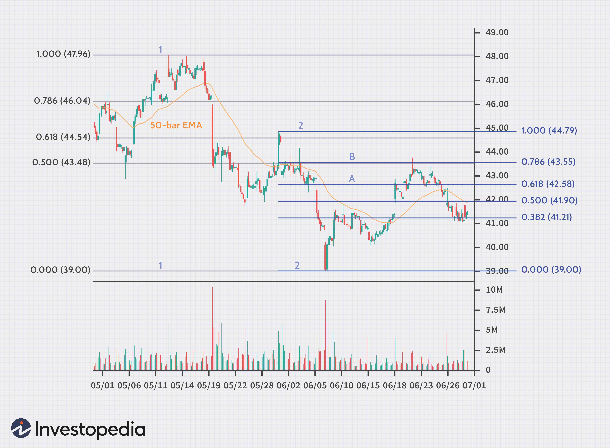

The world of trading is a dynamic landscape filled with various strategies and techniques, each aiming to maximize profits and manage risks. Among these, technical analysis stands out as a popular approach due to its methodology, which focuses on historical price data and chart patterns. By examining these elements, traders aim to predict future market movements and identify optimal entry and exit points.

A key component of technical analysis is the application of Fibonacci levels. These are derived from the Fibonacci sequence, a mathematical series recognized for its distinctive pattern where each number is the sum of the two preceding ones. In trading, Fibonacci levels help to identify potential turning points in the market, which is crucial for executing informed trading strategies. The primary Fibonacci levels used in trading include 23.6%, 38.2%, 50%, 61.8%, and 78.6%, which are applied to financial markets to forecast potential support and resistance levels.



This exploration into Fibonacci levels highlights their utility in analyzing price movements and developing strategic insights. Their application is particularly significant in algorithmic trading, where these principles can be integrated into automated systems for strategic decision-making. Algorithmic trading, which utilizes computer programs to execute trades at high speed, benefits greatly from the predictive power of Fibonacci retracement and extension levels. These metrics provide a framework for creating rules-based systems that can pinpoint price corrections and extensions with precision.

Technical analysis, fortified by the use of Fibonacci retracement and extension levels, plays a vital role in the creation of automated trading systems. These systems rely on real-time data to make rapid calculations and decisions, enhancing trading efficiency and accuracy. Through the integration of Fibonacci levels, traders and developers can build sophisticated algorithms capable of adapting to ever-changing market conditions.

In summary, Fibonacci levels are an essential tool within technical analysis, offering insights into market dynamics that can significantly enhance trading strategies. Their role in algorithmic trading further underscores their importance, facilitating the development of automated systems that are both strategic and efficient.

## Table of Contents

## Understanding Fibonacci Levels

Fibonacci levels are fundamental tools in technical analysis, indispensable to traders for identifying potential turning points in the financial markets. These levels originate from the Fibonacci sequence, a series where each number is the sum of the two preceding ones, such as $0, 1, 1, 2, 3, 5, 8, 13, 21$, and so on. This sequence not only appears in mathematics but also manifests in natural phenomena, making its application in financial markets noteworthy for predicting possible price movements.

In trading, Fibonacci retracement levels serve as a guide to pinpoint potential support and resistance points. These key levels—23.6%, 38.2%, 50%, 61.8%, and 78.6%—are derived by calculating the retracement percentages of a primary trend. Traders utilize these levels to forecast possible reversals in market trends, as historical price action often shows a tendency for prices to retrace a predictable portion of a move, only to continue in the original direction.

Moreover, Fibonacci extensions are utilized when prices extend beyond the initial price trend, providing traders with potential price targets for future support and resistance. Commonly employed extension levels include 161.8%, 261.8%, and 423.6%, which can suggest where an asset's price might extend. These extensions allow traders to estimate the continuation of a trend once it surpasses the previous high or low.

Understanding the interplay between Fibonacci levels and market psychology is crucial for traders aiming to make informed decisions. Since a significant number of traders observe these levels, their collective actions can create self-fulfilling prophecies, influencing market sentiment and price movement. For instance, if a large number of market participants expect a price to reverse at the 61.8% retracement level, their trades can contribute to the anticipated reversal.

Fibonacci tools are often paired with other forms of technical analysis, such as trend lines and moving averages, to enhance their predictive power. By integrating these methods, traders can bolster the reliability of Fibonacci levels as part of a broader trading strategy. In summary, the efficacy of Fibonacci retracement and extension levels lies in their ability to offer insights into potential market entry and [exit](/wiki/exit-strategy) points, thus empowering traders with a more structured approach to navigating the complexities of the financial markets.

## Technical Analysis and Fibonacci Trading

Technical analysis is a methodology used by traders to make informed trading decisions based on chart patterns and historical price movements. It involves a suite of tools and techniques that help traders predict future price trends. Among the most popular tools in technical analysis are Fibonacci levels, which are applied to identify potential market corrections and extension levels for establishing take-profit zones.

Fibonacci levels originate from the Fibonacci sequence, a mathematical series where each number is the sum of its two preceding numbers. In trading, these levels help identify the most probable bounce or reversal points during a market correction. There are key Fibonacci ratios—23.6%, 38.2%, 50%, 61.8%, and 78.6%—that traders use to predict potential retracement levels within a trend.

To utilize Fibonacci levels effectively, traders typically start by identifying the highest and lowest points on a chart, known as swing high and swing low. From these points, Fibonacci retracement levels are constructed to forecast potential price reversals. These levels act as psychological barriers where price action is likely to encounter resistance or support, often coinciding with other chart patterns or trends.

Moreover, Fibonacci extensions are used to project potential price targets during strong trending markets, identifying areas where profit-taking could occur. These extension levels are often marked beyond the original trend and can be used strategically to decide exit points.

Incorporating Fibonacci levels into a trading strategy involves a detailed analysis of historical market cycles and price structures. Traders set retracement and extension grids, which involve geometrically plotting these levels on price charts, to predict future price movements with greater precision. This process usually requires keen observation and the ability to discern patterns in historical price data, making it an essential skill in technical analysis.

The combination of Fibonacci levels with other technical indicators can enhance trading accuracy. For instance, using moving averages or the Relative Strength Index (RSI) alongside Fibonacci levels provides traders with more robust insights into potential market movements. This supplementary analysis can validate or refute trading signals derived from Fibonacci-based frameworks, contributing to more informed decision-making.

## Building Fibonacci-Based Trading Algorithms

Algorithmic trading leverages the principles of Fibonacci trading by automating them, facilitating faster and more consistent execution of trades. This process often involves programming languages such as Python, which are used to optimize trading strategies through [backtesting](/wiki/backtesting). Backtesting involves applying historical data to assess the effectiveness of a trading strategy, allowing developers to fine-tune entry and exit points based on Fibonacci levels.

To implement a Fibonacci-based algorithmic strategy, traders start by writing code that calculates Fibonacci retracement and extension levels. These calculations typically use price data to determine potential trading zones. For instance, in Python, the pandas and numpy libraries are often employed for data manipulation, while matplotlib can be used for visualizing the levels on price charts.

```python
import numpy as np
import pandas as pd
import matplotlib.pyplot as plt

# Example function to calculate Fibonacci retracement levels
def fibonacci_retracement(high, low):
    diff = high - low
    levels = [high - 0.236 * diff, high - 0.382 * diff, high - 0.618 * diff, low]
    return levels

# Example usage
high_price = 150
low_price = 100
fib_levels = fibonacci_retracement(high_price, low_price)
print("Fibonacci Retracement Levels:", fib_levels)
```

For enhanced accuracy, successful algo-trading with Fibonacci levels often integrates additional technical indicators. Indicators such as moving averages or the Relative Strength Index (RSI) can identify market [momentum](/wiki/momentum) and confirm potential reversal points. Combining these indicators within an algorithm can improve the reliability of the trading strategy by providing additional signals or confirmation before executing a trade.

Moreover, automated systems in trading have the capability to adapt to changing market conditions. They achieve this by continuously recalculating Fibonacci levels as new price data becomes available, thereby maintaining their relevance in dynamic markets. Designing these systems requires not only coding proficiency but also a deep understanding of market mechanics to appropriately re-evaluate the levels when significant price movements occur.

Integrating Fibonacci analysis with algorithmic strategies allows traders to efficiently capitalize on market opportunities while minimizing emotional biases. However, it remains crucial for traders to periodically review and update these automated systems, ensuring they align with evolving market behaviors and conditions.

## Challenges and Considerations in Fibonacci Trading

While Fibonacci levels are a valuable tool in technical analysis, they are not without limitations and can sometimes produce misleading signals. To effectively utilize Fibonacci-based strategies, traders must understand the inherent challenges and considerations.

Market [volatility](/wiki/volatility-trading-strategies), unexpected news, and inaccuracies in data can significantly affect the performance of Fibonacci-based trading. Given that financial markets can be highly volatile, price movements may surpass Fibonacci levels, leading to false signals and missed opportunities. Unexpected news events or economic data releases can cause abrupt market fluctuations that render Fibonacci predictions less reliable. It is crucial for traders to remain vigilant and consider the broader economic context when using Fibonacci levels.

Moreover, the reliance on historical data for drawing Fibonacci retracements and extensions poses a risk. Past data does not guarantee future performance, and solely depending on these levels for market predictions could lead to inaccuracies. Fibonacci levels, derived mathematically from price histories, need to be supplemented with dynamic market analysis.

One way to enhance the effectiveness of Fibonacci analysis is by integrating it with risk management strategies and other analytical tools. Risk management involves setting stop-loss and take-profit levels that correspond to market conditions. Traders may also use additional indicators, such as moving averages or Relative Strength Index (RSI), to confirm signals provided by Fibonacci levels. This combinatory approach can help identify entry and exit points more reliably and reduce the impact of false signals.

By adopting a multi-faceted strategy that includes sound risk management and comprehensive analysis, traders can better navigate the challenges associated with Fibonacci trading. Balancing Fibonacci tools with broader market insights fosters more robust decision-making processes, ultimately leading to improved trading outcomes.

## Conclusion

Fibonacci levels, when applied correctly, provide valuable insights into potential market movements by highlighting probable points of support and resistance. These levels, rooted in the Fibonacci sequence, offer a framework for predicting market corrections and extensions, forming a strategic tool in the arsenal of technical analysts and algorithmic traders. By incorporating these levels into trading strategies, traders can enhance their ability to forecast price movements and capitalize on market trends.

Technical analysis and [algorithmic trading](/wiki/algorithmic-trading) leverage Fibonacci insights for strategic trading decisions. The integration of Fibonacci retracements and extensions allows traders to identify optimal entry and exit points, potentially maximizing profitability. Furthermore, algorithmic models can systematically apply Fibonacci principles, executing trades with precision and speed that manual trading may lack. These algorithms, often developed in programming languages such as Python, can continuously adjust to market volatilities, recalibrating Fibonacci levels with new data inputs to remain effective.

Ultimately, a balanced approach that combines Fibonacci analysis with complementary indicators, such as moving averages and relative strength index (RSI), tends to yield the most robust trading outcomes. This strategy supports a comprehensive market analysis, mitigating the risk associated with over-reliance on a single method. The integration of various tools enhances the reliability of predicted market behaviors, providing a more holistic view that aligns with complex market dynamics.

As with any trading strategy, continual learning and adaptation are essential for success in the volatile financial markets. Traders must remain vigilant, updating their methods and understanding as new insights emerge. This commitment to ongoing education and flexibility ensures that trading strategies remain relevant and effective, even as market conditions inevitably evolve.

## References & Further Reading

[1]: ["Fibonacci Analysis"](https://www.investopedia.com/ask/answers/05/fibonacciretracement.asp) by Constance Brown

[2]: ["Technical Analysis of the Financial Markets: A Comprehensive Guide to Trading Methods and Applications"](https://www.amazon.com/Technical-Analysis-Financial-Markets-Comprehensive/dp/0735200661) by John J. Murphy

[3]: ["Trading with the Elliott Wave Principle: A Practical Guide to Spotting and Profiting from Trend Reversals"](https://www.amazon.com/Trading-Elliott-wave-principle-introduction/dp/B0CJ47SW62) by Steven W. Poser

[4]: ["Fibonacci Trading: How to Master the Time and Price Advantage"](https://www.amazon.com/Fibonacci-Trading-Master-Price-Advantage/dp/007149815X) by Carolyn Boroden

[5]: ["Algorithmic Trading & DMA: An introduction to direct access trading strategies"](https://archive.org/details/algorithmictradi0000john) by Barry Johnson