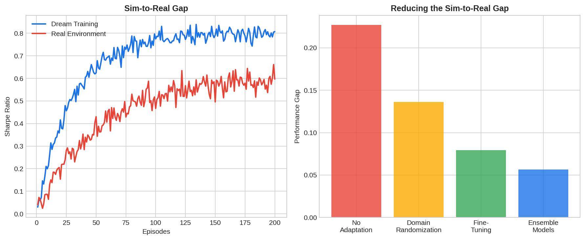

**Dream-to-real transfer** (also called sim-to-real transfer) is the process of training a trading agent inside a simulated or learned environment and then deploying it to trade in real markets. The concept borrows from robotics, where agents trained in physics simulators must operate in the real world. In finance, the "dream" is a market simulator or learned world model, and the "reality" is the live market with all its noise, latency, and adversarial dynamics. Bridging the gap between simulated and real performance is one of the central challenges in applying [model-based reinforcement learning](https://paperswithbacktest.com/wiki/model-based-reinforcement-learning-trading) to trading.

## The Sim-to-Real Gap in Finance

Agents trained in simulated environments consistently outperform their real-world deployments. This gap arises from several sources: the simulator's dynamics model is imperfect, transaction costs and slippage are underestimated, market impact is ignored, other participants adapt to the agent's behavior, and regime shifts create distribution shifts not seen in training data.

| Gap Source | Simulator Assumption | Reality |
|-----------|---------------------|---------|
| Transaction costs | Fixed or zero | Variable, spread-dependent |
| Market impact | None | Price moves against large orders |
| Latency | Instantaneous execution | Millisecond to second delays |
| Other agents | Static or absent | Adaptive, adversarial |
| Distribution | Stationary training data | Non-stationary, regime shifts |

## Techniques for Reducing the Gap

**Domain randomization**: Randomly vary simulator parameters (volatility, spread, latency) during training so the agent learns robust policies that work across a range of conditions rather than overfitting to a single simulator configuration.

**Ensemble world models**: Train multiple world models and evaluate the agent's policy under each. If performance is consistent across models, the policy is more likely to transfer. High disagreement between models signals unreliable predictions.

**Progressive fine-tuning**: Pre-train in simulation, then fine-tune on a small amount of real market data. This combines the sample efficiency of simulation with the accuracy of real data.

**Conservative policy optimization**: Add constraints that penalize the agent for taking actions where the world model is uncertain. This prevents the agent from exploiting simulator artifacts.



## Python Example: Domain Randomization

```python
import numpy as np

class RandomizedMarketSim:
    """Market simulator with randomized parameters for robust training."""
    def __init__(self):
        self.randomize()
    
    def randomize(self):
        """Randomize market parameters each episode."""
        self.mu = np.random.uniform(-0.001, 0.002)
        self.sigma = np.random.uniform(0.005, 0.025)
        self.spread = np.random.uniform(0.0001, 0.001)
        self.impact = np.random.uniform(0.0, 0.0005)
    
    def step(self, position_change):
        """Simulate one timestep with randomized dynamics."""
        raw_return = np.random.normal(self.mu, self.sigma)
        cost = abs(position_change) * (self.spread + self.impact)
        return raw_return - cost

# Train agent across many randomized environments
np.random.seed(42)
sim = RandomizedMarketSim()
n_episodes = 100
episode_rewards = []

for ep in range(n_episodes):
    sim.randomize()  # New market parameters each episode
    total_reward = 0
    position = 0
    for step in range(252):
        action = np.random.choice([-1, 0, 1])  # Placeholder policy
        reward = sim.step(abs(action - position))
        total_reward += reward * action
        position = action
    episode_rewards.append(total_reward)

print(f"Mean reward across randomized envs: {np.mean(episode_rewards):.4f}")
print(f"Std of rewards: {np.std(episode_rewards):.4f}")
```

## Best Practices for Traders

Start with a realistic simulator that includes transaction costs, slippage, and partial fills. Use [historical tick data](https://paperswithbacktest.com/wiki/tick-data) for calibration. Always evaluate the agent on held-out data from different market regimes than training. Monitor the agent's live performance with kill-switches that halt trading if drawdown exceeds simulated worst-case scenarios.

## Limitations and Risks

No simulator perfectly replicates live markets. The more complex the strategy (e.g., HFT, market-making), the larger the sim-to-real gap. Agents may learn to exploit simulator bugs rather than genuine market patterns. Always paper-trade before deploying real capital and scale position sizes gradually.

## Conclusion

Dream-to-real transfer is the critical bridge between RL research and live trading. By using domain randomization, ensemble models, and progressive fine-tuning, traders can build agents that are robust to the inevitable differences between simulation and reality. The goal is not to eliminate the gap — that is impossible — but to make the agent's policy robust enough that real-world performance degrades gracefully rather than catastrophically.

---

**Explore further on PapersWithBacktest:**
- Browse [backtested trading strategies](https://paperswithbacktest.com/strategies) with Python code and performance metrics
- Access [clean historical market data](https://paperswithbacktest.com/datasets) for equities, crypto, and futures
- Take the [algo trading course](https://paperswithbacktest.com/course) — 60+ video lessons and notebooks
- Related wiki pages: [Model-Based RL for Trading](https://paperswithbacktest.com/wiki/model-based-reinforcement-learning-trading) · [Tick Data](https://paperswithbacktest.com/wiki/tick-data) · [LLM Trading Agents](https://paperswithbacktest.com/wiki/llm-trading-agents)
