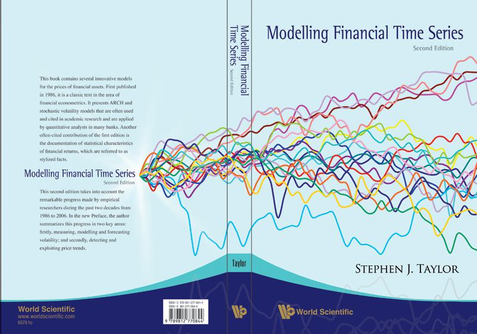

Understanding price behavior is essential for developing profitable strategies in algorithmic trading. Financial time series analysis often hinges on two key concepts: drift and reversion. These concepts are fundamental to understanding asset price movements and the market dynamics that drive them.

Drift refers to the long-term underlying trend in a price series, representing a persistent movement either upwards or downwards. This trend often results from macroeconomic factors, company performance, and investor sentiment, dictating the general direction of asset prices over time. Identifying drift is crucial for trend-following strategies that aim to capitalize on sustained price movements.



In contrast, mean reversion is the statistical phenomenon suggesting that prices tend to return to their historical average over time. This theory is predicated on the idea that overreactions in the market lead to price extremes, which are subsequently corrected as prices revert to a mean or equilibrium level. Mean reversion forms the foundation for contrarian strategies, which seek to exploit these deviations and predict reversals.

This guide will explore the mechanics of drift and mean reversion, defining them, discussing their significance, and examining the indicators used for their identification. Furthermore, it will elaborate on the strategies that leverage these principles, aiming to optimize trading outcomes. Whether you are a novice or a seasoned trader, understanding these concepts is pivotal in crafting effective algorithmic trading strategies that navigate both long-term trends and short-term market corrections.

## Table of Contents

## Understanding Drift and Reversion

Drift in a financial time series represents the persistent long-term trend in asset prices moving in a single direction. This component is typically attributed to factors such as changes in the economic fundamentals, monetary policy decisions, or investor sentiment that gradually influence market prices. Mathematical representation of drift often involves a deterministic trend component in time series models, with a common approach being the incorporation of a constant term in stochastic models like the Geometric Brownian Motion (GBM). In GBM, the price $S_t$ of an asset at time $t$ is modeled as:

$$
dS_t = \mu S_t dt + \sigma S_t dW_t
$$

where $\mu$ is the drift term signifying the expected percentage change in price per unit of time, $\sigma$ is the volatility, and $dW_t$ is the Wiener process representing the random shocks.

Mean reversion, on the other hand, is a theory postulating that prices will eventually revert to their historical average over time. This concept is driven by market overreactions that lead to prices deviating from their equilibrium levels. The mean reversion process is often modeled through mean-reverting processes such as the Ornstein-Uhlenbeck process. In this context, the price process $X_t$ is characterized by the following stochastic differential equation:

$$
dX_t = \theta (\mu - X_t) dt + \sigma dW_t
$$

Here, $\theta$ is the rate of mean reversion, indicating the speed at which prices return to the mean $\mu$, while $\sigma$ again represents the [volatility](/wiki/volatility-trading-strategies) of the process.

Both drift and mean reversion are essential for understanding market behavior, providing a framework for predicting future price movements. The presence of drift suggests opportunities for trend-following strategies, where traders capitalize on the market's continued movement in a particular direction. Mean reversion strategies, conversely, are based on identifying overreactions and anticipating price corrections.

Financial models often integrate these concepts to simulate asset prices and develop trading strategies. For instance, when utilizing models for [algorithmic trading](/wiki/algorithmic-trading), calibrating the parameters $\mu$, $\sigma$, and $\theta$ in historical data can yield insights into probable future behavior. By leveraging statistical techniques and [machine learning](/wiki/machine-learning) algorithms, traders enhance their ability to forecast price dynamics accurately and make informed trading decisions.

## Importance in Algorithmic Trading

In algorithmic trading, accurately identifying and exploiting drift and reversion patterns are critical for maximizing profitability. Drift, which characterizes the underlying trend in asset prices, offers a foundation for trend-following strategies. These strategies aim to capitalize on the persistence of price movements in a single direction, allowing traders to benefit from [momentum](/wiki/momentum). An example of a basic trend-following strategy involves using moving averages, where buy signals are generated when a shorter-term moving average crosses above a longer-term moving average.

Contrastingly, mean reversion suggests that asset prices tend to move back towards their historical average or mean. This behavior is instrumental for contrarian strategies, which are based on the concept that markets typically overreact to news, leading to short-term price disparities that will eventually correct themselves. Such strategies allow traders to anticipate and profit from price corrections. By identifying statistical anomalies or mispricings, traders can determine optimal entry and [exit](/wiki/exit-strategy) points that promise better risk-adjusted returns.

Algorithmic traders who adeptly apply these concepts can thus exploit market inefficiencies. For instance, by utilizing statistical techniques to quantify drift and reversion, traders can develop algorithms that systematically identify strategic opportunities. This process often involves rigorous [backtesting](/wiki/backtesting) to evaluate how these strategies would have performed under different historical market conditions, which helps in refining the strategy to ensure its robustness.

### Python Example: Simple Moving Average Crossover Strategy

A simple Python implementation of a moving average crossover strategy can illustrate how these concepts are operationalized algorithmically:

```python
import pandas as pd
import numpy as np

def moving_average_strategy(prices, short_window=40, long_window=100):
    signals = pd.DataFrame(index=prices.index)
    signals['price'] = prices
    signals['short_mavg'] = prices.rolling(window=short_window, min_periods=1).mean()
    signals['long_mavg'] = prices.rolling(window=long_window, min_periods=1).mean()

    signals['signal'] = 0.0
    signals['signal'][short_window:] = np.where(signals['short_mavg'][short_window:] > signals['long_mavg'][short_window:], 1.0, 0.0)   
    signals['positions'] = signals['signal'].diff()

    return signals

# Assuming 'data' is a pandas Series with historical price data
# signals = moving_average_strategy(data)

```

This script calculates the short-term and long-term moving averages, generating buy or sell signals based on crossover points. The positions column identifies whether a buy or sell action is indicated, representing entry and exit points in the market.

Overall, drift and mean reversion provide strategic insights into asset price behaviors that can be systematically exploited through algorithmic trading. Such strategies leverage quantitative models to ensure decisions are data-driven, reducing emotional biases often associated with manual trading. This systematic approach allows traders to adapt to evolving market conditions, maintaining a competitive edge.

## Indicators for Detecting Drift and Reversion

Various technical indicators enable traders to identify drift and mean reversion opportunities, playing a crucial role in executing efficient trading strategies. Among these indicators, Bollinger Bands, the Relative Strength Index (RSI), and Moving Averages are prominent due to their efficacy in detecting deviations from average price levels, thereby providing actionable signals.

**Bollinger Bands** are a volatility-based indicator consisting of three lines: the middle line is a simple moving average (SMA) of the asset price, while the upper and lower bands are standard deviations away from the SMA. The equation for Bollinger Bands is:

$$

\text{Upper Band} = \text{SMA} + m \cdot \text{SD} 
$$
$$

\text{Lower Band} = \text{SMA} - m \cdot \text{SD} 
$$

where $\text{SMA}$ is the simple moving average, $m$ is the multiplier (usually set to 2), and $\text{SD}$ is the standard deviation. When prices break above or below these bands, it signals potential overbought or oversold conditions, often indicating imminent mean reversion.

Python code to compute Bollinger Bands:

```python
import pandas as pd

def bollinger_bands(data, window, num_std_dev):
    rolling_mean = data['Close'].rolling(window).mean()
    rolling_std = data['Close'].rolling(window).std()
    upper_band = rolling_mean + (rolling_std * num_std_dev)
    lower_band = rolling_mean - (rolling_std * num_std_dev)
    return rolling_mean, upper_band, lower_band

# Example usage with a DataFrame
# sma, upper_band, lower_band = bollinger_bands(df, 20, 2)
```

**The Relative Strength Index (RSI)** is an oscillator that assesses price momentum over a specified period, typically 14 days. It ranges from 0 to 100 and is computed as follows:

$$

\text{RSI} = 100 - \left(\frac{100}{1 + \frac{\text{Average Gain}}{\text{Average Loss}}}\right)
$$

An RSI above 70 suggests a security is overbought, while below 30 indicates oversold conditions, both of which may precede price reversals towards the mean.

Python code snippet to calculate the RSI:

```python
def rsi(data, window):
    delta = data['Close'].diff()
    gain = (delta.where(delta > 0, 0)).rolling(window).mean()
    loss = (-delta.where(delta < 0, 0)).rolling(window).mean()
    rs = gain / loss
    return 100 - (100 / (1 + rs))

# Example usage with a DataFrame
# rsi_values = rsi(df, 14)
```

**Moving Averages** represent the average price of an asset over a set period, aiding in the identification of trends. The Simple Moving Average (SMA) is the most basic form, calculated as follows:

$$

\text{SMA}_n = \frac{\sum_{i=0}^{n-1} P_i}{n} 
$$

where $P_i$ is the closing price at period $i$, and $n$ is the number of periods. A longer SMA provides insights into the long-term trend (drift), while a shorter SMA can illustrate price noise or short-term fluctuations. Crossovers between short-term and long-term SMAs can indicate bullish or bearish market signals, offering potential entry or exit points.

Incorporating these indicators into a comprehensive strategy allows traders to make informed decisions based on statistical analysis of price movements. Understanding the implications of these signals can significantly enhance trading performance by optimizing timing in both trend-following and mean reversion strategies.

## Strategies Leveraging Drift and Reversion

Algorithmic trading strategies that leverage drift and reversion are aimed at exploiting different market behaviors to enhance profitability. Understanding these strategies allows traders to effectively utilize both price trends and price corrections.

**Trend-Following Strategies**

Trend-following strategies are designed to capitalize on the drift in asset prices, which is the tendency of a price series to move in a particular direction over time. These strategies are predicated on the belief that once a trend is established, it is likely to continue. A common technique in trend-following strategies is the use of moving average crossovers.

A moving average crossover occurs when a short-term moving average crosses a long-term moving average. A typical implementation involves using a shorter period moving average (e.g., 50-day) and a longer period moving average (e.g., 200-day). A buy signal is generated when the short-term average crosses above the long-term average, indicating an upward trend, and a sell signal is generated when the short-term average crosses below the long-term average, indicating a downward trend.

Here is a simple Python example using pandas for moving average crossovers:

```python
import pandas as pd

def moving_average_crossover_strategy(data, short_window=50, long_window=200):
    data['Short_MA'] = data['Close'].rolling(window=short_window, min_periods=1).mean()
    data['Long_MA'] = data['Close'].rolling(window=long_window, min_periods=1).mean()
    data['Signal'] = 0
    data['Signal'][short_window:] = np.where(data['Short_MA'][short_window:] > data['Long_MA'][short_window:], 1.0, 0.0)
    data['Position'] = data['Signal'].diff()
    return data

# Example usage
# data = pd.read_csv('stock_data.csv') # Assuming stock_data.csv has a 'Close' column
# strategy_data = moving_average_crossover_strategy(data)
```

**Mean Reversion Strategies**

Mean reversion strategies rely on the concept that asset prices tend to revert to their historical mean. These strategies involve identifying price deviations from the average and anticipating a reversal. This can be done using statistical measures to determine when a price is significantly higher or lower than its average value.

Pairs trading is a popular mean reversion strategy that involves taking long and short positions in two correlated assets. The basic premise is that if the price relationship between two co-integrated stocks diverges from its historical mean, it will eventually converge back. The strategy involves short-selling the outperforming asset and buying the underperforming one, expecting the spread to close.

Here is a Python example for pairs trading using the statsmodels library for co-integration testing:

```python
import numpy as np
import statsmodels.api as sm

def pairs_trading_strategy(asset1, asset2):
    model = sm.OLS(asset1, sm.add_constant(asset2))
    result = model.fit()
    spread = asset1 - result.params[1] * asset2
    z_score = (spread - np.mean(spread)) / np.std(spread)
    return z_score

# Example usage
# asset1 = np.array([...])  # Price data for asset 1
# asset2 = np.array([...])  # Price data for asset 2
# z_score = pairs_trading_strategy(asset1, asset2)
```

**Statistical Arbitrage**

Statistical [arbitrage](/wiki/arbitrage) extends mean reversion principles to larger baskets of securities or broader market indices. It involves identifying price anomalies and engaging in trades that exploit temporary statistical mispricings. The techniques often require complex models and large datasets to find subtle inefficiencies and are executed via high-frequency trading algorithms.

These strategies, whether focusing on drift with trend-following or on mean reversion, allow traders to systematically approach market opportunities. Implementing them effectively requires robust computational tools and careful consideration of transaction costs and market conditions.

## Challenges and Considerations

Trading strategies based on drift and mean reversion, while offering significant opportunities, are not without challenges that traders must address carefully. One primary concern is the occurrence of prolonged trends, which can adversely affect mean reversion strategies. These strategies rely on the assumption that asset prices revert to their historical average; however, during sustained trends, prices may continue moving away from the mean, causing potential losses. Conversely, drift-based strategies can underperform in choppy or sideways markets where a clear direction is absent.

Market dynamics add another layer of complexity. Changes in economic conditions, regulatory environments, or investor behavior can alter market patterns. Traditional indicators might become less reliable under new conditions, leading to decreased strategy performance. Adapting to these shifts requires continuous monitoring and strategy adjustment to maintain profitability.

Backtesting is indispensable for assessing the potential success of a strategy. By simulating how a strategy would have performed using historical data, traders can identify strengths and weaknesses before committing capital. Nonetheless, past performance does not guarantee future results, and models must incorporate factors like transaction costs and slippage to provide realistic evaluations.

Effective risk management is equally crucial. Traders should employ techniques such as setting stop-loss orders and position sizing to limit potential losses. Diversification across different assets and strategies can also reduce risk exposure. 

Understanding these limitations is essential for developing resilient strategies. Traders should stay informed about macroeconomic indicators and market news that might influence trends and reversions. Advanced analytic techniques, like machine learning, can be integrated to detect and adapt to emerging patterns, providing a competitive edge.

Ultimately, successful trading strategies based on drift and reversion necessitate a dynamic approach, combining historical insights with forward-looking analysis to navigate evolving market landscapes effectively.

## Conclusion

Drift and mean reversion are essential concepts in algorithmic trading, providing traders with effective tools to navigate financial markets. By leveraging these principles, traders can develop strategies that capitalize on both long-term trends and short-term market corrections. Drift, representing the persistent movement of prices in one direction, is instrumental in trend-following strategies, allowing traders to identify and ride market trends. Conversely, mean reversion, based on the theory that prices eventually return to their historical average, is crucial for contrarian strategies that seek to exploit market overreactions.

Adapting to dynamic market conditions is crucial for optimizing these strategies. Continuous learning and the refinement of models are necessary to maintain relevance in evolving markets. Algorithmic traders must employ robust backtesting and risk management practices to ensure strategy resilience and to minimize potential losses.

This article offers a comprehensive guide to integrating drift and mean reversion into algorithmic trading practices. Through an understanding of these concepts, traders can effectively tackle the complexities of financial markets, maximizing their potential for achieving superior risk-adjusted returns. As markets change, the ability to adjust and enhance strategies in response to new information will remain a key differentiator for successful traders.

## References & Further Reading

For those seeking to deepen their understanding of financial time series analysis and algorithmic trading, several academic and practical resources are invaluable. 

**Books and Texts:**

1. **"Algorithmic Trading and DMA: An Introduction to Direct Access Trading Strategies" by Barry Johnson**: This book provides an extensive overview of algorithmic trading techniques and the infrastructure of electronic markets. It's an excellent starting point for understanding direct market access and the execution of algorithmic strategies.

2. **"Quantitative Trading: How to Build Your Own Algorithmic Trading Business" by Ernie Chan**: Ernie Chan's work focuses on practical aspects of building and operating an algorithmic trading business, offering insights into strategy development, testing, and implementation with real-world examples.

3. **"Mean Reversion Trading Systems" by Dr. Howard Bandy**: This book emphasizes the development and application of mean reversion trading strategies, providing both theoretical foundations and practical guidance on system creation and testing.

**Academic Papers:**

4. **"The Econometrics of Financial Markets" by John Y. Campbell, Andrew W. Lo, and A. Craig MacKinlay**: This paper is seminal in understanding the econometric techniques applied in analyzing financial market data, covering topics like asset pricing, volatility modeling, and market efficiency.

5. **"A Non-Random Walk Down Wall Street" by Andrew W. Lo and A. Craig MacKinlay**: This collection of papers challenges the random walk hypothesis, presenting evidence of predictable components in asset prices, critical for developing both drift and mean reversion strategies.

**Online Resources:**

6. **QuantStart**: This website offers a wealth of tutorials, articles, and courses on algorithmic trading and quantitative finance. It includes in-depth guides on trading strategy development, backtesting techniques, and the use of Python for quantitative analysis.

7. **Khan Academy: Finance and Capital Markets**: While not exclusively focused on algorithmic trading, Khan Academy provides clear explanations of fundamental financial concepts which are essential for anyone engaged in financial time series analysis.

8. **Coursera and edX Courses on Algorithmic Trading**: These platforms offer courses from universities and institutions covering various aspects of algorithmic trading, from basic introductions to specialized topics like machine learning in finance.

By exploring these resources, traders can enhance their knowledge and skills, applying advanced methodologies to optimize their trading strategies effectively. Continuous learning and adaptation remain crucial in navigating the ever-evolving landscape of financial markets.

