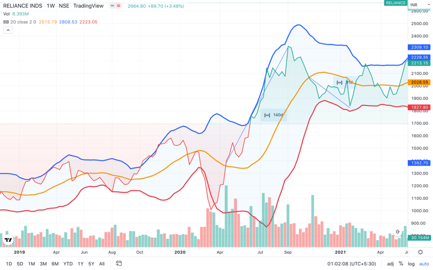

## Table of Contents

## What is a financial time series?

A financial time series is a set of data points collected over time that show how a financial variable changes. This could be the price of a stock, the value of a currency, or an interest rate. Each data point in the series is recorded at a specific time, like every day, hour, or minute. By looking at these time series, people can see patterns and trends in the financial markets, which can help them make decisions about buying or selling assets.

These series are important because they help analysts and investors understand past performance and predict future movements. For example, if you see that a stock's price goes up every December, you might decide to buy it in November. Financial time series are used in many areas, like stock market analysis, economic forecasting, and risk management. They are a key tool for anyone who wants to make smart choices with their money.

## What is meant by 'drift' in the context of financial time series?

In financial time series, 'drift' refers to a slow and steady change in the value of a financial asset over time. Imagine you're watching the price of a stock. If the price keeps going up a little bit each day, that's what we call drift. It's like a gentle push in one direction, making the price move away from where it started.

Drift is important because it can show us the overall direction that a stock or another financial asset is moving. If a stock has a positive drift, it means its price is generally increasing over time. On the other hand, a negative drift means the price is going down. Understanding drift helps investors predict where the price might go in the future and make better decisions about buying or selling.

## How does 'reversion' differ from 'drift' in financial markets?

In financial markets, 'drift' and 'reversion' are two different ways that prices can move over time. Drift is like a slow and steady push in one direction. Imagine a stock's price slowly going up or down over many days. That's drift. It shows the general direction that the price is moving. If a stock has a positive drift, it means its price is usually going up over time. If it has a negative drift, the price is generally going down.

Reversion, on the other hand, is when prices tend to come back to a certain level after moving away from it. Think of it like a rubber band. If you stretch it, it will snap back to where it started. In the financial world, this is called mean reversion. If a stock's price goes up a lot, it might come back down to its average price later. Or if it goes down a lot, it might go back up. Reversion is important because it helps investors understand that big changes in price might not last forever, and the price could return to normal.

Both drift and reversion help investors make decisions. Drift shows the long-term direction, while reversion tells us that prices might not stay far from their average for too long. By understanding these concepts, investors can better predict how prices might move and plan their buying and selling strategies accordingly.

## Can you explain the concept of mean reversion in financial time series?

Mean reversion is a fancy term that means prices tend to go back to their average over time. Imagine you're watching the price of a stock. If it goes way up one day, it might come back down closer to its usual price later. It's like when you throw a ball up in the air; it comes back down to the ground. In the world of money, this idea helps people guess that if a stock's price gets too high or too low, it will probably move back towards what's normal for it.

This idea is really helpful for people who invest money. If they see a stock's price is much higher than usual, they might think it's a good time to sell because the price could go down soon. On the other hand, if a stock's price is much lower than normal, they might buy it, hoping the price will go back up. By understanding mean reversion, investors can make smarter choices about when to buy or sell, trying to make more money in the long run.

## What are the common statistical methods used to identify drift in time series data?

One common way to spot drift in time series data is by using something called linear regression. Think of it like drawing a straight line through a bunch of points on a graph. If the line goes up or down, that's showing you the drift. You take all the data points and find the line that best fits them. The slope of this line tells you if there's a drift and how strong it is. If the slope is positive, the drift is pushing the values up over time. If it's negative, the drift is pulling them down.

Another method people use is called the Augmented Dickey-Fuller (ADF) test. This test helps you figure out if there's a trend in your data or if it's just bouncing around without any real direction. The ADF test looks at how the data changes from one point to the next. If it finds that the changes are related to the past values in a way that suggests a trend, then you might have drift. This test is a bit more complicated, but it's good for making sure the drift you see isn't just random noise.

Sometimes, people also use something called moving averages to spot drift. You take the average of the data over a certain period and see how it changes over time. If the moving average keeps going up or down, that could be a sign of drift. It's like smoothing out the ups and downs to see the bigger picture. This method is simpler and can be a good first step to see if there's a trend in your data.

## How can one detect mean reversion in a financial time series?

To spot mean reversion in a financial time series, you can use a simple method called the moving average. Imagine you're tracking the price of a stock every day. You take the average price over the last few days and see how it changes. If the price goes way above this average and then comes back down, or if it drops way below and then goes back up, that's a sign of mean reversion. It's like watching a rubber band stretch and then snap back to its normal shape.

Another way to detect mean reversion is by using a statistical test called the Augmented Dickey-Fuller (ADF) test. This test helps you figure out if the price changes are just random or if they tend to go back to a certain level. If the test shows that the price movements are not just bouncing around but are instead coming back to an average, then you've got mean reversion. It's a bit more complicated, but it gives you a clearer picture of whether the prices are really moving back to their usual spot.

## What are the implications of drift for financial modeling and forecasting?

Drift is important for financial modeling and forecasting because it shows us the long-term direction that a stock or another financial asset is moving. If a stock has a positive drift, it means its price is generally going up over time. This information helps people who are trying to predict where the price might go in the future. They can use drift to build models that take into account this slow and steady change, making their predictions more accurate. For example, if a stock has been slowly increasing in price for a long time, a model that includes drift would expect this trend to continue, helping investors decide when to buy or sell.

However, drift can also make forecasting more challenging because it means the data isn't just bouncing around randomly. It's moving in a certain direction, and this needs to be included in the models. If a model doesn't account for drift, it might miss important trends and give wrong predictions. So, people who build these models need to carefully look at the data to see if there's a drift and then adjust their models to include it. This way, their forecasts will be more reliable and helpful for making smart investment choices.

## How does understanding reversion help in developing trading strategies?

Understanding reversion can help traders make better choices about when to buy or sell stocks. If a stock's price goes way up or down, but usually comes back to its average price, that's called mean reversion. Traders can use this idea to make money. For example, if a stock's price is much higher than its usual price, a trader might decide to sell it because they think the price will go back down soon. On the other hand, if the price is much lower than normal, a trader might buy it, hoping it will go back up to its average.

By using mean reversion in their trading strategies, traders can try to make profits from these price movements. They look for times when the price is far from its average and then make trades based on their guess that the price will move back towards that average. This can be a smart way to trade because it's based on a pattern that happens a lot in the stock market. But, it's important to remember that no strategy works all the time, and traders need to be careful and keep learning to do well.

## What are some real-world examples of drift and reversion in financial markets?

Let's talk about drift first. Imagine you're looking at the stock price of a big company like Apple over many years. You might notice that, over time, the stock price has been slowly going up. This slow and steady increase is what we call drift. It's like a gentle push in one direction. For example, if you looked at Apple's stock from 2010 to 2020, you'd see that the price generally moved upward, even though there were ups and downs along the way. This drift helps investors see the long-term trend and make decisions about whether to buy or keep holding the stock.

Now, let's look at reversion. Think about the price of oil. Sometimes, the price of oil can jump really high because of things like political problems in oil-producing countries. But after a while, the price often comes back down closer to what it usually is. This is called mean reversion. For instance, in 2008, the price of oil shot up to around $145 per barrel, but then it fell back down to around $40 per barrel within a year. People who understand mean reversion might have sold oil when the price was very high, expecting it to come back down, or bought it when the price was low, hoping it would go back up.

## How do advanced models like ARIMA and GARCH account for drift and reversion?

ARIMA, which stands for AutoRegressive Integrated Moving Average, is a type of model that can help predict future values in a time series by looking at past data. It's really good at spotting both drift and reversion. If there's a drift in the data, like a stock price slowly going up over time, ARIMA can include that in its predictions. It does this by adding a trend component to the model. For reversion, ARIMA looks at how the data moves around its average. If it sees that prices tend to go back to their average after big changes, it can use that information to make better guesses about where the prices might go next.

GARCH, which stands for Generalized Autoregressive Conditional Heteroskedasticity, is another model that's great for understanding financial time series. It's especially good at dealing with reversion in something called volatility, which is how much prices jump around. GARCH looks at past volatility to predict future volatility. If it sees that volatility tends to go back to a certain level after big changes, it can use that to make more accurate predictions. While GARCH focuses more on volatility, it can also help with drift by looking at how volatility changes over time, which can be related to the overall direction of the prices.

## What are the challenges in accurately modeling drift and reversion in highly volatile markets?

In highly volatile markets, it's really hard to model drift and reversion accurately. Volatility means prices can jump around a lot, making it tough to see the slow, steady changes that show drift. Imagine trying to find a gentle slope on a mountain that's always shaking. The big ups and downs can hide the drift, making it hard for models like ARIMA to spot and predict it correctly. Plus, when markets are super volatile, the data can be all over the place, and it's tough to figure out if there's a real trend or if it's just random noise.

Reversion is also tricky to model in these markets. Mean reversion means prices tend to go back to their average, but in a volatile market, prices can swing so wildly that it's hard to tell if they're really coming back to normal or just bouncing around. Models like GARCH try to predict how much prices will jump around, but when the market is really wild, these predictions can be off. It's like trying to guess where a ball will land when it's being thrown in a storm. The more the market moves, the harder it is to see the patterns that show reversion, making it a big challenge for anyone trying to use these models to make smart investment choices.

## How can machine learning techniques enhance the prediction of drift and reversion patterns in financial time series?

Machine learning can make predicting drift and reversion in financial time series a lot better. These techniques can look at huge amounts of data and find patterns that might be hard for people to see. For example, machine learning can use something called neural networks to learn from past data and guess where prices might go next. It can pick up on the slow, steady changes that show drift, even when the market is jumping around a lot. By training on lots of historical data, machine learning models can get really good at spotting these trends and using them to make more accurate predictions about the future.

When it comes to reversion, machine learning can also help a lot. These models can learn how prices tend to come back to their average after big changes. They can use techniques like regression analysis to understand how prices move and predict when they might go back to normal. This is especially useful in markets that are really volatile because machine learning can sort through all the noise and find the patterns that show reversion. By doing this, machine learning can help traders and investors make smarter choices about when to buy or sell, based on the likelihood that prices will move back to their usual levels.

## What is Understanding Drift and Reversion?

Drift in a financial time series represents the persistent long-term trend in asset prices moving in a single direction. This component is typically attributed to factors such as changes in the economic fundamentals, monetary policy decisions, or investor sentiment that gradually influence market prices. Mathematical representation of drift often involves a deterministic trend component in time series models, with a common approach being the incorporation of a constant term in stochastic models like the Geometric Brownian Motion (GBM). In GBM, the price $S_t$ of an asset at time $t$ is modeled as:

$$
dS_t = \mu S_t dt + \sigma S_t dW_t
$$

where $\mu$ is the drift term signifying the expected percentage change in price per unit of time, $\sigma$ is the volatility, and $dW_t$ is the Wiener process representing the random shocks.

Mean reversion, on the other hand, is a theory postulating that prices will eventually revert to their historical average over time. This concept is driven by market overreactions that lead to prices deviating from their equilibrium levels. The mean reversion process is often modeled through mean-reverting processes such as the Ornstein-Uhlenbeck process. In this context, the price process $X_t$ is characterized by the following stochastic differential equation:

$$
dX_t = \theta (\mu - X_t) dt + \sigma dW_t
$$

Here, $\theta$ is the rate of mean reversion, indicating the speed at which prices return to the mean $\mu$, while $\sigma$ again represents the [volatility](/wiki/volatility-trading-strategies) of the process.

Both drift and mean reversion are essential for understanding market behavior, providing a framework for predicting future price movements. The presence of drift suggests opportunities for trend-following strategies, where traders capitalize on the market's continued movement in a particular direction. Mean reversion strategies, conversely, are based on identifying overreactions and anticipating price corrections.

Financial models often integrate these concepts to simulate asset prices and develop trading strategies. For instance, when utilizing models for [algorithmic trading](/wiki/algorithmic-trading), calibrating the parameters $\mu$, $\sigma$, and $\theta$ in historical data can yield insights into probable future behavior. By leveraging statistical techniques and [machine learning](/wiki/machine-learning) algorithms, traders enhance their ability to forecast price dynamics accurately and make informed trading decisions.

## What are the indicators for detecting drift and reversion?

Various technical indicators enable traders to identify drift and mean reversion opportunities, playing a crucial role in executing efficient trading strategies. Among these indicators, Bollinger Bands, the Relative Strength Index (RSI), and Moving Averages are prominent due to their efficacy in detecting deviations from average price levels, thereby providing actionable signals.

**Bollinger Bands** are a volatility-based indicator consisting of three lines: the middle line is a simple moving average (SMA) of the asset price, while the upper and lower bands are standard deviations away from the SMA. The equation for Bollinger Bands is:

$$

\text{Upper Band} = \text{SMA} + m \cdot \text{SD} 
$$
$$

\text{Lower Band} = \text{SMA} - m \cdot \text{SD} 
$$

where $\text{SMA}$ is the simple moving average, $m$ is the multiplier (usually set to 2), and $\text{SD}$ is the standard deviation. When prices break above or below these bands, it signals potential overbought or oversold conditions, often indicating imminent mean reversion.

Python code to compute Bollinger Bands:

```python
import pandas as pd

def bollinger_bands(data, window, num_std_dev):
    rolling_mean = data['Close'].rolling(window).mean()
    rolling_std = data['Close'].rolling(window).std()
    upper_band = rolling_mean + (rolling_std * num_std_dev)
    lower_band = rolling_mean - (rolling_std * num_std_dev)
    return rolling_mean, upper_band, lower_band

# Example usage with a DataFrame
# sma, upper_band, lower_band = bollinger_bands(df, 20, 2)
```

**The Relative Strength Index (RSI)** is an oscillator that assesses price momentum over a specified period, typically 14 days. It ranges from 0 to 100 and is computed as follows:

$$

\text{RSI} = 100 - \left(\frac{100}{1 + \frac{\text{Average Gain}}{\text{Average Loss}}}\right)
$$

An RSI above 70 suggests a security is overbought, while below 30 indicates oversold conditions, both of which may precede price reversals towards the mean.

Python code snippet to calculate the RSI:

```python
def rsi(data, window):
    delta = data['Close'].diff()
    gain = (delta.where(delta > 0, 0)).rolling(window).mean()
    loss = (-delta.where(delta < 0, 0)).rolling(window).mean()
    rs = gain / loss
    return 100 - (100 / (1 + rs))

# Example usage with a DataFrame
# rsi_values = rsi(df, 14)
```

**Moving Averages** represent the average price of an asset over a set period, aiding in the identification of trends. The Simple Moving Average (SMA) is the most basic form, calculated as follows:

$$

\text{SMA}_n = \frac{\sum_{i=0}^{n-1} P_i}{n} 
$$

where $P_i$ is the closing price at period $i$, and $n$ is the number of periods. A longer SMA provides insights into the long-term trend (drift), while a shorter SMA can illustrate price noise or short-term fluctuations. Crossovers between short-term and long-term SMAs can indicate bullish or bearish market signals, offering potential entry or exit points.

Incorporating these indicators into a comprehensive strategy allows traders to make informed decisions based on statistical analysis of price movements. Understanding the implications of these signals can significantly enhance trading performance by optimizing timing in both trend-following and mean reversion strategies.

## References & Further Reading

For those seeking to deepen their understanding of financial time series analysis and algorithmic trading, several academic and practical resources are invaluable. 

**Books and Texts:**

1. **"Algorithmic Trading and DMA: An Introduction to Direct Access Trading Strategies" by Barry Johnson**: This book provides an extensive overview of algorithmic trading techniques and the infrastructure of electronic markets. It's an excellent starting point for understanding direct market access and the execution of algorithmic strategies.

2. **"Quantitative Trading: How to Build Your Own Algorithmic Trading Business" by Ernie Chan**: Ernie Chan's work focuses on practical aspects of building and operating an algorithmic trading business, offering insights into strategy development, testing, and implementation with real-world examples.

3. **"Mean Reversion Trading Systems" by Dr. Howard Bandy**: This book emphasizes the development and application of mean reversion trading strategies, providing both theoretical foundations and practical guidance on system creation and testing.

**Academic Papers:**

4. **"The Econometrics of Financial Markets" by John Y. Campbell, Andrew W. Lo, and A. Craig MacKinlay**: This paper is seminal in understanding the econometric techniques applied in analyzing financial market data, covering topics like asset pricing, volatility modeling, and market efficiency.

5. **"A Non-Random Walk Down Wall Street" by Andrew W. Lo and A. Craig MacKinlay**: This collection of papers challenges the random walk hypothesis, presenting evidence of predictable components in asset prices, critical for developing both drift and mean reversion strategies.

**Online Resources:**

6. **QuantStart**: This website offers a wealth of tutorials, articles, and courses on algorithmic trading and quantitative finance. It includes in-depth guides on trading strategy development, backtesting techniques, and the use of Python for quantitative analysis.

7. **Khan Academy: Finance and Capital Markets**: While not exclusively focused on algorithmic trading, Khan Academy provides clear explanations of fundamental financial concepts which are essential for anyone engaged in financial time series analysis.

8. **Coursera and edX Courses on Algorithmic Trading**: These platforms offer courses from universities and institutions covering various aspects of algorithmic trading, from basic introductions to specialized topics like machine learning in finance.

By exploring these resources, traders can enhance their knowledge and skills, applying advanced methodologies to optimize their trading strategies effectively. Continuous learning and adaptation remain crucial in navigating the ever-evolving landscape of financial markets.

