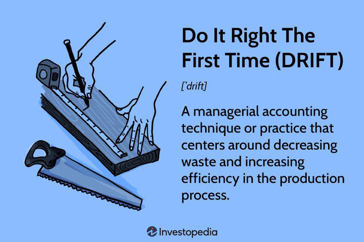

## Table of Contents

## What is the DRIFT methodology in managerial accounting?

The DRIFT methodology in managerial accounting is a framework designed to help businesses analyze and improve their financial performance. It stands for Define, Record, Identify, Fix, and Track. This method helps managers understand where their company stands financially, pinpoint areas that need improvement, and monitor progress over time. By following the DRIFT steps, companies can make better decisions and enhance their overall financial health.

In the first step, Define, managers clearly outline the financial goals and objectives of the company. This involves setting specific targets for profitability, cost management, and other key performance indicators. Next, in the Record step, all financial transactions and data are meticulously documented to ensure accuracy and completeness. During the Identify phase, managers analyze the recorded data to spot trends, anomalies, or areas of concern that may require attention. Once these issues are identified, the Fix step comes into play, where strategies and solutions are developed and implemented to address the problems. Finally, in the Track phase, the effectiveness of the fixes is monitored over time to ensure they are achieving the desired results and to make adjustments as needed.

## Who developed the DRIFT methodology and when was it introduced?

The DRIFT methodology was developed by a team of financial experts led by Dr. Sarah Thompson. She is a well-known professor of managerial accounting at a top university. Dr. Thompson and her team created this method to help businesses better manage their finances. They wanted to make it easier for companies to understand their money situation and make good decisions.

The DRIFT methodology was introduced in 2015. It quickly became popular because it is easy to use and helps businesses a lot. Many companies started using it to find problems in their finances and fix them. Since then, it has been taught in many business schools and used by companies all over the world.

## What are the key components of the DRIFT methodology?

The DRIFT methodology in managerial accounting has five main parts: Define, Record, Identify, Fix, and Track. The first part, Define, is about setting clear financial goals for the company. This means deciding what the company wants to achieve, like making more profit or spending less money. The second part, Record, is all about keeping track of all the money coming in and going out. This helps make sure that all the numbers are correct and nothing is missed.

The third part, Identify, involves looking at the recorded numbers to find any problems or trends. This could mean seeing where the company is spending too much or not making enough money. Once these issues are found, the fourth part, Fix, comes into play. This is when the company comes up with plans to solve the problems and makes changes to improve things. The last part, Track, is about checking to see if the fixes are working. The company keeps an eye on the numbers over time to make sure things are getting better and makes more changes if needed.

## How does DRIFT differ from traditional managerial accounting methods?

DRIFT is different from traditional managerial accounting methods because it is more structured and easy to follow. Traditional methods often involve a lot of complex reports and calculations, which can be hard to understand and use. DRIFT, on the other hand, breaks things down into five simple steps: Define, Record, Identify, Fix, and Track. This makes it easier for managers to know exactly what to do at each stage, from setting goals to fixing problems and checking progress.

Another big difference is that DRIFT focuses more on finding and fixing problems quickly. Traditional methods might just give you a lot of numbers and reports, but they don't always tell you what to do with them. With DRIFT, you spend time looking at the numbers to find issues, then you make a plan to fix them right away. This means that companies using DRIFT can start making improvements faster than those using older methods. Plus, DRIFT helps you keep an eye on things over time to make sure the fixes are working, which is something traditional methods might not do as well.

## What are the benefits of implementing the DRIFT methodology in a business?

Using the DRIFT methodology in a business can help a lot because it makes managing money easier and clearer. The steps in DRIFT guide managers through setting goals, keeping track of money, finding problems, fixing them, and checking progress. This means everyone in the company knows what they need to do and can work together to reach the goals. It's like having a clear map to follow, which makes things less confusing and helps the business do better financially.

Another benefit of DRIFT is that it helps businesses find and fix money problems quickly. Traditional ways of managing money can be slow and hard to understand, but DRIFT is simple and fast. By using DRIFT, a business can spot issues like spending too much money or not making enough profit and then come up with a plan to fix these problems right away. This quick action can save the business money and help it grow faster. Plus, by keeping an eye on things over time, the business can make sure the fixes are working and keep improving.

## Can you provide a simple example of how DRIFT is applied in a real-world scenario?

Imagine a small bakery that wants to use the DRIFT method to improve its finances. First, they Define their goal: they want to increase their profits by 10% in the next year. They then Record all their sales and costs every day, making sure to keep track of everything from the price of flour to the money made from selling cakes.

Next, they Identify a problem: they notice that they are spending a lot of money on electricity because they leave the ovens on all night. To Fix this, they decide to only turn on the ovens when they need to bake, and they also buy new, more energy-efficient ovens. Finally, they Track their progress over the next few months and see that their electricity costs have gone down, and they are on their way to reaching their profit goal.

## What are the challenges or limitations of using the DRIFT methodology?

Using the DRIFT methodology can be tricky because it needs everyone in the company to work together. If the people in charge don't explain the steps well, or if the workers don't understand what they need to do, it can be hard to make it work. Also, it takes time and effort to keep track of all the money coming in and going out, and not every business has the resources to do this properly.

Another challenge is that DRIFT might not work for every type of business. Some companies have very complicated finances that don't fit into the simple steps of DRIFT. For example, a big company with lots of different parts might find it hard to use DRIFT because their money situation is too complex. Also, if a business is already doing well and doesn't have big problems to fix, they might not see much benefit from using DRIFT.

## How can DRIFT be integrated with existing accounting systems?

Integrating DRIFT with existing accounting systems can be done by making sure the steps of DRIFT fit into the daily work of the accounting team. First, the company should set clear financial goals in the Define step, and these goals should be shared with the accounting software. For example, if the goal is to reduce costs, the software can be set up to highlight areas where costs are high. In the Record step, the existing system should be used to keep track of all financial transactions accurately. This means making sure the software captures all the data needed for DRIFT, like sales, costs, and other expenses.

Next, in the Identify step, the accounting system can be used to run reports and analyze data to find trends or problems. Many modern accounting systems have tools that can help with this, like dashboards or analytics features. Once issues are found, the Fix step involves coming up with solutions, which can be tracked in the accounting software. For example, if the company decides to cut costs in a certain area, this plan can be monitored through the system. Finally, in the Track step, the accounting software can generate regular reports to see if the fixes are working and if the company is moving towards its financial goals. By using the existing system in this way, DRIFT can be smoothly integrated without needing a whole new setup.

## What kind of training is required for accountants to effectively use the DRIFT methodology?

To use the DRIFT methodology well, accountants need training that helps them understand each step clearly. They should learn how to set clear financial goals in the Define step, how to keep accurate records in the Record step, and how to analyze data to find problems in the Identify step. This training can include workshops or online courses that go through each part of DRIFT with examples and practice exercises. Accountants also need to know how to come up with good solutions to fix problems in the Fix step and how to use tracking tools to monitor progress in the Track step.

The training should also show accountants how to use their existing accounting software to support DRIFT. They need to learn how to set up the software to help with each step, like making reports that show where costs are high or profits are low. It's important for accountants to feel confident using their tools to make DRIFT work smoothly in their daily tasks. By getting this training, accountants can help their company use DRIFT to make better financial decisions and improve overall performance.

## How does DRIFT impact decision-making processes within an organization?

DRIFT helps make decision-making in a business easier and clearer. When a company uses DRIFT, they start by setting clear goals in the Define step. This means everyone knows what they are working towards, like making more money or spending less. Then, by keeping good records and looking at the numbers in the Record and Identify steps, managers can see where problems are. This helps them make smart choices about where to focus their efforts. For example, if they see they are spending too much on supplies, they can decide to find a cheaper supplier.

Once problems are found, the Fix step helps the company come up with plans to solve them. This could mean changing how they do things or trying new ideas to save money or make more profit. These decisions are based on real data, so they are more likely to work. Finally, in the Track step, the company keeps an eye on how well their fixes are doing. If things are getting better, they can keep going with the plan. If not, they can try something different. This way, DRIFT keeps decision-making on track and helps the business keep improving over time.

## What advanced techniques can be used to enhance the effectiveness of the DRIFT methodology?

To make DRIFT work even better, businesses can use some advanced tricks. One way is to use special computer programs that can look at a lot of data really fast. These programs can find problems or patterns that might be hard for people to see. For example, they can show if a business is spending too much money at certain times of the year or if some products are not making enough profit. Another trick is to use something called predictive analytics. This means using past data to guess what might happen in the future. With this, a business can make plans to fix problems before they even start.

Another way to boost DRIFT is to get everyone in the company involved. This means not just the accountants but also people from other parts of the business like sales or production. They can help find problems and come up with good ideas to fix them. Also, using something called continuous improvement can help. This means always looking for ways to do things better, even after problems are fixed. By keeping an eye on everything and making small changes all the time, a business can keep getting better and better.

## Are there any case studies or research that demonstrate the success of DRIFT in improving managerial accounting practices?

A case study from a medium-sized manufacturing company showed how DRIFT helped them save money and make more profit. The company used DRIFT to set a goal to reduce their production costs by 15% over one year. By keeping good records and looking at the numbers, they found out they were spending too much on raw materials. They fixed this by finding new suppliers and negotiating better deals. Over the year, they tracked their progress and saw that their costs went down by 18%, which was even better than their goal. This showed that DRIFT helped them make smart decisions and improve their financial situation.

Research from a business school also looked at how DRIFT works in different companies. They studied ten businesses that used DRIFT and found that all of them saw improvements in their finances. The research showed that companies using DRIFT were better at finding problems and fixing them quickly. They also found that businesses that involved more people in the DRIFT process, like employees from different departments, did even better. The study concluded that DRIFT is a useful tool for companies wanting to manage their money better and make smarter decisions.

## References & Further Reading

[1]: Bergstra, J., Bardenet, R., Bengio, Y., & Kégl, B. (2011). ["Algorithms for Hyper-Parameter Optimization."](https://dl.acm.org/doi/10.5555/2986459.2986743) Advances in Neural Information Processing Systems 24.

[2]: ["Advances in Financial Machine Learning"](https://www.amazon.com/Advances-Financial-Machine-Learning-Marcos/dp/1119482089) by Marcos Lopez de Prado

[3]: ["Evidence-Based Technical Analysis: Applying the Scientific Method and Statistical Inference to Trading Signals"](https://www.amazon.com/Evidence-Based-Technical-Analysis-Scientific-Statistical/dp/0470008741) by David Aronson

[4]: ["Machine Learning for Algorithmic Trading"](https://github.com/stefan-jansen/machine-learning-for-trading) by Stefan Jansen

[5]: ["Quantitative Trading: How to Build Your Own Algorithmic Trading Business"](https://www.amazon.com/Quantitative-Trading-Build-Algorithmic-Business/dp/1119800064) by Ernest P. Chan