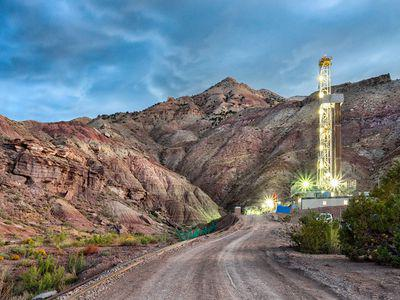

The intersection of drilling fluid disposal and algorithmic trading appears unconventional at first glance. However, both are critical to their respective domains, serving to enhance efficiency and sustainability. Drilling fluids, commonly referred to as drilling muds, are crucial in the oil and gas sector, primarily used to lubricate drill bits, maintain wellbore stability, and transport drill cuttings to the surface. Their effective use is vital for optimizing the drilling process, minimizing operational costs, and enhancing safety measures.

As the global focus shifts towards environmentally responsible practices, the disposal of drilling mud has gained increased attention. Improper disposal can lead to environmental hazards such as soil and groundwater contamination, emphasizing the need for safe and sustainable handling. Developing methodologies for proper disposal and recycling of drilling waste has become an imperative for industries to align with ecological standards, ensuring that their operations do not compromise surrounding ecosystems.



In contrast, algorithmic trading has revolutionized financial markets through the use of complex algorithms that execute trades with incredible speed and accuracy. This method replaces traditionally manual trading processes, which were prone to errors, with automated systems capable of processing and analyzing vast amounts of data in real-time. The precision brought by algorithmic trading strategies has dramatically altered investment landscapes, offering faster transaction speeds, reduced human error, and better asset management.

This article delves into the core aspects of drilling mud disposal and algorithmic trading, illustrating how both practices exemplify the role of innovation and technology. It further explores how these seemingly disparate areas converge in their mutual emphasis on sustainability and efficiency, ultimately suggesting a path forward where continued technological advancements drive further improvements in both environmental conservation and the financial sector.

## Table of Contents

## Understanding Drilling Mud and Its Uses

Drilling mud, also known as drilling fluid, is essential in the oil and gas industry for its multifaceted functions during the drilling process. Its primary roles include lubricating the drill bits, cooling the drill string, maintaining hydrostatic pressure to prevent formation fluids from entering the wellbore, and transporting drill cuttings to the surface.

There are three main categories of drilling muds: water-based, oil-based, and synthetic-based. Water-based muds are favored for their lower environmental impact, as they are generally less toxic and more biodegradable compared to their oil-based and synthetic counterparts. Water-based muds primarily consist of water mixed with clays and polymers, making them effective for most geological conditions while minimizing ecological disturbance.

Oil-based muds, which use petroleum distillates as their base fluid, provide superior lubricity, thermal stability, and a wider range of density and viscosity options. They are particularly advantageous in challenging drilling environments, such as those involving reactive shales, high-temperature, and high-pressure formations. However, their usage is often limited by stringent environmental regulations due to the potential for soil and water contamination.

Synthetic-based muds are formulated with synthetic oils, offering a balance between the performance of oil-based muds and the environmental benefits of water-based muds. These muds are designed to reduce ecological impact while maintaining high performance, making them suitable for sensitive environments and deep-water drilling.

The choice of drilling mud is crucial for efficient and safe drilling operations. It impacts the rate of penetration, wellbore stability, and ultimately, the success of the drilling project. The understanding of drilling mud's properties and their appropriate application enhances operational efficiency, minimizes environmental risks, and adheres to regulatory compliance.

## Challenges and Solutions in Drilling Mud Disposal

Improper disposal of drilling mud poses significant environmental risks, particularly soil and groundwater contamination. Drilling muds are a complex mix of natural and synthetic compounds, which, if not handled correctly, can lead to severe ecological consequences. The U.S. Environmental Protection Agency (EPA) classifies drilling mud as "special waste," necessitating adherence to state-specific disposal regulations to mitigate these risks effectively.

Several methods are employed to manage and dispose of drilling mud safely. Traditional approaches include pit burial, where the drilling mud is contained within lined pits to prevent leaching, and landfarming, which involves spreading the mud over land and mixing it with the soil to facilitate biodegradation. While these methods are commonplace, they come with limitations, particularly concerning space and long-term environmental impact.

To address these challenges, more advanced technologies have been developed. Thermal desorption is a noteworthy solution, a process where heat is used to separate contaminants from the drilling mud. This method allows for the extraction and reuse of valuable hydrocarbons while reducing the overall [volume](/wiki/volume-trading-strategy) of waste. Thermal desorption units operate by heating the contaminated material to a temperature where volatile constituents evaporate, which are then cooled, condensed, and collected for further processing or disposal. This process not only reduces waste but also enables the recycling of components, making it an environmentally sustainable choice.

Recycling and reclaiming drilling fluids represent another progressive step toward sustainable disposal practices. These processes involve treating used drilling muds to remove impurities, allowing the fluids to be reintegrated into the drilling cycle. This practice significantly lowers the need for fresh materials, reducing both environmental footprints and operational costs. Technologies such as centrifugation and chemical treatments are utilized to separate solids from liquids, enhancing the reclaimed fluid's quality and usability.

In conclusion, while the challenges of drilling mud disposal are considerable, evolving technologies and methodologies offer promising solutions. By embracing recycling, advanced treatment techniques, and strict regulatory adherence, the environmental implications of drilling operations can be minimized, promoting a more sustainable and responsible industry.

## Algorithmic Trading: A New Era in Financial Markets

Algorithmic trading refers to the use of computer algorithms to automatically execute trading orders based on predetermined criteria. These algorithms process vast quantities of market data, making split-second decisions that individuals could not achieve manually. This form of trading has profoundly altered the financial markets by enhancing the volume and frequency of trades.

The precision employed by [algorithmic trading](/wiki/algorithmic-trading) reduces the likelihood of human error, offering more efficient asset management. By automating trade execution, it allows for back-testing of strategies on historical data, which helps to refine and optimize trading schemes. As a result, traders can gain insights into risk factors, market behavior, and asset correlations, leading to more informed decision-making processes.

Algorithmic trading primarily hinges on strategies including but not limited to trend-following systems, [arbitrage](/wiki/arbitrage), market-making, and [statistical arbitrage](/wiki/statistical-arbitrage). Advanced versions integrate [machine learning](/wiki/machine-learning) to adapt and fine-tune trading decisions in real-time. For example, a trend-following algorithm might utilize a moving average crossover strategy, which signals buy or sell actions when short-term and long-term moving averages intersect.

```python
# Example: Simple Moving Average Crossover Strategy
import pandas as pd
import numpy as np

def simple_moving_average(price_series, window):
    return price_series.rolling(window=window).mean()

# Assuming 'data' is a pandas DataFrame with a 'Close' price column
short_window = 40
long_window = 100

data['Short_MA'] = simple_moving_average(data['Close'], short_window)
data['Long_MA'] = simple_moving_average(data['Close'], long_window)

signals = np.where(data['Short_MA'] > data['Long_MA'], 1, 0)  # Buy signal (1) or no signal (0)
data['Signal'] = signals
```

Algorithmic trading's adoption emulates the progression seen in industries adapting to technology, akin to how drilling mud disposal evolved through innovative methods. Financial markets have integrated algorithmic trading as a core technological advancement, reflecting a synergy between computational accuracy and market efficiency.

The evolution of algorithmic trading underscores its necessity in modern finance, aligning with broader trends of digital transformation across industries. It highlights a trajectory where financial operations are optimized for speed, accuracy, and comprehensive data utilization.

## Comparative Insights and Future Prospects

Both drilling mud disposal and algorithmic trading emphasize the core objective of enhancing efficiency and adapting to technological advancements. These processes, though belonging to distinct domains, share a foundational reliance on innovation to achieve greater effectiveness.

In the context of drilling mud disposal, technological progress has enabled the industry to adopt more sustainable and effective methods. Techniques such as thermal desorption, which involves heating contaminated materials to separate volatile and semi-volatile contaminants, showcase the shift towards environmentally friendly solutions. The incorporation of technologies like these not only ensures compliance with environmental regulations but also reduces the ecological footprint, thereby promoting sustainability in the oil and gas sector.

Algorithmic trading in financial markets mirrors this trajectory of technological adoption for precision and efficiency. By utilizing algorithms programmed to execute trades based on pre-defined criteria, trading operations are optimized, and the influence of human error is minimized. This precision in execution allows for superior asset management strategies, enhancing the overall performance of financial portfolios. The algorithms analyze market conditions, historical data, and trading signals to identify lucrative trading opportunities, executing trades at speeds unimaginable through manual intervention.

The common ground between these two domains lies in their leveraging of technology to push boundaries. In drilling mud disposal, the focus is on mitigating environmental impact through innovative waste management techniques. Conversely, algorithmic trading prioritizes the enhancement of financial operations through speed and precision. Both fields illustrate a broader trend where industries are increasingly turning to modern technology to realize goals of efficiency and sustainability.

Looking ahead, the future promises even smarter and more efficient methodologies driven by further technological advancements. For drilling mud disposal, this may translate to breakthroughs in recycling technologies or new methods of contaminant extraction. In the realm of algorithmic trading, continuous improvements in [artificial intelligence](/wiki/ai-artificial-intelligence) and machine learning could lead to more sophisticated trading algorithms, capable of real-time data processing and adaptive learning.

The implications of these advancements extend beyond operational efficiency; they also represent a cultural shift towards more sustainable practices in industrial sectors and heightened precision in financial operations. As both fields continue to evolve, the integration of novel technologies will likely lead to the development of even more effective strategies, driving both environmental and financial sectors towards a future of greater efficiency and sustainability.

## Conclusion

The development of environmentally friendly drilling mud disposal techniques and advancements in algorithmic trading strategies highlight the critical role of innovation in both industries. For drilling operations, adopting practices that minimize ecological impact is imperative. Implementing methods such as recycling drilling fluids and leveraging thermal desorption not only mitigates environmental risks but also enhances operational efficiency and cost-effectiveness. These innovations ensure that oil and gas extraction is sustainable and aligns with global environmental priorities.

In the domain of financial markets, the precision and speed brought by algorithmic trading have redefined asset management and trading practices. Algorithms allow for the execution of trades with reduced human error and increased accuracy, optimizing portfolio performance. Algorithmic strategies, with their ability to quickly process vast amounts of data and execute orders in milliseconds, reflect the significant shift towards technology-driven efficiency in financial operations. This strategic evolution fosters a marketplace where transactions occur with unparalleled speed and precision.

Both domains are propelled by a shared commitment to innovation. The future is likely to witness even more sophisticated techniques that blend sustainability and efficiency. In drilling, this might involve further improvements in waste management processes and advances in drilling technologies. In financial markets, emerging algorithms could incorporate artificial intelligence to predict market movements with greater accuracy.

As these fields continue to advance, the adoption of sustainable and precise methodologies offers the promise of optimized operations, balancing economic performance with ecological responsibility. This dual emphasis on technological advancement and sustainability is necessary not only for meeting current market demands but also for securing a viable future for both the environment and financial sectors.

## References & Further Reading

[1]: Caenn, R., Darley, H. C. H., & Gray, G. R. (2011). ["Composition and Properties of Drilling and Completion Fluids."](https://www.sciencedirect.com/book/9780128047514/composition-and-properties-of-drilling-and-completion-fluids) Gulf Professional Publishing.

[2]: Fink, J. K. (2011). ["Petroleum Engineer's Guide to Oil Field Chemicals and Fluids."](https://www.sciencedirect.com/book/9780123838445/petroleum-engineers-guide-to-oil-field-chemicals-and-fluids) Gulf Professional Publishing.

[3]: Katz, J. O., & McCormick, D. (2000). ["Technical Analysis from A to Z."](https://www.amazon.com/Encyclopedia-Trading-Strategies-Jeffrey-Ph-D/dp/0070580995) McGraw-Hill Education.

[4]: Lopez de Prado, M. (2018). ["Advances in Financial Machine Learning."](https://www.amazon.com/Advances-Financial-Machine-Learning-Marcos/dp/1119482089) Wiley.

[5]: Wang, F., Michalik, P., & Thomas, A. M. (2001). ["Drilling Fluids Processing Handbook."](https://archive.org/details/drillingfluidspr0000unse) Elsevier.

[6]: Pardo, R., & Pardo, A. W. (2007). ["The Evaluation and Optimization of Trading Strategies."](https://onlinelibrary.wiley.com/doi/book/10.1002/9781119196969) Wiley.

[7]: Schlumberger. ["Oilfield Glossary: Drilling Mud."](https://glossary.slb.com/terms/m/mud)

[8]: Basak, S., & Chaboud, A. P. (2019). ["Machine Learning in Financial Markets: A survey."](https://www.sciencedirect.com/science/article/pii/S0957417423001410) Social Science Research Network.