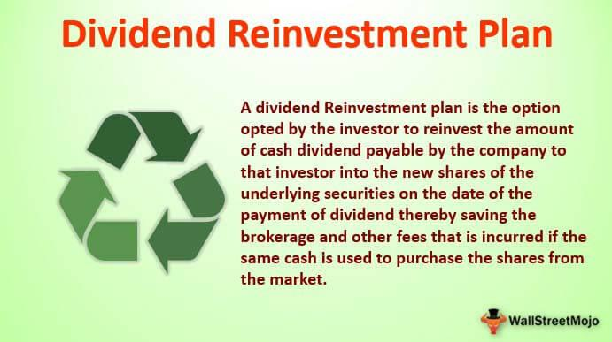

Dividend reinvestment is a strategic approach to investment that involves using dividends received from holdings to purchase additional shares, rather than taking them as cash. This method contributes significantly to long-term growth by compounding returns, where investors harness the power of reinvesting dividends to purchase more stock, thus potentially increasing their total returns over time. One of the most prominent systems utilized in dividend reinvestment is the Dividend Reinvestment Plan (DRIP). DRIPs allow investors to automatically reinvest their cash dividends into additional shares or even fractional shares of the underlying equity, often without any commission fees, making it a cost-efficient method to build wealth.

DRIPs integrate with broader investment strategies by providing both novice and experienced investors with a disciplined approach to accumulating more shares. By consistently reinvesting dividends, investors can benefit from dollar-cost averaging, which helps mitigate the impact of volatility by spreading out the purchase price of shares over time. For companies, offering a DRIP encourages shareholder loyalty and provides a steadier capital inflow.

Algorithmic trading intersects with dividend reinvestment strategies such as DRIP to further optimize investment decisions. Using algorithms can enhance the efficiency of how dividends are reinvested through data-driven decision-making processes and enables precise timing of market entries. By automating reinvestments based on specific market conditions or signals, algorithmic trading can potentially boost the return rates associated with traditional DRIP strategies.

By combining the systematic structure of DRIPs with the analytical prowess of algorithmic trading, investors may maximize their returns and streamline their portfolio management processes. This integration can cater to varied investment horizons, allowing investors to maintain diversified portfolios while effectively capitalizing on dividend yields. Employing both strategies in tandem not only aligns with modern investment practices but can propel investors toward achieving their financial goals more efficiently.

## Table of Contents

## Understanding DRIP: The Basics

A Dividend Reinvestment Plan (DRIP) is an investment strategy that allows shareholders to automatically reinvest their cash dividends into purchasing additional shares or fractional shares of the same company. This approach provides investors with the opportunity to benefit from compounding returns, as the reinvested dividends can generate their own dividends over time.

DRIPs typically work by enabling investors to enroll in the program either through the issuing company or through a brokerage service. Once enrolled, the dividends paid by the company are not distributed as cash but are instead used to buy more shares. This can be particularly beneficial for long-term investors who wish to grow their holdings without actively purchasing additional shares on their own.

The process of enrolling in a DRIP often requires investors to notify their broker or the company's investor relations department. Enrollment may involve completing certain forms and meeting specific eligibility criteria, which can vary depending on the company or the brokerage offering the plan. Some DRIPs even offer shares at a discount, providing further incentive for participation.

Companies that commonly offer DRIP programs include large, stable corporations that consistently pay dividends. These typically include blue-chip companies in sectors like utilities, telecommunications, and consumer goods. By offering DRIPs, these companies provide an additional channel for investors to increase their equity in a cost-effective manner, often with reduced or no commission fees.

Overall, DRIPs offer a straightforward way to enhance the potential for portfolio growth through systematic reinvestment, leveraging the power of compounding. This method caters to investors aiming to maximize their returns without the need for constant market monitoring or significant financial outlay to acquire more shares.

## Benefits of DRIP Investment

Dividend Reinvestment Plans (DRIPs) offer several compelling benefits to investors, chiefly characterized by features such as compounding growth, cost efficiency, dollar-cost averaging, convenience, automation, and notable tax considerations. These aspects together make DRIPs an attractive element of an investment strategy.

One of the primary benefits of DRIP is the power of compounding growth. Reinvesting dividends allows investors to purchase additional shares, which can generate their own dividends in future periods. This results in exponential growth over time as opposed to linear growth. For instance, if an investor holds shares in a company that offers a 4% dividend yield and the dividends are reinvested, the effective yield will increase annually due to the larger number of shares owned.

The principle of dollar-cost averaging (DCA) is automatically employed through DRIPs. This concept involves purchasing a fixed dollar amount of a security at regular intervals, resulting in buying more shares when prices are low and fewer when prices are high, thus lowering the average cost per share over time. For example, if an investor committed to reinvesting $100 per month into a stock, they would purchase more shares when the stock price is lower and fewer shares when it is higher, effectively mitigating the impact of market [volatility](/wiki/volatility-trading-strategies). Mathematically, dollar-cost averaging can be represented as:

$$
\text{Average Cost per Share} = \frac{\sum (\text{Number of Shares Purchased} \times \text{Price per Share})}{\sum (\text{Number of Shares Purchased})}
$$

DRIPs offer substantial convenience and automation advantages. Once enrolled, dividends are automatically reinvested without further action required from the investor. This not only reduces transaction costs typically associated with buying shares but also allows for seamless compounding without the need to decide each time dividends are received. This auto-reinvestment feature aligns closely with long-term investing principles, requiring minimal maintenance.

Tax considerations are another important aspect of DRIPs. In some jurisdictions, dividends are taxed as regular income, but reinvesting them might not change their taxable event status. However, tracking the cost basis of reinvested dividends is essential for tax reporting, especially when shares are eventually sold. Investors should be aware of the potential impact of taxes on their overall investment strategy and consider seeking advice from tax professionals to maximize tax efficiency.

In conclusion, DRIPs offer a combination of growth through compounding, the cost-effectiveness of dollar-cost averaging, ease of use through automation, and important tax implications. These characteristics make DRIPs a valuable tool for investors aiming to build wealth over time while minimizing the challenges associated with active management.

## The Role of Algorithmic Trading in DRIP

Algorithmic trading has become an integral part of modern investment strategies, offering significant advancements in optimizing Dividend Reinvestment Plans (DRIPs). By leveraging complex algorithms, investors can make data-driven decisions, enhancing the efficiency and profitability of their reinvestment strategies.

At its core, [algorithmic trading](/wiki/algorithmic-trading) involves the use of computer programs to execute trading decisions based on a set of predefined conditions. These algorithms analyze large datasets, identify patterns, and execute trades at speeds and frequencies that outperform human capabilities. The relevance of algorithmic trading to DRIP strategies is rooted in its ability to process vast amounts of data and generate actionable insights, thereby optimizing the timing and selection of reinvestments.

Algorithms assist in making informed decisions by evaluating factors such as current stock performance, historical dividend payouts, and market trends. This data-driven approach ensures that reinvestments are targeted towards stocks with the potential for favorable returns. For instance, an algorithm can be programmed to evaluate a stock's historical price volatility and current market conditions to decide whether the reinvestment of dividends is optimal at a particular time.

The potential of algorithms to time market entry is another critical advantage. Algorithms can monitor market conditions continuously and execute trades at the most opportune moments, thus potentially enhancing return rates. For example, by employing techniques such as mean reversion or [momentum](/wiki/momentum) trading, algorithms can identify when a stock is undervalued or overvalued and adjust reinvestment strategies accordingly.

The integration of algorithms with DRIP is particularly beneficial for managing large portfolios. By automating the reinvestment process, investors can ensure consistent application of their investment strategy across a diverse array of holdings without the need for manual oversight. This automation not only saves time but also reduces the emotional biases that often accompany investment decisions.

Moreover, advanced algorithms can implement [machine learning](/wiki/machine-learning) techniques to improve their predictions and adapt to changing market conditions over time. For instance, a [reinforcement learning](/wiki/reinforcement-learning) algorithm could be used to continuously refine DRIP strategies based on feedback from previous investment outcomes, thereby increasing the strategy's efficiency and effectiveness.

In conclusion, the application of algorithmic trading to DRIP represents a powerful synergy, combining the automated and data-driven nature of algorithms with the compounding benefits of dividend reinvestment. This integration enables investors to manage extensive portfolios effectively while optimizing returns through precise and timely reinvestment decisions.

## Challenges and Considerations

Dividend Reinvestment Plans (DRIPs) present a valuable opportunity for investors to leverage compounding growth by automatically reinvesting cash dividends into additional shares. However, there are several challenges and considerations that investors must be aware of when incorporating DRIPs, particularly when combined with algorithmic trading strategies.

Concentration risk is a major concern associated with DRIPs. As dividends are consistently reinvested in the same stock, an investor's portfolio may become overly concentrated in certain assets. This concentration increases vulnerability to company-specific risks. To mitigate concentration risk, diversification strategies should be implemented, such as periodically reviewing the portfolio and possibly reallocating the reinvestment to different equities or funds.

Market volatility is another [factor](/wiki/factor-investing) that can impact the effectiveness of reinvestments. In a volatile market, the timing of reinvestments can significantly affect returns. For instance, reinvesting dividends during a market peak could lead to purchasing shares at inflated prices, thus decreasing potential capital gains. Implementing a dollar-cost averaging strategy through DRIPs can help smooth out the effects of volatility, as it involves investing a fixed amount regularly, regardless of share price fluctuations. This approach generally results in a lower average cost per share over time.

Algorithmic trading offers a sophisticated means to enhance DRIP strategies, but it also introduces its own set of challenges. Technologically, there are programming, data management, and system reliability concerns. Algorithms rely heavily on large datasets and their predictive accuracy to make informed decisions, requiring robust systems and real-time analytics. Additionally, most algorithms are susceptible to errors and need continuous monitoring and adjustment. Regulatory challenges also play a role, as financial markets impose strict regulations on trading activities, and non-compliance can lead to significant penalties. Investors must ensure that algorithmic strategies comply with regulations such as the SEC's Rule 15c3-5, which mandates risk management controls for financial transactions.

To manage risk effectively while using DRIPs and algorithmic trading, the following tips are useful:

1. **Diversification**: Continuously assess the level of diversification in your portfolio. Diversification is key to mitigating concentration risk and absorbing the impact of any single asset’s downturn.

2. **Volatility Assessment**: Maintain awareness of market conditions and remain vigilant to changes in market volatility. Incorporating a balanced approach between automated reinvestment and manual oversight can ensure timely interventions.

3. **Robust Algorithm Design**: Develop and test trading algorithms thoroughly before deploying them in real-world scenarios. Utilize backtesting to simulate trading strategies using historical data to evaluate their performance.

4. **Regulatory Compliance**: Keep abreast of regulatory changes and ensure that investment strategies are compliant with both local and international trading regulations.

By carefully considering these challenges and implementing strategies to mitigate associated risks, investors can optimize their use of DRIPs and algorithmic trading to maximize potential returns while maintaining a sound investment approach.

## Case Studies and Examples

One notable example of a company that has effectively implemented a Dividend Reinvestment Plan (DRIP) is The Coca-Cola Company. Coca-Cola's DRIP allows shareholders to automatically reinvest dividends to purchase additional shares. This mechanism not only fosters a culture of long-term investment among its shareholders but also contributes to the company’s stable investor base. The predictability offered by DRIPs can be advantageous for both investors, who benefit from compounding returns, and companies, which enjoy consistent capital inflow.

Johnson & Johnson is another company recognized for its successful DRIP implementation. This pharmaceutical giant's DRIP is known for its flexibility, allowing shareholders to reinvest dividends into buying additional shares without paying brokerage fees. Given J&J’s long history of increasing dividends, investors have greatly benefited from compounding effects over extended periods.

Anecdotal evidence highlights the experiences of retail investors who have combined DRIP strategies with algorithmic trading. For instance, a retail investor named Alex used algorithmic trading tools to analyze historical data and predict dividend fluctuation patterns. By automating his dividend reinvestment decisions, Alex optimized his acquisition of shares, taking advantage of lower-priced opportunities triggered by market volatility. Over a period of five years, Alex reported a significant increase in his portfolio's return rate compared to his previous manual reinvestment approach, illustrating the potential of algorithmic integration.

For quantitative analysis, consider a hypothetical scenario where an investor commenced a DRIP with an initial investment of $10,000 in a company offering a steady 4% annual dividend yield. Using an algorithm to reinvest dividends at an average annual market return of 7%, the final portfolio value $V$ after $n$ years can be calculated using the formula:

$$
V = P \times (1 + r)^n
$$

where $P$ is the initial investment, and $r$ is the combined rate of dividend yield and market appreciation. Over 20 years, this strategy could potentially grow the initial investment to approximately $42,478, thanks to the power of compounding and strategic reinvestment timing.

Combining DRIPs with algorithmic trading has demonstrated potential benefits, as evidenced by data analyses. An investor using algorithm-driven DRIP strategies during the period from 2000 to 2020 could capture opportunities the market presents. Algorithms can optimize reinvestment decisions based on predicted dividend announcement impacts and historical price behaviors, potentially enhancing return rates versus conventional reinvestment methods.

These examples underscore the effectiveness of DRIPs when supplemented by algorithmic trading. They highlight the ability to make sophisticated reinvestment decisions, optimise timing, and harness compounding effects, ultimately maximizing shareholder value through strategic dividend reinvestment.

## Conclusion: Maximizing DRIP Benefits

Combining Dividend Reinvestment Plans (DRIPs) with algorithmic trading presents a powerful strategy for investors looking to maximize returns. DRIPs offer a practical mechanism for reinvesting cash dividends into additional shares of a company's stock, thereby harnessing the benefits of compounding growth. When combined with algorithmic trading, which uses automated systems to execute trades based on pre-established criteria, DRIPs can further enhance an investor's ability to make informed, data-driven decisions.

One of the primary advantages of integrating DRIPs with algorithmic trading is the potential for enhanced returns through precise market timing and portfolio management. Algorithms can analyze vast amounts of market data quickly, identifying optimal reinvestment points and adjusting strategies in response to market fluctuations. This dynamic approach can potentially outperform traditional reinvestment strategies, which may not account for rapid market changes.

Investors must remain committed to ongoing education and adaptation to leverage DRIP and algorithmic trading fully. Financial markets are continually evolving, influenced by technological advances, regulatory changes, and macroeconomic trends. Keeping abreast of these developments ensures that investors can refine their strategies and tools to maintain a competitive edge.

For those interested in exploring DRIP and algorithmic strategies, conducting thorough research is crucial. Investors should start by understanding the basics of DRIPs and how algorithms function, then progress to exploring specific platforms and tools that offer these services. Engaging in this informed approach will facilitate better decision-making and investment outcomes.

Consultation with a financial advisor is advisable when personalizing DRIP and algorithmic trading plans. Financial advisors can provide valuable insights and expertise, ensuring that investment strategies align with individual financial goals, risk tolerance, and market conditions. By combining professional guidance with personal research, investors can effectively tailor their approach to reap the benefits of this robust investment strategy.

## References & Further Reading

[1]: ["The Dividend Reinvestment Micro-Miracle"](https://www.fool.com/investing/stock-market/types-of-stocks/dividend-stocks/dividend-reinvestment/) by Fidelity

[2]: Lhabitant, F. S. (2004). ["Handbook of Hedge Funds"](https://www.amazon.com/Handbook-Hedge-Funds-Fran%C3%A7ois-Serge-Lhabitant/dp/0470026634). Wiley.

[3]: Hunt, R. M. (2005). ["Reinvesting Dividends: Opportunities and Risks"](https://www.morningstar.com/portfolios/when-reinvest-dividends-or-not) on Investopedia

[4]: Chan, E. (2009). ["Quantitative Trading: How to Build Your Own Algorithmic Trading Business"](https://github.com/ftvision/quant_trading_echan_book). Wiley.

[5]: Ernie, C. (2012). ["Algorithmic Trading: Winning Strategies and Their Rationale"](https://books.google.com/books/about/Algorithmic_Trading.html?id=WAlFDwAAQBAJ). Wiley.