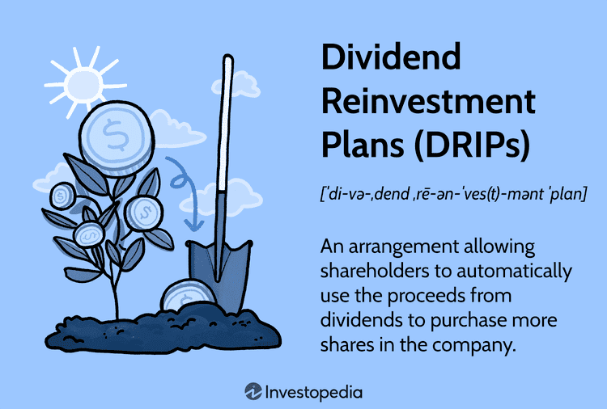

## Table of Contents

## What is a DRIP investment?

A DRIP investment, or Dividend Reinvestment Plan, is a way for people to automatically use their dividend earnings to buy more shares of the same company. When a company pays out dividends, instead of getting cash, the investor gets more shares. This can help grow the investment over time because the investor ends up owning more and more of the company.

DRIPs are popular because they are easy to set up and they help investors benefit from compound growth. By reinvesting dividends, the investor can buy more shares without spending extra money. Over many years, this can lead to owning a lot more shares than if the dividends were taken as cash. It's a simple way to increase wealth slowly but steadily.

## How does a DRIP work?

When you own shares in a company that offers a DRIP, you can choose to have your dividends automatically used to buy more shares instead of getting the money. This happens every time the company pays out dividends, which could be every few months. The new shares you get are usually bought at a discounted price, which means you pay less than what other people might pay on the stock market.

Over time, as you keep getting more shares, the number of shares you own grows. This is good because the more shares you have, the more dividends you get the next time. It's like a snowball that gets bigger and bigger. This way, your investment can grow a lot without you having to do anything extra. It's a simple way to make your money work harder for you.

## What are the basic requirements to start a DRIP?

To start a DRIP, you need to own shares in a company that offers a DRIP. You can buy these shares through a stockbroker or sometimes directly from the company. Once you own the shares, you need to sign up for the DRIP. This can usually be done through the company's investor relations website or by contacting their investor services.

After you're enrolled, your dividends will automatically be used to buy more shares instead of being paid out as cash. Some companies might have a minimum number of shares you need to own before you can join their DRIP. Also, you might need to have a brokerage account that supports DRIPs, as not all brokers offer this service. Once everything is set up, you don't need to do anything else, and your investment will grow over time as you keep getting more shares.

## What are the main benefits of investing in a DRIP?

One of the main benefits of investing in a DRIP is that it helps your money grow over time without you having to do anything extra. When you get dividends, instead of taking the money, you use it to buy more shares of the same company. This means you end up owning more and more shares, which can lead to bigger dividends in the future. It's like a snowball that keeps getting bigger as it rolls down a hill. Plus, many companies offer a discount on the shares you buy through a DRIP, so you're getting a good deal.

Another benefit is that DRIPs are easy to set up and manage. Once you own shares in a company that offers a DRIP and you sign up for it, everything happens automatically. You don't have to keep track of when dividends are paid or remember to buy more shares. This makes it a simple way to invest, especially if you're new to investing or don't want to spend a lot of time managing your money. Over many years, this can really add up and help you build wealth slowly but steadily.

## Can DRIPs help in building long-term wealth?

DRIPs can definitely help in building long-term wealth. When you use a DRIP, your dividends are used to buy more shares of the company instead of getting cash. Over time, this means you own more and more shares. The more shares you own, the more dividends you get the next time. It's like a snowball that keeps growing bigger. This can lead to a lot more wealth over many years because you're not just keeping the same number of shares, you're adding to them with every dividend payment.

Another way DRIPs help with long-term wealth is that they're easy to manage. Once you set up a DRIP, everything happens automatically. You don't have to remember to buy more shares or keep track of when dividends are paid. This makes it a simple way to invest, especially if you're new to it or don't want to spend a lot of time on it. Plus, many companies offer a discount on the shares you buy through a DRIP, so you're getting a good deal. Over time, all these little advantages can add up to a lot more money in your pocket.

## How do dividends reinvested through a DRIP compound over time?

When you use a DRIP, your dividends are used to buy more shares of the company instead of getting cash. Each time the company pays a dividend, you get more shares. Over time, this means you own more and more shares. The more shares you own, the more dividends you get the next time. It's like a snowball that keeps getting bigger. Every time it rolls, it picks up more snow, which makes it even bigger the next time it rolls. This is how your money can grow over many years without you doing anything extra.

The power of compounding through a DRIP is that it happens automatically. Once you sign up for a DRIP, you don't have to remember to buy more shares or keep track of when dividends are paid. The company does it for you. This makes it easy to build wealth over time. Plus, many companies offer a discount on the shares you buy through a DRIP, so you're getting a good deal. Over many years, all these little advantages can add up to a lot more money in your pocket.

## What are the tax implications of participating in a DRIP?

When you participate in a DRIP, you still have to pay taxes on the dividends you receive, even though you're using them to buy more shares instead of getting cash. The IRS considers these dividends as taxable income in the year you receive them. So, you'll need to report the total amount of dividends you earned on your tax return, even if you didn't see any cash from them.

The good news is that you don't have to pay taxes right away on the increase in value of your shares from reinvesting dividends. You only pay taxes on those gains when you sell your shares. If you hold onto your shares for more than a year before selling, you might get a lower tax rate on your profits, which is called a long-term capital gains rate. This can help you save money on taxes if you're planning to invest for the long term.

## How can one select the best DRIP stocks?

When you want to pick the best DRIP stocks, it's a good idea to look at companies that have a strong history of paying dividends. These are usually big, stable companies that have been around for a long time. They often have a track record of increasing their dividends every year, which means your investment can grow even more over time. Also, check if the company offers a discount on the shares you buy through the DRIP. This can make your money go further because you're getting a better deal on each share you buy.

Another thing to think about is the company's overall financial health. You want to make sure the company is doing well and can keep paying dividends in the future. Look at things like their earnings, how much debt they have, and what they say about their plans for the future. It's also smart to pick companies in industries that you think will do well over the long term. This way, you can feel more confident that your investment will keep growing through the DRIP.

## Are there any fees associated with DRIPs, and how can they impact returns?

Some DRIPs might have fees that you need to pay, but many don't. If there are fees, they can be for things like setting up the DRIP or buying the new shares. These fees can take a little bit away from your investment, so it's good to know about them before you start. If you're using a broker to set up your DRIP, they might charge a fee for each time they buy more shares for you. But if you set it up directly with the company, they might not charge any fees at all.

These fees can make a small difference in how much your investment grows over time. If you're paying a fee every time you get more shares, it means you're not getting as many shares as you could. Over many years, this can add up and make your investment a bit smaller than it would have been without the fees. But if the company doesn't charge any fees, or if the fees are very small, then the impact on your returns will be less. It's always a good idea to check what fees might be involved so you can pick the best DRIP for your money.

## What are the differences between a DRIP offered directly by a company versus one through a brokerage?

A DRIP offered directly by a company lets you sign up through their investor relations website or by contacting their investor services. When you do this, you usually don't have to pay any fees to the company for buying more shares with your dividends. This can be a good way to save money because you're not losing any of your investment to fees. Also, some companies might give you a discount on the shares you buy through their DRIP, which means you get more shares for your money.

On the other hand, a DRIP through a brokerage means you set it up through your stockbroker. They might charge you a fee every time they buy more shares for you with your dividends. This can take a little bit away from your investment over time. But using a brokerage can be easier if you already have an account with them and you want to manage all your investments in one place. It's important to check what fees your broker might charge so you can decide if it's worth it for you.

In the end, the main difference is about fees and convenience. A company's direct DRIP might save you money on fees and give you a discount on shares, but a brokerage DRIP might be easier to manage if you're already using a broker for other investments. Both can help your money grow over time, so it's good to think about what works best for you.

## How do market conditions affect the performance of a DRIP?

Market conditions can have a big impact on how well your DRIP does. When the stock market is doing well and the price of the company's shares goes up, the dividends you get can buy fewer shares than before. But because the value of each share is higher, the total value of your investment can still go up. On the other hand, if the market is not doing well and the share price goes down, your dividends can buy more shares. This might seem good because you're getting more shares, but the total value of your investment might go down if the share price keeps falling.

It's important to remember that DRIPs are a long-term investment. Even if the market goes up and down a lot, over many years, a DRIP can still help your money grow. This is because you keep getting more shares with every dividend payment, and over time, this can add up to a lot more shares. So, while market conditions can change how well your DRIP does in the short term, sticking with it for the long term can still help you build wealth.

## What advanced strategies can be used to maximize returns from a DRIP?

One advanced strategy to maximize returns from a DRIP is to focus on companies with a history of increasing their dividends. When a company raises its dividends, the amount of money you get each time goes up. This means you can buy more shares with each dividend payment, which can help your investment grow faster. Look for companies that have been paying higher dividends every year for a long time. These are often called "dividend aristocrats" or "dividend kings," and they can be a good choice for a DRIP because they tend to be stable and reliable.

Another strategy is to use dollar-cost averaging alongside your DRIP. This means you add extra money to your investment at regular times, no matter what the stock price is doing. By doing this, you can buy more shares when the price is low and fewer when the price is high. Over time, this can help you get a better average price for your shares. Combining this with a DRIP can really boost your returns because you're not just relying on the dividends to buy more shares, you're also adding your own money to the mix.

## What are the benefits of DRIP investment?

Dividend Reinvestment Plans (DRIPs) offer several compelling benefits to investors, chiefly characterized by features such as compounding growth, cost efficiency, dollar-cost averaging, convenience, automation, and notable tax considerations. These aspects together make DRIPs an attractive element of an investment strategy.

One of the primary benefits of DRIP is the power of compounding growth. Reinvesting dividends allows investors to purchase additional shares, which can generate their own dividends in future periods. This results in exponential growth over time as opposed to linear growth. For instance, if an investor holds shares in a company that offers a 4% dividend yield and the dividends are reinvested, the effective yield will increase annually due to the larger number of shares owned.

The principle of dollar-cost averaging (DCA) is automatically employed through DRIPs. This concept involves purchasing a fixed dollar amount of a security at regular intervals, resulting in buying more shares when prices are low and fewer when prices are high, thus lowering the average cost per share over time. For example, if an investor committed to reinvesting $100 per month into a stock, they would purchase more shares when the stock price is lower and fewer shares when it is higher, effectively mitigating the impact of market [volatility](/wiki/volatility-trading-strategies). Mathematically, dollar-cost averaging can be represented as:

$$
\text{Average Cost per Share} = \frac{\sum (\text{Number of Shares Purchased} \times \text{Price per Share})}{\sum (\text{Number of Shares Purchased})}
$$

DRIPs offer substantial convenience and automation advantages. Once enrolled, dividends are automatically reinvested without further action required from the investor. This not only reduces transaction costs typically associated with buying shares but also allows for seamless compounding without the need to decide each time dividends are received. This auto-reinvestment feature aligns closely with long-term investing principles, requiring minimal maintenance.

Tax considerations are another important aspect of DRIPs. In some jurisdictions, dividends are taxed as regular income, but reinvesting them might not change their taxable event status. However, tracking the cost basis of reinvested dividends is essential for tax reporting, especially when shares are eventually sold. Investors should be aware of the potential impact of taxes on their overall investment strategy and consider seeking advice from tax professionals to maximize tax efficiency.

In conclusion, DRIPs offer a combination of growth through compounding, the cost-effectiveness of dollar-cost averaging, ease of use through automation, and important tax implications. These characteristics make DRIPs a valuable tool for investors aiming to build wealth over time while minimizing the challenges associated with active management.

## What are some case studies and examples?

One notable example of a company that has effectively implemented a Dividend Reinvestment Plan (DRIP) is The Coca-Cola Company. Coca-Cola's DRIP allows shareholders to automatically reinvest dividends to purchase additional shares. This mechanism not only fosters a culture of long-term investment among its shareholders but also contributes to the company’s stable investor base. The predictability offered by DRIPs can be advantageous for both investors, who benefit from compounding returns, and companies, which enjoy consistent capital inflow.

Johnson & Johnson is another company recognized for its successful DRIP implementation. This pharmaceutical giant's DRIP is known for its flexibility, allowing shareholders to reinvest dividends into buying additional shares without paying brokerage fees. Given J&J’s long history of increasing dividends, investors have greatly benefited from compounding effects over extended periods.

Anecdotal evidence highlights the experiences of retail investors who have combined DRIP strategies with [algorithmic trading](/wiki/algorithmic-trading). For instance, a retail investor named Alex used algorithmic trading tools to analyze historical data and predict dividend fluctuation patterns. By automating his dividend reinvestment decisions, Alex optimized his acquisition of shares, taking advantage of lower-priced opportunities triggered by market volatility. Over a period of five years, Alex reported a significant increase in his portfolio's return rate compared to his previous manual reinvestment approach, illustrating the potential of algorithmic integration.

For quantitative analysis, consider a hypothetical scenario where an investor commenced a DRIP with an initial investment of $10,000 in a company offering a steady 4% annual dividend yield. Using an algorithm to reinvest dividends at an average annual market return of 7%, the final portfolio value $V$ after $n$ years can be calculated using the formula:

$$
V = P \times (1 + r)^n
$$

where $P$ is the initial investment, and $r$ is the combined rate of dividend yield and market appreciation. Over 20 years, this strategy could potentially grow the initial investment to approximately $42,478, thanks to the power of compounding and strategic reinvestment timing.

Combining DRIPs with algorithmic trading has demonstrated potential benefits, as evidenced by data analyses. An investor using algorithm-driven DRIP strategies during the period from 2000 to 2020 could capture opportunities the market presents. Algorithms can optimize reinvestment decisions based on predicted dividend announcement impacts and historical price behaviors, potentially enhancing return rates versus conventional reinvestment methods.

These examples underscore the effectiveness of DRIPs when supplemented by algorithmic trading. They highlight the ability to make sophisticated reinvestment decisions, optimise timing, and harness compounding effects, ultimately maximizing shareholder value through strategic dividend reinvestment.

## References & Further Reading

[1]: ["The Dividend Reinvestment Micro-Miracle"](https://www.fool.com/investing/stock-market/types-of-stocks/dividend-stocks/dividend-reinvestment/) by Fidelity

[2]: Lhabitant, F. S. (2004). ["Handbook of Hedge Funds"](https://www.amazon.com/Handbook-Hedge-Funds-Fran%C3%A7ois-Serge-Lhabitant/dp/0470026634). Wiley.

[3]: Hunt, R. M. (2005). ["Reinvesting Dividends: Opportunities and Risks"](https://www.morningstar.com/portfolios/when-reinvest-dividends-or-not) on Investopedia

[4]: Chan, E. (2009). ["Quantitative Trading: How to Build Your Own Algorithmic Trading Business"](https://github.com/ftvision/quant_trading_echan_book). Wiley.

[5]: Ernie, C. (2012). ["Algorithmic Trading: Winning Strategies and Their Rationale"](https://books.google.com/books/about/Algorithmic_Trading.html?id=WAlFDwAAQBAJ). Wiley.