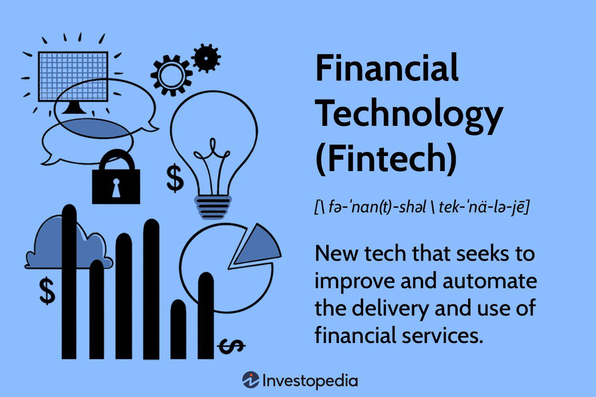

In finance, algorithmic trading has emerged as a crucial force, redefining how markets operate through the utilization of technology. At its core, technical advancements in algorithmic trading have revolutionized trading strategies by leveraging sophisticated algorithms and computational power to make rapid and informed decisions. These algorithms, often grounded in complex mathematical models and statistical analysis, enable traders to execute orders at speeds unimaginable in manual trading environments.

The integration of technology in trading processes has allowed financial markets to benefit from increased efficiency, liquidity, and the potential for reduced transaction costs. By automating the trading process, algorithms can react almost instantaneously to market conditions, thus providing a significant edge in fast-paced and volatile environments. This capability is particularly advantageous in contexts such as high-frequency trading, where execution speed and precision are paramount.



Moreover, the power of technology in algorithmic trading lies not only in its speed but also in its ability to analyze and process vast amounts of data in real-time. This continuous data processing allows for intricate analysis of market trends and patterns, which can be leveraged to optimize trading strategies and improve decision-making accuracy. As a result, technology in algorithmic trading provides opportunities for both retail and institutional investors to access market insights that were previously available only to large financial institutions with extensive resources.

Algorithmic trading's technological foundation also plays a significant role in minimizing human psychological and emotional biases. By relying on data-driven methodologies, algorithms remove subjective interpretations that can lead to irrational and inconsistent trading behaviors. This objectivity ensures that trading decisions are made based on empirical evidence, thus aligning closely with predefined strategic objectives.

This exploration into the intricate functions of technology as a driver in algorithmic trading highlights its capacity to transform financial market paradigms. The interplay between speed, precision, and data analytics underscores the formidable nature of algorithmic trading, fostering a landscape ripe with opportunities and innovations. As we examine the continuing impact of technology on algorithmic trading, it becomes evident that its significance will continue to grow, shaping the future of financial trading in profound and unpredictable ways.

## Table of Contents

## What is Algorithmic Trading?

Algorithmic trading involves the utilization of computer algorithms to execute trading activities based on pre-defined criteria derived from market data. This sophisticated method of trading enables market participants to [carry](/wiki/carry-trading) out orders at a speed and frequency that are unattainable through manual processes. Algorithmic trading systems employ a set of pre-established instructions ranging from straightforward strategies, such as moving averages, to complex calculations involving [statistical arbitrage](/wiki/statistical-arbitrage). By automating the trading process, algorithms can manage an array of trading activities, including high-frequency trading (HFT), which is characterized by a high number of trades executed in fractions of a second.

The core advantage of [algorithmic trading](/wiki/algorithmic-trading) lies in its capacity to reduce the impact of human emotions and irrational behavior in decision-making. Instead of relying on gut feelings or emotional reactions, algorithmic trading systems prioritize data-driven analysis to make objective trading decisions. This approach not only increases the efficiency of trades but also aligns trading strategies with well-defined parameters and market trends.

An essential aspect of algorithmic trading is its ability to handle complex computations and data processing in real-time. For instance, consider a strategy that continuously monitors the price movements of two correlated stocks for [arbitrage](/wiki/arbitrage) opportunities. The algorithm can be designed to dynamically calculate the spread between the prices and identify the optimal entry and [exit](/wiki/exit-strategy) points for trades. In Python, a simple pseudo-code snippet for this might look like:

```python
import numpy as np

# Hypothetical stock price streams
stock_A_prices = np.random.random_sample(1000)
stock_B_prices = np.random.random_sample(1000)

# Calculate price spread
spread = stock_A_prices - stock_B_prices

# Define trading signals based on spread
buy_signal = spread > 0.05
sell_signal = spread < -0.05

def execute_trade(signal):
    if signal == "buy":
        print("Executing buy order.")
    elif signal == "sell":
        print("Executing sell order.")

# Monitor and execute trades
for i in range(len(spread)):
    if buy_signal[i]:
        execute_trade("buy")
    elif sell_signal[i]:
        execute_trade("sell")
```

This example reflects the basic logic of utilizing price data and spread calculations to trigger buy or sell signals based on predefined criteria. As algorithms continue to evolve, they increasingly incorporate sophisticated techniques such as [machine learning](/wiki/machine-learning) and statistical models, further enhancing their efficacy and adaptability in rapidly changing market environments.

Through algorithmic trading, traders have the opportunity to explore a market landscape characterized by increased speed, precision, and the leveraging of massive datasets for improved strategic decision-making.

## The Role of Technology in Driving Algorithmic Trading

Technology plays a foundational role in algorithmic trading by supplying the essential infrastructure and tools that support advanced trading strategies. Advancements in data processing capabilities have significantly enhanced the ability of traders to analyze vast amounts of data in real-time. This improvement allows for more accurate and timely decision-making, as algorithms can process and react to market data faster than human operators. Real-time data analytics is a crucial component, enabling the identification of trading opportunities and the execution of trades with minimal latency.

Artificial intelligence (AI) and machine learning (ML) have further bolstered the capabilities of algorithmic trading by introducing the concept of adaptive learning. Algorithms powered by AI can learn from historical data, identify patterns, and make predictions about future market movements. Machine learning models, such as neural networks, can process complex datasets and improve their accuracy over time. For instance, a support vector machine (SVM) algorithm might be employed to classify trading signals based on historical price movements and other relevant factors.

Python has become a preferred language in algorithmic trading due to its extensive libraries and ease of integration. Libraries such as `numpy` for numerical computations, `pandas` for data manipulation, and `scikit-learn` for machine learning are commonly used to build robust trading algorithms. An example of a basic moving average crossover strategy using Python might look like this:

```python
import pandas as pd

def moving_average(data, window):
    return data.rolling(window=window).mean()

def generate_signals(data, short_window=40, long_window=100):
    signals = pd.DataFrame(index=data.index)
    signals['price'] = data['Close']
    signals['short_mavg'] = moving_average(data['Close'], short_window)
    signals['long_mavg'] = moving_average(data['Close'], long_window)
    signals['signal'] = 0.0
    signals['signal'][short_window:] = np.where(signals['short_mavg'][short_window:] > signals['long_mavg'][short_window:], 1.0, 0.0)   
    signals['positions'] = signals['signal'].diff()
    return signals
```

The continuous evolution of mobile and cloud technologies has democratized access to algorithmic trading by broadening its availability to both retail and institutional investors. Mobile platforms provide traders with the capability to monitor and execute trades from anywhere, ensuring they remain connected to the markets at all times. Cloud computing offers scalable resources and storage capabilities, enabling sophisticated algorithms to run without requiring substantial investments in physical infrastructure. This helps reduce entry barriers for individuals and smaller firms who wish to participate in algorithmic trading.

As technology advances, algorithmic trading continues to expand its reach and influence across financial markets, offering new possibilities and efficiencies that were previously unattainable.

## Macro and Micro Economic Drivers in Trading

Algorithmic trading functions within an intricate ecosystem shaped by both macro and microeconomic factors. These drivers collectively influence market dynamics and form the basis for algorithmic trading strategies designed to respond to changing economic environments.

On a macroeconomic level, broad market trends and geopolitical events are pivotal drivers. These include factors such as changes in interest rates set by central banks, global economic growth patterns, inflation rates, and significant geopolitical events such as elections, policy shifts, and international trade agreements. Such factors can shift investor sentiment and market [liquidity](/wiki/liquidity-risk-premium), impacting asset prices across multiple markets and sectors. For instance, an unexpected change in interest rates can alter stock and bond valuations, which algorithmic trading systems will need to account for and adapt to quickly.

Microeconomic drivers, on the other hand, pertain to influences that impact individual companies or specific sectors. These include corporate earnings reports, announcements of new product launches, shifts in consumer behavior, and changes in competitive dynamics. For example, an earnings surprise—whether positive or negative—can lead to substantial price movements in a company's stock. Moreover, emerging technologies or innovations within a sector can create new investment opportunities or threats, thereby influencing strategic decisions. Algorithmic trading systems that effectively incorporate these microeconomic insights can better predict short-term movements and exploit transient inefficiencies in the market.

Traders and developers harness these macro and microeconomic drivers by integrating them into algorithmic models. This often involves the use of complex data analysis and machine learning techniques to discern patterns and predict future movements. By understanding the broader market context and individual asset nuances, algorithmic strategies can be fine-tuned to optimize performance, mitigate risk, and capitalize on emerging opportunities. 

Developing effective algorithmic trading strategies thus hinges on the ability to synthesize information from these diverse economic drivers, enabling traders to make informed decisions in an ever-evolving marketplace.

## Key Advancements and Trends in Algorithmic Trading

High-Frequency Trading ([HFT](/wiki/high-frequency-trading-strategies)) has rapidly established itself as a fundamental component of contemporary financial markets. By utilizing sophisticated algorithms capable of processing large volumes of transactions at lightning speeds, HFT enhances market liquidity and reduces bid-ask spreads. This speed and efficiency have become critical as they enable the exploitation of minuscule price discrepancies that exist for mere fractions of a second.

The incorporation of Artificial Intelligence (AI) and Machine Learning (ML) in algorithmic trading represents a significant shift towards more sophisticated predictive analytics. AI and ML algorithms facilitate the development of adaptive strategies capable of responding to volatile market conditions with greater precision. For example, machine learning models can be trained using historical market data to predict future price movements, identify trends, and optimize trading strategies. This is often done by employing techniques such as neural networks and decision trees, which adaptively refine their models as more data becomes available.

Big data analytics plays a pivotal role in algorithmic trading by enabling traders to process and analyze vast datasets, often in real-time. The ability to uncover hidden patterns and trends from these massive datasets allows for more informed trading decisions. Techniques like clustering, natural language processing (NLP), and sentiment analysis are utilized to interpret market signals and assess market sentiment, driving decision-making processes. For instance, NLP can be used to analyze news articles, social media posts, and financial reports to gauge market sentiment regarding a particular stock or sector.

Blockchain technology and the trading of cryptocurrencies have introduced both opportunities and challenges for algorithmic trading systems. The decentralized nature of blockchain offers a transparent and secure environment for trading, which can mitigate certain risks inherent in traditional markets. However, the [volatility](/wiki/volatility-trading-strategies) and lack of regulatory frameworks surrounding cryptocurrencies pose unique challenges for traders. These challenges necessitate the innovation of new risk management practices and trading models that can accommodate the dynamic nature of cryptocurrencies. Additionally, smart contracts on blockchain platforms can automate trading processes, reducing transaction costs, and enhancing efficiency.

As these technological advancements continue to evolve, they redefine traditional trading paradigms and present investors with diversified strategies tailored to the increasingly complex financial landscape. These innovations underscore the transformative potential of algorithmic trading as it adapts to and shapes the future financial markets.

## Challenges Faced by Technology in Algorithmic Trading

Algorithmic trading, while offering significant advantages in speed, efficiency, and data-driven decision-making, is not without its challenges. One of the foremost issues is cybersecurity and data integrity. Algorithmic trading systems are vulnerable to cyber threats due to their reliance on complex software and digital communications. Hackers pose a significant risk, as they can manipulate algorithms, introduce false data, or cause system disruptions, potentially leading to financial losses. Ensuring data integrity is crucial, as inaccurate or tampered data can lead to erroneous trading decisions.

Additionally, regulatory requirements are continuously evolving, impacting the development and deployment of trading algorithms differently across jurisdictions. Regulations are designed to maintain market fairness and stability but also necessitate algorithmic systems to be adaptable to meet compliance standards. Institutions must stay abreast of legal changes and implement responsive compliance measures in algorithm development and deployment.

Infrastructure reliability is another critical concern, as algorithmic trading depends on seamless network connectivity and the availability of substantial computational power. System downtimes or connectivity disruptions can result in missed trading opportunities or inaccurate execution of trades, affecting financial outcomes. This dependency necessitates robust infrastructure capable of handling high volumes of trades with minimal latency.

To address these challenges, continuous technological enhancements are essential. This includes implementing advanced security protocols to safeguard against cyber threats, developing adaptable algorithms to comply with regulatory changes, and investing in reliable infrastructure to ensure uninterrupted trading operations. Moreover, fostering collaborations between technology providers and regulatory bodies can facilitate the development of algorithms that meet both performance and compliance requirements effectively.

These challenges underscore the need for algorithmic trading entities to prioritize security, regulatory compliance, and infrastructure resilience as they navigate the complexities of modern financial markets, ensuring that the advantages of technology are fully realized without compromising system integrity or stability.

## The Future of Algorithmic Trading in Technology-Driven Markets

Emerging technologies such as quantum computing are poised to transform algorithmic trading by offering unparalleled computational speeds and enhanced data processing capabilities. Quantum computing, which manipulates qubits to represent and process multiple states simultaneously, is expected to supersede classical computer algorithms by improving the efficiency of complex calculations involved in trading strategies. This enhancement translates to rapidly processing and analyzing vast sets of market data, enabling traders to execute strategies with superior precision and speed.

Further integration of [artificial intelligence](/wiki/ai-artificial-intelligence) (AI) stands to refine algorithmic models substantially. AI's capacity to learn from historical data and recognize patterns allows it to enhance predictive accuracy and adaptability to market fluctuations. Machine learning algorithms, a subset of AI, contribute to this by developing more sophisticated trading strategies. Such refinement is crucial in adapting to highly volatile markets where rapid shifts can occur unexpectedly.

The increasing accessibility of algorithmic trading tools is expected to boost retail investor participation significantly. This growth is facilitated by user-friendly interfaces, which lower the entry barriers for individuals without extensive financial expertise. Additionally, the proliferation of online educational resources empowers retail investors to better understand and leverage algorithmic trading strategies, promoting a more inclusive trading environment.

Concurrently, there is a noticeable shift toward decentralized trading platforms. Blockchain technology underpins these platforms, providing secure, transparent, and efficient execution of trades. Decentralized platforms challenge traditional centralized exchanges by reducing the need for intermediaries, potentially lowering transaction costs and increasing market liquidity. This paradigm shift could redefine traditional market structures, enhancing trading efficiency and fostering innovation in trading methodologies.

In conclusion, as technology continues to advance, algorithmic trading will increasingly benefit from these innovations. The ongoing developments in quantum computing, AI, and decentralized platforms promise to drive further evolution in market trading strategies, expanding opportunities for both institutional and retail investors while reinforcing the importance of continually adapting to emerging technological trends.

## Conclusion

Technology serves as the foundational driver in algorithmic trading, with its influence set to grow as technological capabilities evolve. The enhancement of speed, efficiency, and access through cutting-edge technology has democratized trading, merging market opportunities with unparalleled risk management practices. 

With technological advancements, traders are better equipped to navigate and capitalize on future trends and shifting market dynamics. The automatization and precision offered by algorithmic systems provide significant advantages over traditional trading methods, allowing quicker responses to market conditions and enabling data-driven decision-making. As a result, traders leveraging these advancements are distinctly positioned to outperform in an increasingly competitive landscape.

The continuous progression in algorithmic trading marks a transformative period in financial markets, rooted in advanced technological frameworks that herald a future rich with innovative trading solutions. As markets evolve, the integration of novel technologies such as artificial intelligence, machine learning, and blockchain into trading systems will continue to redefine market strategies and outcomes. This trajectory underscores a commitment to embracing technology as a catalyst for unlocking new opportunities in trading, defining an era of strategic growth and innovation.

## References & Further Reading

[1]: Bergstra, J., Bardenet, R., Bengio, Y., & Kégl, B. (2011). ["Algorithms for Hyper-Parameter Optimization."](https://papers.nips.cc/paper/4443-algorithms-for-hyper-parameter-optimization) Advances in Neural Information Processing Systems 24.

[2]: ["Advances in Financial Machine Learning"](https://www.amazon.com/Advances-Financial-Machine-Learning-Marcos/dp/1119482089) by Marcos Lopez de Prado

[3]: ["Evidence-Based Technical Analysis: Applying the Scientific Method and Statistical Inference to Trading Signals"](https://www.amazon.com/Evidence-Based-Technical-Analysis-Scientific-Statistical/dp/0470008741) by David Aronson

[4]: ["Machine Learning for Algorithmic Trading"](https://github.com/stefan-jansen/machine-learning-for-trading) by Stefan Jansen

[5]: ["Quantitative Trading: How to Build Your Own Algorithmic Trading Business"](https://www.amazon.com/Quantitative-Trading-Build-Algorithmic-Business/dp/1119800064) by Ernest P. Chan