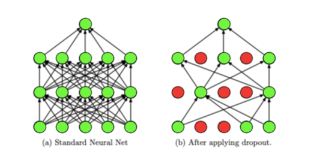

## Table of Contents

## What is dropout regularization in machine learning?

Dropout regularization is a technique used in machine learning to prevent a model from overfitting. Overfitting happens when a model learns the training data too well, including its noise and details, which makes it perform poorly on new, unseen data. Dropout works by randomly "dropping out" a certain percentage of neurons during the training process. This means that these neurons do not contribute to the forward pass or the backward pass in that particular training iteration. By doing this, the model is forced to learn more robust features because it cannot rely on any single neuron too much.

During training, if a model has a dropout rate of, say, 0.5, then each neuron has a 50% chance of being temporarily removed from the network for each training iteration. This randomness helps the model to generalize better because it has to find a solution that works even when different parts of the network are missing. When it comes time to make predictions with the trained model, dropout is usually turned off, and all neurons are used. However, to keep the expected output of the network the same, the outputs of the neurons are scaled down by the dropout rate during training. For example, if the dropout rate is 0.5, the outputs are scaled by multiplying them by 0.5 during training.

## Why is dropout regularization used in neural networks?

Dropout regularization is used in neural networks to stop them from overfitting. Overfitting happens when a neural network learns the training data too well, including all the small details and mistakes in the data. This can make the network perform badly on new data it hasn't seen before. Dropout helps by turning off some neurons randomly during training. This means the network can't depend too much on any single neuron, so it learns to work well even when parts of it are missing.

By using dropout, the neural network becomes better at generalizing. Generalizing means the network can work well on new data, not just the data it was trained on. During training, if a neuron is dropped out, it doesn't help with the calculations for that round. This makes the network stronger because it has to find different ways to solve problems. When it's time to use the network for predictions, all the neurons are used again, but their outputs are adjusted to make sure the network's behavior stays the same as during training.

## How does dropout regularization prevent overfitting?

Dropout regularization helps prevent overfitting by randomly turning off some neurons during training. When these neurons are turned off, they don't help with the calculations for that round. This makes the [neural network](/wiki/neural-network) learn in a way that it can't depend too much on any single neuron. Because different neurons are turned off each time, the network has to find different ways to solve problems. This makes the network stronger and better at working with new data it hasn't seen before.

During training, if a neuron is dropped out, it's like it's not there for that round. This randomness helps the network learn more general features instead of just memorizing the training data. When it's time to use the network for predictions, all the neurons are used again, but their outputs are scaled down. For example, if the dropout rate is 0.5, the outputs during training are multiplied by 0.5 to keep the expected output the same. This way, the network can work well on new data, not just the data it was trained on.

## What is the typical dropout rate used in neural networks?

The typical dropout rate used in neural networks is between 0.2 and 0.5. This means that during training, each neuron has a 20% to 50% chance of being temporarily removed from the network. A dropout rate of 0.5 is very common because it strikes a good balance between preventing overfitting and allowing the network to learn effectively.

Choosing the right dropout rate depends on the specific problem and the network's architecture. A higher dropout rate, like 0.5, can be more effective at preventing overfitting but might slow down the learning process. On the other hand, a lower dropout rate, like 0.2, might not prevent overfitting as well but can help the network learn faster. It's often a good idea to experiment with different dropout rates to find what works best for your specific neural network.

## How do you implement dropout in a neural network?

To implement dropout in a neural network, you need to add a dropout layer to your model. During training, this layer will randomly turn off some neurons based on the dropout rate you set. For example, if you set a dropout rate of 0.5, half of the neurons will be turned off in each training round. This randomness helps the network learn better because it can't rely too much on any single neuron. You can add dropout layers after the input layer or after hidden layers in your network. When it's time to use the network for predictions, dropout is turned off, and all neurons are used again, but their outputs are scaled down to keep the network's behavior the same as during training.

In practice, implementing dropout can be done using popular [deep learning](/wiki/deep-learning) libraries like TensorFlow or PyTorch. For example, in PyTorch, you can add a dropout layer using the `nn.Dropout` module. You set the dropout rate when you create the layer, and then you apply it to the output of the previous layer. Here's a simple example of how to do this:

```python
import torch
import torch.nn as nn

class SimpleNetwork(nn.Module):
    def __init__(self):
        super(SimpleNetwork, self).__init__()
        self.fc1 = nn.Linear(10, 20)  # Input layer to hidden layer
        self.dropout = nn.Dropout(0.5)  # Dropout layer with rate 0.5
        self.fc2 = nn.Linear(20, 1)  # Hidden layer to output layer

    def forward(self, x):
        x = torch.relu(self.fc1(x))  # Apply ReLU activation
        x = self.dropout(x)  # Apply dropout
        x = self.fc2(x)  # Output layer
        return x
```

This example shows a simple neural network with one hidden layer and a dropout layer. The dropout layer is applied after the first fully connected layer (`fc1`) and before the second fully connected layer (`fc2`). During training, the `dropout` layer will randomly turn off half of the neurons from the output of `fc1`. When you use the network for predictions, the dropout layer is turned off, and all neurons are used, but their outputs are scaled down by multiplying them by 0.5 during training to keep the expected output the same.

## What are the effects of dropout on the training and testing phases?

During the training phase, dropout randomly turns off some neurons, which means they don't help with the calculations for that round. This randomness helps the neural network learn better because it can't depend too much on any single neuron. If the dropout rate is set to 0.5, for example, half of the neurons will be turned off in each training round. This makes the network stronger because it has to find different ways to solve problems. To keep the expected output the same, the outputs of the neurons are scaled down during training. For example, if the dropout rate is 0.5, the outputs are multiplied by 0.5 during training.

In the testing phase, dropout is turned off, and all neurons are used to make predictions. This is because we want the full power of the network when it's time to use it on new data. However, to make sure the network's behavior is the same as during training, the outputs of the neurons are scaled down by the dropout rate. This means that if the dropout rate was 0.5 during training, the outputs of the neurons will be multiplied by 0.5 during testing to keep the expected output consistent. This way, the network can work well on new data, not just the data it was trained on.

## Can dropout be applied to any type of neural network?

Dropout can be used in many types of neural networks, but it's most common in feedforward neural networks and convolutional neural networks (CNNs). These networks often have many layers and neurons, so dropout helps them learn better by stopping them from overfitting. Overfitting happens when a network learns the training data too well, including all the small mistakes and details, and then doesn't work well on new data. Dropout stops this by turning off some neurons randomly during training, which makes the network learn more general features.

In recurrent neural networks (RNNs) and [long short](/wiki/equity-long-short)-term memory networks (LSTMs), dropout can also be used, but it's a bit more complicated. These networks have loops that let information pass from one step to the next, so dropout needs to be applied carefully. There are special kinds of dropout for RNNs, like "variational dropout," which keeps the same neurons turned off across different time steps. This helps the network learn better over time without losing important information.

## How does dropout affect the model's architecture during training?

During training, dropout changes how the neural network works by turning off some neurons randomly. If you set a dropout rate of 0.5, half of the neurons won't help with the calculations for that round. This randomness makes the network learn better because it can't depend too much on any single neuron. The network has to find different ways to solve problems, which makes it stronger and better at working with new data it hasn't seen before. To keep the expected output the same, the outputs of the neurons are scaled down during training. For example, if the dropout rate is 0.5, the outputs are multiplied by 0.5 during training.

In the testing phase, dropout is turned off, and all neurons are used to make predictions. This is because we want the full power of the network when it's time to use it on new data. However, to make sure the network's behavior is the same as during training, the outputs of the neurons are scaled down by the dropout rate. This means that if the dropout rate was 0.5 during training, the outputs of the neurons will be multiplied by 0.5 during testing to keep the expected output consistent. This way, the network can work well on new data, not just the data it was trained on.

## What are the alternatives to dropout regularization?

Besides dropout, another way to stop a neural network from overfitting is called "L1 and L2 regularization." These methods add a penalty to the loss function, which makes the network's weights smaller. L1 regularization adds the sum of the absolute values of the weights to the loss, while L2 regularization adds the sum of the squares of the weights. By making the weights smaller, the network becomes simpler and less likely to overfit. You can choose the strength of the penalty by setting a hyperparameter, often called lambda. A bigger lambda means a stronger penalty, which can help stop overfitting but might also make the network learn slower.

Another alternative is called "early stopping." This method stops the training of the network before it has a chance to overfit. During training, you keep track of how well the network does on a separate set of data called the validation set. If the performance on the validation set starts to get worse, even though the performance on the training set keeps getting better, you stop the training. This way, the network doesn't learn the training data too well and can still work well on new data. Early stopping is simple to use and doesn't need any extra calculations during training, but it needs a validation set to work properly.

A third option is called "[data augmentation](/wiki/data-augmentation)." This method changes the training data in small ways to make it seem like there's more data than there really is. For example, in image recognition, you might flip the images, rotate them, or zoom in on them. By doing this, the network sees more different examples and learns to recognize patterns better, which can stop it from overfitting. Data augmentation is especially useful when you don't have a lot of training data, but it can be used with any amount of data to help the network learn better.

## How does dropout interact with other regularization techniques?

Dropout can be used together with other regularization techniques like L1 and L2 regularization to make a neural network even better at learning. L1 and L2 regularization add a penalty to the loss function to make the network's weights smaller. This helps the network become simpler and less likely to overfit. When you use dropout with L1 or L2 regularization, the network gets the benefits of both methods. Dropout makes the network learn more general features by turning off some neurons randomly during training, while L1 and L2 regularization keep the weights small. Together, they can help the network learn faster and work better on new data.

Another way dropout can work with other techniques is with early stopping. Early stopping stops the training of the network before it has a chance to overfit. During training, you keep track of how well the network does on a separate set of data called the validation set. If the performance on the validation set starts to get worse, even though the performance on the training set keeps getting better, you stop the training. Using dropout with early stopping can be very effective because dropout helps the network learn more general features, and early stopping makes sure the network doesn't learn the training data too well. This combination can make the network work well on new data without overfitting.

## What are the theoretical foundations behind dropout?

Dropout is based on the idea of making a neural network learn in a way that it can't depend too much on any single neuron. During training, dropout randomly turns off some neurons, which means they don't help with the calculations for that round. This randomness helps the network learn better because it has to find different ways to solve problems. If the dropout rate is set to 0.5, for example, half of the neurons will be turned off in each training round. This makes the network stronger because it can't rely on any single neuron too much. To keep the expected output the same, the outputs of the neurons are scaled down during training. For example, if the dropout rate is 0.5, the outputs are multiplied by 0.5 during training.

The theoretical foundation of dropout is connected to the idea of ensemble learning. Ensemble learning is when you use many different models together to make predictions. Dropout can be thought of as creating a kind of ensemble within a single neural network. Each time dropout turns off different neurons, it's like creating a new, smaller network. During training, the network learns to work well even when different parts of it are missing. When it's time to use the network for predictions, dropout is turned off, and all neurons are used again, but their outputs are scaled down to keep the network's behavior the same as during training. This way, the network can work well on new data, not just the data it was trained on.

## How can the effectiveness of dropout be measured and optimized?

To measure the effectiveness of dropout, you can look at how well your neural network does on a separate set of data called the validation set. During training, you keep track of the network's performance on this validation set. If the network's performance on the validation set gets better as you use dropout, it means dropout is helping the network learn more general features and not just memorizing the training data. You can also compare the network's performance with and without dropout to see if dropout is making a difference. If the network does better with dropout, it's a sign that dropout is working well.

To optimize dropout, you can try different dropout rates to see which one works best for your network. A common dropout rate is between 0.2 and 0.5, but the best rate can depend on your specific problem and network. You can start with a rate like 0.5 and then try rates like 0.3 or 0.7 to see if the network's performance on the validation set gets better. You can also use techniques like cross-validation to test different dropout rates on different parts of your data. This way, you can find the dropout rate that helps your network learn the best without overfitting.

## References & Further Reading

[1]: Srivastava, N., Hinton, G., Krizhevsky, A., Sutskever, I., & Salakhutdinov, R. (2014). ["Dropout: A Simple Way to Prevent Neural Networks from Overfitting."](https://dl.acm.org/doi/abs/10.5555/2627435.2670313) Journal of Machine Learning Research, 15, 1929-1958.

[2]: Goodfellow, I., Bengio, Y., & Courville, A. (2016). ["Deep Learning"](https://www.deeplearningbook.org/). MIT Press. (Refer to Chapter 7 for regularization techniques, including dropout).

[3]: Gal, Y., & Ghahramani, Z. (2016). ["Dropout as a Bayesian Approximation: Representing Model Uncertainty in Deep Learning."](https://arxiv.org/abs/1506.02142) In Proceedings of the 33rd International Conference on Machine Learning (Vol. 48, pp. 1050-1059).

[4]: Ioffe, S., & Szegedy, C. (2015). ["Batch Normalization: Accelerating Deep Network Training by Reducing Internal Covariate Shift."](https://arxiv.org/abs/1502.03167) In Proceedings of the 32nd International Conference on Machine Learning (pp. 448-456).

[5]: Chollet, F. (2018). ["Deep Learning with Python."](https://www.amazon.com/Deep-Learning-Python-Francois-Chollet/dp/1617294438) Manning Publications. (Includes practical information on implementing dropout in deep learning models).