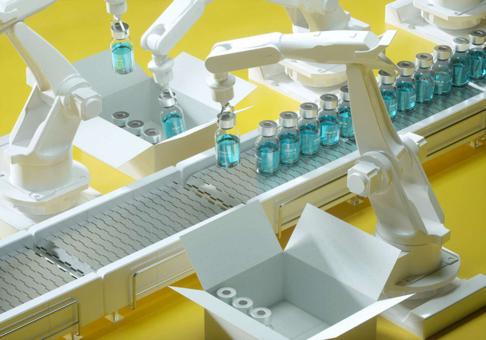

## Table of Contents

## What are the basic factors that influence drug pricing?

Drug pricing is influenced by several key factors. One major factor is the cost of research and development. It takes a lot of time and money to create new drugs. Companies spend billions of dollars on studies to make sure the drugs are safe and effective. They also need to cover the costs of failed experiments, where drugs don't work out. All these costs add up, and companies often set higher prices to recover their investments.

Another factor is the cost of production and distribution. Making drugs involves buying raw materials, using manufacturing facilities, and packaging the final product. Then, the drugs need to be shipped to pharmacies and hospitals. All these steps cost money, and these costs are reflected in the final price of the drug. Sometimes, drugs need special handling or storage, which can make them even more expensive.

Market dynamics also play a big role in drug pricing. This includes how much demand there is for a drug and how much competition there is from other companies. If a drug treats a rare disease and there are no other options, the company can charge more. On the other hand, if there are many similar drugs available, prices might be lower to stay competitive. Government regulations and policies can also affect drug prices, either by setting limits or by offering subsidies that change how much patients pay.

## How do pharmaceutical companies set initial prices for new drugs?

When pharmaceutical companies set the initial prices for new drugs, they think about a few main things. First, they look at how much it cost them to research and develop the drug. This can be a lot of money because it takes many years and lots of experiments to make sure the drug is safe and works well. Companies want to make back this money, so they set prices that help them recover their costs. They also think about how much it costs to make and ship the drug. If a drug needs special storage or handling, it might cost more to produce, and this can make the price higher.

Another important thing companies consider is the market for the drug. They look at how many people need the drug and if there are other similar drugs already available. If the drug treats a rare disease and there are no other options, the company might set a higher price because people really need it. But if there are lots of similar drugs, the price might be lower to compete with other companies. Government rules can also affect the price. Some countries have rules about how much drugs can cost, or they might help pay for certain drugs, which can change how much patients have to pay.

## What is the role of patents in drug pricing strategies?

Patents play a big role in how pharmaceutical companies set prices for their drugs. When a company gets a patent, it means they are the only ones who can make and sell that drug for a certain time, usually about 20 years. This gives them a chance to make back the money they spent on research and development without having to worry about other companies making the same drug and selling it for less. Because they have no competition, they can set higher prices to recover their costs and make a profit.

Once the patent runs out, other companies can start making and selling the same drug. These are called generic drugs, and they usually cost a lot less than the original drug. This is because the companies making generics don't have to spend money on research and development; they just need to make the drug. When generics come into the market, the price of the original drug often goes down because there is more competition. So, patents help companies set high prices at first, but when they expire, prices usually drop.

## How do government regulations affect drug pricing in different countries?

Government rules can really change how much drugs cost in different countries. Some countries have rules that set a maximum price for drugs. This means drug companies can't charge more than what the government says is okay. Other countries might use something called price controls, where the government decides the price based on how much the drug costs to make or how much it helps people. This can make drugs cheaper for people in those countries, but it can also make it harder for drug companies to make money.

In some places, the government helps pay for drugs through programs like health insurance or subsidies. This means people don't have to pay the full price themselves. For example, in countries with national health care systems, the government might negotiate with drug companies to get lower prices for everyone. This can make drugs more affordable, but it can also mean that new drugs might take longer to become available if the government is slow to agree on a price.

Different countries also have different rules about patents and how long they last. In some countries, the government might allow longer patents, which lets drug companies keep high prices for a longer time. In others, they might let generic drugs come to market sooner, which can bring prices down faster. All these rules together shape how much drugs cost and how people can get them in different parts of the world.

## What is differential pricing and how is it applied in the pharmaceutical industry?

Differential pricing is when a company charges different prices for the same product in different places or for different people. In the pharmaceutical industry, this means that a drug might cost more in one country than in another, or it might be cheaper for some patients than others. Companies do this to make their drugs affordable for more people while still making enough money to keep their business going.

In the pharmaceutical industry, differential pricing is often used to help people in poorer countries get the medicines they need. For example, a drug company might sell a drug at a lower price in a developing country where people can't afford to pay as much. This way, more people can get the medicine they need. At the same time, the company might charge more for the same drug in richer countries, where people can pay more. This helps the company make enough money to keep making new drugs and helping more people around the world.

## Can you explain the concept of value-based pricing in pharmaceuticals?

Value-based pricing in pharmaceuticals means setting the price of a drug based on how much it helps people and how much they are willing to pay for that help. It's different from just looking at how much it costs to make the drug. Instead, companies think about how much the drug improves someone's life, like if it helps them live longer or feel better. They might also look at how much money the drug can save by keeping people out of the hospital or helping them go back to work.

To use value-based pricing, drug companies talk to doctors, patients, and insurance companies to figure out how much a drug is worth. They might do studies to see how much the drug helps compared to other treatments. If a drug helps a lot and there aren't many other options, the company might set a higher price because people see it as more valuable. But if there are lots of other treatments that work just as well, the price might be lower. This way, the price of the drug matches how much people think it's worth.

## How do pharmaceutical companies use price discrimination strategies?

Pharmaceutical companies use price discrimination strategies to charge different prices for the same drug to different groups of people or in different countries. They do this to make their drugs affordable for more people while still making enough money to keep their business going. For example, they might charge less for a drug in a poor country where people can't afford to pay as much. This way, more people in that country can get the medicine they need. At the same time, they might charge more for the same drug in a rich country where people can pay more. This helps the company make enough money to keep making new drugs and helping more people around the world.

Another way companies use price discrimination is by offering different prices to different types of buyers, like hospitals, insurance companies, or individual patients. For example, they might give a lower price to a big hospital that buys a lot of the drug, because the hospital can then help more patients. But they might charge more to an insurance company that can pass the cost on to its customers. This way, the company can reach more people and still make a profit. By using these strategies, pharmaceutical companies try to balance making their drugs affordable and making enough money to keep going.

## What impact does generic competition have on drug pricing strategies?

When a drug's patent runs out, other companies can start making and selling the same drug. These are called generic drugs, and they usually cost a lot less than the original drug. This is because the companies making generics don't have to spend money on research and development; they just need to make the drug. When generics come into the market, the price of the original drug often goes down because there is more competition. Drug companies know this will happen, so they try to make as much money as they can while they still have the patent.

To deal with generic competition, drug companies might use different strategies. One way is to come up with a new version of the drug that is a little bit different, so they can get a new patent and keep charging high prices. Another way is to offer discounts or special deals to keep people buying their original drug instead of the cheaper generic. Sometimes, they might even focus on selling the drug in countries where generics are not available yet. All these strategies help drug companies keep making money even when generics start to compete.

## How do drug companies manage pricing strategies during the lifecycle of a drug?

When a drug is first made, it has a patent that lets the company be the only one to sell it for a while. During this time, the company can set a high price to make back the money they spent on research and to make a profit. They might use value-based pricing, where they set the price based on how much the drug helps people, or they might use differential pricing, where they charge different prices in different countries or to different buyers. The company wants to make as much money as they can during this time because they know the price will go down later.

Once the patent runs out, other companies can start making and selling the same drug as a generic. These generics are usually a lot cheaper because the companies making them don't have to pay for research. The original drug's price often goes down because of this competition. To keep making money, the original company might come up with a new version of the drug to get a new patent, or they might offer discounts to keep people buying their drug instead of the generic. They might also focus on selling the drug in countries where generics aren't available yet. This way, they can manage their pricing strategy throughout the drug's lifecycle.

## What are the ethical considerations in pharmaceutical pricing strategies?

When drug companies set prices for their medicines, they have to think about what is fair and right. One big ethical question is how to balance making money with making sure people can afford the drugs they need. If prices are too high, people might not be able to buy the medicine, which can be bad for their health. But if prices are too low, the company might not make enough money to keep making new drugs. This is a hard balance to find, and companies need to think about how their pricing affects people's lives.

Another ethical issue is how drug companies use different prices in different places. They might charge less in poor countries so more people can get the medicine, but this can lead to problems if people in rich countries try to buy the cheaper drugs. It can also be seen as unfair if people in one country have to pay a lot more than people in another country for the same drug. Drug companies need to be careful and fair when they use these strategies, making sure they help as many people as possible without causing harm or unfairness.

## How do global market dynamics influence drug pricing decisions?

Global market dynamics play a big role in how drug companies decide what to charge for their medicines. One important thing is how much demand there is for a drug around the world. If a drug treats a common illness and a lot of people need it, the company might set a higher price because there is a big market for it. On the other hand, if a drug treats a rare disease, the company might still set a high price, but they might also try to make it affordable in different countries by using different prices. This is called differential pricing, and it helps more people get the medicine they need.

Another thing that affects drug pricing is how much competition there is from other companies. If there are many similar drugs available, the company might have to lower their prices to stay competitive. But if they have a patent and no one else can make the same drug, they can charge more. When the patent runs out, other companies can make generic versions of the drug, which are usually cheaper. This can make the original drug's price go down. Drug companies have to think about all these things when they set prices, trying to make enough money while also making sure people can afford their drugs.

## What advanced economic models are used to optimize drug pricing strategies?

Drug companies use advanced economic models to help them set the best prices for their medicines. One model they use is called the "willingness-to-pay" model. This model looks at how much people or insurance companies are willing to pay for a drug. It takes into account how much the drug helps people, like if it makes them feel better or live longer. By understanding this, companies can set a price that people are happy to pay while still making enough money to keep making new drugs.

Another model is the "cost-effectiveness analysis." This model looks at how much it costs to give someone a drug compared to how much it helps them. For example, if a drug is very expensive but doesn't help much, it might not be a good choice. But if a drug is cheaper and helps a lot, it might be worth it. Companies use this model to set prices that make sense for both them and the people who need the drug. By using these models, drug companies can make smart pricing decisions that help as many people as possible while still keeping their business going.

## What is the role of algorithmic trading in pharmaceutical pricing?

Algorithmic trading, characterized by the use of advanced algorithms and computer systems, has increasingly been adopted to enhance pricing decisions in various industries, including pharmaceuticals. This technological approach leverages comprehensive data analysis and predictive models, providing precision and efficiency in establishing drug prices.

In the pharmaceutical industry, algorithms are capable of analyzing vast amounts of market data, identifying trends, and consequently predicting optimal pricing strategies. These algorithms consider variables such as market demand, competitor pricing, and historical sales data. By doing so, companies can set prices that maximize both competitiveness and profitability.

Machine learning models play a crucial role in this process by forecasting demand and enabling dynamic price adjustments. Through techniques such as time series analysis and regression models, [machine learning](/wiki/machine-learning) algorithms can predict future demand patterns based on historical data and external factors, like changes in healthcare policies or economic conditions. An example of such forecasting could involve using a linear regression model to analyze the relationship between the number of prescriptions filled (X) and the drug price (Y), represented as:

$$
Y = \beta_0 + \beta_1X + \epsilon
$$

Where $\beta_0$ and $\beta_1$ are coefficients and $\epsilon$ is the error term.

Algorithm-based pricing tools provide a competitive edge by minimizing human errors typically associated with manual pricing strategies. By automating the pricing process, these systems enhance efficiency, enabling companies to react swiftly to market fluctuations and competitive actions. The real-time nature of algorithmic pricing ensures that pharmaceutical companies can dynamically adjust prices in response to immediate market changes.

However, the implementation of [algorithmic trading](/wiki/algorithmic-trading) in drug pricing presents several challenges. Ensuring transparency is critical, as stakeholders demand clarity on how prices are determined. This requirement necessitates algorithms that are interpretable and auditable. Data privacy is another significant concern, given that pricing algorithms often analyze sensitive and proprietary information. Robust data protection measures must be implemented to safeguard this data from unauthorized access or misuse.

Additionally, the risk of algorithmic errors poses a substantial challenge. Errors in pricing algorithms can lead to significant financial losses or regulatory penalties. Therefore, continuous monitoring, validation, and refinement of these algorithms is essential to mitigate such risks.

In summary, algorithmic trading has the potential to revolutionize pricing strategies in the pharmaceutical industry by offering precision, efficiency, and dynamic adaptability. Nonetheless, the challenges associated with transparency, data privacy, and algorithmic errors must be carefully managed to harness these benefits effectively.

## References & Further Reading

[1]: Angell, M. (2004). ["The Truth About the Drug Companies: How They Deceive Us and What to Do About It."](https://pmc.ncbi.nlm.nih.gov/articles/PMC521592/) Random House.

[2]: DiMasi, J.A., Grabowski, H.G. (2007). ["The Cost of Biopharmaceutical R&D: Is Biotech Different?"](https://onlinelibrary.wiley.com/doi/abs/10.1002/mde.1360) Managerial and Decision Economics 28(4-5), 469-479.

[3]: Doshi, J.A., Pettit, A.R., Li, P., & Rajan, A. (2018). ["Increased Medicaid Rebate Liability and Complications of Noninnovator Drug Classification."](https://pubmed.ncbi.nlm.nih.gov/29261440/) JAMA Network Open, 1(8), e185505.

[4]: Mullard, A. (2016). ["New Drugs Cost US$2.6 Billion to Develop."](https://www.nature.com/articles/nrd4507) Nature Reviews Drug Discovery 15, 73–74.

[5]: Porter, M.E., & Kramer, M.R. (2011). ["Creating Shared Value."](https://hbr.org/2011/01/the-big-idea-creating-shared-value) Harvard Business Review, 89(1/2), 62-77.

[6]: Wouters, O. J., McKee, M., & Luyten, J. (2020). ["Estimated Research and Development Investment Needed to Bring a New Medicine to Market, 2009-2018."](https://pubmed.ncbi.nlm.nih.gov/32125404/) JAMA, 323(9), 844–853. 

[7]: Young, G. J., Burgess, J. F., & Valley, D. (2015). ["Health System Affiliations and the Prices That Hospitals Charge."](https://www.semanticscholar.org/paper/Employee-turnover-and-operational-performance%3A-the-Mohr-Young/e048714ceecb09f3a0baf6b92973fa846301573a) Health Affairs, 34(10), 1738–1744.