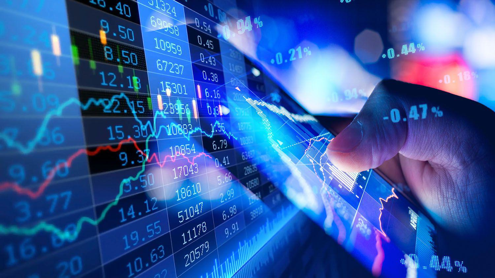

In the fast-paced world of financial markets, algorithmic trading has emerged as an essential tool for both institutional and individual traders. This powerful practice integrates complex algorithms, allowing market participants to execute trades at unprecedented speeds and volumes, fundamentally reshaping the trading landscape. Algorithmic trading leverages technologies to analyze vast sets of market data, identify patterns, and execute trades with precision, offering a significant advantage in competitive environments.

This article focuses on the practices of DRW, a prominent proprietary trading firm recognized for its innovative strategies and technological advancement. DRW is renowned in the industry for its commitment to leveraging technology to achieve superior trading outcomes. Algorithmic trading at DRW is characterized by the use of sophisticated models and computer systems that analyze market conditions and implement trades efficiently.



We will explore the various strategies employed within algorithmic trading, assessing their benefits and challenges, and examining how DRW uses these strategies to secure a competitive edge in global markets. The discussion will highlight DRW's approach to integrating advanced computational methods and extensive data analysis, showcasing its role as a leader in the evolving domain of financial trading.

## Table of Contents

## Understanding DRW and Its Role in Financial Markets

Founded in 1992 by Don Wilson, DRW has positioned itself as a significant player within the global trading landscape. This proprietary trading firm, headquartered in Chicago, has built a robust presence across various asset classes including fixed income, energy, and cryptocurrencies. The firm's success is a testament to its focus on innovation and technological advancement.

DRW's commitment to innovation is illustrated by its early adoption and integration of electronic trading platforms, which have enabled it to keep pace with the rapidly evolving financial markets. By leveraging these platforms, DRW has developed sophisticated automated trading strategies that allow for fast, efficient, and accurate trade execution. These technologies have provided the firm with a competitive advantage, as they enable traders to process large volumes of data and execute trades at speeds unachievable by traditional manual trading methods.

The global reach of DRW is another [factor](/wiki/factor-investing) that underscores its prominence. The firm has expanded its operations into major financial hubs worldwide, including London, New York, and Singapore. This geographic diversification allows DRW to participate actively in a variety of markets and capitalize on opportunities across time zones, thereby optimizing its trading activities around the clock.

DRW is also recognized as a leader in high-frequency trading ([HFT](/wiki/high-frequency-trading-strategies)), a form of [algorithmic trading](/wiki/algorithmic-trading) that involves executing a large number of orders at extremely rapid speeds. This reputation has been built on the firm's ability to innovate continually and adapt to market changes with agility. Through investment in state-of-the-art infrastructure and recruitment of top-tier talent, DRW has maintained its edge in an arena where milliseconds can make the difference between profit and loss.

In summary, DRW's strategic focus on utilizing cutting-edge technology and expanding its global reach has cemented its status as a leading entity in the dynamic world of proprietary trading. Its ability to continually innovate and adapt its strategies ensures it remains at the forefront of the industry.

## The Rise of Algorithmic Trading

Algorithmic trading, or 'algo trading', represents a paradigm shift in financial markets by automating both trading decisions and executions through advanced computer algorithms. These algorithms are meticulously designed to swiftly analyze real-time market data and efficiently execute trades at optimal prices, thereby minimizing latency and enhancing market responsiveness.

The rise of algorithmic trading can be directly attributed to the widespread adoption of electronic trading platforms. These platforms have revolutionized the trading landscape over the past two decades by providing the necessary infrastructure to execute an immense [volume](/wiki/volume-trading-strategy) of trades with remarkable precision and speed. The transformation from manual to automated systems has eliminated many traditional bottlenecks, allowing for quicker decision-making processes.

Algo trading is distinguished by several key advantages. The foremost benefit is speed—algorithms can process and react to market data far faster than any human can, enabling the exploitation of fleeting market opportunities that may only exist for milliseconds. This rapid execution is crucial in highly competitive markets where price changes occur in fractions of a second.

Efficiency is another significant advantage. Automated systems can operate continuously without fatigue, allowing for trading operations around the clock. This continuous functionality enables traders to engage in multiple markets across different time zones without the need for human intervention, thereby ensuring continuous activity and profit potential.

Moreover, algorithmic trading reduces human error, a common cause of costly mistakes in manual trading. By relying on pre-defined and backtested algorithms, traders can mitigate the risks associated with emotional and psychological biases. Algorithms adhere strictly to their programming, ensuring consistent adherence to trading strategies and risk management protocols.

In summary, the proliferation of algorithmic trading has been significantly driven by technological advancements in electronic trading platforms, offering unprecedented speed, efficiency, and error reduction. These attributes of algo trading have enabled traders to operate with enhanced precision and capitalize on short-lived market opportunities.

## DRW's Approach to Algorithmic Trading

DRW's innovative approach to algorithmic trading involves leveraging cutting-edge technology to maintain and enhance its competitive edge. The firm has consistently invested in the development of sophisticated trading algorithms, reinforcing its commitment to technological advancement. At the core of DRW's strategy is the integration of high-performance computing and advanced analytics, enabling the firm to process vast amounts of market data with remarkable speed and accuracy.

DRW’s technology division plays a crucial role by supporting a multitude of open-source software projects, which are instrumental in refining and optimizing trading strategies. By actively contributing to open-source communities, DRW not only enhances its own trading capabilities but also fosters a culture of collaboration and innovation within the broader tech community. This engagement with open-source projects ensures access to cutting-edge developments and facilitates the rapid incorporation of innovative tools into its trading systems.

Furthermore, DRW places a significant emphasis on attracting and retaining top talent, recognizing that skilled professionals are essential for sustaining excellence in algorithmic trading. The firm seeks individuals with a robust understanding of quantitative finance, computer science, and related disciplines. By fostering an environment that encourages creativity and technical expertise, DRW ensures that its team is well-equipped to address the complexities of modern financial markets.

Investing in both advanced technology and human capital allows DRW to continually adapt to the evolving landscape of algorithmic trading. This balanced approach of utilizing state-of-the-art infrastructure alongside highly skilled personnel positions DRW as a leader in the use of innovative trading technologies.

## Core Strategies of Algorithmic Trading

Several core strategies underpin algorithmic trading, each crafted to fulfill specific trading objectives and exploit various market conditions. Some of the most prominent strategies include:

- **Trend Following**: This strategy capitalizes on the momentum of market prices to capture profits from trends. It typically employs technical indicators like moving averages and channel breakouts to identify and follow price trends. A simple moving average (SMA) can be used as a trend indicator, which smooths out price data by creating a constantly updated average price over a specific period. The basic idea is that if the price crosses the moving average from below, it signals a buying opportunity, whereas crossing from above indicates a selling signal.

  ```python
  def moving_average(prices, window_size):
      return [sum(prices[i:i+window_size])/window_size for i in range(len(prices)-window_size+1)]

  prices = [100, 102, 105, 107, 110, 115]
  print(moving_average(prices, 3))  # Example output: [102.33, 104.67, 107.33, 110.67]
  ```

- **Arbitrage Opportunities**: This strategy seeks to exploit price discrepancies between different markets or instruments. Arbitrageurs aim to simultaneously buy and sell equivalent assets to profit from their price difference, often requiring sophisticated algorithms to detect and execute trades within milliseconds to capitalize on fleeting opportunities. For instance, if a stock is priced lower on one exchange than another, the algorithm would buy on the cheaper exchange and sell on the more expensive one. 

- **Market Making**: In this strategy, traders provide liquidity to the markets by placing both buy and sell orders for financial instruments simultaneously. The objective is to profit from the bid-ask spread, providing liquidity and reducing market volatility. The market maker algorithm must be perfectly calibrated to adjust quickly to market movements and maintain a balance between orders to mitigate risks.

- **Mean Reversion**: This strategy is based on the statistical premise that asset prices will revert to their historical averages over time. Traders utilizing mean reversion strategies look for assets that have deviated from their mean price with the expectation that they will return to that mean. This can involve statistical measures like Bollinger Bands to identify overbought or oversold conditions.

  ```python
  def mean_reversion_strategy(prices, window_size):
      mean_price = sum(prices[-window_size:]) / window_size
      current_price = prices[-1]
      if current_price < mean_price:
          return "Buy"
      elif current_price > mean_price:
          return "Sell"
      else:
          return "Hold"

  prices = [100, 102, 98, 95, 105]
  print(mean_reversion_strategy(prices, 3))  # Example output: "Sell"
  ```

These strategies form the backbone of algorithmic trading, allowing traders to harness computational power and data analysis to optimize their trading endeavors. Each strategy comes with its unique set of challenges and requires meticulous [backtesting](/wiki/backtesting) and tuning to align with the trader's risk tolerance and market assumptions.

## Pros and Cons of Algorithmic Trading

Algorithmic trading offers numerous advantages that have revolutionized the financial markets. Among its primary benefits is the significant enhancement of trading efficiency. By relying on computer algorithms to execute trades, traders can capitalize on market opportunities faster than any human could, thus optimizing the timing and pricing of transactions. Moreover, algorithmic trading facilitates anonymity in the market, enabling traders to execute large orders without tipping off other market participants, thus minimizing the impact on market prices.

Another significant advantage of algorithmic trading is its ability to strip biases from decision-making processes. Human traders often fall prey to emotional biases, such as fear and greed, which can impair their judgment and lead to suboptimal trading decisions. Algorithmic systems, by contrast, operate based on predefined criteria and logic, enabling them to make decisions devoid of emotional influence, leading to more consistent and reliable trading outcomes.

Despite these advantages, algorithmic trading also poses several challenges, which firms must navigate carefully. The complexity of developing and maintaining robust algorithmic systems is a significant hurdle. Crafting sophisticated algorithms that can accurately interpret market signals and respond appropriately requires substantial technical expertise and continuous refinement.

Additionally, the risk of system failures is an ever-present concern in algorithmic trading. Software bugs, hardware malfunctions, or connectivity issues can lead to significant financial losses, as trades may be executed incorrectly or missed altogether. Proper risk management strategies, including robust testing and redundancy systems, are critical to mitigating these risks.

Regulatory scrutiny further complicates the landscape of algorithmic trading. As these systems have grown more prevalent, regulators have increased their focus on ensuring they do not destabilize markets or disadvantage other traders. Compliance with evolving regulatory standards requires firms to remain vigilant and adaptive, often necessitating changes to their trading algorithms and practices.

For firms like DRW, effectively leveraging the pros and cons of algorithmic trading is crucial to maintaining a competitive edge. By embracing advanced technology, comprehensive risk management, and a continual focus on compliance, firms can harness the benefits of algorithmic trading while mitigating its challenges. This balanced approach is key to achieving long-term success in the dynamic environment of financial trading.

## Conclusion

Algorithmic trading continues to reshape financial markets by providing unparalleled speed and accuracy in trade execution, while removing human emotional biases from decision-making processes. This cutting-edge approach empowers traders to exploit market opportunities within milliseconds, often employing sophisticated algorithms to analyze large volumes of market data instantaneously. DRW, a prominent firm in this field, exemplifies a commitment to harnessing such technologies. By consistently innovating and adapting their strategies, DRW maintains its competitive edge in a fast-evolving landscape.

With technology progressing at an ever-accelerating pace, DRW's dedication to embracing these advancements is apparent in their strategic focus. By investing in state-of-the-art technological infrastructure and attracting top talent, the firm is well-positioned to sustain and enhance its success in algorithmic trading. Continuous development and refinement of trading algorithms ensure that DRW remains agile and responsive to market changes, thereby solidifying its role as a leader in financial trading innovation.

As the financial sector increasingly relies on technology-driven solutions, DRW's adaptive approach to algorithmic trading illustrates a blueprint for maintaining relevance and success in this dynamic environment. Whether through developing open source software projects or pioneering novel trading strategies, the firm's ongoing commitment to innovation ensures its continued influence and efficacy in global markets.

## References & Further Reading

[1]: Bergstra, J., Bardenet, R., Bengio, Y., & Kégl, B. (2011). ["Algorithms for Hyper-Parameter Optimization."](https://dl.acm.org/doi/10.5555/2986459.2986743) Advances in Neural Information Processing Systems 24.

[2]: ["Advances in Financial Machine Learning"](https://www.amazon.com/Advances-Financial-Machine-Learning-Marcos/dp/1119482089) by Marcos Lopez de Prado

[3]: ["Evidence-Based Technical Analysis: Applying the Scientific Method and Statistical Inference to Trading Signals"](https://www.amazon.com/Evidence-Based-Technical-Analysis-Scientific-Statistical/dp/0470008741) by David Aronson

[4]: ["Machine Learning for Algorithmic Trading"](https://books.google.com/books/about/Machine_Learning_for_Algorithmic_Trading.html?id=4f30DwAAQBAJ) by Stefan Jansen

[5]: ["Quantitative Trading: How to Build Your Own Algorithmic Trading Business"](https://www.amazon.com/Quantitative-Trading-Build-Algorithmic-Business/dp/1119800064) by Ernest P. Chan