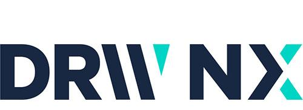

DRW Holdings, LLC, commonly known as DRW, has established itself as a formidable entity in the field of algorithmic trading, a sector that has revolutionized the way financial markets operate. As a prominent trader, DRW leverages cutting-edge technology and sophisticated algorithmic strategies to make split-second trading decisions, enabling it to capitalize on opportunities across various asset classes around the globe.

Algorithmic trading represents a significant evolution in financial markets. Unlike traditional trading methods, which rely heavily on human intuition and manual execution, algorithmic trading employs computer algorithms to automatically execute orders based on pre-defined criteria. This has several advantages, including increased speed, accuracy, and the ability to handle complex data and large volumes transactions, ultimately leading to greater market efficiency.



DRW began its journey in 1992, founded by Don Wilson, with a focus on trading options on the Chicago Mercantile Exchange. Over the years, the firm has been at the forefront of innovation in trading technology, continuously evolving to incorporate advanced quantitative techniques and embracing electronic trading platforms. This adaptability has ensured its position as a leader in the industry.

The article targets financial investors, technology enthusiasts, and those interested in understanding the burgeoning field of algorithmic trading. Readers can expect to gain insights into DRW's innovative approaches, the technical strategies that have cemented its status, and the broader implications of algorithmic trading on global financial markets.

Understanding DRW's approach to algorithmic trading is crucial for anyone looking to navigate the ever-changing landscape of finance and technology. For investors, it provides a glimpse into the strategies driving market trends and capital allocation. For tech enthusiasts, it highlights the transformative potential of tech-driven trading solutions.

The structure of this article is thoughtfully designed to offer a comprehensive view of algorithmic trading and DRW's impactful role within it. Beginning with a foundational explanation of algorithmic trading, the article explores the evolution of DRW, investigates into its strategic methodologies, and examines the technological infrastructure behind its operations. Furthermore, it addresses challenges and controversies faced by DRW, and concludes with an exploration of future trends in algorithmic trading.

## Table of Contents

## What is Algorithmic Trading?

Algorithmic trading refers to the use of computer algorithms to automate trading decisions in financial markets. These algorithms are capable of evaluating market conditions and executing trades at speeds and efficiencies that surpass traditional trading methods. The core advantage of [algorithmic trading](/wiki/algorithmic-trading) lies in its ability to process large volumes of data rapidly, which allows for quick reaction to market changes, minimizing execution times and reducing potential human errors.

The key components and technologies that underpin algorithmic trading include sophisticated software systems, high-speed network connections, and advanced statistical and mathematical models. These are used to design and implement trading strategies that can capitalize on short-term opportunities in the market. For example, high-frequency trading ([HFT](/wiki/high-frequency-trading-strategies)), a subset of algorithmic trading, involves the execution of a large number of orders at extremely fast speeds, often within milliseconds, to profit from very small price discrepancies.

The impact of algorithmic trading on the financial industry has been profound. It has increased market [liquidity](/wiki/liquidity-risk-premium), reduced transaction costs, and enhanced price discovery. However, it has also introduced new challenges such as potential market [volatility](/wiki/volatility-trading-strategies) and systemic risk due to the speed and [volume](/wiki/volume-trading-strategy) of trades that algorithms can execute. Notably, trading algorithms contributed to market events like the infamous "Flash Crash" of 2010, where the Dow Jones Industrial Average plunged nearly 1,000 points within minutes before a quick recovery.

Common strategies employed within algorithmic trading include [trend following](/wiki/trend-following), [arbitrage](/wiki/arbitrage), [market making](/wiki/market-making), and [pair trading](/wiki/pair-trading). For instance, trend-following strategies rely on algorithms to identify and capitalize on market trends, while arbitrage strategies exploit price differences across different markets or instruments to generate profits. Market making involves placing both buy and sell orders to earn a spread, and pair trading focuses on taking offsetting positions in correlated stocks to profit from relative price movements.

Python, a programming language popular among traders for its simplicity and extensive libraries, is commonly used in algorithmic trading to implement such strategies. An example of a simple [momentum](/wiki/momentum)-based trading strategy in Python could be as follows:

```python
# Import necessary libraries
import pandas as pd
import numpy as np
import talib

# Fetch historical price data
data = pd.read_csv('price_data.csv')

# Calculate momentum indicators, e.g., Moving Average Convergence Divergence (MACD)
data['MACD'], data['MACD_signal'], _ = talib.MACD(data['Close'], fastperiod=12, slowperiod=26, signalperiod=9)

# Define trading signals
data['Signal'] = np.where(data['MACD'] > data['MACD_signal'], 1, -1)

# Generate trading orders
data['Position'] = data['Signal'].shift(1)

# Calculate strategy returns
data['Strategy_Return'] = data['Position'] * data['Return']

# Output performance metrics
cumulative_strategy_return = (data['Strategy_Return'] + 1).prod() - 1
print("Cumulative Strategy Return:", cumulative_strategy_return)
```

In conclusion, algorithmic trading represents a significant advancement in financial trading, providing tools and strategies that enhance efficiency and execution in the markets. However, it also necessitates a thorough understanding of the associated risks and the development of robust systems to mitigate them.

## The Evolution of DRW

DRW, a prominent trading firm, was established in 1992 by Don Wilson, Jr., a trader with a keen interest in financial mathematics and derivatives markets. From its inception, DRW sought to distinguish itself through the innovative application of technology in trading. Initially, the firm focused on trading financial derivatives and options, gradually expanding its reach to various asset classes. Throughout the 1990s, DRW capitalized on the growing technological advancements of the period, positioning itself as a forerunner in the use of algorithmic trading methods.

As algorithmic trading began to reshape the financial landscape, DRW adeptly integrated these technologies into its operations. This strategic adaptation enabled the firm to execute trades with unprecedented speed and precision. By leveraging cutting-edge computational models, DRW enhanced its trading strategies, capitalizing on arbitrage opportunities and executing complex trading strategies more efficiently than rivals relying on traditional methods.

Key milestones in DRW's evolution include the early adoption of high-frequency trading and the establishment of a diverse portfolio that spans equities, fixed income, and commodities. These achievements were underpinned by DRW's commitment to continuous innovation and investment in technology. The firm's growth in the early 2000s was marked by the opening of new offices in major financial hubs around the world, including London and Singapore. This global expansion allowed DRW to tap into diverse markets and respond rapidly to shifting financial trends.

DRW's influence extends beyond its trading accomplishments; the firm has played a noteworthy role in shaping industry norms and regulations. By engaging with regulatory bodies and participating in industry forums, DRW contributes to the ongoing dialogue regarding the evolving landscape of algorithmic trading. This involvement ensures a balanced approach to maintaining fair and transparent market practices.

Today, DRW stands as a testament to the transformative power of technology in finance. Its journey from a derivatives trading firm to a leader in algorithmic trading highlights the importance of continuously adapting to technological advances. DRW's global presence and its ability to influence market practices demonstrate the significant impact of innovative trading strategies on the financial industry.

## DRW's Approach to Algorithmic Trading

DRW Holdings, LLC is a prominent player in algorithmic trading, utilizing advanced technological solutions and innovative strategies to maintain its competitive edge. At the heart of DRW's operations is a focus on leveraging technology and data analysis to optimize trading decisions, allowing the firm to efficiently navigate complex financial markets.

Technology and data analysis are critical components of DRW's trading strategy. The firm integrates sophisticated quantitative models with comprehensive market data to develop and execute trading strategies. By using these models, DRW can process vast amounts of market information, identify patterns, and execute trades with precision and speed. This technological prowess enables DRW to capitalize on opportunities that are often invisible to traditional trading methods.

One of the key technologies employed by DRW is [artificial intelligence](/wiki/ai-artificial-intelligence) (AI), particularly [machine learning](/wiki/machine-learning). DRW integrates machine learning algorithms to adapt to changing market conditions and refine its trading parameters continuously. Machine learning models help improve the predictive accuracy of market movements by analyzing historical data and learning from market behaviors. These models can automatically adjust trading strategies to optimize performance and manage risks.

Balancing risk and reward is a fundamental aspect of DRW's trading operations. The firm employs risk management frameworks that assess potential downside scenarios and implement strategies to mitigate risk exposure. DRW's algorithms are designed to maximize expected returns while keeping track of various risk metrics, such as Value at Risk (VaR) and conditional Value at Risk (cVaR). This systematic approach allows DRW to maintain stability even in volatile market conditions.

DRW has several trading success stories that highlight its effective use of algorithmic trading. For instance, the firm is known for its operations in high-frequency trading (HFT), where it quickly processes and executes a large number of orders to exploit small price discrepancies across different markets. Another notable area is options trading, where DRW uses complex option pricing models to identify undervalued options and develop strategies capitalizing on volatility.

Overall, DRW's approach to algorithmic trading is characterized by a commitment to technological innovation, rigorous quantitative analysis, and strategic risk management. These elements work together to ensure that the firm not only survives but thrives in the highly dynamic and competitive environment of financial trading.

## Technology and Innovation at DRW

DRW utilizes a sophisticated technological infrastructure to power its trading systems, enabling the firm to maintain a competitive edge in algorithmic trading. This infrastructure is characterized by high-performance computing capabilities, low-latency execution systems, and advanced analytics. By harnessing cutting-edge technology, DRW can process vast quantities of market data in real time, facilitating rapid and informed trading decisions.

A significant aspect of DRW's success lies in its strategic partnerships with technology firms alongside its robust in-house development. Collaborating with external tech companies allows DRW to integrate the latest advances in technology, such as high-speed networking and custom hardware solutions, while its internal teams focus on developing proprietary algorithms and trading software tailored to the firm's specific needs.

Innovation at DRW is driven by investments in emerging technologies that offer a competitive advantage. A notable focus area is the deployment of artificial intelligence and machine learning across trading strategies. These technologies enhance DRW's ability to identify complex patterns and deploy predictive models that optimize trading decisions. Moreover, the firm continually evolves its technology stack to incorporate distributed ledger technology and blockchain innovations, exploring their potential applications in trading operations and asset management.

Cybersecurity plays a crucial role in DRW’s trading practice to safeguard its operations against threats. The firm employs a multi-layered security approach, which includes encryption, intrusion detection systems, and continuous monitoring of its trading networks. By adopting a proactive stance on cybersecurity, DRW ensures the integrity and confidentiality of its proprietary information and client data.

To maintain its leadership in technology-driven trading, DRW emphasizes the continuous training and development of its tech talent. This involves cultivating a dynamic work environment where innovation is encouraged and technical skills are continually honed. DRW provides access to advanced tools, resources, and learning opportunities that enable its traders and technologists to stay ahead of industry trends and technological advancements.

Overall, DRW’s commitment to leveraging state-of-the-art technology while fostering talent and innovation is key to its sustained success in algorithmic trading. By integrating advanced technologies with robust security measures and skilled personnel, the firm remains well-equipped to navigate the complexities of modern financial markets.

## Challenges and Controversies

DRW has navigated numerous challenges within the trading industry, primarily centered around legal and regulatory concerns. As a prominent figure in algorithmic trading and high-frequency trading (HFT), DRW operates within a heavily scrutinized domain. The firm's involvement in high-frequency trading has often placed it under the microscope, contributing to controversies and prompting legal challenges.

**Legal and Regulatory Issues:**
DRW has faced significant legal hurdles, notably a high-profile case with the U.S. Commodity Futures Trading Commission (CFTC). The dispute centered on allegations that DRW manipulated market prices through its trading practices. This case highlights the regulatory challenges faced by firms engaged in advanced trading strategies such as HFT. Despite these challenges, DRW was ultimately vindicated, with a federal court dismissing the CFTC's case. This outcome underscored the complexity of regulating algorithmic trading and the difficulties in proving market manipulation within this context.

**Controversies in High-Frequency Trading:**
High-frequency trading, a subset of algorithmic trading, has been at the forefront of controversies due to its potential impact on market fairness and stability. DRW, given its involvement in HFT, has been part of debates surrounding the ethical and equitable nature of such trading methods. Critics argue that HFT can lead to unfair advantages due to speed and access disparities, while proponents highlight its role in enhancing market liquidity and efficiency. The intricate technology underlying these trades often leads to industry-wide debates on information asymmetry and market impacts.

**Company’s Response to Challenges:**
In response to these challenges, DRW has demonstrated resilience and adaptability. The firm has invested heavily in compliance and regulatory affairs, ensuring their trading activities adhere to evolving legal frameworks. DRW's initiatives include enhancing transparency in its operations and leveraging advanced technologies to align with regulatory expectations. The rigorous defense in the CFTC case reflects DRW's commitment to maintaining its reputation and defending its trading algorithms and methodologies.

**Lessons Learned and Adaptation:**
The challenges DRW has encountered have offered valuable lessons in navigating the increasingly complex financial regulatory landscape. A key takeaway for the firm has been the importance of robust risk management and compliance frameworks. DRW continues to adapt by anticipating regulatory shifts and engaging actively with policymakers. Furthermore, the firm's experiences have informed its internal policies, promoting a corporate culture that values ethical trading practices and innovation within legal confines.

By learning from past controversies and legal skirmishes, DRW positions itself at the intersection of technology and regulation, ensuring its continued influence and success in the evolving world of algorithmic trading.

## The Future of DRW and Algorithmic Trading

The future of algorithmic trading is poised for significant evolution, with DRW standing as a potentially pivotal player in this transformative landscape. Algorithmic trading, characterized by the use of complex algorithms to automate trading strategies, continues to redefine the financial markets. As we progress into an era dominated by rapid technological advancements, the role and strategy of firms like DRW will be crucial in shaping this evolution.

A leading prediction for the future of algorithmic trading is the increasing reliance on artificial intelligence (AI) and machine learning (ML) to enhance the precision and adaptability of trading strategies. Advanced AI systems can analyze vast datasets at unprecedented speeds, enabling more informed decision-making processes. DRW, with its history of integrating cutting-edge technology, is likely to continue investing heavily in these areas. By leveraging AI and ML, DRW can maintain a competitive edge, adapting quickly to market fluctuations and identifying new trading opportunities that traditional algorithms may overlook.

Emerging industry trends suggest a growing focus on integrating environmental, social, and governance ([ESG](/wiki/esg-investing)) factors into trading algorithms. As demand for sustainable financial practices intensifies, DRW may explore the development of algorithms that not only seek profit but also align with ESG criteria. This adaptation not only caters to socially responsible investors but also positions DRW as a leader in sustainable trading practices.

Potential growth areas for DRW include the expansion into new asset classes such as cryptocurrencies and decentralized finance (DeFi). These markets offer fresh opportunities given their increasing mainstream acceptance and potential for high volatility, which is ideal for algorithmic exploitation. DRW’s existing expertise in technology-driven trading positions the firm well to venture into these domains while managing associated risks effectively.

Leaders within DRW have highlighted the importance of remaining agile and responsive to change as financial markets become more interconnected and technology-driven. This philosophy suggests that DRW will continue to prioritize research and development, nurturing innovation from within and potentially forming strategic partnerships to enhance its capabilities.

As technology and finance become increasingly intertwined, the relationship between these sectors will evolve, emphasizing the importance of cybersecurity and data integrity. For DRW, safeguarding its systems and algorithms against cyber threats will be paramount in maintaining its reputation and operational efficacy. This necessitates continuous investment in robust cybersecurity measures alongside the development of advanced trading systems.

In summary, DRW is poised to be a major influencer in the future of algorithmic trading, propelled by its commitment to technological advancement and strategic adaptability. By focusing on AI, ESG integration, and emerging financial instruments, while ensuring robust cybersecurity, DRW can capitalize on new opportunities and navigate challenges in the evolving financial landscape.

## Conclusion

DRW has established itself as a prominent figure in the landscape of algorithmic trading, leveraging technology and data analysis to maintain a competitive edge. Throughout the article, we've explored how DRW harnesses sophisticated algorithms and cutting-edge technology to optimize trading strategies and make informed decisions in real-time. From its inception to becoming a global force, DRW's journey underscores its pivotal role in shaping industry standards and influencing regulatory developments.

DRW's contributions to algorithmic trading extend beyond its own corporate success; they have catalyzed broader advancements within the financial sector. As a pioneer in integrating AI and machine learning into trading, DRW not only enhances its own operations but also sets benchmarks for other market participants. This forward-thinking approach highlights the firm's commitment to continuous innovation, ensuring its relevance in the fast-paced trading environment.

Staying abreast of innovations in finance and technology is crucial for anyone engaged in the financial markets, be it investors, technologists, or regulators. The rapid evolution of algorithmic trading requires constant learning and adaptation to emerging trends. For those interested in pursuing careers or investments in this dynamic field, an understanding of DRW's methodologies offers valuable insights.

As a call to action, readers are encouraged to delve deeper into the mechanisms and strategies employed in algorithmic trading. For those aspiring to enter the field, engaging with resources such as industry publications, webinars, or courses can provide a solid foundation. Additionally, exploring DRW's specific contributions through its research papers, public talks, and other educational materials can further enrich one's knowledge of this transformative domain.

To further explore the intricacies of DRW and algorithmic trading, consider reviewing publications from authoritative sources like the Journal of Financial Markets, or accessing comprehensive databases such as SSRN for research papers. Engaging with online platforms like Coursera or edX can also offer structured learning paths to enhance understanding of financial technologies and algorithmic strategies. Engaging with such resources will empower readers to not only comprehend current practices but also anticipate future developments in finance and technology.

## References & Further Reading

[1]: ["Quantitative Trading: How to Build Your Own Algorithmic Trading Business"](https://www.amazon.com/Quantitative-Trading-Build-Algorithmic-Business/dp/1119800064) by Ernest P. Chan

[2]: ["Advances in Financial Machine Learning"](https://www.amazon.com/Advances-Financial-Machine-Learning-Marcos/dp/1119482089) by Marcos Lopez de Prado

[3]: Aldridge, Irene. ["High-Frequency Trading: A Practical Guide to Algorithmic Strategies and Trading Systems."](https://www.amazon.com/High-Frequency-Trading-Practical-Algorithmic-Strategies/dp/1118343506) Wiley Finance, 2013.

[4]: Narang, Rishi K. ["Inside the Black Box: A Simple Guide to Quantitative and High-Frequency Trading."](https://www.amazon.com/Inside-Black-Box-Quantitative-Frequency/dp/1118362411) Wiley, 2013.

[5]: MacKenzie, Donald. ["Trading at the Speed of Light: How Ultrafast Algorithms Are Transforming Financial Markets."](https://www.amazon.com/Trading-Speed-Light-Algorithms-Transforming/dp/0691211388) Princeton University Press, 2021.

[6]: ["Evidence-Based Technical Analysis: Applying the Scientific Method and Statistical Inference to Trading Signals"](https://www.amazon.com/Evidence-Based-Technical-Analysis-Scientific-Statistical/dp/0470008741) by David Aronson

[7]: Kissell, Robert. ["The Science of Algorithmic Trading and Portfolio Management."](https://www.sciencedirect.com/book/9780124016897/the-science-of-algorithmic-trading-and-portfolio-management) Academic Press, 2013.