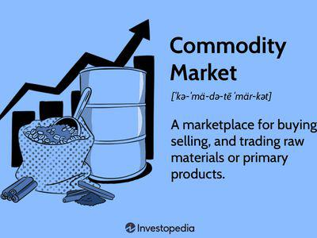

The global economy operates through an intricate network of trade relationships, with shipping serving as a crucial component in moving essential commodities across the globe. This process involves the seamless interaction of multiple facets, including bulk shipping, dry bulk commodities, container shipping, and algorithmic (algo) trading, which all play pivotal roles in the international trade landscape.

Bulk shipping is responsible for the transportation of large volumes of unpackaged goods, such as grains, coal, and iron ore, which are pivotal to various sectors worldwide. The dry bulk category, focused on solid raw materials, is essential for industries like construction, manufacturing, and energy production. In parallel, container shipping has revolutionized the transport of diverse goods by standardizing their carriage, thus significantly enhancing global logistics efficiency.



Algorithmic trading, with its reliance on sophisticated computer algorithms, further augments the efficiency of trading operations in the commodities market. Through these algorithms, trading decisions are executed swiftly and with precision, mitigating many traditional market risks and creating new avenues for investment.

For investors, traders, and businesses engaged in the import and export sectors, understanding these components is imperative. Each element operates within a broader commercial framework, affecting how goods are priced, traded, and delivered globally.

This guide aims to shed light on the complex dynamics of bulk shipping and commodities trading, providing insights into their operational mechanisms and interactions. By doing so, it equips stakeholders with the knowledge needed to navigate the complexities of international trade, ultimately fostering more resilient and informed participation in the global market.

## Table of Contents

## Understanding Bulk Shipping

Bulk shipping is a critical component of global trade, involving the transport of substantial quantities of unpackaged goods such as grains, coal, and iron ore. This sector is divided into two main categories: dry bulk and wet bulk shipping. Dry bulk shipping specifically deals with solid raw materials like iron ore, coal, grains, and other similar commodities, while wet bulk focuses on liquid cargoes, including crude oil and chemicals.

### Types of Vessels Used

Bulk carriers, or bulker ships, are the primary vessels used for transporting dry bulk commodities. These ships come in various sizes, ranging from small feeders to large Capesize vessels. The classification is generally based on their deadweight tonnage (DWT), which dictates the [volume](/wiki/volume-trading-strategy) of goods they can transport:

- **Handysize**: Ships with a capacity of 10,000 to 35,000 DWT, ideal for minor bulk trades.
- **Supramax**: With a capacity range of 50,000 to 60,000 DWT, suitable for a wide array of dry bulk trades.
- **Panamax**: Designed to fit through the Panama Canal, these vessels have a capacity of 60,000 to 80,000 DWT.
- **Capesize**: Large ships over 150,000 DWT, primarily used for the transportation of coal and iron ore.

The choice of vessel depends on factors such as port infrastructure, trade routes, cargo characteristics, and economic considerations.

### Significance of the Baltic Dry Index (BDI)

Developed in 1985 by the London-based Baltic Exchange, the Baltic Dry Index (BDI) serves as a leading economic indicator reflecting the demand for shipping capacity versus the supply of dry bulk carriers. It encompasses three sub-indices, which measure different sizes of bulk carriers (Capesize, Panamax, and Supramax). A high BDI indicates strong demand for shipping, often correlating with economic growth, while a decrease suggests a downturn.

Mathematically, the BDI is computed as an average of the sub-indices, weighted by ship size and market activity. It provides a composite figure representing freight costs for transporting raw materials. Fluctuations in the BDI can impact shipping rates, influencing decisions on fleet deployment and chartering strategies.

### Impact on Global Supply Chains and Economic Activities

Bulk shipping plays an integral role in global supply chains, facilitating the efficient movement of critical raw materials from production sites to industrial centers. The ability to transport large volumes at lower costs compared to other shipping methods is essential for maintaining competitive advantage in industries such as steel manufacturing, energy production, and agriculture.

Economic activities are directly affected by bulk shipping, as it determines the availability and costs of fundamental commodities. When bulk shipping operates smoothly, it supports economic stability by ensuring consistent supply and managing price [volatility](/wiki/volatility-trading-strategies). However, disruptions, such as port congestion or changes in freight rates, can lead to significant ripple effects across global markets, highlighting the interconnected nature of modern trade. 

In conclusion, understanding bulk shipping is vital not only for industry stakeholders but also for policymakers and economists, as it underpins both the practical and economic frameworks of international commerce.

## Dry Bulk Commodities: Key Players and Trade Routes

Dry bulk commodities form the backbone of numerous global industries, notably construction and energy, through the supply of essential materials such as iron ore, coal, and grains. These commodities are pivotal in supporting infrastructure projects and energy production worldwide. Key exporting countries such as Australia and Brazil have established themselves as dominant players in the dry bulk market, primarily due to their vast natural resources.

Australia is renowned for its iron ore exports, primarily supplying to China, which remains the world's largest consumer of this commodity. The trade route from Australia to China is one of the most significant in global trade, driven by China's robust industrial sector and infrastructure development. This route is not only critical for the iron and steel industry but also for the broader economic relationship between these two nations.

Similarly, Brazil is a major exporter of iron ore, with significant shipments directed to China. Large mining corporations, such as Vale S.A., play a crucial role in facilitating this trade, ensuring that high-quality iron ore reaches Asian markets efficiently. Brazil’s geographical advantage, coupled with a developed mining industry, positions it as a key player in the dry bulk sector.

In the coal market, Indonesia ranks as a leading exporter, largely supplying to Asian economies, including China and India. Indonesia's proximity to these large markets offers a logistical advantage, making its coal more competitive. Factors such as low production costs and substantial reserves contribute to Indonesia's prominence in the coal trade.

The United States and Russia also hold significant roles in the dry bulk commodities market. The USA exports a variety of agricultural products, primarily grains, which are integral to the global food supply chain. Key importers of American grains include countries in Asia and Europe, necessitating efficient shipping routes across the Atlantic and Pacific Oceans.

Russia, on the other hand, is a major supplier of both coal and grains. Its exports serve several markets in Europe and Asia, with its coal trade benefiting from Russia's extensive reserves and developed infrastructure. The Northern Sea Route has also become increasingly important for Russian exports, potentially reducing transit times to Asian markets.

Understanding these trade routes and the dynamics of key players highlights the intricate web of global shipping and the critical importance of dry bulk commodities. Efficient logistics and strategic alliances are essential for countries to maintain and enhance their positions within this competitive market. As global demand for these essential materials continues to rise, the significance of these trade routes and players will only grow, underscoring the need for continued investment and cooperation in the international shipping industry.

## Container Shipping: A Comparison

Container shipping has fundamentally transformed the landscape of global trade by introducing a standardized approach to transporting a wide variety of goods. This transformation came through the use of intermodal containers that could easily be transferred from ships to trucks and trains, thus streamlining logistics and reducing handling costs. The main distinction between container shipping and bulk shipping lies in how goods are transported. While bulk shipping involves large quantities of unpackaged cargo such as grains or coal, container shipping is focused on transporting goods in large standardized boxes that can [carry](/wiki/carry-trading) everything from electronics to clothing.

The advantages of container shipping are numerous. One of the primary benefits is its ability to efficiently handle a diverse array of products. Standardized containers simplify loading and unloading, reducing labor costs and the time ships spend in port. This efficiency translates to lower shipping costs for companies and can lead to reduced prices for consumers. The standardization also enhances security, as containers remain sealed from origin to destination, minimizing theft and damage.

In contrast, bulk shipping has its own set of advantages, particularly for raw materials that do not require packaging. Transporting bulk commodities like iron ore or coal is more cost-effective when these materials are shipped in large quantities without the need for containers. However, it presents challenges, including higher risks of contamination and spillage, as well as longer loading and unloading times compared to container shipping.

Changes in global trade patterns significantly impact both container and bulk shipping. For instance, growing e-commerce has fueled an increase in container traffic, as more goods are shipped directly to consumers. Conversely, economic slowdowns in key importer countries can affect the demand for bulk commodities, subsequently impacting bulk shipping routes and business.

Overall, while container shipping has brought increased efficiency and versatility to global trade, bulk shipping remains indispensable for transporting essential raw materials. Each type of shipping plays a crucial role in the global supply chain, and changes in trade trends continue to alter how each is utilized. Understanding the strengths and limitations of both approaches allows businesses to choose the shipping method that best meets their needs in a dynamic international market.

## Algo Trading in Bulk Commodities

Algorithmic trading, commonly known as algo trading, is a process that leverages computer algorithms to automate trading strategies and execute trades at speeds and efficiencies that are unachievable by human traders. In the context of bulk commodities, such as iron ore, coal, and grains, algo trading provides several significant advantages.

One of the key applications of algo trading in dry bulk commodities is optimizing trade execution. Algorithms are programmed to follow specific rules and conditions that assess market variables such as price, volume, and timing. This enables traders to capitalize on market opportunities more swiftly, executing trades at optimal prices and minimizing transaction costs. The efficiency of algo trading is particularly beneficial in the bulk commodities market, where prices can be highly volatile due to factors like supply chain disruptions and changing demand.

The benefits of algo trading extend to risk management. By employing sophisticated algorithms, traders can monitor market conditions in real-time and adjust their strategies accordingly. This helps reduce exposure to market risks and enhances the ability to react promptly to adverse movements. Furthermore, [algorithmic trading](/wiki/algorithmic-trading) can back-test historical data to validate trading strategies before they are implemented, decreasing the likelihood of financial losses.

Despite the advantages, algo trading in bulk commodities faces specific challenges. The volatility of commodity markets means that algorithms must be carefully designed to handle large price swings and unexpected market events. Moreover, the efficacy of an algorithm is heavily dependent on the quality of data and the assumptions modeled within it. Poor data quality or inaccuracies in market assumptions can lead to suboptimal trading decisions.

Market participants also need to be cautious of the regulations governing algorithmic trading. These regulations aim to prevent market manipulation and protect the market's integrity, making it essential for traders to ensure compliance with legal standards.

Moreover, algorithmic strategies can encounter limitations due to market [liquidity](/wiki/liquidity-risk-premium) issues. In the bulk commodities market, especially in less traded commodities, liquidity can be thin, potentially impacting an algorithm's ability to execute trades without significant market impact.

With ongoing advancements in technology, algorithmic trading continues to evolve, incorporating [machine learning](/wiki/machine-learning) and AI to enhance decision-making capabilities and predictive accuracy. These advances promise to further transform the trading landscape in bulk commodities, making it essential for industry participants to stay informed about technological developments and market trends.

## The Future of Commodity Shipping and Trading

As technology and global markets evolve, the shipping and trading of commodities are poised for significant transformations. One of the most pivotal trends is the automation of shipping processes, which aims to enhance efficiency and reduce operational costs. Automated systems are being implemented in various aspects of shipping, from autonomous vessels navigating global trade routes to advanced port operations utilizing robotic equipment for loading and unloading cargo. These innovations not only streamline operations but also increase safety by minimizing human error.

Sustainability is another critical focus shaping the future of commodity shipping. The International Maritime Organization (IMO) and other regulatory bodies have introduced stringent regulations to curb emissions and reduce the environmental impact of shipping activities. This push towards a greener future has led to investments in cleaner technologies, such as liquefied natural gas (LNG)-powered ships and the development of alternative fuels like hydrogen and biofuels. Moreover, initiatives like slow steaming, which reduces speed to cut fuel consumption, are being widely adopted to meet sustainability goals.

Regulatory developments continue to influence the shipping industry, with new policies affecting everything from emission standards to trade tariffs. For instance, regulations aimed at reducing sulfur emissions have prompted the adoption of scrubbers—devices that remove pollutants from ship exhausts. Navigating these regulations requires agility and adaptability on the part of shipping companies and traders, as compliance becomes a key determinant of competitiveness.

Geopolitical events also play a significant role, often causing disruptions that impact global supply chains. Trade tensions, economic sanctions, and political instability in key regions can lead to fluctuations in commodity prices and availability, necessitating strategic adjustments by businesses engaged in international trade. For example, tensions in the South China Sea or disruptions through the Suez Canal can cause significant delays and rerouting of cargo, impacting delivery schedules and costs.

Technological advancements, especially in data analytics and [artificial intelligence](/wiki/ai-artificial-intelligence), are transforming the way commodities are traded. The utilization of big data and machine learning algorithms enables more accurate forecasting, risk management, and decision-making processes. These tools allow traders to analyze vast datasets to identify trends and optimize their strategies effectively. Python libraries such as Pandas and NumPy, along with machine learning frameworks like TensorFlow and Scikit-learn, are increasingly used to develop predictive models for market movements.

```python
import pandas as pd
import numpy as np
from sklearn.model_selection import train_test_split
from sklearn.ensemble import RandomForestRegressor

# Example dataset
data = pd.DataFrame({
    'feature1': np.random.rand(100),
    'feature2': np.random.rand(100),
    'price': np.random.rand(100) * 500
})

# Preparing data
X = data[['feature1', 'feature2']]
y = data['price']

# Splitting data
X_train, X_test, y_train, y_test = train_test_split(X, y, test_size=0.2, random_state=42)

# Model training
model = RandomForestRegressor(n_estimators=100, random_state=42)
model.fit(X_train, y_train)

# Prediction
predictions = model.predict(X_test)
```

Understanding these factors will be crucial to stay competitive in the dynamic world of commodity shipping and trading. Businesses and investors need to harness technology, adhere to evolving regulations, and anticipate geopolitical changes to thrive in this ever-changing landscape. As the industry moves towards more sustainable and efficient practices, stakeholders must remain informed and adaptable to leverage emerging opportunities.

## Conclusion

Bulk shipping, dry bulk commodities, and algorithmic trading are pivotal in shaping the landscape of global commerce. Understanding these elements allows businesses and investors to make informed decisions, optimally leveraging the resources and opportunities that arise in international trade. Bulk shipping facilitates the movement of essential raw materials across oceans, supporting industries like construction and energy. Dry bulk commodities such as iron ore, coal, and grains are central to sustaining economic activities, necessitating efficient and reliable transportation methods.

Algorithmic trading introduces a modern approach to trading these commodities by enhancing efficiency and minimizing risks. As we advance, staying informed about the developments in these areas is crucial. Technological progress and shifting global market dynamics demand adaptability, ensuring that stakeholders remain competitive in an ever-evolving landscape.

For businesses engaged in international trade, leveraging data and technology to optimize shipping logistics and trading strategies will be key to remaining competitive. By integrating algorithmic trading with robust shipping networks, companies can enhance their operational capabilities. Awareness of geopolitical changes, regulatory frameworks, and sustainability initiatives will form the backbone of strategic planning in commodity shipping and trading.

To summarize, the intersection of bulk shipping, dry bulk commodities, and algorithmic trading forms a complex yet pivotal aspect of global commerce. Embracing these components and preparing for future trends will empower businesses and investors to navigate the complexities effectively, unlocking potential opportunities in the dynamic world of international trade.

## References & Further Reading

[1]: Stopford, M. (2009). ["Maritime Economics"](https://www.taylorfrancis.com/books/mono/10.4324/9780203891742/maritime-economics-3e-martin-stopford), 3rd Edition. Routledge.

[2]: Geman, H. (2005). ["Commodities and Commodity Derivatives: Modelling and Pricing for Agriculturals, Metals and Energy"](https://download.e-bookshelf.de/download/0000/5675/90/L-G-0000567590-0015270354.pdf). Wiley.

[3]: Alderton, P. (2011). ["Reeds Sea Transport: Operation and Economics"](https://archive.org/details/reedsseatranspor0000patr), 6th Edition. Adlard Coles Nautical.

[4]: Kavussanos, M.G., & Visvikis, I.D. (Eds.). (2016). ["The International Handbook of Shipping Finance: Theory and Practice"](https://link.springer.com/book/10.1057/978-1-137-46546-7). Palgrave Macmillan.

[5]: Caplice, C., & Sheffi, Y. (1994). ["A Review and Evaluation of Logistics Metrics"](https://sheffi.mit.edu/sites/sheffi.mit.edu/files/2018-07/15_09574099410805171.pdf). International Journal of Logistics Management, 5(2), 11-28.

[6]: Sanders, R. (2019). ["Algorithmic Trading and Quantitative Strategies"](https://api.pageplace.de/preview/DT0400.9781498737197_A39374186/preview-9781498737197_A39374186.pdf). Springer.

[7]: Baltic Exchange. ["Baltic Dry Index (BDI)"](https://tradingeconomics.com/commodity/baltic).