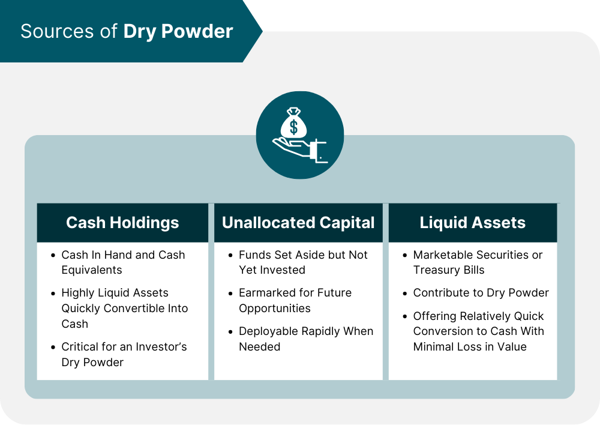

## Table of Contents

## What is dry powder in finance?

In finance, dry powder refers to the cash reserves or liquid assets that a company, investor, or private equity firm holds. This money is set aside and ready to be used for investments, acquisitions, or other business opportunities. Think of it like having cash in your pocket that you can use whenever a good deal comes along.

Dry powder is important because it allows businesses and investors to act quickly when opportunities arise. For example, during economic downturns, companies with dry powder can buy assets at lower prices or invest in new ventures when others can't. Having this reserve can give a company a big advantage in the market, helping them grow and succeed even in tough times.

## Why is dry powder important for investors?

Dry powder is really important for investors because it gives them the chance to jump on good deals fast. Imagine you're at a store and there's a big sale, but you need money to buy the things you want. If you have dry powder, that's like having cash in your pocket ready to spend. Investors can use this money to buy stocks, bonds, or other investments when prices are low, which can lead to big profits later.

Having dry powder also helps investors stay safe during tough times. When the market goes down, many people might need to sell their investments at a loss just to get some cash. But if you have dry powder, you don't have to do that. Instead, you can wait for the market to get better and then make your moves. This way, you can keep your investments and maybe even buy more when prices are low, setting yourself up for success when things improve.

## How can dry powder be used in investment strategies?

Dry powder can be a big help in investment strategies by letting investors buy things when prices are low. Imagine you're waiting for a sale at your favorite store. When the prices drop, you can use your dry powder to buy more stuff than you could if you had to pay full price. In the same way, investors can use their dry powder to buy stocks, bonds, or other investments when the market is down. This can lead to bigger profits when the market goes back up.

Another way dry powder helps is by giving investors the chance to take advantage of new opportunities quickly. Sometimes, a great investment chance comes up out of nowhere, like a new company starting or a big company selling off part of its business. If you have dry powder, you can jump on these opportunities right away without having to sell other investments first. This can make a big difference in how much money you can make over time.

## What are the sources of dry powder for different types of investors?

For individual investors, dry powder usually comes from saving money from their paychecks or selling other investments. They might put this money into a savings account or a money market fund where it's easy to get to when they want to invest. Sometimes, they might also use money they get from bonuses or other extra income to build up their dry powder.

For big investors like private equity firms or hedge funds, dry powder often comes from the money that investors give them to manage. These investors, called limited partners, might be rich people or big organizations like pension funds. The firms also make money from their investments and can use that to add to their dry powder. Sometimes, they might also borrow money to increase their dry powder, but this can be riskier.

For companies, dry powder can come from their profits that they don't spend on other things like running the business or paying dividends. They might keep this money in cash or short-term investments that they can use quickly. Sometimes, companies might also raise dry powder by selling new shares or bonds to investors.

## How does dry powder affect market dynamics?

Dry powder can have a big impact on how the market works. When a lot of investors have dry powder, they're ready to buy things when prices go down. This can help keep the market from falling too far because there are people waiting to buy at lower prices. It's like having a safety net for the market. When everyone starts buying, it can push prices back up. This can make the market feel more stable and can help it recover faster after a dip.

On the other hand, if a lot of investors don't have dry powder, the market can be more shaky. When prices start to fall, people might need to sell their investments just to get some cash. This can make prices fall even more because there are more people selling than buying. It's like a snowball rolling downhill, getting bigger and faster. So, having dry powder can make a big difference in how the market moves and feels.

## What are the risks associated with holding too much dry powder?

Holding too much dry powder can mean missing out on good investment chances. If you keep all your money on the sidelines waiting for the perfect moment, you might miss out on buying stocks or other investments that could go up in value. It's like waiting for a big sale that never happens while prices are already going up. Over time, this can lead to lower returns because you're not putting your money to work when it could be making more.

Another risk is that the value of your dry powder might go down because of inflation. If you keep your money in a savings account or something similar, the interest you earn might not keep up with the rising prices of things. This means your money will be worth less over time. It's like having a jar of cookies that slowly get smaller while you wait to eat them. So, while having some dry powder is good, holding too much for too long can actually hurt your overall financial plan.

## How can dry powder be measured and tracked?

Dry powder can be measured by looking at how much cash or liquid assets someone has. For an individual, this might mean checking their savings account or money market funds. For a company or big investor, it could mean looking at their cash reserves and short-term investments. They might keep track of this by regularly checking their bank statements or financial reports to see how much money they have ready to use.

Tracking dry powder involves keeping an eye on these cash reserves over time. This can be done by setting up a simple spreadsheet or using financial software to record how much dry powder they have at different times. It's important to update this information regularly so they can make smart decisions about when to use their dry powder for new investments. By doing this, they can make sure they always have enough money ready for good opportunities without holding onto too much for too long.

## What role does dry powder play in private equity and venture capital?

In private equity and venture capital, dry powder is the money that firms have ready to invest. These firms get this money from investors who want them to find good companies to invest in. Having dry powder means they can quickly buy a company or invest in a new business when they see a good chance. It's like having cash in your pocket when you go shopping, so you can buy something great as soon as you see it.

Dry powder is really important because it lets private equity and venture capital firms act fast. If they see a company that's doing well and might do even better with some help, they can use their dry powder to invest in it right away. This can help them make more money for their investors. But, if they have too much dry powder and don't use it, they might miss out on good investments, so they need to find the right balance.

## How do economic cycles influence the management of dry powder?

Economic cycles play a big role in how investors manage their dry powder. During good times, when the economy is growing and businesses are doing well, investors might not keep as much dry powder. They feel confident and might use their money to invest in new opportunities because they think the market will keep going up. But they still need some dry powder to be ready for any small dips in the market, so they can buy more when prices go down a little.

When the economy starts to slow down or goes into a recession, having dry powder becomes even more important. Investors know that prices might drop, so they want to have cash ready to buy things at lower prices. This can help them make big profits when the market starts to recover. But they also have to be careful not to hold onto too much dry powder for too long, because they might miss out on good investments while waiting for the perfect moment.

## Can dry powder be considered a performance indicator for fund managers?

Dry powder can be a good way to see how well fund managers are doing their job. If a fund manager has a lot of dry powder, it might mean they are being careful and waiting for the right time to invest. This can be good because it shows they are ready to jump on new opportunities when the market goes down. But, if they have too much dry powder for a long time, it might mean they are not finding enough good investments, which could make their investors unhappy.

On the other hand, if a fund manager doesn't have much dry powder, it could mean they are using their money to invest a lot. This can be good if their investments are doing well, but it can also be risky if the market goes down and they don't have cash to buy more at lower prices. So, the amount of dry powder a fund manager has can tell you something about how they are managing their funds, but it's just one part of the story.

## What are some historical examples of dry powder usage in major financial events?

During the 2008 financial crisis, a lot of investors used their dry powder to buy things when prices were really low. Many big companies and investment funds had cash saved up, and they used it to buy stocks, bonds, and other investments that had lost value. This helped them make a lot of money when the market started to recover. For example, Warren Buffett used his dry powder to invest in companies like Goldman Sachs and General Electric, which turned out to be very profitable as the economy got better.

Another example is during the dot-com bubble burst in the early 2000s. When a lot of internet companies failed and stock prices crashed, investors with dry powder were able to buy up good companies at low prices. Some private equity firms used their cash reserves to buy struggling tech companies, fix them up, and then sell them for a profit later on. This showed how having dry powder can help investors take advantage of big market drops and make money in the long run.

## How do regulatory environments impact the accumulation and deployment of dry powder?

Regulatory environments can make a big difference in how much dry powder investors can save up and use. Rules set by governments can limit how much money investors are allowed to keep in cash or liquid assets. For example, some regulations might require investors to put their money into certain types of investments instead of keeping it as dry powder. Also, rules about how much risk investors can take might make them keep more dry powder as a safety net, just in case things go wrong.

When it comes to using dry powder, regulations can also affect what kinds of investments investors can make. Some rules might make it harder to buy certain companies or invest in certain industries. This can slow down how quickly investors can use their dry powder. On the other hand, if the rules are relaxed, investors might be able to move their money faster and take advantage of new opportunities. So, the regulatory environment plays a big role in both saving up dry powder and deciding when and where to spend it.

## How can dry powder be integrated with algorithmic trading?

Dry powder, or liquid financial reserves, is increasingly being integrated into [algorithmic trading](/wiki/algorithmic-trading) strategies to effectively capitalize on market opportunities. These reserves provide the necessary flexibility and financial backing to exploit sudden market inefficiencies or downturns, allowing trading algorithms to function optimally without [liquidity](/wiki/liquidity-risk-premium) risks.

**Determining Optimal Cash Reserves for Algo Strategies**

Determining the optimal amount of dry powder involves a strategic assessment of market conditions, risk tolerance, and investment objectives. Quantitative models, which include Monte Carlo simulations and Value-at-Risk (VaR) calculations, are frequently used to estimate these reserves. These models aid in forecasting potential drawdowns and liquidity needs under different market scenarios. For instance, the VaR model helps in estimating the potential loss in value of the cash reserves under normal market conditions for a set period, which can guide in maintaining appropriate liquidity.

$$
\text{VaR} = V_0 \cdot (\mu - z \cdot \sigma)
$$

Where:
- $V_0$ is the initial investment amount,
- $\mu$ is the expected return,
- $z$ is the z-score corresponding to the desired confidence level,
- $\sigma$ is the standard deviation of returns.

**Algorithms Detecting Market Opportunities**

Trading algorithms can be programmed to detect and respond to specific market triggers that warrant the deployment of dry powder. For instance, mean reversion algorithms may activate large trades during uncharacteristic price deviations, while [momentum](/wiki/momentum)-based algorithms might reserve cash for executing trades as trends begin to form. Machine learning approaches further enhance these strategies by integrating real-time data feeds and predictive analytics, allowing for swift identification and capitalization of market opportunities.

Example Python code for a simple trading algorithm incorporating dry powder strategy:

```python
def determine_trade_opportunity(market_data, dry_powder):
    # Simulate algorithm to detect market opportunities
    mean_price = sum(market_data) / len(market_data)
    if market_data[-1] < mean_price * 0.95 and dry_powder > 0:
        execute_trade(dry_powder)

def execute_trade(amount):
    # Example of trade execution logic
    print(f"Executing trade with dry powder: {amount}")
    # Reduce dry powder by trade amount for simplicity
    dry_powder -= amount

market_data = [100, 102, 101, 97, 95]
dry_powder = 10000
determine_trade_opportunity(market_data, dry_powder)
```

**Challenges in Synchronizing Cash Reserves with Trading Algorithms**

A critical challenge is ensuring that the cash reserves are efficiently synchronized with trading algorithms to avoid either underutilization or depletion. This requires dynamic adjustment mechanisms within the algorithms to align with changing market conditions and liquidity constraints. Additionally, there's the complexity of integrating cash reserve management into algorithmic trading systems, which must be robust enough to handle high-frequency trades and market [volatility](/wiki/volatility-trading-strategies) without compromising reserve levels.

**Importance of Risk Management**

Effective risk management is crucial when combining dry powder with algorithmic trading. It involves setting clear stop-loss and take-profit levels, diversifying investment portfolios, and continuously monitoring market conditions and algorithm performance. Additionally, ensuring that algorithms are designed with fail-safes and are regularly back-tested against historical data helps mitigate potential risks associated with algorithmic errors or unforeseen market reactions.

In summary, leveraging dry powder within the scope of algorithmic trading requires a comprehensive strategy encompassing optimal reserve determination, advanced algorithms for market detection, synchronization of liquidity with trading activities, and robust risk management practices. This integrated approach aims to maximize financial returns while safeguarding the investment against inherent market risks.

## References & Further Reading

[1]: Bergstra, J., Bardenet, R., Bengio, Y., & Kégl, B. (2011). ["Algorithms for Hyper-Parameter Optimization."](https://papers.nips.cc/paper/4443-algorithms-for-hyper-parameter-optimization) Advances in Neural Information Processing Systems 24.

[2]: ["Advances in Financial Machine Learning"](https://www.amazon.com/Advances-Financial-Machine-Learning-Marcos/dp/1119482089) by Marcos Lopez de Prado

[3]: ["Evidence-Based Technical Analysis: Applying the Scientific Method and Statistical Inference to Trading Signals"](https://www.amazon.com/Evidence-Based-Technical-Analysis-Scientific-Statistical/dp/0470008741) by David Aronson

[4]: ["Machine Learning for Algorithmic Trading"](https://github.com/PacktPublishing/Machine-Learning-for-Algorithmic-Trading-Second-Edition) by Stefan Jansen

[5]: ["Quantitative Trading: How to Build Your Own Algorithmic Trading Business"](https://books.google.com/books/about/Quantitative_Trading.html?id=j70yEAAAQBAJ) by Ernest P. Chan