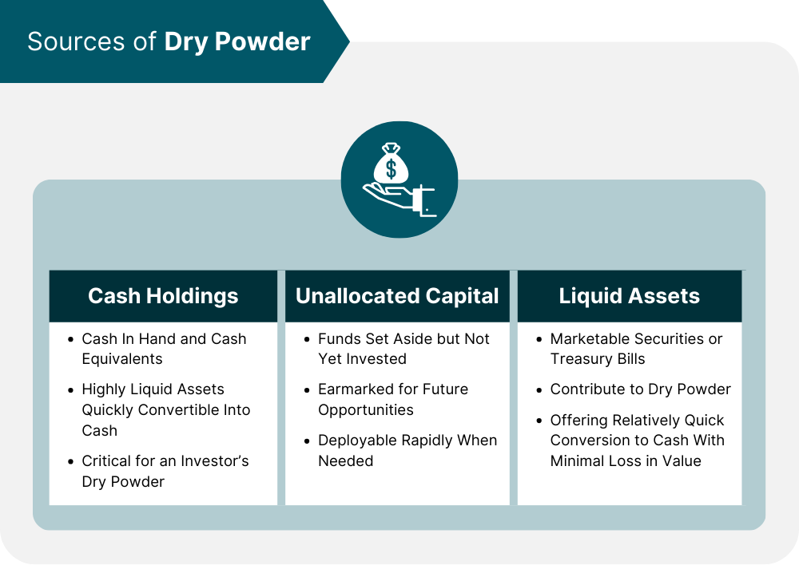

In today's dynamic financial environment, sophisticated strategies and tools play a pivotal role in successful investing. As markets continue to evolve rapidly, staying ahead requires an understanding of advanced concepts and the ability to implement them effectively. Two terms that frequently emerge in investment circles are 'dry powder' and 'algorithmic trading.' These concepts are crucial for investors aiming to make informed financial decisions, providing them with the flexibility and precision necessary to navigate complex market landscapes.

Dry powder, in financial parlance, refers to cash reserves or liquid assets maintained by investors or companies, allowing them to capitalize on unexpected investment opportunities or market dips. This strategic reserve position helps in seizing opportunities without the need to liquidate existing investments, thus preserving the overall portfolio structure. Meanwhile, algorithmic trading has revolutionized the trading landscape by utilizing computer algorithms to execute trades with minimal human intervention. These algorithms process vast datasets to make decisions based on predefined criteria, enhancing trading speed and accuracy.



This article explores the intersection of dry powder investment strategies and algorithmic trading, elucidating how these elements can be combined to optimize investment outcomes. We will discuss the significance of dry powder in finance and its benefits, such as liquidity and the ability to act swiftly in volatile markets. Additionally, we will explore how algorithmic trading can efficiently utilize these funds, providing investors with a competitive edge through enhanced market responsiveness.

The combination of maintaining dry powder reserves and employing algorithmic trading strategies allows investors to enhance their liquidity management and market opportunity capitalizations. This synergy enables them to react promptly to market changes and seize undervalued assets, ultimately leading to superior investment performance. Through various case studies and practical applications, we aim to offer insights and strategic recommendations that will assist investors in leveraging these powerful financial tactics effectively. Join us on this exploration as we uncover the potential of these strategies in the modern investment landscape.

## Table of Contents

## Understanding Investment Dry Powder

Originating from military parlance, 'dry powder' in finance symbolizes an investor’s financial readiness and liquidity. This term refers to cash reserves and liquid assets that investors keep readily available to seize unforeseen investment opportunities. These reserves provide the ability to capitalize on market downturns or undervalued assets without the necessity to liquidate other investments. By maintaining a supply of dry powder, investors can act swiftly in volatile markets, which has historically been advantageous, particularly during economic crises where such liquidity led to significant gains.

In practical terms, dry powder can take the form of cash or equivalents like Treasury bills and short-term bonds. These instruments are chosen for their liquidity and minimal price fluctuation risk, ensuring that funds are accessible when attractive investment opportunities arise. For instance, Treasury bills are short-term securities issued by the U.S. government with maturities ranging from a few days up to one year. They are considered a safe haven due to their government backing and are easily converted to cash without significant loss of value.

The strategic maintenance of dry powder is underscored by its utility during economic downturns. During periods of financial instability, asset prices often decline, presenting opportunities to acquire undervalued investments. An investor with adequate dry powder can purchase these assets at a low cost and potentially realize substantial future returns as market conditions improve. Historical precedents, such as the 2008 financial crisis, highlighted how investors with [liquidity](/wiki/liquidity-risk-premium) were able to acquire discounted assets, resulting in notable financial gains as markets recovered.

In conclusion, the concept of dry powder is a fundamental component of investment strategy, emphasizing liquidity preparedness. It empowers investors with the ability to respond quickly to market changes, thereby optimizing investment outcomes amid economic fluctuations.

## The Rise of Algorithmic Trading in Modern Finance

Algorithmic trading, an innovation in modern finance, has revolutionized the execution of trades by leveraging computer algorithms for heightened precision and speed. This advancement facilitates the efficient processing of market data, enabling trades to be executed based on predefined criteria, devoid of emotional influence. The reliance on algorithms eliminates human error and emotional decision-making, leading to more consistent and objective trading outcomes.

The ability of algorithms to process vast datasets and incorporate [machine learning](/wiki/machine-learning) techniques significantly enhances decision-making capabilities. Machine learning algorithms can identify complex patterns and correlations within the data, adapt to changing market conditions, and optimize trading strategies accordingly. For example, using regression models to predict future price movements or employing classification algorithms to determine trade signals are common practices within [algorithmic trading](/wiki/algorithmic-trading).

Over recent years, the reliance on algorithmic trading has surged, with algorithms executing a substantial portion of global trades across various asset classes, including equities, foreign exchange ([forex](/wiki/forex-system)), and commodities. According to the Bank for International Settlements, algorithmic trading accounted for more than 60% of equity trades in major markets by 2020. This widespread adoption underscores the efficiency and effectiveness of algorithmic systems in managing large volumes of transactions with minimal latency and reduced transaction costs compared to traditional manual trading methods.

The inherent advantages of algorithmic trading lie in automation and efficiency. Automated systems can execute trades at the most opportune moments, often within milliseconds, ensuring optimal pricing. Additionally, these systems can perpetually monitor markets, remain active 24/7 in some cases, and execute predetermined strategies even during off-hours, which is unfeasible in manual trading environments.

Overall, the strategic deployment of algorithmic trading tools represents a transformative force within finance, offering traders and investors a competitive edge through speed, accuracy, and cost-effectiveness. Through continuous refinement and adaptation, algorithmic trading is poised to remain at the forefront of trading innovation, reshaping market dynamics and driving financial efficiencies.

## Integrating Dry Powder and Algorithmic Trading

Combining dry powder reserves with algorithmic trading strategies represents a sophisticated approach to investment management that emphasizes the importance of balancing liquidity and automation. This blend allows investors to leverage the speed and precision of algorithmic trading while maintaining sufficient liquidity to seize market opportunities as they arise.

Optimal cash reserves are a cornerstone of this strategy. Determining the ideal amount of dry powder necessitates a statistical approach, accounting for market [volatility](/wiki/volatility-trading-strategies), investment goals, and the opportunity cost of holding cash. Techniques such as Monte Carlo simulations or Value at Risk (VaR) can be instrumental in optimizing reserve levels. For instance, if a portfolio manager aims to maintain liquidity that covers potential drawdowns with a 95% confidence level, they might use a VaR calculation to quantify the required cash reserves.

Algorithmic trading systems contribute significantly to this strategy by identifying favorable market conditions for deploying dry powder. These algorithms analyze real-time data and historical trends to make informed decisions quickly and without emotional bias. For example, a trading algorithm can be programmed to purchase undervalued stocks identified by metrics such as a price-to-earnings ratio below a certain threshold during market dips. Python, a popular language in data analysis, can be used to create such algorithms:

```python
import pandas as pd

# Assuming `market_data` is a DataFrame with market information
# Define a condition for undervaluation
undervalued_condition = (market_data['PE_Ratio'] < 10)

# Select stocks that meet the condition
undervalued_stocks = market_data[undervalued_condition]
```

Risk management is integral to the effective integration of dry powder and algorithmic trading. This involves implementing fail-safes and monitoring systems to adjust strategies in response to changing market conditions. Regular performance reviews help ensure that the algorithm's assumptions and parameters remain aligned with current market dynamics.

An adaptive, integrated approach maximizes financial returns by aligning liquidity reserves with automated trading efficiencies. This approach not only enhances responsiveness to market opportunities but also maintains stability in liquidity, ensuring that cash is always available for strategically advantageous moves. By synthesizing these elements, investors can advance their financial strategies to navigate complex market environments with both agility and assurance.

## Case Studies and Real-world Applications

Renowned investment firms have consistently demonstrated the efficacy of combining dry powder strategies with algorithmic trading to achieve superior financial results. Among the prominent examples in this domain, Renaissance Technologies stands out for its noteworthy integration of substantial liquidity with advanced trading algorithms. This approach enables the firm to maximize market opportunities and secure market-leading performance. By maintaining a robust pool of dry powder, Renaissance Technologies can optimize its algorithmic strategies, allowing rapid adaptation to shifting market conditions and capturing value from volatility.

Similarly, Bridgewater Associates serves as a model for utilizing dry powder in tandem with algorithmic systems, particularly in navigating volatile markets. The strategic combination of cash reserves with sophisticated algorithms allows Bridgewater to identify and seize distressed assets, enhancing portfolio resilience and gains during unpredictable market phases. Such approaches indicate the critical importance of maintaining liquidity while employing high-frequency trading techniques to capitalize on transient market opportunities.

These case studies illustrate several advantages and challenges involved in the synchronization of cash reserves with algorithmic trading. A key advantage of this integration is the enhanced agility in executing trades without the pressure of immediate liquidations, allowing for better adherence to strategic investment goals. Furthermore, the automation provided by algorithms facilitates precise execution, minimizing human error and emotional bias.

Conversely, these examples also reveal the challenges inherent in this integration, particularly the necessity for precision in execution. Ensuring that algorithms are responsive to real-time market conditions and are implemented with fail-safes to prevent errors is crucial. Adaptive strategies must be a core component of this integration, with continuous updates and monitoring to align with evolving financial landscapes and technological advancements.

The discussed cases underscore critical lessons for investors regarding the importance of aligning dry powder reserves with algorithmic trading. They highlight the necessity for precision, adaptability, and a balance between maintaining liquidity and deploying technology-driven solutions in investment strategies. Properly executed, this integration can provide substantial leverage in achieving exceptional financial outcomes.

## Strategic Recommendations for Investors

In the context of modern finance, maintaining a strategic percentage of a portfolio as dry powder offers investors the flexibility to respond swiftly to market dynamics. This allocation is essential for seizing unexpected opportunities without disrupting existing investments. Typically, a proportion ranging from 5% to 20% of the portfolio may be advisable, depending on the investor's risk tolerance and market outlook. The principle is to maintain sufficient liquidity to act decisively during market fluctuations, ensuring financial agility and resilience.

Portfolio diversification stands as a cornerstone strategy for risk mitigation. By spreading investments across various asset classes, sectors, or geographic regions, investors reduce the impact of adverse movements in any single component. Incorporating algorithmic tools in this diversification process can further enhance the identification of emergent opportunities and optimize asset allocation. Algorithms can efficiently analyze vast datasets to uncover patterns and anomalies, enhancing an investor’s ability to capitalize on potential gains while managing downside risk.

Utilizing advanced platforms for algorithmic trading offers a significant strategic advantage. Modern trading interfaces provide [backtesting](/wiki/backtesting) capabilities, real-time data analytics, and algorithm customization, empowering investors to adapt strategies promptly. The integration of machine learning models can refine predictive accuracy, fostering informed decision-making and sustained competitive advantages. For example, Python’s popular libraries such as NumPy and Scikit-learn can be effectively used to develop and evaluate trading strategies:

```python
import numpy as np
from sklearn.model_selection import train_test_split
from sklearn.ensemble import RandomForestRegressor

# Example: Predictive model for asset prices
data = np.load('historical_market_data.npy')
X, y = data[:, :-1], data[:, -1]
X_train, X_test, y_train, y_test = train_test_split(X, y, test_size=0.2)

model = RandomForestRegressor(n_estimators=100)
model.fit(X_train, y_train)
predictions = model.predict(X_test)
```

Continuous education and strategy evaluation are paramount for investors navigating the swift pace of technological and market shifts. As new tools and methodologies emerge, staying informed ensures that investors remain aligned with best practices and are prepared to integrate innovative solutions effectively. Regularly reassessing strategies and incorporating feedback from diverse sources can bolster the robustness of investment decisions.

Finally, integrating risk-adjusted performance metrics is crucial for balanced growth and security. Measures such as the Sharpe Ratio or the Sortino Ratio allow investors to evaluate returns in relation to risk, refining portfolio adjustments to achieve optimal results. This approach fosters an equilibrium between maximizing returns and managing potential losses, aligning investments with broader financial objectives. 

Incorporating these strategic recommendations provides a comprehensive framework for leveraging dry powder and algorithmic trading to achieve informed and resilient investment outcomes.

## Conclusion

The synergy between maintaining dry powder and algorithmic trading is a remarkable strategy in modern finance, fostering an environment where investors can optimize decision-making and execution. By integrating these elements, investors can enhance the precision of liquidity deployment and effectively capitalize on market opportunities. This strategic combination allows for swift responses to emerging trends and market shifts, reducing the lag between market analysis and trade execution.

Investors proficient in these dual strategies are well-positioned to leverage technological advancements, benefiting from data-driven insights and automated decision-making processes. The evolving landscape of finance necessitates a reliance on such intelligent systems, especially as the [volume](/wiki/volume-trading-strategy) and complexity of data available to traders continue to grow. As markets become increasingly volatile, the ability to access and deploy dry powder with speed and accuracy offers a clear advantage.

The future of investing will increasingly rely on this intersection, where liquidity preparation meets algorithmic innovation. Emerging technologies and platforms will further streamline these processes, opening a broader range of opportunities for both individual and institutional investors. By mastering dry powder reserve management alongside agile algorithmic systems, investors can achieve superior outcomes, balancing growth potential with risk management.

As the financial industry progresses, those adept in utilizing these strategies will lead in market efficiency and profitability. Continuous adaptation and education in harnessing these advancements are crucial to maintaining a competitive edge in the dynamic financial landscape. Through thoughtful integration of liquidity reserves and advanced algorithms, investors can not only navigate but thrive in the complexities of modern financial markets.

## References & Further Reading

[Understanding Investments and Liquid Capital Strategies](https://www.investopedia.com/investing-4427685) provides foundational knowledge on how liquid capital can be strategically used to enhance investment flexibility and capture opportunities in fluctuating markets. These resources are invaluable for comprehending the underpinnings of liquidity management and its impact on financial strategies.

- [Algorithmic Trading Insights and Advances](https://www.amazon.com/Advances-Financial-Machine-Learning-Marcos/dp/1119482089) offers an in-depth exploration of how machine learning and advanced algorithms revolutionize trading. This book highlights techniques for deploying algorithms in live trading scenarios, thus offering a comprehensive guide for those looking to integrate technology into their investment strategies.

- [Dry Powder Utilization in Diverse Economic Scenarios](https://www.morpher.com/blog) discusses the significance of dry powder in investment portfolios. The article examines how maintaining liquidity enables investors to react promptly to economic changes, providing practical examples of effective dry powder management.

- [Technological Impacts on Modern Trading Strategies](https://blog.paperswithbacktest.com) explores how technological advancements are reshaping traditional trading approaches. This blog offers insights into the use of backtesting and predictive models that are crucial for developing sound, high-performing trading strategies.