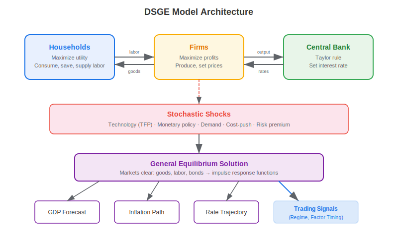
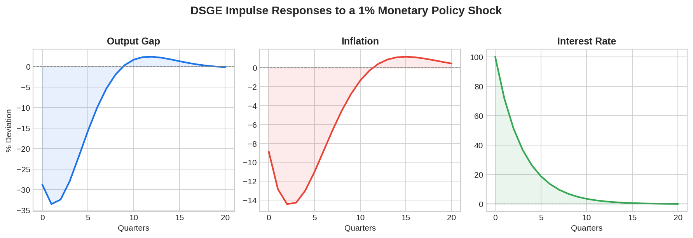

A **DSGE model** (Dynamic Stochastic General Equilibrium) is the workhorse macroeconomic framework used by central banks, policy institutions, and macro quant funds to simulate how economies respond to shocks. The model derives aggregate outcomes — GDP growth, inflation, interest rates — from the optimizing behavior of individual agents (households, firms, central banks) interacting in markets subject to random disturbances. For algorithmic traders, DSGE models provide a principled way to forecast macro regimes, anticipate policy shifts, and construct factor-timing signals.

## What Is a DSGE Model?

A DSGE model has three defining characteristics reflected in its name:

- **Dynamic**: agents make decisions over time, trading off present and future consumption
- **Stochastic**: the economy is hit by random shocks (technology, monetary policy, demand)
- **General Equilibrium**: all markets (goods, labor, bonds) clear simultaneously

The simplest New Keynesian DSGE consists of three core equations:

**IS curve** (aggregate demand):

$$x_t = E_t[x_{t+1}] - \sigma(i_t - E_t[\pi_{t+1}] - r^n_t)$$

**Phillips curve** (inflation dynamics):

$$\pi_t = \beta E_t[\pi_{t+1}] + \kappa x_t$$

**Taylor rule** (monetary policy):

$$i_t = \phi_\pi \pi_t + \phi_x x_t + \epsilon_t^m$$

where $x_t$ is the output gap, $\pi_t$ is inflation, $i_t$ is the nominal interest rate, $r^n_t$ is the natural rate, and $\epsilon_t^m$ is a monetary policy shock.



## How Central Banks Use DSGE Models

Every major central bank maintains at least one DSGE model. The Fed's primary model is **FRB/US**, while the ECB uses the **New Area-Wide Model (NAWM)**. These models serve several purposes:

**Policy simulation**: What happens if we raise rates by 50 bps? The model traces the impulse response — how output, inflation, and employment evolve quarter by quarter.

**Forecasting**: DSGE models produce conditional forecasts of macro variables under different scenarios, which feed into the staff projections that guide rate decisions.

**Communication**: The models provide a consistent language for discussing transmission mechanisms — how monetary policy affects the real economy through expectations, investment, and exchange rates.



## Why Algo Traders Care About DSGE Models

Macro-oriented quant funds like Bridgewater, AQR, and Man Group use DSGE-derived insights in several ways:

**Regime identification**: DSGE models characterize the economy's state. When the model implies the economy is in an "overheating" regime (positive output gap, rising inflation), traders tilt toward inflation hedges and short duration. When the model signals recession risk, they favor quality and defensive positioning.

**Rate path forecasting**: DSGE models with calibrated Taylor rules predict the central bank's rate trajectory better than naive extrapolation. Traders use these forecasts to position in interest rate futures and bond markets.

**Factor timing**: Research shows that macro state variables extracted from DSGE models help explain time-varying returns to value, momentum, and carry strategies. The paper "A Global Macroeconomic Risk Model for Value, Momentum, and Other Asset Classes" demonstrates that global macro risk factors account for a significant portion of factor return variation.

**Shock decomposition**: After a surprise data release, traders use DSGE models to decompose the move: Is it a demand shock (positive for equities) or a supply shock (negative for equities and bonds)? This informs the cross-asset response.

## Python Implementation: Three-Equation New Keynesian Model

The following code solves a simplified New Keynesian DSGE and computes impulse responses to a monetary policy shock:

```python
import numpy as np

def solve_nk_dsge(sigma=1.0, kappa=0.3, beta=0.99,
                  phi_pi=1.5, phi_x=0.5, T=20):
    """
    Solve a 3-equation New Keynesian DSGE via backward iteration.
    Returns impulse response functions to a 1% monetary policy shock.
    """
    # Initialize IRFs
    x = np.zeros(T)   # output gap
    pi = np.zeros(T)  # inflation
    i = np.zeros(T)   # interest rate

    # Terminal conditions (variables return to steady state)
    # Solve backwards from T-1 to 0
    # At t=0, monetary shock = 1%
    shock = np.zeros(T)
    shock[0] = 0.01

    # Simple forward iteration with rational expectations approximation
    for t in range(T - 1):
        # Monetary policy with shock
        i[t] = phi_pi * pi[t] + phi_x * x[t] + shock[t]

        # Expected future values (naive: assume decay toward zero)
        E_x_next = x[t] * 0.7
        E_pi_next = pi[t] * 0.7

        # IS curve
        x[t + 1] = E_x_next - sigma * (i[t] - E_pi_next)

        # Phillips curve
        pi[t + 1] = beta * E_pi_next + kappa * x[t + 1]

    return x, pi, i

# Compute impulse responses
output_gap, inflation, rate = solve_nk_dsge()

print("Impulse Response to 1% Monetary Policy Shock:")
print(f"{'Quarter':>8} {'Output Gap':>12} {'Inflation':>12} {'Rate':>12}")
for t in range(10):
    print(f"{t:>8} {output_gap[t]*100:>12.3f}% {inflation[t]*100:>12.3f}% {rate[t]*100:>12.3f}%")
```

## DSGE vs Other Macro Models

| Feature | DSGE | VAR | IS-LM |
|---------|------|-----|-------|
| Micro-founded | Yes — agents optimize | No — reduced form | Partial |
| Forward-looking | Yes — rational expectations | No — backward-looking | No |
| Policy analysis | Strong — Lucas critique resistant | Weak | Weak |
| Data requirements | Moderate (calibration + estimation) | High (long time series) | Low |
| Flexibility | Medium — constrained by theory | High — atheoretical | Low |
| Complexity | High | Medium | Low |

For traders already familiar with the [IS-LM model](https://paperswithbacktest.com/wiki/is-lm-model-curves-characteristics-limitations), DSGE is the modern, micro-founded extension that adds dynamics, expectations, and stochastic shocks.

## Limitations and Risks

DSGE models rest on strong assumptions: representative agents, rational expectations, and log-linear approximations around steady state. Critics point out that these models failed to predict the 2008 financial crisis because they lacked a meaningful financial sector. Post-crisis models (like the Smets-Wouters model extended with financial frictions) have improved, but they still struggle with tail events, structural breaks, and agent heterogeneity.

For traders, the practical implication is clear: use DSGE outputs as one input among many, not as a sole forecasting oracle. Combine structural model insights with statistical models, market-implied expectations, and robust [backtesting](https://paperswithbacktest.com/wiki/backtesting-with-python) to build resilient strategies.

## Conclusion

DSGE models translate economic theory into quantitative forecasts by simulating how optimizing agents respond to shocks within a general equilibrium framework. For algo traders, they provide a structured way to decompose macro regimes, forecast rate paths, and time factor exposures. Understanding the three-equation New Keynesian core — IS curve, Phillips curve, Taylor rule — gives traders the vocabulary to interpret central bank communication and position ahead of policy shifts. The [All Weather Portfolio](https://paperswithbacktest.com/wiki/all-weather-portfolio) is one practical application of the macro regime thinking that DSGE models formalize.

---

**Explore further on PapersWithBacktest:**
- Browse [backtested macro and regime-based strategies](https://paperswithbacktest.com/strategies) with Python code and performance metrics
- Access [clean historical market data](https://paperswithbacktest.com/datasets) for equities, crypto, and futures
- Take the [algo trading course](https://paperswithbacktest.com/course) — 60+ video lessons and notebooks
- Related wiki pages: [IS-LM Model](https://paperswithbacktest.com/wiki/is-lm-model-curves-characteristics-limitations) · [All Weather Portfolio](https://paperswithbacktest.com/wiki/all-weather-portfolio) · [Backtesting with Python](https://paperswithbacktest.com/wiki/backtesting-with-python)
