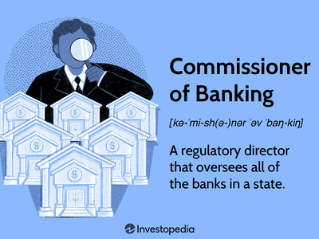

The dual banking system in the United States represents a distinctive regulatory framework where both national and state banks operate concurrently. This structure allows financial institutions the choice of being chartered and regulated at different levels of government, significantly enhancing the competitive landscape and diversity within the banking sector. Banks can select between federal and state charters based on strategic priorities, compliance ease, or desired regulatory oversight.

The intricacies of the dual banking system are pivotal for effectively navigating the complex U.S. financial landscape. This framework has historical roots dating back to the 19th century and continues to influence modern banking practices, ultimately impacting both consumers and institutions. By fostering a varied and resilient banking environment, the dual system remains a vital component of financial services in the U.S.

Furthermore, the dual banking system's evolution mirrors broader economic and technological changes. Its adaptability ensures that it remains relevant amidst shifts in market demands and regulatory policies. The system also intersects with emerging financial technologies, such as algorithmic trading, which leverage advanced computational strategies to optimize trading performance. 

In this article, the focus is on exploring the financial history of the dual banking system, its current state, and its interplay with algorithmic trading, providing a comprehensive understanding of its role in shaping U.S. financial markets.

## Table of Contents

## History of the Dual Banking System

The dual banking system in the United States traces its origins to the Civil War era, primarily with the enactment of the National Bank Act of 1863. This legislation marked a significant shift in the American banking landscape by introducing a framework for establishing national banks. The intent was to create a stable, national currency and to finance the Union's war efforts. Salmon P. Chase, who was then serving as the Treasury Secretary under President Abraham Lincoln, played a pivotal role in crafting this system. By establishing national banks, the Union government aimed to centralize financial operations and ensure macroeconomic stability.

Subsequent amendments, including the tax imposed on state banknotes through the National Bank Act of 1864, further transformed the banking environment. This tax rendered state banknotes less competitive, exerting pressure on state-chartered banks. While this policy led to a decline in state banknotes' circulation, it inadvertently spurred innovation as these banks sought alternative financial instruments. The development of demand deposits is one such example, enabling state banks to continue servicing local communities effectively despite increased regulation and competition from national banks.

The dual banking system was significantly strengthened with the establishment of the Federal Reserve System in 1913. The Federal Reserve emerged as the central bank of the United States, tasked with broad monetary policy management and oversight. This development allowed for a more coherent national financial strategy and integration of the dual banking framework. Within this new structure, both national and state banks found roles that complemented their operational strengths—national banks could leverage larger economies of scale, while state banks maintained agility and responsiveness to local market needs.

As market conditions evolved, state banks managed to regain and even expand their prominence, thanks in part to their capacity for innovation and adaptation. They commonly led innovations relevant to local markets, such as introducing various financial products and services that catered to regional needs and preferences. Demand deposits, which first gained traction as an alternative to state banknotes, are a testament to the state banks' ability to navigate and exploit the regulatory environment presented by the dual system.

Overall, the dual banking system of the United States has proven to be a dynamic and flexible framework, accommodating an array of financial institutions while promoting financial diversity and innovation. Its historical evolution underscores its resilience and adaptability through numerous economic challenges and regulatory landscapes.

## The Dual Banking System Today

In today's banking environment, the dual banking system in the United States is characterized by a complex regulatory framework where state and national banks coexist under distinct oversight authorities. There are 50 state banking regulatory bodies, along with the District of Columbia, each responsible for the oversight of state-chartered banks. These state regulatory agencies ensure that banks adhere to local banking laws, offering services that meet the specific needs of their communities while also fostering competitive markets. 

National banks, on the other hand, are regulated by federal entities, primarily the Federal Reserve and the Office of the Comptroller of the Currency (OCC). The Federal Reserve plays a crucial role in the formulation of national monetary policy, maintaining financial stability, and supervising and regulating banking institutions. Meanwhile, the OCC charters, regulates, and supervises national banks and federal savings associations to ensure they operate safely and soundly, provide fair access to financial services, and comply with applicable laws and regulations.

A significant component of this regulatory environment is the Consumer Financial Protection Bureau (CFPB), which was established to oversee the application of consumer protection regulations across financial institutions. The CFPB's primary focus is to ensure that banks and other financial entities abide by consumer laws, therefore safeguarding consumers from unfair, deceptive, or abusive practices in the financial sector.

The dual oversight system, characterized by federal and state regulatory bodies, creates a dynamic and multifaceted regulatory landscape. This structure plays a pivotal role in risk mitigation, ensuring that neither state nor national banks take excessive risks that could jeopardize financial stability. Moreover, this regulatory diversity encourages innovation within banking products and services, as institutions aim to leverage competitive advantages under both state and federal charters.

Importantly, the dual banking model not only applies within the United States but also provides lessons for international banking systems. Different countries have adapted similar dual models in varied contexts. For example, some nations incorporate Islamic banking principles alongside conventional banking, illustrating the flexibility and adaptability of the dual banking framework in addressing diverse financial and cultural needs.

Overall, the dual banking system sustains a balance of regulatory oversight, innovation, and competition, contributing to a robust and diverse banking industry in the United States, while providing a model for potential application in other banking systems worldwide.

## Pros and Cons of the Dual Banking System

The dual banking system in the United States is characterized by its inherent flexibility, allowing banks to select between state and federal charters. This choice fosters a competitive environment where institutions can innovate and tailor their services to specific community needs. State-chartered banks, in particular, benefit from this system as they often exhibit enhanced responsiveness to local demands. Their capacity to innovate is facilitated by a regulatory environment that accommodates unique local economic conditions and community needs.

On the other hand, national banks, regulated under a unified federal system, benefit from economies of scale. They can streamline operations across state lines due to consistent regulatory standards, potentially reducing operational costs and offering a cohesive market presence. This uniformity in governance aids in expanding their services and customer base across the country, providing a competitive advantage over banks with state charters.

However, the dual banking system also presents challenges, primarily due to its complex regulatory landscape. The coexistence of separate state and federal regulatory bodies can lead to overlapping regulations, complicating compliance efforts for banks. This complexity can result in increased administrative and operational costs, which may eventually be transferred to consumers in the form of higher fees or reduced services.

Despite these challenges, proponents of the system argue that its complexity is a strength, rather than a weakness. The dual banking system's ability to evolve and adapt to new regulatory and market demands showcases its resilience. By balancing state and federal oversight, the system encourages innovation and flexibility, ensuring the banking sector remains robust and capable of addressing both traditional and emerging financial challenges.

Overall, the dual banking system plays a critical role in shaping a diverse banking environment in the United States, enabling both competition and collaboration between state and national banks. This system's intricate structure is essential for fostering an adaptive and innovative financial sector that can effectively meet the dynamic needs of its diverse clientele.

## Algorithmic Trading in the Banking System

Algorithmic trading, commonly known as algo trading, is the process of using advanced algorithms to automate trading strategies in financial markets. This approach allows financial institutions to execute trades at speeds and frequencies that are impossible for human traders. In the context of the dual banking system in the United States, algo trading is notably influenced by the diverse regulatory and operational environments of national and state banks.

The dual banking system in the U.S. creates a dynamic regulatory framework impacting [algorithmic trading](/wiki/algorithmic-trading) by offering banks the option to operate under either a state or federal charter. This setup influences how institutions develop and implement algorithmic strategies, as regulatory requirements and market conditions can vary significantly depending on the charter. For instance, state banks often have the flexibility to experiment with innovative technologies due to potentially less stringent state regulations. This experimental advantage can lead to unique algo trading solutions tailored to niche markets or regional needs.

On the other hand, national banks, operating under federal oversight entities such as the Federal Reserve or the Office of the Comptroller of the Currency, may prioritize scaling successful algorithmic innovations. These banks benefit from a unified national market presence, allowing them to deploy algorithmic trading strategies at a larger scale across an expansive customer base. As a result, national banks might focus on adopting technologies that ensure uniformity and efficiency in their operations, harnessing economies of scale to optimize trading algorithms.

The dual banking system, therefore, fosters an environment of technological innovation, crucial for the evolution and sophistication of algo trading strategies. Both state and national banks contribute to the development of these strategies, albeit in different capacities. State banks, with a focus on innovation and local adaptability, may implement pioneering technologies earlier, whereas national banks leverage their expansive infrastructure to refine and scale these innovations.

Algorithmic trading, in this context, represents a critical intersection of traditional banking systems with modern financial technologies. It underscores the ongoing evolution of the banking sector, where regulatory frameworks and technological advancements converge to shape market behaviors and dynamics. The dual banking system, with its distinct regulatory and market conditions, offers a unique landscape for the continuous advancement and adoption of algorithmic trading strategies.

## Conclusion

The dual banking system stands as a fundamental aspect of U.S. financial architecture, integrating state and federal regulatory frameworks to create a versatile and resilient banking environment. This system's flexibility allows for a varied range of banking services, catering to both local and national needs. The adaptability and diversity inherent in the dual banking system enable financial institutions to navigate economic fluctuations and regulatory changes effectively, ensuring sustained growth and innovation within the banking sector.

Moreover, algorithmic trading highlights the intersection of the dual banking system with advanced financial technologies. By leveraging mathematical models and computer algorithms, banks can optimize trading operations and enhance market strategies. This not only underscores the importance of technological progress within the dual banking framework but also demonstrates the system's role in driving financial innovation.

While the dual banking system presents certain complexities, such as complying with both state and federal regulations, it ultimately benefits from its robustness. The system's capacity to support diverse banking operations and its resilience in the face of economic challenges underscore its significance. It remains crucial for stakeholders—ranging from consumers to policymakers and financial institutions—to comprehend and engage with this system, ensuring informed decision-making and effective participation in the financial markets. Understanding the dual banking system equips stakeholders with the insights necessary to contribute to a sustainable and dynamic financial future.

## References & Further Reading

[1]: White, M. J. (2015). ["The Dual Banking System in the United States."](https://www.jstor.org/stable/pdf/1228174.pdf) Federal Reserve Bank of Cleveland.

[2]: ["The National Bank Act of 1863"](https://en.wikipedia.org/wiki/National_Bank_Act) - Federal Reserve History.

[3]: Barth, J. R., Brumbaugh, R. D., & Wilcox, J. A. (2000). ["The Repeal of Glass-Steagall and the Advent of Broad Banking."](https://faculty.haas.berkeley.edu/wilcox/Papers/Wilcox/jep.14.2.191.pdf) Journal of Economic Perspectives, 14(2), 191-204.

[4]: Lopez de Prado, M. (2018). ["Advances in Financial Machine Learning."](https://www.amazon.com/Advances-Financial-Machine-Learning-Marcos/dp/1119482089) Wiley.

[5]: Al-Ubaydli, O., & MacLeod, W. B. (2020). ["The Dual Banking System and Financial Stability in the United States: Lessons from the National Banking Era."](https://www.cambridge.org/core/journals/journal-of-economic-history/article/the-dual-banking-system-and-financial-stability-in-the-united-states-lessons-from-the-national-banking-era/7349EA3A7CBF309A4DC59F92A9BB46B8) Journal of Economic History, 80(4), 1152-1180.

[6]: Jansen, S. (2019). ["Machine Learning for Algorithmic Trading."](https://github.com/stefan-jansen/machine-learning-for-trading) Packt Publishing.