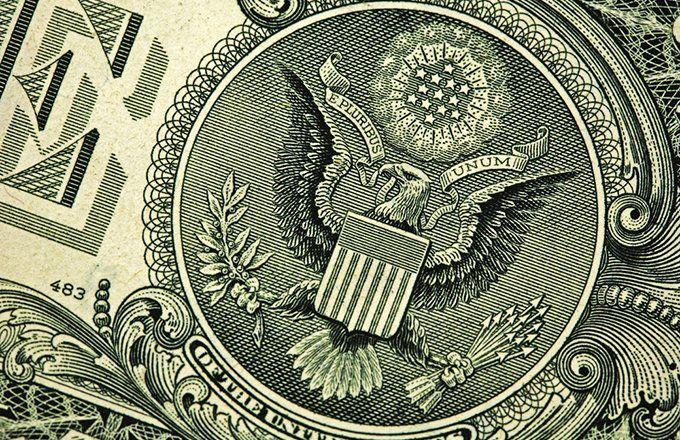

## Table of Contents

## What is a dual banking system?

A dual banking system is a structure in the United States where banks are regulated by both the federal government and individual state governments. This means that banks can choose to be chartered either by the federal government or by a state government. The federal government oversees national banks, while state governments handle the regulation of state banks. This system was established to balance the power between the federal and state levels and to provide more options for banks and their customers.

The dual banking system allows for flexibility and competition among banks. Banks chartered at the state level might have different rules and requirements compared to those chartered at the federal level. This can lead to a variety of banking services and products available to customers. However, it can also create challenges because banks need to follow different sets of regulations depending on their charter. Overall, the dual banking system aims to promote a healthy and diverse banking environment in the U.S.

## How does the dual banking system work in the United States?

In the United States, the dual banking system means that banks can be set up and watched over by either the federal government or a state government. If a bank gets its charter from the federal government, it's called a national bank. The Office of the Comptroller of the Currency (OCC) is the federal agency that keeps an eye on these banks. If a bank gets its charter from a state, it's called a state bank. Each state has its own rules and its own agency to watch over these banks.

This system lets banks choose which rules they want to follow. National banks follow federal rules, while state banks follow their state's rules. This can make things a bit tricky because the rules can be different in each state. But it also means that banks can offer different services and products. Customers can choose the bank that best fits their needs. The dual banking system helps keep a balance between the power of the federal government and the states, and it encourages competition among banks.

## What is the historical background of the dual banking system?

The dual banking system in the United States started a long time ago, back in the 1800s. It began because people couldn't agree on whether the federal government or the states should control banks. In 1863, during the Civil War, the federal government made a law called the National Bank Act. This law let banks get a charter from the federal government, making them national banks. But states already had their own banks, so they didn't want to lose control. That's how the dual banking system started, with banks being able to choose between a federal or state charter.

Over the years, the dual banking system has had its ups and downs. Sometimes, people thought the system caused problems because the rules for banks were different in each state. But other times, it was seen as a good thing because it let banks offer different services and gave customers more choices. Today, the dual banking system is still used in the U.S. It helps keep a balance between the power of the federal government and the states, and it encourages competition among banks.

## What are the key differences between state and national banks in a dual banking system?

In the dual banking system, the main difference between state and national banks is who watches over them. National banks get their charter from the federal government. This means they are overseen by the Office of the Comptroller of the Currency (OCC), a federal agency. State banks, on the other hand, get their charter from a state government. Each state has its own agency to watch over its banks. Because of this, state banks follow the rules set by their state, while national banks follow federal rules.

Another key difference is the kind of services and products they can offer. Since national banks follow the same federal rules everywhere, they might offer similar services across different states. State banks, however, can offer services that fit the needs of their local area because they follow their state's rules. This can mean more variety for customers. But it can also make things a bit confusing because the rules and services can be different from one state to another.

## How does the dual banking system affect financial regulation and oversight?

The dual banking system affects financial regulation and oversight by splitting the job between the federal government and the states. This means that national banks are watched over by the federal government, while state banks are watched over by their state's government. This can make things a bit tricky because the rules can be different in each state. For example, a bank in one state might have different rules to follow than a bank in another state. This can lead to different levels of oversight and regulation depending on where a bank is located.

On the other hand, the dual banking system also helps to keep a balance of power. It stops one level of government from having too much control over banks. This can be good because it encourages competition among banks. Banks can choose whether to follow federal rules or state rules, which can lead to more choices for customers. But it can also make it harder for regulators to keep an eye on everything because they have to deal with different sets of rules. Overall, the dual banking system tries to make sure that banks are well-regulated while also giving them the freedom to offer different services.

## What are the primary advantages of a dual banking system for consumers?

The dual banking system gives consumers more choices. Because banks can be set up by either the federal government or a state government, they can offer different services and products. This means that customers can pick the bank that best fits their needs. For example, a state bank might offer special services that fit the needs of people in that state, while a national bank might offer services that are the same everywhere. This variety can help consumers find better deals and services that work for them.

Another advantage is that the dual banking system can lead to more competition among banks. When banks have to follow different rules, they try harder to attract customers. This can mean better interest rates, lower fees, and new kinds of services. Competition is good for consumers because it pushes banks to do better and offer more. So, the dual banking system can help make banking better for everyone by giving more choices and encouraging banks to compete.

## What are the main disadvantages of a dual banking system for the economy?

The dual banking system can make things harder for the economy because it splits the job of watching over banks between the federal government and the states. This means that banks have to follow different rules depending on where they are. It can be tricky for the people who watch over banks to keep everything in line because they have to deal with different sets of rules. This can lead to some banks being watched more closely than others, which might not be fair. It can also make it harder to stop problems from spreading if something goes wrong at a bank because the rules are not the same everywhere.

Another problem with the dual banking system is that it can make the economy less stable. When banks can choose whether to follow federal rules or state rules, it can lead to a lot of variety in how banks work. This variety can be good for customers because they have more choices, but it can also make the economy more risky. If one state has very loose rules, banks in that state might take more risks. If those risks lead to problems, it can hurt not just that state but the whole country. So, the dual banking system can make it harder to keep the economy stable because it's harder to control what banks are doing.

## How does the dual banking system impact competition among banks?

The dual banking system helps make banks compete more. Because banks can choose to follow federal rules or state rules, they can offer different services and products. This means that banks have to work harder to get customers to choose them. They might offer better interest rates, lower fees, or special services that other banks don't have. This competition is good for customers because it gives them more choices and can lead to better deals.

But the dual banking system can also make competition harder to manage. Since banks follow different rules depending on where they are, it can be tricky for everyone to play fair. Some banks might have an easier time because their state has looser rules. This can lead to some banks taking more risks than others. If those risks cause problems, it can hurt the whole economy. So while the dual banking system can make banks compete more, it can also make it harder to keep everything balanced and fair.

## Can you explain the role of the Office of the Comptroller of the Currency (OCC) in the dual banking system?

The Office of the Comptroller of the Currency (OCC) is a very important part of the dual banking system in the United States. The OCC is a federal agency that watches over national banks. National banks are the ones that get their charter from the federal government. The OCC makes sure these banks follow the rules set by the federal government. This helps keep national banks safe and sound, so they can serve their customers well.

The OCC's role is different from the role of state agencies that watch over state banks. State banks get their charter from their state government, and they follow the rules set by that state. Because of this, the OCC only deals with national banks and not state banks. This split in oversight is what makes the dual banking system work. It lets the federal government and the states share the job of making sure banks are doing things right, which helps keep the whole banking system strong and fair.

## What are some notable examples of conflicts or issues arising from the dual banking system?

One big example of a problem caused by the dual banking system happened during the Savings and Loan Crisis in the 1980s. Some state-chartered savings and loan associations, or S&Ls, took big risks because their state rules were not as strict as the federal rules. When these risky moves failed, it led to a lot of S&Ls going bankrupt. This mess cost taxpayers a lot of money to fix and showed how different rules in different places can cause big problems for the whole country.

Another issue with the dual banking system is seen in the way banks are watched over. Because state and national banks follow different rules, it can be hard to make sure all banks are playing fair. For example, if one state has very loose rules, banks in that state might take bigger risks than banks in other states. If those risks go bad, it can hurt not just that state but the whole economy. This shows how the dual banking system can make it tricky to keep things balanced and safe.

## How have recent legislative changes affected the dual banking system?

Recent legislative changes have had a big impact on the dual banking system. One big change was the Dodd-Frank Wall Street Reform and Consumer Protection Act, passed in 2010. This law came after the big financial crisis in 2008. It made new rules for banks to follow, no matter if they were state or national banks. The Dodd-Frank Act tried to make the banking system safer by making rules stricter for everyone. This meant that some of the differences between state and national banks got smaller because they had to follow more of the same rules.

Another change that affected the dual banking system was the Economic Growth, Regulatory Relief, and Consumer Protection Act of 2018. This law changed some parts of the Dodd-Frank Act to make things a bit easier for smaller banks. It let some smaller banks follow less strict rules. This meant that the differences between state and national banks could grow again because smaller banks could choose rules that fit them better. These changes show how the government keeps trying to balance the need for safety in banking with the need for banks to be able to offer different services to their customers.

## What are the potential future developments or reforms proposed for the dual banking system?

In the future, people might want to change the dual banking system to make it simpler and safer. One idea is to make the rules more the same for all banks, no matter if they are state or national banks. This could help stop problems from happening because everyone would have to follow the same rules. It could also make it easier for the people who watch over banks to do their job because they wouldn't have to deal with different sets of rules in different places.

Another idea is to keep the dual banking system but make it work better. This could mean giving more power to the federal government to watch over all banks, not just national banks. That way, the federal government could step in if a state bank was taking too many risks. It could also mean helping state governments work together more so they can make rules that are good for everyone. These changes could help the dual banking system keep giving customers choices while also making sure the whole economy stays safe and strong.

## References & Further Reading

[1]: White, M. J. (2015). ["The Dual Banking System in the United States."](https://www.jstor.org/stable/pdf/1228174.pdf) Federal Reserve Bank of Cleveland.

[2]: ["The National Bank Act of 1863"](https://en.wikipedia.org/wiki/National_Bank_Act) - Federal Reserve History.

[3]: Barth, J. R., Brumbaugh, R. D., & Wilcox, J. A. (2000). ["The Repeal of Glass-Steagall and the Advent of Broad Banking."](https://faculty.haas.berkeley.edu/wilcox/Papers/Wilcox/jep.14.2.191.pdf) Journal of Economic Perspectives, 14(2), 191-204.

[4]: Lopez de Prado, M. (2018). ["Advances in Financial Machine Learning."](https://www.amazon.com/Advances-Financial-Machine-Learning-Marcos/dp/1119482089) Wiley.

[5]: Al-Ubaydli, O., & MacLeod, W. B. (2020). ["The Dual Banking System and Financial Stability in the United States: Lessons from the National Banking Era."](https://www.cambridge.org/core/journals/journal-of-economic-history/article/the-dual-banking-system-and-financial-stability-in-the-united-states-lessons-from-the-national-banking-era/7349EA3A7CBF309A4DC59F92A9BB46B8) Journal of Economic History, 80(4), 1152-1180.

[6]: Jansen, S. (2019). ["Machine Learning for Algorithmic Trading."](https://github.com/stefan-jansen/machine-learning-for-trading) Packt Publishing.