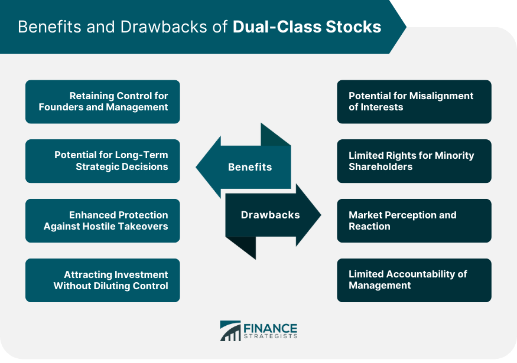

## Table of Contents

## What are dual-class shares?

Dual-class shares are a type of stock structure where a company has two types of shares with different voting rights. Usually, one type of share, often called Class A, gives shareholders one vote per share. The other type, often called Class B, gives shareholders more votes per share, like 10 votes per share. This means that people who own Class B shares have more power to make decisions about the company, even if they own fewer shares overall.

Companies use dual-class shares for different reasons. Sometimes, founders or key leaders want to keep control of the company even after it goes public. By holding onto the shares with more voting power, they can make sure they have a strong say in the company's future, without worrying about being outvoted by new investors. However, this can be controversial because it means that not all shareholders have an equal voice in the company's decisions.

## How do dual-class shares differ from single-class shares?

Dual-class shares and single-class shares are different because of how they handle voting rights. With single-class shares, every share gives the owner the same number of votes, usually one vote per share. This means that if you own more shares, you have more votes and more say in the company's decisions. It's a simple and fair system where everyone's vote counts the same.

On the other hand, dual-class shares split the shares into two types with different voting rights. One type, like Class A shares, might give one vote per share, while the other type, like Class B shares, might give more votes per share, such as 10 votes per share. This setup lets some people, often the founders or key leaders, keep more control over the company even if they don't own the most shares. This can be good for keeping the original vision of the company but can also lead to concerns about fairness since not all shareholders have an equal say.

## What are the common reasons companies choose to issue dual-class shares?

Companies often choose to issue dual-class shares because it helps the founders or key leaders keep control of the company. When a company goes public, it can be hard for the original leaders to stay in charge because new investors might want to make big changes. By using dual-class shares, the founders can hold onto shares that give them more votes. This way, they can keep making the big decisions and stick to their original plan for the company, even if other people own more shares.

Another reason companies might choose dual-class shares is to focus on long-term goals instead of short-term profits. Sometimes, investors want quick money and might push for changes that help them now but hurt the company later. With dual-class shares, the people in charge can ignore this pressure and work on plans that might take a long time to pay off. This can be good for the company's future, but it can also make some investors unhappy because they feel left out of the decision-making process.

## Can you provide examples of companies that use dual-class shares?

Some big companies that use dual-class shares are Google (now called Alphabet) and Facebook (now called Meta). Google's founders, Larry Page and Sergey Brin, wanted to keep control of the company even after it went public. They did this by holding Class B shares, which give them 10 votes per share. This way, they can make the big decisions and keep working on their long-term plans without worrying about other shareholders voting against them. 

Another example is Meta, where Mark Zuckerberg uses dual-class shares to stay in charge. He owns Class B shares that give him more votes, so he can keep making the decisions he thinks are best for the company, even if other people might want something different. This helps him focus on long-term goals instead of just trying to make quick profits.

## What are the potential benefits of dual-class shares for founders and management?

Dual-class shares help founders and management keep control of the company. When a company goes public, lots of new people buy shares and might want to change things. But with dual-class shares, founders can hold onto shares that give them more votes. This means they can still make the big decisions and keep their original plan for the company, even if they don't own the most shares.

Another benefit is that dual-class shares let founders and management focus on long-term goals instead of short-term profits. Sometimes, new investors want quick money and might push for changes that help them now but hurt the company later. With dual-class shares, the people in charge can ignore this pressure and work on plans that might take a long time to pay off. This can be good for the company's future and help them stick to what they believe in.

## How might dual-class shares impact shareholder voting rights?

Dual-class shares can change how much say shareholders have in a company. With dual-class shares, there are two types of shares. One type, like Class A shares, gives one vote per share. The other type, like Class B shares, gives more votes per share, like 10 votes per share. This means that people who own Class B shares have more power in making decisions about the company, even if they own fewer shares overall.

This setup can make some shareholders feel left out. People who own Class A shares might feel like their votes don't matter as much because the people with Class B shares have more control. This can lead to concerns about fairness, as not all shareholders have an equal voice in the company's decisions. Even though it helps founders keep control and focus on long-term goals, it can also make some investors unhappy because they feel they don't have a real say in what happens.

## What are the arguments in favor of dual-class shares from a corporate governance perspective?

From a corporate governance perspective, dual-class shares are good because they let founders and key leaders keep control of the company. When a company goes public, lots of new people buy shares and might want to change things. But with dual-class shares, founders can hold onto shares that give them more votes. This way, they can make the big decisions and stick to their original plan for the company, even if they don't own the most shares. This can be important for keeping the company's vision and making sure it stays on track with what the founders wanted.

Another argument in favor of dual-class shares is that they help the company focus on long-term goals instead of short-term profits. Sometimes, new investors want quick money and might push for changes that help them now but hurt the company later. With dual-class shares, the people in charge can ignore this pressure and work on plans that might take a long time to pay off. This can be good for the company's future and help them stick to what they believe in, even if it means not making as much money right away.

## What are the criticisms and potential drawbacks of dual-class shares?

Dual-class shares can make some shareholders feel left out. People who own the shares with fewer votes might feel like their say doesn't matter as much. This can lead to concerns about fairness because not all shareholders have an equal voice in the company's decisions. Even though dual-class shares help founders keep control and focus on long-term goals, they can also make some investors unhappy because they feel they don't have a real say in what happens.

Another potential drawback is that dual-class shares might lead to bad decisions. When the founders or key leaders have too much control, they might make choices that are good for them but not for the company or other shareholders. This can be risky because it means the company might not listen to good ideas from other people who own shares. If the leaders make mistakes, it can be hard for other shareholders to do anything about it because their votes don't count as much.

## How do dual-class shares affect the valuation and performance of a company?

Dual-class shares can affect how much a company is worth and how well it does. When investors see that founders or key leaders have more control because of dual-class shares, they might feel less sure about the company. They might worry that the people in charge won't listen to their ideas or might make choices that are good for themselves but not for everyone. This can make the company seem riskier, which might lower its value because investors might not want to pay as much for the shares.

On the other hand, dual-class shares can help a company focus on big goals that take a long time to achieve. When founders keep control, they can work on plans that might not make money right away but could be really good for the company in the future. If these long-term plans work out, the company might do better than others that are just trying to make quick profits. This can make the company's value go up over time because investors see that it's doing well and has a strong future.

## What are the regulatory considerations and restrictions on dual-class shares in different countries?

Different countries have different rules about dual-class shares. In the United States, dual-class shares are allowed, and many big companies use them. But some stock exchanges, like the Nasdaq and the New York Stock Exchange, have rules about how long a company can keep dual-class shares. For example, they might say that after a certain number of years, the shares with more votes have to turn into regular shares with one vote each. This is to make sure that over time, all shareholders get an equal say.

In other places, like the United Kingdom, dual-class shares are not as common and can be harder to use. The UK's stock market rules are stricter and don't usually allow companies to have different voting rights for different shares. Some European countries, like Germany and France, also have tight rules and might not let companies use dual-class shares at all. These rules are there to make sure that all shareholders have a fair chance to vote on what happens with the company.

## How have institutional investors and proxy advisory firms responded to dual-class share structures?

Institutional investors and proxy advisory firms often don't like dual-class share structures. They worry that these setups give too much power to founders or key leaders and not enough to other shareholders. These groups want to make sure that everyone who owns shares has a fair say in the company's decisions. They might vote against companies that use dual-class shares or advise their clients not to invest in them. This is because they think it's important for all shareholders to have an equal voice, and dual-class shares can make that hard.

Some big proxy advisory firms, like Institutional Shareholder Services (ISS) and Glass, Lewis & Co., have clear rules about dual-class shares. They might tell their clients to vote against directors or proposals that keep dual-class structures in place. They believe that these structures can lead to bad decisions and might hurt the company in the long run. Because of this, companies thinking about using dual-class shares have to think carefully about how these big investors and advisors might react.

## What future trends and potential reforms might impact the use of dual-class shares?

In the future, more countries might start to change their rules about dual-class shares. Some places might decide to make it harder for companies to use them because they want all shareholders to have an equal say. This could mean new laws that limit how long dual-class shares can last or even stop companies from using them at all. If this happens, companies might have to think of other ways to keep control when they go public.

On the other hand, some people think dual-class shares can help companies do well in the long run. If more companies that use dual-class shares do better than others, more countries might allow them or make the rules less strict. This could mean that more companies choose to use dual-class shares to focus on big goals that take a long time to reach. It's hard to say which way things will go, but it will depend on what people think is best for companies and shareholders.

## References & Further Reading

[1]: Bebchuk, L. A., & Kastiel, K. (2017). ["The Untenable Case for Perpetual Dual-Class Stock."](https://corpgov.law.harvard.edu/2017/04/24/the-untenable-case-for-perpetual-dual-class-stock/) Virginia Law Review, 103.

[2]: Goshen, Z., & Hamdani, A. (2016). ["Corporate Control and Idiosyncratic Vision."](https://www.researchgate.net/publication/292156319_Corporate_Control_and_Idiosyncratic_Vision) Yale Law Journal, 125.

[3]: Gompers, P., Ishii, J., & Metrick, A. (2010). ["Extreme Governance: An Analysis of Dual-Class Firms in the United States."](https://www.jstor.org/stable/40604777) Review of Financial Studies, 23(3).

[4]: Hu, B., & Black, B. (2006). ["The Dual-Class Share Structure: The Effects of the Adoption and Termination of the Dual-Class Structure."](https://onlinelibrary.wiley.com/doi/10.1002/ente.201402110) The Journal of Financial and Quantitative Analysis, 41(3).

[5]: "Markets in Financial Instruments Directive II (MiFID II)." European Commission. [Link](https://finance.ec.europa.eu/regulation-and-supervision/financial-services-legislation/implementing-and-delegated-acts/markets-financial-instruments-directive-ii_en)