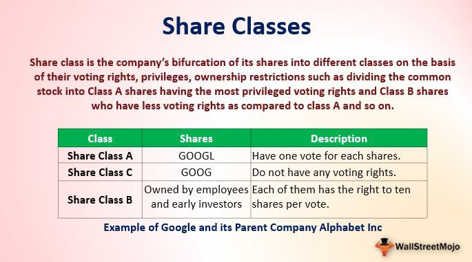

The landscape of corporate governance is undergoing constant transformation, characterized by emerging trends and new challenges. In this article, we investigate essential aspects of investor rights, corporate governance, dual-class shares, and algorithmic trading. These components significantly impact market dynamics and corporate performance, influencing how companies operate and engage with their stakeholders.

Investor rights play a crucial role in maintaining equilibrium within corporate governance structures. Voting rights and dividend entitlements provide investors with mechanisms to influence company decisions, thus ensuring their voices are considered. The rise of institutional investors has heightened the demand for greater transparency and accountability from corporations.

Corporate governance, on the other hand, is the backbone of sustained investor confidence and organizational integrity. Effective corporate boards uphold a balance of power among shareholders, preventing conflicts of interest. Current trends in governance exhibit a blend of traditional responsibilities alongside innovative oversight practices.

Dual-class shares present a unique dimension to corporate control, as they allow founders to retain significant decision-making power while tapping into public investment. However, their capacity to bestow enhanced voting rights on select shareholders raises concerns over investor equality and company governance. Critics argue that this system can dilute shareholder influence and concentrate power in the hands of a few.

Algorithmic trading has revolutionized the execution of trades, enhancing speed and efficiency in market transactions. Nonetheless, the implications for market stability have prompted increased scrutiny from regulatory bodies. Striking an appropriate balance between technological advancement and market integrity remains a crucial consideration for regulators and market participants.

Understanding the interplay among these facets is pivotal for formulating effective strategies that align with regulatory requirements and stakeholder expectations. As corporate governance continues to evolve, stakeholders must remain vigilant, ensuring that governance frameworks are both equitable and sustainable in an ever-changing landscape.

## Table of Contents

## Understanding Investor Rights

Investor rights are essential components of corporate governance frameworks, ensuring that investors can influence essential company decisions and protect their financial interests. Key rights include the ability to vote in shareholder meetings and the right to receive dividends, both of which are fundamental for giving investors a role in guiding company policies and aligning corporate objectives with shareholder interests. Voting rights enable shareholders to influence critical issues such as the election of board members, approval of mergers and acquisitions, and significant changes to corporate strategy. Dividends, on the other hand, provide a direct financial return on shareholders' investments, often reflecting the company's profitability and financial health.

The increasing prominence of institutional investors, such as pension funds, mutual funds, and insurance companies, has significantly impacted the landscape of investor rights. As these entities manage large pools of capital, they hold considerable sway in corporate governance. Their focus on long-term returns and sustainable business practices has put pressure on firms to improve transparency and accountability measures. Institutional investors often advocate for enhanced corporate reporting, risk management, and adherence to environmental, social, and governance ([ESG](/wiki/esg-investing)) criteria. This has led to a growing trend towards more rigorous disclosure requirements and better stakeholder engagement practices.

Furthermore, the rise of shareholder activism, where investors actively influence corporate behavior, has reinforced the need for comprehensive investor rights frameworks. Activists may pursue changes in corporate governance structures, strategic realignments, or financial restructuring to unlock shareholder value. This movement underscores the importance of balancing corporate decision-making power with shareholder interests.

Overall, maintaining robust investor rights is crucial for fostering a balance between enabling corporate leaders to make strategic decisions and ensuring that these decisions are in the best interest of the shareholders. As the business environment continues to evolve, corporations must adapt their governance practices to uphold the rights of all shareholders, both individual and institutional, thereby supporting sustainable economic growth and innovation.

## Examining Corporate Governance

Corporate governance serves as the foundation for ensuring investor confidence and the integrity of firms. It encompasses the mechanisms, processes, and relationships by which corporations are controlled and directed. Strong corporate governance practices are essential for maintaining investor trust, which in turn supports a stable and efficient market environment.

Boards of directors are at the core of corporate governance frameworks. They are responsible for overseeing company management and ensuring that the interests of shareholders are represented fairly. To balance control among shareholders and prevent conflicts of interest, boards must implement robust governance structures. These structures typically include effective checks and balances, such as audit committees, independent board members, and transparent reporting.

Recent trends indicate a blending of traditional governance roles with modern oversight techniques. One such trend is the increasing emphasis on environmental, social, and governance (ESG) criteria. As investors become more sensitive to corporate social responsibility, boards are integrating ESG considerations into their strategic decision-making processes. This shift not only addresses shareholder demands but also positions companies as responsible corporate citizens, thereby enhancing long-term value.

Another trend in corporate governance is the rising influence of technology. Digital governance tools and data analytics provide boards with unprecedented insights into company operations, risk management, and performance metrics. These technologies facilitate more informed decision-making and allow for more dynamic response strategies to market changes.

Despite these advancements, challenges remain. Ensuring that governance practices evolve to meet emerging risks and stakeholder expectations is critical. Boards must navigate complex regulatory environments and adapt to global standards, balancing innovation with compliance.

Strong corporate governance, therefore, involves not just adhering to established norms, but also embracing innovation to optimize governance processes and outcomes. By doing so, companies can sustain investor trust and ensure firm integrity in a rapidly changing world.

## The Dual-Class Share Structure

Dual-class share structures are a mechanism that allows company founders and specific initial shareholders to retain significant control over the business by issuing shares with different voting rights. Typically, these structures involve two types of shares: one class with multiple votes per share (Class A) and another with single or no votes per share (Class B). This arrangement enables the original owners or decision-makers to maintain authoritative control of the company, despite holding a minority of the total equity, while still leveraging the benefits of being a publicly traded entity.

The primary appeal of dual-class shares lies in their ability to preserve strategic vision and long-term focus by insulating management from the pressures of short-term market fluctuations and activist shareholders. By granting enhanced voting rights to founders or original stakeholders, companies can pursue ambitious projects and innovations without the constant threat of takeover or direct opposition from minority shareholders with different priorities.

However, dual-class share structures have substantial implications for corporate governance and investor equality. Enhanced voting rights can result in disproportionate influence, leading to imbalances in corporate control. This concentration of power can sometimes sideline minority shareholders, whose ability to influence significant company decisions is diluted. This dynamic poses questions about accountability and responsiveness, further magnified if those in control make decisions primarily benefiting their interests rather than the broader shareholder base.

Critics of dual-class shares highlight these issues, arguing that they can undermine shareholder democracy by skewing decision-making toward the interests of a select few. There is a growing concern that, without adequate checks and balances, dual-class structures may lead to potential conflicts of interest and governance pitfalls. These concerns have fueled debates over whether dual-class share companies should be allowed to list on certain stock exchanges or if regulatory measures should be imposed to ensure balanced governance and protect minority shareholder interests.

Efforts to address these concerns may include sunset clauses, where enhanced voting rights expire after a set period or upon specific events, mitigating long-term control imbalances. By exploring such regulatory innovations, corporate governance frameworks can attempt to balance the entrepreneurial advantages of dual-class shares with the essential principles of equality and accountability in investor rights.

## Impacts of Dual-Class Shares on Company Performance

Dual-class share structures have been a point of contention in corporate governance discussions, particularly regarding their impact on company performance. Research indicates that firms with dual-class shares often experience inferior financial performance relative to their single-class counterparts. This discrepancy can be attributed to several factors intrinsic to the dual-class share model.

The primary concern with dual-class shares is the misalignment of control and economic ownership. In this structure, a select group of shareholders, typically founders, hold shares that grant superior voting rights, allowing them to exert significant influence over corporate decisions despite potentially owning a small fraction of the overall equity. This concentration of power can lead to governance issues where the interests of minority shareholders are not adequately represented or protected.

One key performance issue linked to dual-class firms is diminished accountability. When decision-makers are insulated from the pressures typically exerted by shareholders in a single-class share structure, there is a risk that they may pursue strategies that do not prioritize shareholder value. This might result in strategic choices that favor personal interests or long-term control, even at the expense of financial performance.  

Moreover, dual-class share structures can negatively impact market perceptions. Investors may view these companies as having governance that favors the interests of a few over the many, leading to potential undervaluation. The perception of increased risk, due to potential governance abuses, can deter investment and result in lower stock prices compared to companies without such structures.

The reduced transparency and potential for entrenchment in dual-class companies can also create valuation challenges. Analysts and investors often find it difficult to assess the true value of these firms, given the complexity of their governance structures and the limited influence of public shareholders.

These concerns underscore the necessity of examining governance reforms and regulatory frameworks to mitigate potential downsides of dual-class share systems. Potential reforms could include sunset clauses, which automatically convert dual-class shares into single-class shares after a certain period or upon the occurrence of specific events, thereby ensuring that the governance structure evolves in alignment with market expectations.

In conclusion, while dual-class shares can incentivize innovation and long-term planning by allowing founders to retain control, their propensity to depress financial performance and complicate investor relations necessitates an ongoing assessment of governance practices. Adjusting regulatory frameworks to address these challenges may foster a more balanced approach, ensuring that such structures do not compromise the broader health and fairness of financial markets.

## Algo Trading and Its Influence on Markets

Algorithmic trading, commonly referred to as algo trading, has revolutionized financial markets by enabling trades to be executed at unprecedented speed and efficiency. This form of trading leverages computer algorithms to automate trading strategies, allowing for high-frequency trading ([HFT](/wiki/high-frequency-trading-strategies)) and the execution of complex financial transactions within microseconds. The primary advantage of algo trading lies in its ability to process vast amounts of data in real time, leading to more precise market predictions and reduced transaction costs.

One of the key benefits of algo trading is its capacity to enhance market [liquidity](/wiki/liquidity-risk-premium). By automating the buying and selling process, algorithms can react to market changes instantly, providing continuous liquidity and tighter spreads. This increased liquidity helps in stabilizing markets and reducing [volatility](/wiki/volatility-trading-strategies), which is particularly beneficial during periods of market stress.

However, the widespread adoption of algo trading has raised significant concerns regarding market stability. The 'Flash Crash' of May 6, 2010, which saw the Dow Jones Industrial Average plummet nearly 1,000 points in minutes before recovering, highlighted the potential risks associated with [algorithmic trading](/wiki/algorithmic-trading). Such incidents have prompted regulatory bodies to scrutinize the implications of algo trading on market stability. Regulators are concerned that the rapid execution of automated trades can exacerbate market swings and lead to systemic risks.

The challenge for regulators and market participants is to balance the use of technology with the imperative for market integrity. Ensuring that algorithms operate within predefined risk parameters and are subject to rigorous testing is crucial to preventing unintended market disruptions. Key strategies include implementing circuit breakers that halt trading during extreme volatility and imposing restrictions on the design and deployment of high-frequency trading algorithms.

Regulatory efforts are increasingly focused on transparency and accountability within algo trading practices. Initiatives such as the European Union's Markets in Financial Instruments Directive II (MiFID II) mandate comprehensive reporting and testing requirements for algorithmic trading systems. These regulations aim to mitigate risks by ensuring trading algorithms are resilient, transparent, and accountable for their actions.

In conclusion, while algo trading offers significant advantages in terms of efficiency and liquidity, ensuring the stability and integrity of financial markets remains a critical challenge. Continuous innovation in regulatory measures and technological tools is essential to address the complexities presented by algorithmic trading, safeguarding market participants and the broader financial ecosystem.

## Synergies and Conflicts in Governance Trends

Dual-class shares and algorithmic (algo) trading present notable opportunities and challenges in corporate governance. These governance trends intersect in complex ways, impacting shareholder rights and market dynamics. Understanding these interactions is crucial for developing effective and equitable governance frameworks.

**Dual-class Shares and Governance**

Dual-class share structures allow companies to create different classes of shares, typically granting superior voting rights to founders or insiders while offering lesser rights to ordinary shareholders. This system enables founder-driven decisions and continuity but often raises concerns about shareholder equality and voice. Critics argue that these structures can lead to power imbalances, potentially sidelining minority shareholders and prioritizing the interests of a few over broader stakeholder needs.

Despite these concerns, dual-class shares can facilitate long-term innovation and strategic decision-making. By insulating management from short-term market pressures, companies can pursue ambitious projects without immediate profitability constraints, at times leading to sustainable growth and innovation.

**Algo Trading and Market Integrity**

Algorithmic trading, characterized by high-speed trading executed through automated systems, has revolutionized financial markets. This technology enhances market liquidity and efficiency but also poses significant risks, such as heightened market volatility and potential systemic disruptions. The rapid trade execution can exacerbate price swings, leading to market instability during times of stress.

Regulatory bodies have increased scrutiny on algorithmic trading to ensure it does not compromise market integrity. They aim to implement frameworks that both harness the advantages of technological advancements and mitigate associated risks.

**Interactions between Dual-class Shares and Algo Trading**

The interplay between dual-class share structures and algo trading presents unique governance challenges. On one hand, algorithmic trading can improve market access for dual-class shares by providing liquidity and efficient price discovery. On the other hand, the combination of complex share structures and high-frequency trading can lead to information asymmetries, complicating investor decision-making and complicating effective market regulation.

For instance, algorithmic trading can disproportionately affect less-informed retail investors in companies with dual-class structures, who might face challenges accessing timely and accurate information. This raises questions about fairness and transparency in such trading environments.

**Sustainable Governance Frameworks**

Stakeholders, including regulators, companies, and investors, must collectively evaluate these trends to ensure governance frameworks remain equitable and sustainable. Balancing innovation with robust regulatory oversight is key. This involves assessing the long-term implications of dual-class shares on market fairness and ensuring algorithmic trading does not undermine shareholder rights and trust.

Strategies such as implementing sunset clauses in dual-class shares and increasing transparency in algorithmic trading practices can contribute to more balanced governance systems. By fostering collaboration between different market participants, governance structures can adapt to evolving challenges while safeguarding investor interests and maintaining market stability.

## Conclusion

The evolution of investor rights, corporate governance, dual-class shares, and algo trading reflects broader market dynamics characterized by rapid technological advancement and shifting investor priorities. These elements intersect in complex ways, each influencing the stability, fairness, and efficiency of financial markets. Understanding their interplay is essential for crafting strategies that align with regulatory standards while addressing stakeholder needs. 

Investor rights are fundamental for maintaining a balanced power dynamic between shareholders and corporate management, ensuring accountability and transparency. Enhanced transparency is increasingly demanded, reinforcing the need for robust governance structures. Corporate governance must adapt to integrate these changes, ensuring that decision-making processes are equitable and inclusive.

The dual-class share structure, while allowing founders and key stakeholders to maintain significant control, poses challenges to investor equality and corporate accountability. Its impact on company performance and market valuations suggests that reforms may be necessary to align these structures with broader market expectations. Maintaining an equitable approach requires balancing the benefits of control with the needs of diverse investor groups.

Algorithmic trading presents both opportunities and risks, enhancing market efficiency but also introducing volatility and systemic concerns. Regulatory bodies face the challenge of managing these risks, which requires a sophisticated understanding of technology's role in trading dynamics.

Future discussions in corporate governance will need to address these interlinked issues, exploring reforms that protect investor interests while fostering innovation. As markets continue to evolve, the ability to navigate these complexities will be crucial for stakeholders across the financial landscape, contributing to sustainable and equitable economic growth.

## References & Further Reading

[1]: Bebchuk, L. A., & Kastiel, K. (2017). ["The Untenable Case for Perpetual Dual-Class Stock."](https://corpgov.law.harvard.edu/2017/04/24/the-untenable-case-for-perpetual-dual-class-stock/) Virginia Law Review, 103.

[2]: Goshen, Z., & Hamdani, A. (2016). ["Corporate Control and Idiosyncratic Vision."](https://www.researchgate.net/publication/292156319_Corporate_Control_and_Idiosyncratic_Vision) Yale Law Journal, 125.

[3]: Gompers, P., Ishii, J., & Metrick, A. (2010). ["Extreme Governance: An Analysis of Dual-Class Firms in the United States."](https://www.jstor.org/stable/40604777) Review of Financial Studies, 23(3).

[4]: Hu, B., & Black, B. (2006). ["The Dual-Class Share Structure: The Effects of the Adoption and Termination of the Dual-Class Structure."](https://onlinelibrary.wiley.com/doi/10.1002/ente.201402110) The Journal of Financial and Quantitative Analysis, 41(3).

[5]: "Markets in Financial Instruments Directive II (MiFID II)." European Commission. [Link](https://finance.ec.europa.eu/regulation-and-supervision/financial-services-legislation/implementing-and-delegated-acts/markets-financial-instruments-directive-ii_en)