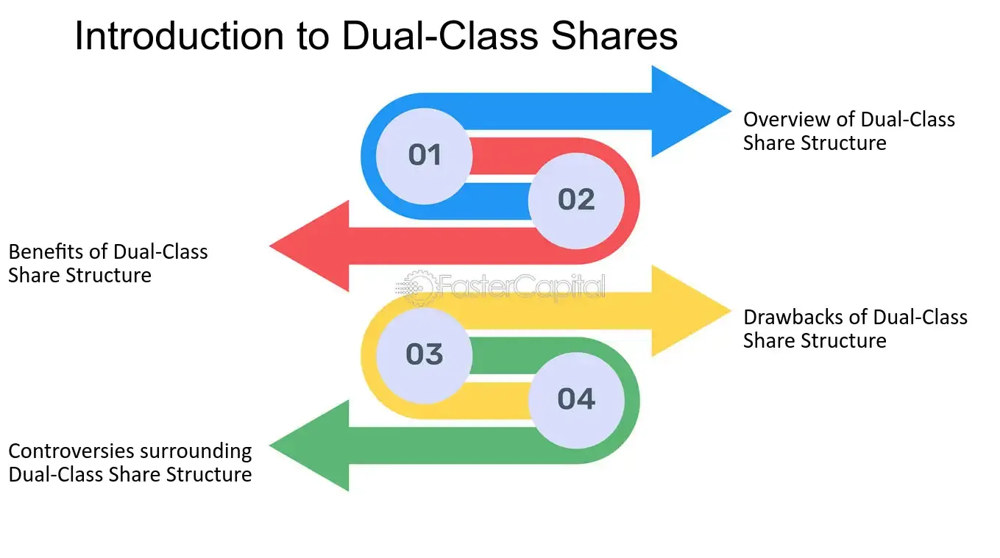

## Table of Contents

## What is a dual-class stock structure?

A dual-class stock structure is a way some companies set up their shares. In this setup, there are two types of stocks: one type gives the owner more voting power, and the other type gives less or no voting power. Usually, the people who started the company or the top leaders keep the stocks with more voting power. This lets them make big decisions for the company even if they don't own most of it.

This kind of structure can be good because it lets the founders or leaders focus on long-term goals without worrying about short-term pressures from other shareholders. But it can also be bad because it might let the leaders make choices that are not good for all shareholders. Some people think it's not fair because it gives too much power to a few people, while others believe it helps keep the company's original vision alive.

## How does dual-class stock differ from single-class stock?

Dual-class stock and single-class stock are two different ways companies can set up their shares. With single-class stock, every share of stock is the same. This means that each share gives the owner the same amount of voting power. So, if you own more shares, you have more say in the company's decisions. It's simple and fair because everyone's vote counts the same per share.

On the other hand, dual-class stock splits the shares into two types. One type of share gives the owner more voting power, while the other type gives less or no voting power. Usually, the founders or top leaders of the company keep the shares with more voting power. This lets them control the company's big decisions even if they don't own most of the shares. This can be good for keeping the company's original vision but can also lead to decisions that might not be best for all shareholders.

## What are the advantages of dual-class stock for company founders?

Dual-class stock helps company founders keep control over their company even when they sell shares to raise money or go public. With dual-class stock, founders can own shares that have more votes than regular shares. This means they can still make big decisions for the company, even if they don't own most of it. This is good because it lets founders stick to their long-term plans without worrying about what other shareholders might want in the short term.

Another advantage is that dual-class stock can protect the company's original vision and mission. Founders often have a clear idea of what they want their company to be, and dual-class stock helps them keep that vision alive. By holding onto shares with more voting power, founders can make sure the company stays true to its goals, even if new shareholders come in with different ideas. This can be important for companies that want to grow and innovate in their own unique way.

## What are the potential disadvantages of dual-class stock for investors?

Dual-class stock can be bad for investors because it means they have less say in how the company is run. When a company uses dual-class stock, the founders or top leaders usually keep the shares that have more votes. This means that even if an investor buys a lot of shares, they might not be able to influence big decisions. This can be frustrating because investors want to make sure their money is being used wisely, but with dual-class stock, they have less control.

Another problem with dual-class stock is that it can lead to decisions that might not be good for all shareholders. Because the founders or leaders have more voting power, they might choose to do things that help them more than the other shareholders. This can mean less money for investors or choices that don't make the company grow as much as it could. It can make investors feel like they are not being treated fairly, which might make them less likely to invest in the company in the future.

## Can you provide examples of companies that use dual-class stock structures?

Many big companies use dual-class stock to keep control with their founders or top leaders. One example is Google's parent company, Alphabet Inc. The founders, Larry Page and Sergey Brin, have shares that give them a lot more votes than regular shares. This lets them make big decisions for the company, even though they don't own most of it. Another example is Facebook, now known as Meta Platforms. Mark Zuckerberg, the founder, has shares with more voting power, so he can guide the company the way he wants.

Other companies that use dual-class stock include Snap Inc., the company behind Snapchat, and Berkshire Hathaway, led by Warren Buffett. Snap's founders, Evan Spiegel and Bobby Murphy, have shares with more votes, which helps them keep control over the company's direction. Berkshire Hathaway uses dual-class stock to let Warren Buffett and his team make decisions without too much pressure from other shareholders. These examples show how dual-class stock can help founders and leaders stick to their vision for the company.

## How does dual-class stock impact corporate governance?

Dual-class stock can change how a company is run because it gives more power to some shareholders over others. With dual-class stock, the people who started the company or the top leaders usually keep the shares that have more votes. This means they can make big choices for the company without needing to ask other shareholders as much. This can be good because it lets the founders focus on what they think is best for the company in the long run, without worrying about what other shareholders might want right away.

But, this can also cause problems. When the founders or leaders have more power, they might make decisions that are not good for everyone who owns shares in the company. This can make other shareholders feel like they don't have a say in how the company is run, which can lead to less trust and even less investment in the company. So, while dual-class stock can help keep a company's original vision alive, it can also make some shareholders unhappy because they feel left out of important decisions.

## What are the arguments in favor of dual-class stock from a business perspective?

From a business perspective, dual-class stock helps founders and top leaders keep control over their company even after it goes public. This is important because it lets them stick to their long-term plans without being pushed around by other shareholders who might only care about making quick money. When founders can make decisions without too much pressure, they can focus on growing the company in the way they think is best, which can lead to more innovation and success in the long run.

Another argument in favor of dual-class stock is that it helps protect the company's original vision and mission. Founders often have a clear idea of what they want their company to be, and dual-class stock lets them keep that vision alive. By holding onto shares with more voting power, founders can make sure the company stays true to its goals, even if new shareholders come in with different ideas. This can be really important for companies that want to grow and innovate in their own unique way.

## What are the criticisms against dual-class stock from an investor's viewpoint?

From an investor's viewpoint, dual-class stock can be a big problem because it means they have less say in how the company is run. When a company uses dual-class stock, the founders or top leaders keep the shares that have more votes. This means that even if an investor buys a lot of shares, they might not be able to influence big decisions. This can be frustrating because investors want to make sure their money is being used wisely, but with dual-class stock, they have less control over what happens.

Another criticism is that dual-class stock can lead to decisions that might not be good for all shareholders. Because the founders or leaders have more voting power, they might choose to do things that help them more than the other shareholders. This can mean less money for investors or choices that don't make the company grow as much as it could. It can make investors feel like they are not being treated fairly, which might make them less likely to invest in the company in the future.

## How do dual-class stock structures affect voting rights and shareholder influence?

Dual-class stock structures change how voting works in a company. With this setup, there are two kinds of stocks: one type gives more votes and the other gives fewer or no votes. Usually, the people who started the company or the top leaders keep the stocks with more votes. This means they can make big decisions without needing to ask other shareholders much. It's like they have more say in what happens, even if they don't own most of the company.

This can be a problem for other shareholders because they have less influence. Even if someone buys a lot of shares, they might not be able to change what the company does because their votes don't count as much. This can make investors feel left out and worried that the company might make choices that are not good for everyone. They might think it's not fair that the founders or leaders have so much power, which could make them less likely to invest in the company.

## What regulatory considerations and changes have been proposed regarding dual-class stocks?

Some people worry about dual-class stocks because they give too much power to a few people. Because of this, some places have rules about how dual-class stocks can work. For example, some stock markets have rules that say dual-class stocks can only last for a certain number of years. After that time, all the shares have to be the same. This is to make sure that over time, everyone who owns shares has a fair say in what the company does.

Other places are thinking about changing the rules to make dual-class stocks harder to use. Some people want to make sure that all shareholders have the same voting power. They think this would make companies treat everyone more fairly. But, not everyone agrees. Some think that letting founders keep control helps companies grow and do new things. So, there's a lot of talk about what the best rules should be to balance the good and bad parts of dual-class stocks.

## How have dual-class stock structures influenced IPO performance and company valuation?

Dual-class stock structures can affect how well a company does when it goes public with an IPO. When a company uses dual-class stock, it can make investors feel less sure about buying shares. This is because investors know they might not have much say in how the company is run. But, sometimes, dual-class stock can also help a company do well in an IPO. If the founders have a good plan and a strong vision, investors might trust them more and be willing to pay more for the shares, even if they have less voting power.

The impact on a company's valuation can go both ways too. On one hand, dual-class stock can make a company seem more valuable if investors believe the founders will stick to their long-term goals and make the company grow. On the other hand, if investors are worried about not having enough control, they might not want to invest as much. This could make the company's valuation lower than it would be with single-class stock. So, whether dual-class stock helps or hurts a company's IPO performance and valuation depends a lot on what investors think about the founders and their plans.

## What are the long-term implications of dual-class stock structures on company performance and market dynamics?

Dual-class stock structures can have a big impact on how a company does over a long time. When founders keep control through dual-class stocks, they can stick to their long-term plans without worrying about what other shareholders want right away. This can be good because it lets them focus on growing the company and coming up with new ideas. If investors trust the founders, they might be happy to invest in the company, even if they don't have much say in decisions. This can help the company's value go up and stay strong in the market.

But, dual-class stocks can also cause problems in the long run. If other shareholders feel like they don't have a say, they might not want to invest as much or might even sell their shares. This can make the company's value go down and make it harder for the company to raise money. Also, if the founders make choices that are not good for all shareholders, it can hurt the company's performance and how people see it in the market. So, while dual-class stocks can help keep a company's vision alive, they can also lead to less trust and lower value if not managed well.

## References & Further Reading

[1]: Bebchuk, L. A., & Kastiel, K. (2017). ["The Untenable Case for Perpetual Dual-Class Stock."](https://corpgov.law.harvard.edu/2017/04/24/the-untenable-case-for-perpetual-dual-class-stock/) Virginia Law Review, 103(4).

[2]: Gompers, P. A., Ishii, J., & Metrick, A. (2010). ["Extreme Governance: An Analysis of Dual‐Class Firms in the United States."](https://www.jstor.org/stable/40604777) The Review of Financial Studies, 23(3), 1051-1088.

[3]: [Council of Institutional Investors. (2016). "Dual-Class Stock."](https://www.cii.org/dualclass_stock)

[4]: ["The Role of Algorithmic Trading in Market Microstructure"](https://www.daytrading.com/market-microstructure-algorithmic-trading) by Thierry Foucault, Marco Pagano, and Ailsa Röell

[5]: Hasbrouck, J. & Saar, G. (2013). ["Low-latency trading."](https://www.sciencedirect.com/science/article/abs/pii/S1386418113000165) Review of Financial Studies, 26(9), 2573-2613. 

[6]: SEC Division of Trading and Markets (2010). ["Concept Release on Equity Market Structure."](https://www.sec.gov/rules-regulations/2010/01/concept-release-equity-market-structure)