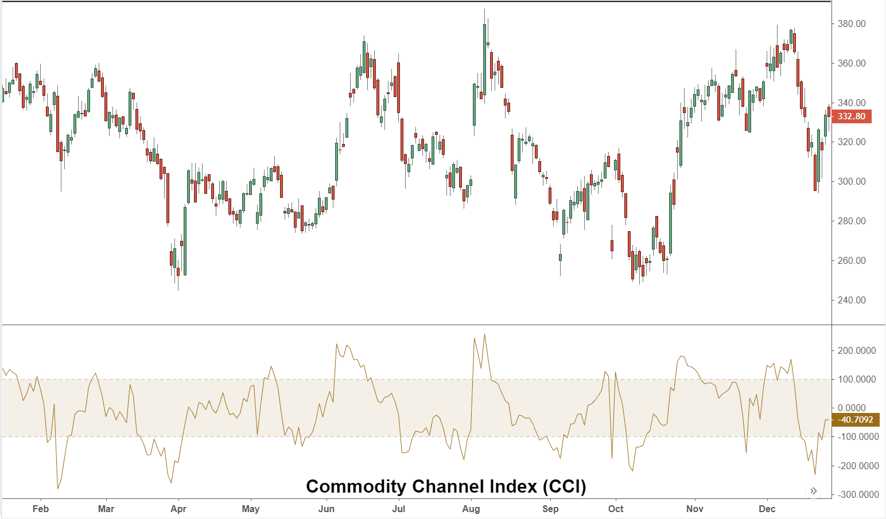

Technical indicators are essential tools in stock trading, allowing traders to analyze historical data and forecast future market movements. These indicators provide insights into price patterns, volume trends, and market psychology, enabling traders to make informed decisions. Among the various technical indicators, the Duel Commodity Channel Index (DCCI) stands out as a distinct tool in technical analysis, offering a unique mechanism to assess market conditions.

The DCCI is an extension of the Commodity Channel Index (CCI), designed to identify cyclical trends in asset prices. It aids traders in recognizing overbought or oversold conditions of financial instruments, crucial for timing entry and exit points in trading. Unlike the traditional CCI, which evaluates price deviations from an average price, the DCCI introduces an additional layer by oscillating between two extreme values, thus enhancing its predictive accuracy. This dual analysis provides a clearer signal of potential market reversals, offering traders a competitive edge.



In the sphere of algorithmic trading, the DCCI's application is noteworthy. Algorithmic trading involves the use of computer programs to execute trades based on predefined criteria. The DCCI's quantitative nature makes it suitable for integration into such automated trading systems, allowing for systematic and emotionless trading strategies. By identifying critical market signals, the DCCI can help develop robust rules for executing trades, optimizing trading performance in various market conditions.

Understanding overbought and oversold conditions is critical for any technical analyst. Overbought refers to a situation where an asset's price has risen significantly, making it susceptible to a price correction. Conversely, oversold conditions indicate a depressed price level that might lead to a price increase. The DCCI excels in identifying these conditions by assessing the intensity of price movements, providing valuable signals for potential reversals. Thus, traders equipped with this knowledge can enhance their risk management strategies and improve their trade execution.

## Table of Contents

## Understanding the Duel Commodity Channel Index (DCCI)

The Duel Commodity Channel Index (DCCI) is an enhanced version of the standard Commodity Channel Index (CCI), designed to provide traders with a more sophisticated tool for analyzing price movements in financial markets. It originates from attempts to improve the CCI's effectiveness by addressing its limitations and integrating additional insights.

The standard Commodity Channel Index, developed by Donald Lambert in 1980, is an oscillator used to identify cyclical trends in a security’s price. It is particularly useful for identifying overbought and oversold conditions. The CCI is calculated using the formula:

$$

CCI = \frac{{\text{Typical Price} - \text{SMA}}}{{0.015 \times \text{Mean Deviation}}} 
$$

where the Typical Price is average of high, low, and close prices, SMA is the Simple Moving Average of the Typical Price, and the mean deviation represents the average of the absolute deviations from the SMA.

In contrast, the DCCI builds on the basic concept of CCI by adding another layer of analysis, allowing it to oscillate between two extreme values. The DCCI uses dual lines or additional smoothing techniques to provide potentially more reliable signals regarding market reversals. This enhanced oscillation provides traders with a clearer picture of potential overbought or oversold situations, as the maximum and minimum values within DCCI indicate areas where asset price reversals might occur.

The dual-oscillator mechanism aims to minimize false signals and improve the precision of entry and [exit](/wiki/exit-strategy) points. While the typical CCI oscillates around a zero line and is bounded primarily by +100 and -100 values, the DCCI can show more nuanced boundaries that traders might set depending on the historical performance of a particular security.

Maximum values in the DCCI signal that a security may be overbought, suggesting an imminent downward price correction. Conversely, minimum values may indicate oversold conditions, highlighting the potential for upward price movement. This dual functionality helps traders discern not just the strength of current price trends but also potential future reversals, providing a more comprehensive tool for market analysis.

Overall, DCCI is utilized to bridge the gap between traditional [momentum](/wiki/momentum) oscillators and advanced technical analysis tools, offering traders enhanced clarity in decision-making processes.

## The Role of DCCI in Technical Analysis

The Duel Commodity Channel Index (DCCI) holds a significant role in technical analysis by providing traders with a robust mechanism to anticipate market movements. Its integration into trading strategies hinges largely on its oscillatory nature, which aids in identifying potential buy and sell signals. 

### Integration of DCCI into Technical Analysis Strategies

DCCI functions as an oscillator, oscillating between two extreme values to pinpoint possible overbought or oversold conditions. It is derived from the traditional Commodity Channel Index (CCI), but with modifications that enhance its sensitivity and reliability. Traders often integrate DCCI into broader technical analysis frameworks by combining it with other indicators such as moving averages or Relative Strength Index (RSI) to confirm signals and avoid false positives. The dual nature of the index allows for better signal filtering when incorporated with these strategies.

### Predicting Market Movements with DCCI

Traders leverage DCCI primarily to forecast market reversals. When DCCI reaches extreme high or low values, it signals that a price reversal could be imminent, indicating overbought or oversold market conditions respectively. An upward movement towards the DCCI’s maximum value suggests an overbought condition, which may result in a price decrease, prompting a sell signal. Conversely, a downward movement towards the minimum value signals an oversold condition, potentially leading to a price increase, thus triggering a buy signal.

### DCCI as an Oscillator for Buy and Sell Signals

The DCCI's effectiveness as an indicator is partly due to its capability to autonomously provide buy and sell signals through its oscillatory movements. Traders often set specific threshold levels, such as +100 for overbought and -100 for oversold conditions, to automate decision-making processes. Here's a simplified Python code illustrating how traders might implement DCCI-based signals:

```python
def dcci_signal(dcci_value, overbought_threshold=100, oversold_threshold=-100):
    if dcci_value > overbought_threshold:
        return "sell"
    elif dcci_value < oversold_threshold:
        return "buy"
    else:
        return "hold"

# Example usage
dcci_value = 120  # Current DCCI value
signal = dcci_signal(dcci_value)
print(f"Trading Signal: {signal}")
```

### Insights into Market Psychology and Risk Management

The DCCI contributes to understanding market psychology by providing insights into collective market behavior during extreme conditions. As it reflects market price fluctuations, traders can deduce the prevailing sentiment, enabling them to make informed decisions. The anticipation of reversals supports traders in managing risk and devising strategies that mitigate potential losses. By adhering to the signals produced by DCCI, traders can develop disciplined trading strategies, enhancing their risk management processes and ultimately contributing to consistent trading performance.

In conclusion, the DCCI serves as a vital component in the arsenal of technical analysis tools. Its oscillatory behavior not only facilitates accurate prediction of market movements but also aids traders in grasping the psychological undercurrents of the market, thereby reinforcing their risk management strategies.

## Implementing DCCI in Algo Trading

The Duel Commodity Channel Index (DCCI) can be effectively integrated into [algorithmic trading](/wiki/algorithmic-trading) systems, offering traders an efficient way to capitalize on its oscillatory nature to inform trading decisions. In the automated context, the DCCI is particularly beneficial due to its ability to provide clear buy and sell signals, enhancing the precision and timing of trade execution.

**Advantages of Using DCCI for Automated Trading Strategies**

The primary advantage of using DCCI in algorithmic trading lies in its capability to provide early indications of market entry and exit points. Since the DCCI oscillates between maximum and minimum values, it helps in identifying overbought and oversold conditions. This makes it possible to automate the process of entering a trade when an asset is expected to reverse its trend. Moreover, the predictable patterns of DCCI reduce the noise that often complicates other indicators, leading to improved signal reliability.

**Examples of Rules and Criteria Based on DCCI for Executing Trades**

In setting up an algorithmic strategy based on DCCI, traders can define explicit rules for executing trades. For instance, a strategy might include:

- **Buy Signal**: When the DCCI crosses above a predefined lower threshold indicating oversold conditions.
- **Sell Signal**: When the DCCI falls below a set upper threshold indicating overbought conditions.
- **Hold Signal**: When DCCI remains between the set thresholds, suggesting neither an overbought nor oversold condition.

These rules can be more complex, incorporating additional conditions like [volume](/wiki/volume-trading-strategy) spikes or confirmations from other indicators to increase accuracy. In Python, a basic implementation using pandas might look like this:

```python
import pandas as pd

# Assuming df is a DataFrame containing stock data with a 'Close' price column
df['DCCI'] = (df['Close'] - df['Close'].rolling(window=20).mean()) / (0.015 * df['Close'].rolling(window=20).std())

def trading_signal(row):
    if row['DCCI'] < -100:
        return 'Buy'
    elif row['DCCI'] > 100:
        return 'Sell'
    else:
        return 'Hold'

df['Signal'] = df.apply(trading_signal, axis=1)
```

**Platforms and Tools for Deploying DCCI-Focused Trading Algorithms**

Several platforms offer tools to implement DCCI-aligned strategies. MetaTrader and QuantConnect are popular for their algorithmic trading infrastructures that support custom indicators like DCCI. MetaTrader allows for the creation of automated strategies via its MQL scripting language, while QuantConnect offers robust [backtesting](/wiki/backtesting) and financial data libraries with C# and Python integration.

Moreover, platforms like TradingView offer the ability to write custom scripts in Pine Script, enabling the visualization and implementation of DCCI into automated trading systems. These platforms provide the necessary backtesting tools, which are crucial for refining DCCI-based strategies before live deployment, ensuring they perform well under different market conditions.

In conclusion, the DCCI, when integrated into algorithmic trading systems, serves as a potent tool for enhancing the timing and accuracy of trades. By employing clear rules and leveraging sophisticated trading platforms, traders can maximize the efficacy of their automated strategies using DCCI.

## Case Studies and Examples

Real-world implementations of the Duel Commodity Channel Index (DCCI) in trading have showcased its potential in identifying profitable opportunities through algorithmic trading strategies. These examples highlight how the DCCI can be effectively applied in diverse market scenarios, enhancing trading decisions and outcomes.

One notable case study involves a [hedge fund](/wiki/hedge-fund-trading-strategies) that incorporated DCCI into its automated trading systems for commodities trading. The fund utilized the DCCI to identify overbought and oversold conditions in various commodity futures, such as [crude oil](/wiki/crude-oil) and natural gas. By setting predefined thresholds, the system executed trades when the DCCI values reached extreme levels, signaling potential market reversals. This strategy allowed the fund to capitalize on short-term price movements, increasing returns significantly.

Another example features an individual trader who integrated the DCCI with other technical indicators to trade equity markets. By combining the DCCI with the Relative Strength Index (RSI) and Moving Average Convergence Divergence (MACD), the trader created a robust system to filter false signals and increase the accuracy of trade entries. This multi-indicator approach helped improve the trader's decision-making process, resulting in more consistent profits.

Comparing the DCCI with other technical indicators highlights its unique oscillatory properties. Unlike the standard Commodity Channel Index (CCI), which evaluates the price level relative to an average price over a certain period, the DCCI oscillates between two extreme values, offering clearer insights into potential reversals. Additionally, traditional indicators like Bollinger Bands provide insights based on [volatility](/wiki/volatility-trading-strategies), while the DCCI focuses on momentum and trend strength, offering distinct perspectives on market conditions.

In algorithmic trading, the DCCI’s integration into sophisticated models has proven advantageous. Python, commonly used for developing trading algorithms due to its simplicity and extensive libraries, allows traders to backtest and refine strategies using historical data. For instance, a trader can employ Python to simulate trades based on DCCI signals:

```python
import pandas as pd
import numpy as np

# Sample DCCI calculation
def calculate_dcci(prices, window=14):
    typical_price = (prices['high'] + prices['low'] + prices['close']) / 3
    sma = typical_price.rolling(window=window).mean()
    mean_deviation = typical_price.rolling(window=window).apply(lambda x: np.mean(np.abs(x - np.mean(x))), raw=True)
    cci = (typical_price - sma) / (0.015 * mean_deviation)
    dcci = 2 * cci / np.std(cci)  # simple way to scale CCI between two values
    return dcci

# Assuming 'data' is a DataFrame with 'high', 'low', and 'close' columns
data['DCCI'] = calculate_dcci(data)

# Example trade execution criteria
buy_signals = data[data['DCCI'] > 100]  # overbought threshold
sell_signals = data[data['DCCI'] < -100]  # oversold threshold
```

These case studies and examples underscore the DCCI's value in trading, demonstrating its potential to enhance existing strategies and improve trading outcomes. Whether used alone or in conjunction with other indicators, the DCCI offers a versatile tool for traders seeking to navigate complex market dynamics.

## Challenges and Considerations

The Duel Commodity Channel Index (DCCI), while offering numerous advantages in stock trading, is not without its challenges and limitations. One potential drawback of using the DCCI is its sensitivity to market volatility. In highly volatile markets, the DCCI may generate numerous false signals, leading traders to make poorly timed buying or selling decisions. This sensitivity can stem from the indicator's nature of oscillating between maximum and minimum values, which, although useful for identifying overbought and oversold conditions, can also result in frequent whipsaws during turbulent market periods.

Another limitation of the DCCI is that it heavily relies on historical price data. As with many technical indicators, past price actions do not always accurately predict future movements. This inherent limitation means that the DCCI may not be entirely reliable in unforeseen market conditions or when new, disruptive information enters the market.

When implementing DCCI-based trading strategies, traders must consider the context in which they are used. One important consideration is the time frame of analysis; different time frames can yield varying results with the DCCI. For short-term trading, the DCCI might provide more frequent signals, which could be advantageous or detrimental depending on the trader's strategy and risk tolerance. Conversely, longer time frames tend to smooth out price fluctuations, possibly reducing the frequency of signals but potentially missing swift market opportunities.

To mitigate these challenges, one effective strategy is to combine the DCCI with other technical indicators. By doing so, traders can enhance the accuracy of their analyses and reduce the likelihood of false signals. For example, integrating the DCCI with indicators such as the Relative Strength Index (RSI) or Moving Averages can provide additional confirmation for buy or sell signals. This complementary use of indicators allows traders to cross-verify signals and make more informed decisions.

Python can be utilized to implement these strategies. For instance, combining DCCI with Moving Averages in a Python-based algorithmic trading strategy could be set up as follows:

```python
import pandas as pd
import talib

# Load historical price data
data = pd.read_csv('price_data.csv')

# Compute DCCI
data['DCCI'] = talib.CCI(data['High'], data['Low'], data['Close'], timeperiod=14)

# Compute Moving Average
data['Moving_Average'] = data['Close'].rolling(window=20).mean()

# Example Signal based on DCCI and Moving Average
data['Signal'] = 0
data.loc[(data['DCCI'] > 100) & (data['Close'] > data['Moving_Average']), 'Signal'] = -1  # Sell condition
data.loc[(data['DCCI'] < -100) & (data['Close'] < data['Moving_Average']), 'Signal'] = 1   # Buy condition

# Analyze signals
print(data[['Close', 'DCCI', 'Moving_Average', 'Signal']].tail())
```

This script exemplifies the integration of DCCI with a Moving Average to create a simple buy/sell indicator. By analyzing such combinations, traders can improve decision-making processes and potentially achieve a more robust trading strategy.

## Conclusion

The Duel Commodity Channel Index (DCCI) emerges as a potent tool in the landscape of technical indicators employed in stock trading and algorithmic trading. In this article, we explored the unique characteristics of DCCI, emphasizing its oscillating nature that aids traders in identifying overbought and oversold market conditions, thus signaling potential price reversals. The comparative analysis with the standard Commodity Channel Index (CCI) reveals DCCI's enhanced capability in capturing price momentum oscillations between two extremes, offering traders a refined perspective on market dynamics.

The efficacy of DCCI in stock trading is notably significant due to its integration into various technical analysis strategies and its utility in algorithmic trading systems. Traders leverage its oscillator function to fine-tune buy and sell signals, ultimately aiming for more informed decision-making processes. The incorporation of DCCI in algo trading underscores the potential of automated strategies to minimize human error and capitalize on rapid market movements, thereby enhancing overall trading performance.

However, the application of DCCI is not devoid of challenges. Traders must recognize its limitations and consider complementing it with other technical indicators to improve accuracy and reliability. The potential for false signals means that a comprehensive understanding and prudence are essential when implementing DCCI-based strategies.

In conclusion, the Duel Commodity Channel Index presents a valuable opportunity for traders seeking to diversify their analytical toolkit. By mastering its application and combining it with other technical approaches, traders can significantly enhance their analytical capabilities and potentially achieve superior trading outcomes. Experimentation and continuous learning with DCCI are encouraged, as they offer the potential to uncover nuanced insights and leverage strategic advantages in both stock trading and algorithmic trading environments.

## References & Further Reading

[1]: Lambert, D. (1980). ["Commodity Channel Index: Tools For Trading Cyclical Trends."](https://store.traders.com/-v01-c05-comm-pdf.html) Lambert Gann Publishing.

[2]: Chen, D. (2010). ["Technical Analysis for Algorithmic Pattern Recognition."](https://link.springer.com/book/10.1007/978-3-319-23636-0)

[3]: Myers, D.J. (1998). ["The Technical Analysis Course: A Winning Program for Investors and Traders."](https://archive.org/details/technicalanalysi0000meye) McGraw-Hill Education.

[4]: Murphy, J.J. (1999). ["Technical Analysis of the Financial Markets: A Comprehensive Guide to Trading Methods and Applications."](https://archive.org/details/technicalanalysi0000murp) New York Institute of Finance.

[5]: Chande, T. (1997). ["The New Technical Trader: Boost Your Profit by Plugging into the Latest Indicators."](https://www.amazon.com/New-Technical-Trader-Plugging-Indicators/dp/0471597805) Wiley Trading.