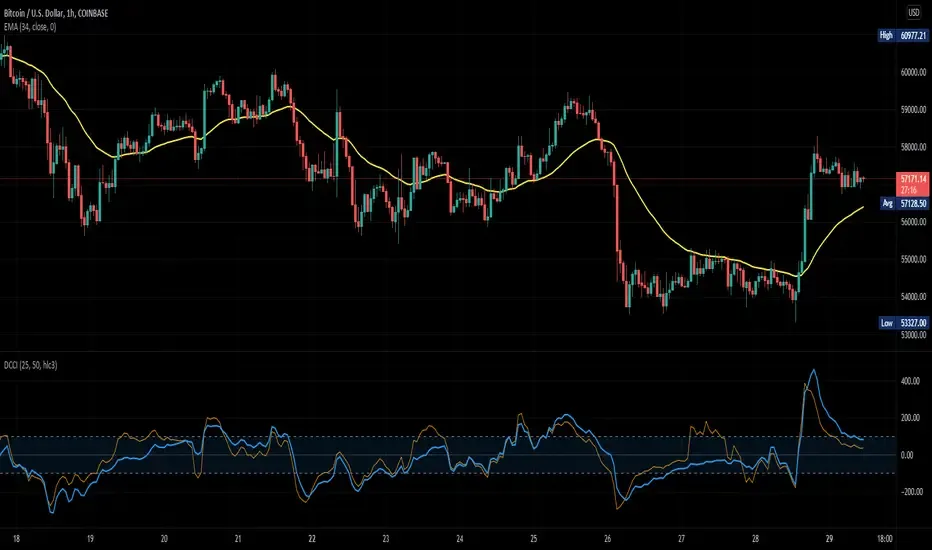

## Table of Contents

## What is the Dual Commodity Channel Index (DCCI)?

The Dual Commodity Channel Index (DCCI) is a technical indicator used in trading to help predict future price movements of a financial asset. It is an advanced version of the Commodity Channel Index (CCI), which was originally developed to identify cyclical turns in commodities. The DCCI uses two CCI lines, typically with different time periods, to provide a more comprehensive view of market trends and potential reversal points. By comparing the two CCI lines, traders can gain insights into both short-term and long-term market conditions, making it easier to make informed trading decisions.

Using the DCCI, traders look for divergences between the two CCI lines to spot potential buying or selling opportunities. For example, if the shorter-term CCI line starts to move in the opposite direction of the longer-term CCI line, it might signal an upcoming change in the price trend. This can help traders anticipate market movements and adjust their strategies accordingly. The DCCI is particularly useful in volatile markets where understanding different time frames can provide a clearer picture of market dynamics.

## How does the DCCI differ from the traditional Commodity Channel Index (CCI)?

The Dual Commodity Channel Index (DCCI) and the traditional Commodity Channel Index (CCI) are both technical indicators used in trading, but they have some key differences. The main difference is that the DCCI uses two CCI lines, while the traditional CCI uses just one. The DCCI typically includes a short-term CCI line and a long-term CCI line, which allows traders to see trends and potential reversal points from different time perspectives. This can be more helpful than the traditional CCI, which only gives you information based on one time period.

Using the DCCI, traders can look for divergences between the two CCI lines to spot trading opportunities. For example, if the short-term CCI line starts to move in the opposite direction of the long-term CCI line, it might signal that the price trend is about to change. This can help traders make better decisions. On the other hand, the traditional CCI only shows one line, so it might not give as much information about different time frames. This makes the DCCI a more versatile tool for traders who want to understand both short-term and long-term market conditions.

## What are the key components used to calculate the DCCI?

The Dual Commodity Channel Index (DCCI) is calculated using two Commodity Channel Index (CCI) lines. Each CCI line is made up of three key components: the typical price, the simple moving average of the typical price, and the mean deviation. The typical price is found by adding the high, low, and close prices of a trading period and then dividing by three. The simple moving average is the average of the typical prices over a set number of periods. The mean deviation is how much the typical prices vary from the moving average.

To calculate each CCI line, you first find the difference between the typical price and the moving average. Then, you divide this difference by a constant (usually 0.015) times the mean deviation. This gives you the CCI value for that period. For the DCCI, you do this calculation for two different time periods, one short-term and one long-term. The short-term CCI line might use a 20-period moving average, while the long-term CCI line might use a 50-period moving average. By comparing these two lines, traders can see how the market is behaving over different time frames and make better trading decisions.

## How is the DCCI calculated step-by-step?

To calculate the Dual Commodity Channel Index (DCCI), you need to first understand how to calculate the Commodity Channel Index (CCI). Start by finding the typical price for each trading period. This is done by adding the high, low, and close prices of the period and then dividing by three. Next, calculate the simple moving average of the typical prices over a set number of periods. Then, find the mean deviation, which is how much the typical prices vary from the moving average. To get the CCI value, subtract the moving average from the typical price and divide the result by 0.015 times the mean deviation. You do this for two different time periods: one short-term and one long-term. For example, the short-term CCI might use a 20-period moving average, while the long-term CCI might use a 50-period moving average.

Once you have both CCI lines calculated, you can plot them on a chart to see the DCCI. The short-term CCI line will show you how the market is behaving over a shorter time frame, while the long-term CCI line will show you the bigger picture. By comparing these two lines, you can spot divergences, which are times when the lines move in opposite directions. These divergences can signal that the price trend might be about to change. For example, if the short-term CCI line starts moving up while the long-term CCI line is still going down, it might mean that the price is about to start increasing. This can help you make better trading decisions by understanding both the short-term and long-term market conditions.

## What are the typical settings for the DCCI and how can they be adjusted?

The typical settings for the Dual Commodity Channel Index (DCCI) use two different time periods for the Commodity Channel Index (CCI) lines. One common setting is to use a 20-period moving average for the short-term CCI line and a 50-period moving average for the long-term CCI line. These settings help traders see both the short-term and long-term trends in the market. The short-term CCI line shows quick changes, while the long-term CCI line shows bigger trends over time.

You can adjust the settings of the DCCI to fit your trading style or the market you're trading in. If you want to focus more on short-term trading, you might use a shorter period for the short-term CCI line, like 10 periods, and keep the long-term CCI line at 50 periods. If you're interested in longer-term trends, you could use 20 periods for the short-term line and increase the long-term line to 100 periods. By changing these settings, you can make the DCCI work better for your specific needs and get a clearer picture of the market trends that matter to you.

## How can the DCCI be used to identify overbought and oversold conditions?

The Dual Commodity Channel Index (DCCI) can help traders spot when a market is overbought or oversold by looking at where the two CCI lines are. When both the short-term and long-term CCI lines go above +100, it usually means the market is overbought. This means the price might have gone up too much and could start to go down soon. On the other hand, if both CCI lines drop below -100, it suggests the market is oversold. This means the price might have gone down too much and could start to go up soon.

Traders can use these levels to make trading decisions. For example, if you see both CCI lines above +100, you might think about selling because the price could fall. If you see both lines below -100, you might consider buying because the price could rise. By watching where the short-term and long-term CCI lines are, traders can get a better idea of when the market might be ready for a change in direction.

## What are the common trading signals generated by the DCCI?

The Dual Commodity Channel Index (DCCI) can help traders spot different signals to make trading decisions. One common signal is when the short-term CCI line crosses above the long-term CCI line. This can mean that the price might start going up soon, so it could be a good time to buy. On the other hand, if the short-term CCI line crosses below the long-term CCI line, it might mean that the price could start going down, so it could be a good time to sell.

Another signal traders look for is when the DCCI lines show divergence. If the price is going up but the short-term CCI line starts going down while the long-term CCI line is still going up, this could mean the price might reverse soon. This is called bearish divergence. If the price is going down but the short-term CCI line starts going up while the long-term CCI line is still going down, this could mean the price might start going up soon. This is called bullish divergence. By watching these signals, traders can try to predict when the market might change direction and make better trading choices.

## How can the DCCI be combined with other technical indicators for better trading decisions?

The Dual Commodity Channel Index (DCCI) can be combined with other technical indicators to help traders make better decisions. One common way to do this is by using the DCCI along with moving averages. For example, if the DCCI shows a bullish signal (like the short-term CCI line crossing above the long-term CCI line) and the price is also above a key moving average like the 50-day moving average, it can give traders more confidence that the price might keep going up. This can help traders decide when to buy.

Another way to use the DCCI with other indicators is by combining it with the Relative Strength Index (RSI). If the DCCI shows that the market is overbought (both CCI lines above +100) and the RSI is also above 70, it can be a strong signal that the price might go down soon. Traders can use this information to decide when to sell. By looking at the DCCI together with other indicators, traders can get a clearer picture of the market and make smarter trading choices.

## What are the limitations and potential pitfalls of using the DCCI?

The Dual Commodity Channel Index (DCCI) can be a helpful tool for traders, but it has some limitations. One big problem is that the DCCI can give false signals. Sometimes, the short-term and long-term CCI lines might show that the price is about to change, but the price keeps going the same way. This can trick traders into making bad trades. Also, the DCCI works best in markets that move in clear trends. If the market is going up and down a lot without a clear direction, the DCCI might not be very useful.

Another issue with the DCCI is that it can be hard to set the right time periods for the CCI lines. If the time periods are too short or too long, the signals might not be accurate. Traders need to spend time trying different settings to find what works best for them. Also, the DCCI should not be used alone. It's better to use it with other indicators like moving averages or the RSI to get a fuller picture of the market. Relying only on the DCCI can lead to mistakes and missed opportunities.

## Can the DCCI be applied effectively to different time frames and asset classes?

The Dual Commodity Channel Index (DCCI) can be used on different time frames, like short-term charts for [day trading](/wiki/day-trading-spy) or long-term charts for investing. The key is to adjust the time periods of the CCI lines to match the time frame you're looking at. For short-term trading, you might use shorter periods like 10 and 20 days for the CCI lines. For long-term investing, you could use longer periods like 50 and 100 days. By changing these settings, the DCCI can help traders see trends and possible changes in price no matter what time frame they're using.

The DCCI can also be used with different types of assets, like stocks, [forex](/wiki/forex-system), and commodities. Each asset class might need different settings for the CCI lines because they can move in different ways. For example, stocks might need shorter time periods because they can be more volatile, while commodities might need longer periods because they often have slower trends. By trying out different settings, traders can use the DCCI to understand the market better, no matter what they're trading.

## How does the performance of the DCCI compare to other momentum indicators in various market conditions?

The Dual Commodity Channel Index (DCCI) is a momentum indicator that can work well in different market conditions, but it's important to compare it with other momentum indicators like the Relative Strength Index (RSI) and the Moving Average Convergence Divergence (MACD). In trending markets, the DCCI can be very useful because it uses two CCI lines to show both short-term and long-term trends. This can help traders spot when the price might change direction. The DCCI might be better than the RSI in these markets because it gives more information about different time frames. However, the MACD can also be good in trending markets because it shows the relationship between two moving averages, which can be easier for some traders to understand.

In markets that move up and down a lot without a clear trend, the DCCI might not work as well as other indicators. The RSI can be better in these choppy markets because it's simpler and can show when the market is overbought or oversold more clearly. The DCCI can give false signals in these conditions because it's harder to see clear trends. The MACD can also struggle in choppy markets, but it might still be better than the DCCI because it's less likely to give false signals. Overall, the DCCI can be a good tool, but traders should use it with other indicators and adjust the settings to fit the market they're trading in.

## What advanced strategies can be developed using the DCCI for expert traders?

Expert traders can use the Dual Commodity Channel Index (DCCI) to create advanced trading strategies by combining it with other technical indicators and looking for specific patterns. One strategy is to use the DCCI with the Relative Strength Index (RSI) to confirm overbought and oversold conditions. If the DCCI shows both CCI lines above +100 and the RSI is also above 70, it's a strong signal that the market might be overbought and could go down soon. On the other hand, if both CCI lines are below -100 and the RSI is below 30, it suggests the market might be oversold and could go up. By using these two indicators together, traders can get a clearer picture of when to buy or sell.

Another advanced strategy involves looking for divergences between the DCCI lines and the price action. If the price is going up but the short-term CCI line starts going down while the long-term CCI line is still going up, it's a bearish divergence. This can mean the price might reverse soon, so it could be a good time to sell. If the price is going down but the short-term CCI line starts going up while the long-term CCI line is still going down, it's a bullish divergence. This can mean the price might start going up soon, so it could be a good time to buy. By watching these divergences, expert traders can spot potential turning points in the market and make better trading decisions.

## What is the Duel Commodity Channel Index (DCCI) and how does it work?

The Duel Commodity Channel Index (DCCI) is an enhanced version of the standard Commodity Channel Index (CCI), designed to provide traders with a more sophisticated tool for analyzing price movements in financial markets. It originates from attempts to improve the CCI's effectiveness by addressing its limitations and integrating additional insights.

The standard Commodity Channel Index, developed by Donald Lambert in 1980, is an oscillator used to identify cyclical trends in a security’s price. It is particularly useful for identifying overbought and oversold conditions. The CCI is calculated using the formula:

$$

CCI = \frac{{\text{Typical Price} - \text{SMA}}}{{0.015 \times \text{Mean Deviation}}} 
$$

where the Typical Price is average of high, low, and close prices, SMA is the Simple Moving Average of the Typical Price, and the mean deviation represents the average of the absolute deviations from the SMA.

In contrast, the DCCI builds on the basic concept of CCI by adding another layer of analysis, allowing it to oscillate between two extreme values. The DCCI uses dual lines or additional smoothing techniques to provide potentially more reliable signals regarding market reversals. This enhanced oscillation provides traders with a clearer picture of potential overbought or oversold situations, as the maximum and minimum values within DCCI indicate areas where asset price reversals might occur.

The dual-oscillator mechanism aims to minimize false signals and improve the precision of entry and [exit](/wiki/exit-strategy) points. While the typical CCI oscillates around a zero line and is bounded primarily by +100 and -100 values, the DCCI can show more nuanced boundaries that traders might set depending on the historical performance of a particular security.

Maximum values in the DCCI signal that a security may be overbought, suggesting an imminent downward price correction. Conversely, minimum values may indicate oversold conditions, highlighting the potential for upward price movement. This dual functionality helps traders discern not just the strength of current price trends but also potential future reversals, providing a more comprehensive tool for market analysis.

Overall, DCCI is utilized to bridge the gap between traditional [momentum](/wiki/momentum) oscillators and advanced technical analysis tools, offering traders enhanced clarity in decision-making processes.

## References & Further Reading

[1]: Lambert, D. (1980). ["Commodity Channel Index: Tools For Trading Cyclical Trends."](https://store.traders.com/-v01-c05-comm-pdf.html) Lambert Gann Publishing.

[2]: Chen, D. (2010). ["Technical Analysis for Algorithmic Pattern Recognition."](https://link.springer.com/book/10.1007/978-3-319-23636-0)

[3]: Myers, D.J. (1998). ["The Technical Analysis Course: A Winning Program for Investors and Traders."](https://archive.org/details/technicalanalysi0000meye) McGraw-Hill Education.

[4]: Murphy, J.J. (1999). ["Technical Analysis of the Financial Markets: A Comprehensive Guide to Trading Methods and Applications."](https://archive.org/details/technicalanalysi0000murp) New York Institute of Finance.

[5]: Chande, T. (1997). ["The New Technical Trader: Boost Your Profit by Plugging into the Latest Indicators."](https://www.amazon.com/New-Technical-Trader-Plugging-Indicators/dp/0471597805) Wiley Trading.