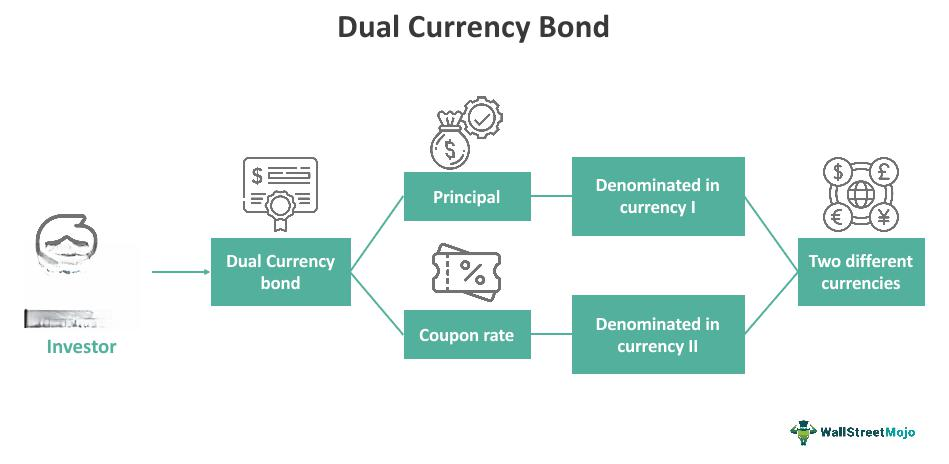

Dual currency bonds are unique financial instruments that provide a strategic advantage in the landscape of global finance. These bonds are typically denominated in one currency for the principal payment and another for the interest payment, offering investors a dual exposure to different currency risks and rewards. This characteristic makes them particularly relevant for investors seeking to diversify their portfolios across multiple currency regions. Diversification is a core principle in investment strategy, aiming to reduce risk by allocating investments among various financial instruments, industries, and other categories, including currencies.

Currency bonds, particularly dual currency bonds, serve as a tactical tool for hedging against currency fluctuations. For instance, an investor expecting a depreciation of the domestic currency may invest in dual currency bonds to benefit from the relative stability or appreciation of foreign currencies. This hedging potential is further enhanced when dual currency bonds are incorporated into a well-diversified investment portfolio, thus spreading risk and potentially increasing returns.



Algorithmic trading has revolutionized the execution of trades in financial markets, and its application in bond markets, including those for dual currency bonds, is increasingly prominent. Algorithmic trading, often referred to as algo trading, denotes the use of computer algorithms to automatically execute trades based on predefined criteria. This method enhances the efficiency and speed of bond trading, offering improved liquidity and reduced transaction costs. As markets move swiftly, the need for rapid execution of trades becomes crucial, making algorithmic trading an invaluable asset in managing dual currency bonds.

The purpose of this article is to provide a comprehensive examination of investing in dual currency bonds. The focus spans from understanding the structural elements of these bonds to exploring their benefits, risks, and the role of algorithmic trading. The analysis aims to equip investors with the knowledge needed to navigate the complexities associated with these financial instruments, ultimately aiding them in making informed investment decisions that could enhance portfolio performance.

## Table of Contents

## Understanding Dual Currency Bonds

Dual currency bonds are a type of financial instrument that provides unique opportunities for both issuers and investors by incorporating multiple currencies within a single bond structure. Unlike traditional bonds, which are typically issued in a single currency and offer fixed or variable interest payments and principal repayment in that currency, dual currency bonds distinguish themselves by allowing interest and principal payments to be made in different currencies. This characteristic can be especially beneficial for multinational corporations and investors seeking to capitalize on currency exchange rate fluctuations.

A dual currency bond is structured to pay interest in one currency while the principal is repaid in another. This setup allows issuers to tailor their currency exposure according to their strategic needs, potentially lowering borrowing costs if the issuer can take advantage of favorable currency moves. For example, a European company with significant revenues in U.S. dollars might issue a dual currency bond that pays interest in euros, leveraging its dollar income to manage currency risk.

Key features that set dual currency bonds apart from traditional bonds include their inherent currency exchange rate exposure, the potential for higher yields, and their complex pricing mechanism, which accounts for the underlying currency risks. These bonds often offer higher yields compared to standard bonds to compensate investors for taking on the additional currency risk. This yield differential can be attractive to investors, particularly in low-interest-rate environments.

Real-world examples of dual currency bonds illustrate their applications and benefits. For instance, an Asian manufacturing company with sales in both Japan and the United States might issue a dual currency bond that pays interest in Japanese yen and the principal in U.S. dollars. This setup can help the issuer manage its currency exposure more effectively while providing investors with exposure to currency fluctuations that could enhance their overall returns.

In summary, dual currency bonds offer a nuanced investment vehicle that combines elements of foreign exchange exposure with fixed-income characteristics. This structure provides opportunities for portfolio diversification and potential yield enhancement, while also presenting unique risks and complexities that must be carefully managed.

## Benefits of Investing in Dual Currency Bonds

Dual currency bonds offer several benefits that make them attractive to investors seeking diversified and potentially higher-yielding portfolios. One of the primary advantages of dual currency bonds is their capacity to enhance portfolio diversification. By investing in bonds denominated in two different currencies, investors access multiple currency markets, which can reduce unsystematic risk and improve the risk-return profile of their investment portfolios. This dual exposure also allows investors to benefit from the economic conditions and [interest rate](/wiki/interest-rate-trading-strategies) environments of both currency regions, potentially smoothing out fluctuations in bond returns driven by single-currency influences.

Another significant benefit of dual currency bonds is the potential for higher yields compared to traditional single-currency bonds. Dual currency bonds often offer higher interest rates or coupon payments as compensation for the additional exchange rate risk involved. This increased yield can be particularly appealing in low-interest-rate environments, where traditional bond yields may not meet investors' income or return objectives. The yield advantage of dual currency bonds is a crucial [factor](/wiki/factor-investing) for investors seeking to maximize returns while maintaining bond market exposure.

Moreover, dual currency bonds provide a natural hedge against currency risk, a critical consideration for global investors. Since these bonds involve payment in two currencies, they can mitigate the impact of adverse currency movements on the overall portfolio. For instance, if an investor holds a dual currency bond with principal repayment in a foreign currency and interest payments in the domestic currency, fluctuations in exchange rates might be balanced by the bond's structure. If the foreign currency depreciates, any loss due to exchange rate movement could be offset by the income generated in the domestic currency, and vice versa.

In summary, dual currency bonds offer substantial benefits by diversifying investment portfolios, potentially delivering higher yields, and providing a hedge against currency fluctuations. These features make them a compelling investment option for those looking to capitalize on opportunities in multiple currency markets while managing associated risks.

## Risks Associated with Dual Currency Bonds

Dual currency bonds present unique risks that investors must consider carefully. One of the primary risks associated with these bonds is exchange rate risk, which can significantly impact bond returns. Exchange rate risk arises from fluctuations in currency values, affecting both interest payments and principal repayments when these transactions occur in different currencies. If the currency in which interest payments are made depreciates relative to the investor's home currency, the returns realized can diminish significantly. Conversely, appreciation can enhance returns, but the unpredictability of currency markets makes this aspect challenging to manage. Mathematical models such as the Interest Rate Parity theorem can assist in predicting currency movements, but investors should remain wary of unexpected market shifts.

The complexity and [liquidity](/wiki/liquidity-risk-premium) of dual currency bonds further complicate investment decisions. Dual currency bonds are inherently more complex than conventional bonds due to their structure, which involves multiple currencies and potentially differing terms and conditions. This complexity requires investors to have a nuanced understanding of various economic indicators and market dynamics. Moreover, the liquidity of dual currency bonds can vary significantly. While some dual currency bonds may be actively traded, others might suffer from limited market participation, making it difficult to sell the bond without incurring a loss or at a desired price.

In addition to these considerations, understanding issuer and credit risk is vital. Issuer risk pertains to the financial health and creditworthiness of the bond issuer. In the case of dual currency bonds, these can involve sovereign or corporate issuers from different countries, each with distinct economic and political climates that may influence their ability to meet debt obligations. Credit risks also encompass the likelihood of default, which can vary based on the issuer’s credit rating. Rating agencies provide assessments to guide investors, yet rapid changes in global conditions can still lead to sudden shifts in an issuer's creditworthiness.

In managing these risks, diversification strategies and hedging mechanisms, such as currency forwards or options, can play a crucial role. Although these financial instruments can mitigate some risk factors, they also introduce additional costs and complexities. Hence, investors are advised to conduct thorough due diligence and possibly consult financial experts when evaluating dual currency bonds for portfolio inclusion.

## Role of Algorithmic Trading in Bond Markets

Algorithmic trading, or algo trading, refers to the use of complex algorithms and high-speed data analysis to automate trading processes, making it a significant component in modern financial markets, including bond markets. The primary objective of [algorithmic trading](/wiki/algorithmic-trading) is to enhance the speed, accuracy, and efficiency of executing trades, which is crucial in markets characterized by large volumes and rapid price changes. In the context of bond markets, algorithmic trading helps manage the diverse and intricate aspects of trading bonds, including dual currency bonds.

**Enhancement of Liquidity and Efficiency**

Algo trading plays a pivotal role in enhancing both liquidity and efficiency in the trading of dual currency bonds. By utilizing high-frequency trading strategies, market participants can offer tighter spreads, thereby boosting market liquidity. The automation provided by algorithmic trading allows for quick and accurate execution of trades, which is particularly advantageous in the dual currency bond markets where currency exchange rates can add another layer of complexity.

For example, algorithmic trading can optimize the execution of trades by monitoring multiple currency exchanges and interest rates concurrently. This optimizes conversion rates at times when currencies are most favorable, thus enhancing trade efficiency and cost-effectiveness. Algorithms can rapidly analyze enormous datasets and execute trades at speeds impossible for human traders to achieve, reducing the time lag between a market opportunity arising and a trade being executed.

Python serves as an effective tool in developing trading algorithms due to its extensive libraries and frameworks such as pandas for data manipulation, NumPy for mathematical operations, and various APIs for live market data access. Here is a python snippet illustrating a simple algorithmic strategy for trading dual currency bonds:

```python
import pandas as pd
import numpy as np

# Fetch market data
# Assuming data contains 'currency_pair' and 'bond_price'
# This is a hypothetical example based on available data structure
market_data = pd.DataFrame({
    'currency_pair': np.random.rand(100),
    'bond_price': np.random.rand(100) * 100
})

# Define a simple moving average strategy
short_window = 10
long_window = 40

signals = pd.DataFrame(index=market_data.index)
signals['signal'] = 0.0

# Create short simple moving average
signals['short_mavg'] = market_data['bond_price'].rolling(window=short_window, min_periods=1).mean()
# Create long simple moving average
signals['long_mavg'] = market_data['bond_price'].rolling(window=long_window, min_periods=1).mean()

# Create buy signal when short mavg exceeds long mavg
signals['signal'][short_window:] = np.where(signals['short_mavg'][short_window:] > signals['long_mavg'][short_window:], 1.0, 0.0)

# Generate trading orders
signals['positions'] = signals['signal'].diff()
```

**Risks and Challenges**

Despite the benefits, implementing algorithmic trading strategies in bond markets is not without risks. One of the primary challenges is managing the exchange rate risk inherent in dual currency bonds, given their exposure to fluctuations in currency values. This risk is compounded by the complexities involved in programming reliable trading algorithms that can adapt to rapidly changing market conditions.

Moreover, the possibility of technical failures, such as latency issues or inaccurate data feeds, poses significant risks. These failures can lead to incorrect pricing or missed trading opportunities, resulting in financial losses. Robust system architecture and real-time monitoring become crucial to mitigate these risks, ensuring that trading algorithms function as intended under varying market conditions.

Additionally, the regulatory environment concerning algo trading can impact its implementation. Regulatory requirements vary by jurisdiction and can influence the design and deployment of trading strategies, necessitating a thorough understanding of global financial regulations. Traders need to ensure compliance with these regulations to prevent legal repercussions and associated costs.

In conclusion, while algorithmic trading significantly enhances the efficiency and liquidity of dual currency bond markets, careful consideration of potential risks and regulatory requirements is crucial for its successful implementation. By employing robust algorithms and adaptive strategies, market participants can capitalize on the opportunities presented by dual currency bonds while managing the associated risks.

## Tax Implications of Dual Currency Bond Investments

Investing in dual currency bonds necessitates careful consideration of various tax implications. These bonds, distinguished by their use of two different currencies for issuing and redemption, introduce unique tax challenges and opportunities depending on the jurisdictions involved and circumstantial currency gains or losses.

**Overview of Tax Considerations**

Investors in dual currency bonds must account for taxation on interest income and capital gains, which can vary significantly depending on the local tax regulations applicable to them and the issuer. In many countries, interest income on bonds is taxed as ordinary income. However, the rate can differ if the bondholder is a domestic versus foreign investor, subject to tax treaties between the involved countries. The gains realized upon maturity or sale of these bonds may also constitute a taxable event and can be categorized as capital gains. The complexity is further introduced when currency exchanges are involved, as currency fluctuation can result in taxable gains or deductible losses.

**Jurisdictional Impact on Tax Obligations**

The tax jurisdiction of both the investor and the bond issuer significantly shapes tax liabilities in dual currency bonds. Tax treaties between nations can mitigate double taxation issues, whereby the same income gets taxed in two different areas. For instance, if the investor resides in a country that has a tax treaty with the issuer's country, the investor may receive a reduced tax rate on interest payments due to foreign tax credits or exemptions.

Additionally, currency conversion at different transaction stages can trigger further tax implications. For instance, an appreciation in the currency in which the bond's interest payments are made could result in a higher tax liability for the investor upon conversion into their home currency. Conversely, depreciation might reduce the value of the bond income, potentially leading to lower tax obligations.

**Strategies for Tax Efficiency**

Maximizing tax efficiency in dual currency bond investments can involve strategic approaches such as utilizing tax-deferred accounts, hedging currency risks, and selecting jurisdictions with favorable tax treatments. 

Investors may opt to hold dual currency bonds within tax-advantaged accounts, such as IRAs in the United States, where interest accumulation and potential capital gains are shielded from tax until withdrawal. Similarly, companies may develop strategies to hedge against currency fluctuation risk, which not only stabilizes returns but can also dictate the applicable tax treatment of gains and losses.

Optimizing investments by pursuing tax-efficient jurisdictions is another strategy. For example, investing in bonds issued in countries with lenient tax regimes or favorable tax treaties can enhance the after-tax yield of these investments. Moreover, sophisticated tax planning might involve utilizing specific accounting methods, like identifying lot-specific gains and losses or using currency forwards to fix exchange rates at favorable terms, thereby reducing taxable income in higher tax settings.

In summary, handling the tax implications of dual currency bonds requires an understanding of the cross-border tax landscape and proactive tax management strategies. Investors should seek expert guidance to navigate the tax regulations and structures that impact dual currency bond investments, ensuring compliance while optimizing returns.

## Investor and Issuer Perspectives

Issuers of dual currency bonds benefit from accessing broader capital markets by appealing to investors interested in both currency markets and traditional bond investments. By issuing bonds in one currency with the promise of returning principal or interest payments in another, issuers can attract a more diversified group of investors, particularly those engaged in international markets. This flexibility allows issuers to target regions with favorable economic conditions or currency appreciation potentials. Moreover, by engaging in such financial mechanisms, issuers can often secure more favorable borrowing conditions than might be available through conventional bonds or loans in local markets.

For investors, dual currency bonds offer several strategic considerations. One primary factor involves potential currency gains. For instance, if the repayment currency strengthens against the currency in which the bond was purchased, the investor stands to gain from favorable exchange movements. Investors also look at the interest rate spread between the two currencies involved. A higher-paying currency provides the opportunity for enhanced returns, albeit with increased exchange rate risk.

Investors should also evaluate the creditworthiness of the issuer, as it directly impacts the risk associated with the bond. Credit risk can be assessed using credit ratings provided by agencies such as Moody's or Standard & Poor's. Additionally, understanding the issuer's economic environment is crucial, as geopolitical or economic instability can affect both the issuer's creditworthiness and the respective currency markets.

Balancing risks and returns is critical for both issuers and investors involved in dual currency bonds. On the issuers' side, the risk mainly lies in currency fluctuation, which can increase the cost of repaying the bond. Issuers need to be strategic in selecting which currencies to engage in and may utilize hedging instruments to mitigate risks.

For investors, the challenge is to weigh the potential high returns against the inherent risks of currency fluctuations and issuer default. Developing a well-diversified investment portfolio, including dual currency bonds, could serve as an effective hedge against economic instability, provided the investor carefully navigates the associated complexities. Investors often employ sophisticated risk assessment models to determine the optimal allocation of dual currency bonds within their broader investment strategies, factoring in macroeconomic trends, interest rates, and currency forecasts.

## Future Trends in Dual Currency Bond Markets

The future of dual currency bond markets is poised to be influenced by a series of global economic developments. As emerging markets continue their growth trajectory, the demand for innovative financial instruments, such as dual currency bonds, is expected to increase. These bonds, which allow issuers and investors to harness exchange rate differentials, may become more attractive in periods of currency [volatility](/wiki/volatility-trading-strategies). With central banks worldwide navigating through complex monetary policies, including interest rate adjustments and currency interventions, these instruments offer both opportunities and complexities.

In terms of technological advancements, algorithmic trading is rapidly gaining traction within bond markets, including those involving dual currency bonds. Algorithmic trading, which utilizes automated pre-programmed trading instructions, enhances the liquidity and efficiency of these markets. This technology can process vast volumes of data to predict price movements, thereby facilitating quicker decision-making processes for traders. A potential Python implementation for a basic algorithmic trading strategy might involve using libraries such as `pandas` for data manipulation and `numpy` for numerical calculations:

```python
import pandas as pd
import numpy as np

# Example dataset of dual currency bond prices
data = pd.DataFrame({'time': range(100), 'price': np.random.random(100)})

# Simple moving average trading algorithm
def moving_average_strategy(data, window=5):
    data['moving_avg'] = data['price'].rolling(window=window).mean()
    data['signal'] = 0  # Default - hold
    data['signal'][window:] = np.where(data['price'][window:] > data['moving_avg'][window:], 1, -1)
    return data

results = moving_average_strategy(data)
```

However, the rapid adoption of such technologies also introduces new risks, such as the potential for market manipulation and increased systemic risk due to algorithmic trading anomalies.

Predictions for the growth and evolution of dual currency bonds suggest a dynamic and expanding market. As global trade continues to flourish, more corporations may issue these bonds to access international capital more efficiently. Additionally, with the integration of sustainable finance principles, there might be a rise in eco-friendly or green dual currency bonds, aligning financial objectives with sustainability goals. These trends indicate significant potential for both issuers and investors, fostering a more interconnected and resilient financial ecosystem.

## Conclusion

Dual currency bonds present a unique investment opportunity by offering exposure to multiple currencies within a single financial instrument. Throughout this article, we discussed their structure, benefits, risks, and their intriguing integration with algorithmic trading, highlighting how they differ from traditional bond investments. 

These bonds are a strategic choice for enhancing portfolio diversification due to their potential for higher yields and ability to hedge against currency risk. By investing in dual currency bonds, investors not only access potentially lucrative markets but also balance their portfolios against currency fluctuations. However, the risks such as exchange rate volatility and complexity necessitate careful consideration and due diligence.

Algorithmic trading plays a crucial role in trading dual currency bonds, improving market liquidity and efficiency. Although it involves potential challenges, these advanced trading strategies can offer significant advantages in execution speed and accuracy, making them an attractive option for modern investors.

From a tax perspective, understanding the jurisdictional tax implications remains vital for maximizing efficiency. Investors should assess these factors alongside issuer objectives, which often involve accessing broader capital markets.

Looking forward, the evolving landscape of global finance and technological advancements suggests a promising future for dual currency bond markets. Innovations in algorithmic trading and financial technology are expected to further transform how these bonds are issued and traded.

In conclusion, dual currency bonds offer compelling benefits that can address different financial strategies while embracing contemporary trading methods. Investors are encouraged to consider these instruments and algo trading strategies as they navigate the complexities and opportunities of modern financial markets.

## References & Further Reading

[1]: Stulz, R. M. (1984). ["Optimal Hedging Policies."](https://www.jstor.org/stable/2330894) Journal of Financial and Quantitative Analysis, 19(2), 127-140.

[2]: Mun, J. C. (2002). ["Real Options Analysis."](https://archive.org/details/realoptionsanaly0000munj) Wiley Finance.

[3]: ["Currency Risk Management: A Handbook for Financial Managers, Brokers, and Their International Clients"](https://books.google.com/books/about/Currency_Risk_Management.html?id=UMRnaCcD_QMC) by Gary Shoup

[4]: Aldridge, I. (2013). ["High-Frequency Trading: A Practical Guide to Algorithmic Strategies and Trading Systems."](https://www.amazon.com/High-Frequency-Trading-Practical-Algorithmic-Strategies/dp/1118343506) Wiley.

[5]: Taylor, M. P. (1995). ["The Economics of Exchange Rates."](https://www.jstor.org/stable/2728909) Journal of Economic Literature, 33(1), 13-47.