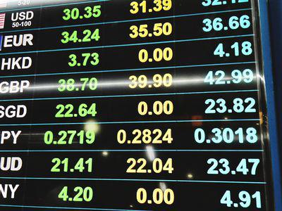

In today’s global financial landscape, investors are constantly seeking innovative ways to enhance returns while managing risks. Among the myriad of investment strategies available, dual currency deposits (DCDs) and foreign exchange deposits stand out as compelling options for those interested in currency investment. 

Dual currency deposits are structured financial products that allow investors to gain exposure to currency fluctuations while typically offering higher interest rates than conventional deposits. These deposits enable the investor to make an investment in one currency and potentially receive the principal and interest in another, depending on the movement of exchange rates. As such, they provide not only an opportunity for gaining higher yields but also introduce currency conversion risk which must be carefully considered.



Foreign exchange deposits, similarly, involve placing funds in one currency with the potential to realize gains through favorable movements in exchange rates. These deposits allow investors to benefit from the dynamic nature of the forex market but carry inherent risks due to exchange rate volatility, which can significantly affect returns.

The emergence of algorithmic trading has revolutionized currency trading by introducing more efficient and sophisticated strategies. Algorithmic trading employs complex algorithms to execute trades based on pre-defined criteria, identifying opportunities for profit faster than human traders ever could. This technological advancement enhances market liquidity and reduces transaction costs, thereby offering a competitive advantage to those leveraging such systems.

As this article will explore, dual currency deposits, foreign exchange investments, and algorithmic trading constitute key components of modern currency investment strategies. Understanding their mechanics and the ways they can be optimized is crucial for investors aiming to navigate this complex but potentially lucrative domain effectively.

## Table of Contents

## Understanding Dual Currency Deposits

A dual currency deposit (DCD) is a structured financial product that combines a fixed deposit with a foreign exchange option, offering potentially higher yields in exchange for exposure to foreign exchange risk. In a typical DCD, the depositor selects two currencies: the base and alternate currency. The investment is made in the base currency, and the payout—comprising the principal and interest—can be in either the base or the alternate currency, depending on pre-agreed conditions and currency movements at maturity.

The mechanics of DCD involve certain predefined terms, such as the investment period, the strike price (or the exchange rate at which conversion occurs), and the [interest rate](/wiki/interest-rate-trading-strategies)—which is generally higher than that offered by standard deposits. This elevated interest rate compensates for the potential risk associated with currency fluctuations. For instance, an investor might deposit funds in USD with the option to have the return in EUR, should the EUR/USD exchange rate at maturity favor conversion to euros.

The appeal of dual currency deposits largely stems from the higher interest yields. However, it is essential to recognize that DCDs are not conventional deposits. Unlike standard deposits where the return is predictable and insulated from market variances, the returns on DCDs hinge on the trajectory of currency rates, which introduces uncertainty. The financial outcome could vary notably between the two currencies, influenced by factors such as changing interest rates, geopolitical developments, and economic indicators.

In summary, while DCDs can enhance portfolio yields, investors must possess a keen understanding of foreign exchange dynamics and embrace the currency risk inherent in these products. By assessing exchange rate trends and economic contexts, investors can make informed decisions, potentially benefiting from favorable currency movements.

## Mechanics of Foreign Exchange Deposits

Foreign exchange deposits involve placing funds in one currency while actively monitoring and responding to exchange rate dynamics. These financial instruments offer investors an opportunity to gain exposure to foreign currency movements, potentially yielding returns through favorable shifts in exchange rates. The primary objective for investors is to capitalize on changes in currency values that arise due to economic indicators, geopolitical events, or market speculations.

The mechanics of foreign exchange deposits are straightforward. An investor deposits money in a foreign currency, typically in a bank account outside their home country. The deposited funds are then subject to the fluctuation of the currency's exchange rate against the investor's home currency. If the foreign currency appreciates relative to the home currency, the investor stands to gain from the conversion back to their domestic currency, thereby realizing a profit. Conversely, if the foreign currency depreciates, losses can occur.

To illustrate, consider an investor with a home currency in USD who chooses to deposit funds in EUR. Suppose the initial exchange rate is 1 USD = 0.90 EUR. If, after a certain period, the EUR appreciates to 1 USD = 0.85 EUR, the value of the deposit in terms of USD will have increased. This profit arises from the enhanced purchasing power of the EUR when converting back to USD.

However, foreign exchange deposits [carry](/wiki/carry-trading) inherent risks mainly due to exchange rate [volatility](/wiki/volatility-trading-strategies). Exchange rates can be influenced by numerous factors, including changes in interest rates, inflation rates, political stability, and economic performance. This volatility can have a significant impact on the returns from a foreign exchange deposit, making it crucial for investors to employ strategies that hedge against adverse movements.

Investors may use tools such as forward contracts, options, or swaps to mitigate these risks. These financial derivatives allow investors to lock in an exchange rate for future transactions, thus providing a level of certainty against unpredictable market shifts. While these mechanisms can reduce exposure to adverse currency movements, they can also limit potential gains if the market moves favorably beyond the locked-in rate.

In summary, foreign exchange deposits present an enticing opportunity for investors to diversify their portfolios and potentially gain from global economic movements. However, they demand a thorough understanding of currency markets and a prudent approach to risk management to effectively navigate the associated exchange rate risks.

## The Role of Currency Investment in Portfolio Diversification

Currency investments play a crucial role in portfolio diversification by expanding the horizons beyond traditional asset classes such as stocks and bonds. One primary advantage of currency investments is their ability to act as a hedge against geopolitical events and economic crises that can adversely affect specific regions. These events can lead to significant currency fluctuations, which, if anticipated correctly, may protect and even enhance the value of an investment portfolio.

For example, investors often seek refuge in stable currencies, such as the Swiss Franc or the US Dollar, during times of geopolitical tension. This strategic allocation can mitigate portfolio risk when other regions are experiencing volatility. Moreover, currencies do not necessarily move in tandem with equity or bond markets, offering a potential buffer against market downturns.

Different currency pairs, defined by their two-part compositions like EUR/USD or USD/JPY, present varied opportunities and risks, making them suitable for investors aiming for differentiated risk profiles. Each currency pair is influenced by distinct economic, political, and financial factors, providing investors with diverse instruments to tailor their exposure to currency markets.

Mathematically, currency investment returns can be modeled through exchange rate changes, given by:

$$
R = \frac{(S_t - S_0)}{S_0} \times 100
$$

where $R$ represents the percentage return, $S_0$ is the initial exchange rate, and $S_t$ is the exchange rate at time $t$.

Investors often employ carry trade strategies, involving borrowing in a currency with low interest rates and investing in one with higher rates. This approach capitalizes on interest rate differentials across countries, adding another layer to diversification strategies.

In sum, currency investments can enhance portfolio diversification by offering protection against regional economic shocks and by enabling exposure to global economic dynamics. Through this, investors can achieve a more balanced risk-reward profile, aligning with their overall investment objectives.

## Algorithmic Trading in Currency Markets

Algorithmic trading employs complex algorithms to automate the process of executing trades in financial markets, based on predefined criteria. This approach is particularly effective in currency markets, where speed and precision are critical. Algorithms can process vast amounts of market data faster than human traders, enabling them to identify and capitalize on profitable trading opportunities as they arise. 

The core of [algorithmic trading](/wiki/algorithmic-trading) lies in its ability to automate decision-making processes using statistical models and technical indicators. For example, an algorithm might be configured to buy a currency pair when its price moves above the 50-day moving average or to sell when the Relative Strength Index (RSI) surpasses a certain threshold. Here's a simple Python script illustrating an algorithm that triggers trades when certain conditions in a currency pair are met:

```python
import pandas as pd

# Sample data for demonstration purposes
data = pd.DataFrame({
    'price': [1.2000, 1.2100, 1.2150, 1.2250, 1.2300],
    'rsi': [30, 50, 55, 70, 65]
})

# Define strategy parameters
moving_average_period = 3
rsi_threshold = 60

# Calculate the moving average
data['moving_average'] = data['price'].rolling(window=moving_average_period).mean()

# Implement the trading strategy
buy_signals = (data['price'] > data['moving_average']) & (data['rsi'] < rsi_threshold)
sell_signals = (data['rsi'] > rsi_threshold)

# Display results
data['buy_signal'] = buy_signals
data['sell_signal'] = sell_signals
print(data)
```

In currency markets, algorithmic trading enhances [liquidity](/wiki/liquidity-risk-premium) by facilitating numerous small orders over time, compared to fewer, larger manual trades. This activity helps maintain market efficiency, ensuring that currency pairs are accurately priced based on real-time supply and demand. 

Additionally, algorithmic trading minimizes transaction costs by executing trades at optimal prices and avoiding the slippage that often accompanies manual trades. This is achieved through executing trades more rapidly, thus reducing the time window for market fluctuations to impact transaction prices.

For traders, having a sophisticated algorithmic trading system offers a competitive advantage, as it allows them to exploit market discrepancies and trends that may not be apparent to manual traders. Furthermore, algorithmic trading systems can operate 24/7, a crucial advantage in the [forex](/wiki/forex-system) market, which never closes. 

Overall, the adoption of algorithmic trading in currency markets revolutionizes the trading landscape by providing enhanced speed, efficiency, and accuracy, making it an indispensable tool for modern traders.

## Benefits of Integrating Algos with DCDs

Integrating algorithmic trading with dual currency deposits (DCDs) can significantly enhance the efficiency and profitability of currency investment strategies. One of the principal advantages of this integration is the automation of exchange rate monitoring. Algorithms can continuously analyze market data to identify profitable trading opportunities and execute trades at optimal exchange rates. This is particularly beneficial in volatile currency markets where timely execution is crucial.

Moreover, algorithms can optimize the conversion process within dual currency deposits. By assessing historical data, trends, and market indicators, algorithms can predict favorable currency shifts and automatically trigger conversions. This reduces the risk of human error and allows investors to capitalize on fleeting market opportunities quickly.

The integration of algorithmic trading also aids in risk management. Algorithms can be programmed to implement stop-loss orders or other risk mitigation strategies, limiting potential losses in adverse market conditions. Additionally, by using [machine learning](/wiki/machine-learning) models, these systems can adapt to changing market dynamics, improving their predictive accuracy over time.

The enhanced liquidity and reduced transaction costs brought by algorithmic trading are another significant benefit. With the ability to process large volumes of trades quickly, algorithms ensure that investors can enter and [exit](/wiki/exit-strategy) positions with minimal slippage, thus preserving more of their potential profits. This is crucial for maximizing returns from DCDs, especially in a market where rapid price movements are common.

Therefore, by leveraging algorithmic systems, investors can not only automate and optimize the timing of their trades but also implement adaptive strategies that respond to market changes in real time. This integration helps maximize returns from dual currency deposits while effectively managing the risks associated with currency fluctuations.

## Risks and Considerations

Dual currency deposits (DCDs) and foreign exchange investments offer opportunities for substantial returns, but they are not without significant risks. Chief among these risks are currency depreciation and market volatility, both of which can have substantial impacts on investment outcomes.

Currency depreciation arises when the value of an investor's home currency falls relative to a foreign currency. For instance, if an investor holds a deposit in a foreign currency that depreciates, the value of the principal and interest, when converted back to the home currency, will decline. This risk is evident in DCDs, where the return is often linked to the performance of a specified foreign currency. Investors should, therefore, carefully consider exchange rate trends and forecasts when engaging in these investments.

Market volatility is another critical risk. The foreign exchange market is known for its rapid and often unpredictable fluctuations. These unpredictable movements can lead to significant financial losses if not properly managed. For example, during periods of economic uncertainty or geopolitical tension, exchange rates can fluctuate widely, affecting the returns on currency investments. This volatility necessitates a robust risk management strategy.

Before investing in DCDs or foreign exchange products, investors should assess their risk tolerance. This involves understanding one's financial situation, investment goals, and ability to absorb potential losses. Tools such as the Value at Risk (VaR) model can be helpful. VaR provides an estimate of the potential loss in value of an investment due to market risks, within a given confidence interval and time frame. Python libraries like NumPy and pandas can be used to calculate VaR efficiently:

```python
import numpy as np

# Simulating daily returns of an investment
daily_returns = np.random.normal(0, 0.01, 1000)

# Calculating VaR at 95% confidence level
VaR_95 = np.percentile(daily_returns, 5)
print(f"Value at Risk (95% confidence): {VaR_95}")
```

Algorithmic trading systems, while offering enhanced efficiency in executing trades, also entail specific risks. These include potential technical failures, such as software glitches or connectivity issues, which can lead to erroneous trades or missed opportunities. Consequently, these systems require continuous monitoring to ensure they function as intended and remain aligned with the investor's strategic goals. Regular updates and testing of algorithms are critical to adapt to changing market conditions and to avoid systemic failures.

Investors should also be aware of the model risk, which is the possibility that a trading model may not perform as expected in real market conditions. Continuous [backtesting](/wiki/backtesting) and validation of algorithms against historical data are essential practices to mitigate this risk.

In summary, while dual currency deposits and foreign exchange investments hold potential for high returns, they demand a thorough understanding and careful management of associated risks. A strategic approach, complemented by advanced risk assessment tools and diligent oversight of algorithmic systems, can significantly bolster the likelihood of successful currency investment outcomes.

## Conclusion

Dual currency deposits (DCDs) and foreign exchange investments represent promising opportunities for investors who possess a comprehensive understanding of financial markets and risks. By leveraging these instruments, informed investors can potentially achieve high returns while navigating the inherent risks associated with currency fluctuations.

Algorithmic trading has significantly enhanced the ability to manage and optimize these currency investment strategies. Through precise and automated execution of trades based on complex algorithms, investors can capture favorable market conditions more efficiently than manual trading methods would allow. This technological advancement facilitates improved responsiveness to market shifts, enabling investors to make more strategic decisions in real-time, thus optimizing returns and managing risks effectively.

Nonetheless, successful investment in DCDs and foreign exchange markets requires more than just access to technology and innovative products. A thorough understanding of these financial instruments, accompanied by a detailed assessment of the associated risks such as currency depreciation and market volatility, is essential. Investors must also remain vigilant regarding the parameters of their algorithmic trading systems to ensure they continue to function as intended. In conclusion, with diligent preparation and effective use of modern trading tools, dual currency deposits and foreign exchange investments can indeed yield substantial returns for those who approach them with the requisite knowledge and caution.

## References & Further Reading

[1]: ["Dual Currency Deposits: Global Stocktake"](https://fastercapital.com/content/Preserving-Capital-with-Dual-Currency-Deposits.html) Central Banking.

[2]: ["International Handbook of Machine Learning for Algorithmic Trading"](https://github.com/stefan-jansen/machine-learning-for-trading) Springer.

[3]: ["Foreign exchange market: The case of the Asian currency crisis"](https://corporatefinanceinstitute.com/resources/economics/asian-financial-crisis/) Journal of Asian Economics.

[4]: Lopez de Prado, M. (2018). ["Advances in Financial Machine Learning"](https://www.amazon.com/Advances-Financial-Machine-Learning-Marcos/dp/1119482089) Wiley.

[5]: Jansen, S. (2020). ["Machine Learning for Algorithmic Trading: Predictive Models to Extract Signals from Market and Alternative Data"](https://www.amazon.com/Machine-Learning-Algorithmic-Trading-alternative/dp/1839217715) Packt Publishing.

[6]: Chan, E. P. (2009). ["Quantitative Trading: How to Build Your Own Algorithmic Trading Business"](https://github.com/ftvision/quant_trading_echan_book) Wiley.

[7]: Hull, J. (2018). "Options, Futures, and Other Derivatives." Pearson. 

[8]: ["Foreign Exchange and Money Markets: Theory, Practice and Risk Management"](https://books.google.com/books/about/Foreign_Exchange_and_Money_Markets.html?id=OP-8wAEACAAJ) by Cornelius Luca.