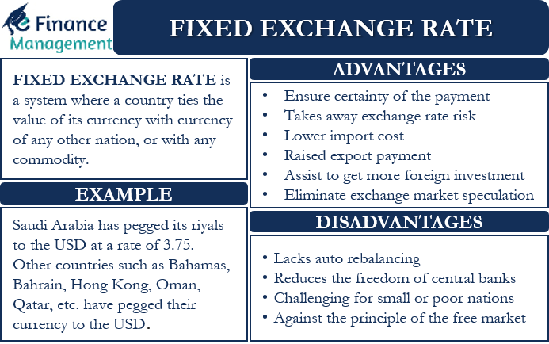

## Table of Contents

## What is a dual exchange rate?

A dual exchange rate is when a country uses two different exchange rates for its currency at the same time. One rate is for certain types of transactions, like trade or tourism, and the other rate is for different types of transactions, like investments or capital flows. This system is usually set up by the government to control the flow of money in and out of the country and to protect the local economy.

Countries might use a dual exchange rate to make their exports cheaper and more competitive in the global market. By having a lower rate for trade, it can help local businesses sell more products abroad. At the same time, a higher rate for investments can help keep money inside the country, preventing too much money from leaving and causing economic problems. However, this system can also lead to confusion and might encourage people to find ways to take advantage of the difference between the two rates.

## How does a dual exchange rate system work?

A dual exchange rate system means a country uses two different rates for its money at the same time. One rate is used for things like buying and selling goods with other countries or for tourists. This rate is often lower to make the country's products cheaper and more attractive to buyers from other places. The other rate is used for different things, like moving money in and out of the country for investments. This rate is usually higher to keep more money inside the country and stop too much from leaving.

The government decides which rate to use for which transactions. For example, if you're a business selling things to other countries, you'll use the lower rate. But if you're an investor wanting to move money out of the country, you'll use the higher rate. This system can help the country's economy by making its products cheaper abroad and keeping more money at home. But it can also be confusing and some people might try to use the difference between the rates to make money in ways that aren't allowed.

## What are the main reasons a country might implement a dual exchange rate?

A country might use a dual exchange rate to help its economy. One big reason is to make its products cheaper for people in other countries to buy. By using a lower exchange rate for trade, the country's goods become more competitive in the global market. This can help local businesses sell more and grow, which is good for the country's economy.

Another reason is to keep money inside the country. By having a higher exchange rate for investments and moving money around, the country can stop too much money from leaving. This can protect the local economy from problems that might happen if a lot of money goes out. But, using two different rates can be confusing and might lead to people trying to take advantage of the difference between the rates.

## Can you provide historical examples of countries that have used dual exchange rates?

One example of a country that used a dual exchange rate is Argentina. In the 1980s, Argentina had big economic problems. They used a dual exchange rate to try and fix things. They had one rate for trade and another for moving money in and out of the country. This was meant to help their businesses sell more abroad and keep money inside Argentina. But it was hard to manage and caused some problems.

Another example is China. In the 1980s and 1990s, China used a dual exchange rate too. They had one rate for trade and another for other things like investments. This helped China make their products cheaper for other countries to buy, which helped their economy grow a lot. But like Argentina, it was tricky to handle and could lead to people trying to use the difference in rates to make money in ways that weren't allowed.

## What are the potential benefits of a dual exchange rate system for a country's economy?

A dual exchange rate system can help a country's economy by making its products cheaper for other countries to buy. When a country uses a lower exchange rate for trade, it means their goods cost less in foreign markets. This can help local businesses sell more abroad, which is good for the economy. More sales can lead to more jobs and more money coming into the country, helping it grow.

Another benefit is that a dual exchange rate can help keep money inside the country. By using a higher exchange rate for investments and moving money around, a country can stop too much money from leaving. This can protect the economy from problems that might happen if a lot of money goes out. Keeping money inside the country can help make it more stable and support local businesses and jobs.

## What are the common criticisms or limitations of dual exchange rate systems?

One big problem with dual exchange rate systems is that they can be very confusing. Having two different rates for the same currency can make it hard for people to understand how much money they are really using. This can make it difficult for businesses to plan and for people to make financial decisions. Also, the government has to decide which rate to use for which transactions, and this can be tricky to manage. If the rules are not clear, it can lead to mistakes and disagreements.

Another issue is that dual exchange rates can encourage people to try and take advantage of the difference between the two rates. Some might find ways to move money around to use the lower rate when they should be using the higher one. This can lead to illegal activities like black market trading, where people trade money at rates that are not allowed by the government. These activities can hurt the economy and make it harder for the government to control the flow of money.

Overall, while dual exchange rate systems can help a country's economy by making its products cheaper abroad and keeping money inside the country, they also come with challenges. The confusion and potential for illegal activities can make it hard for the system to work well. Countries need to carefully think about these problems when deciding to use a dual exchange rate system.

## How does a dual exchange rate affect international trade and foreign investment?

A dual exchange rate can help a country's products become cheaper in other countries. When a country uses a lower rate for trade, it makes their goods cost less in foreign markets. This can make more people from other countries want to buy these products. More sales can help the country's businesses grow and create more jobs. This is good for the country's economy because it brings in more money from abroad.

On the other hand, a dual exchange rate can make foreign investors think twice before putting their money into the country. If the rate for investments is higher, it means less money for investors when they want to take their money out. This can make them worried about getting a good return on their investment. So, they might decide to invest their money somewhere else where the exchange rate is easier to understand and more predictable. This can slow down the country's growth because foreign investment can help create jobs and bring in new technology.

## What are the differences between a dual exchange rate and other exchange rate systems like fixed or floating rates?

A dual exchange rate system means a country uses two different rates for its money at the same time. One rate is for things like buying and selling goods with other countries, and it's usually lower to make the country's products cheaper and more attractive to buyers from other places. The other rate is for moving money in and out of the country, like investments, and it's usually higher to keep more money inside the country. This system can help the country's economy by making its products cheaper abroad and keeping more money at home, but it can also be confusing and lead to people trying to take advantage of the difference between the rates.

A fixed exchange rate is when a country's government decides to keep its currency's value the same compared to another country's money. This can make trade and investments easier to predict because the rate doesn't change. But if the government can't keep the rate fixed, it can lead to big economic problems. A floating exchange rate is when a country lets the value of its money change based on what people want to buy and sell. This can make the rate go up and down a lot, which can be good for adjusting to changes in the economy but can also make it hard for businesses to plan because they don't know what the rate will be in the future. Each system has its own way of helping or hurting the country's economy.

## How do dual exchange rates impact currency speculation and black market activities?

Dual exchange rates can make currency speculation more common. When a country uses two different rates for its money, people might try to guess which rate will change and how they can make money from it. They might buy and sell the currency at the right time to use the difference between the two rates to their advantage. This can lead to a lot of people trying to make quick money, which can make the currency's value go up and down a lot. This can be bad for the country's economy because it can make it hard for businesses to plan and for the government to control the money.

Dual exchange rates can also lead to more black market activities. When there are two rates, some people might find ways to move money around to use the lower rate when they should be using the higher one. This can lead to illegal trading where people buy and sell money at rates that are not allowed by the government. These activities can hurt the economy because they can make it hard for the government to control the flow of money. It can also lead to less trust in the country's money and make it harder for the government to manage the economy.

## What are the challenges faced by policymakers in managing a dual exchange rate system?

Managing a dual exchange rate system can be really hard for policymakers. They have to decide which rate to use for which transactions, like trade or investments. This can be confusing and tricky to manage. If the rules are not clear, it can lead to mistakes and disagreements. Policymakers also have to make sure that people follow the rules and don't try to use the difference between the two rates to make money in ways that aren't allowed. This can be a big challenge because it requires a lot of monitoring and enforcement.

Another challenge is that dual exchange rates can lead to currency speculation and black market activities. People might try to guess which rate will change and how they can make money from it. This can make the currency's value go up and down a lot, which can be bad for the economy. Policymakers have to find ways to stop these activities and keep the currency stable. It's a tough job because they need to balance the benefits of having two rates, like making products cheaper abroad and keeping money inside the country, with the risks of confusion and illegal trading.

## How can dual exchange rates be used as a tool for economic reform or stabilization?

Dual exchange rates can be a tool for economic reform or stabilization by making a country's products cheaper for people in other countries to buy. When a country uses a lower exchange rate for trade, it helps their goods cost less in foreign markets. This can help local businesses sell more abroad, which is good for the economy. More sales can lead to more jobs and more money coming into the country, helping it grow. This can be part of a plan to fix economic problems by boosting trade and making the economy stronger.

At the same time, dual exchange rates can help keep money inside the country. By using a higher exchange rate for investments and moving money around, the country can stop too much money from leaving. This can protect the economy from problems that might happen if a lot of money goes out. Keeping money inside the country can help make it more stable and support local businesses and jobs. Policymakers can use this system to help stabilize the economy during tough times and guide it towards better growth and stability.

## What advanced economic theories or models explain the effectiveness or ineffectiveness of dual exchange rates?

Dual exchange rates can be looked at through the lens of economic theories like the Mundell-Fleming model, which explains how countries can use different exchange rates to control their economy. This model says that a country can use a lower rate for trade to make its products cheaper abroad, which can help increase exports and boost the economy. At the same time, a higher rate for investments can keep money inside the country, preventing too much money from leaving and causing economic problems. But this model also shows that dual exchange rates can lead to problems like currency speculation, where people try to make money from the difference between the rates, which can make the economy unstable.

Another theory that helps explain dual exchange rates is the balance of payments model. This model looks at how a country's money coming in and going out affects its economy. Using a dual exchange rate can help a country balance its trade and investments better. For example, a lower rate for trade can help fix a trade deficit by making exports cheaper, while a higher rate for investments can control capital outflows. However, this model also points out that dual exchange rates can be hard to manage and might lead to black market activities, where people trade money at rates that are not allowed by the government. These activities can hurt the economy and make it harder for the government to control the flow of money.

## What are Currency Valuation Models?

Currency valuation involves a comprehensive and intricate process for determining the exchange rates between currencies. Several models are instrumental in this process, offering distinct approaches to the analysis and prediction of currency values. Among the most recognized are the Real Effective Exchange Rate (REER), Purchasing Power Parity (PPP), and Behavioral Equilibrium Exchange Rate (BEER). Each model leverages different factors such as trade balances, price levels, productivity, and macroeconomic indicators, thereby providing unique insights into currency valuation.

The Real Effective Exchange Rate (REER) is a commonly used currency valuation model that measures a country's currency value against a basket of other currencies, adjusted for inflation differentials. This model provides a broader perspective on a currency's competitive position in the international market. It helps in assessing whether a currency is undervalued or overvalued by considering the relative cost and price levels across trading partners. Mathematically, REER can be expressed and calculated using the following formula:

$$

\text{REER} = \prod_{i=1}^{n} \left( \frac{E_{i} \times \frac{P}{P_{i}}}{W_{i}} \right)
$$

where $E_{i}$ is the nominal bilateral exchange rate with country $i$, $P$ is the domestic price level (usually using a CPI or GDP deflator), $P_{i}$ is the foreign price level, and $W_{i}$ is the trade weight with country $i$.

Purchasing Power Parity (PPP) is another fundamental model in currency valuation, based on the law of one price which suggests that in absence of transaction costs and barriers, identical goods should have the same price in different countries when prices are expressed in a common currency. The PPP model assumes that exchange rates between two currencies will adjust to reflect changes in price levels between the two countries. It is expressed as:

$$

S = \frac{P_{1}}{P_{2}} 
$$

where $S$ is the exchange rate, $P_{1}$ is the cost of good $X$ in country 1, and $P_{2}$ is the cost of the same good in country 2. While PPP is insightful for long-term assessment of currency values, its assumption of perfect markets makes it less reliable in the short-term when market imperfections play a larger role.

The Behavioral Equilibrium Exchange Rate (BEER) model combines economic fundamentals with market dynamics, aiming to determine an equilibrium exchange rate that reflects both cyclical and structural developments. The BEER approach evaluates factors such as productivity differentials, net foreign assets, and terms of trade. This model is employed to identify exchange rate misalignments and forecast future movements based on broader economic conditions.

Understanding these models is essential for anticipating misalignments and forecasting future currency values. They enable economists and financial analysts to interpret market signals, evaluate the alignment of currency prices with economic fundamentals, and guide policy decisions. By analyzing how different variables impact exchange rates, these models contribute significantly to effective currency risk management and strategic decision-making within international finance.

## References & Further Reading

[1]: Krugman, P., & Obstfeld, M. (2014). ["International Economics: Theory and Policy."](https://www.pearson.com/se/Nordics-Higher-Education/subject-catalogue/economics/International-Economics-Theory-and-Policy-Krugman.html) Pearson Education.

[2]: Calvo, G. A., & Reinhart, C. M. (2002). ["Fear of Floating."](https://www.nber.org/papers/w7993) The Quarterly Journal of Economics, 117(2), 379-408.

[3]: Lo, A. W., & MacKinlay, A. C. (1999). ["A Non-Random Walk Down Wall Street."](https://www.jstor.org/stable/j.ctt7tccx) Princeton University Press.

[4]: Jouini, E., & Napp, C. (2006). ["Heterogeneous Beliefs and Asset Pricing in Discrete Time: An Analysis of Kreps-Porteus Specifications."](https://journals.sagepub.com/doi/10.1177/01461672221125619?icid=int.sj-full-text.citing-articles.34) The Review of Economic Studies, 73(4), 957-984.

[5]: Mehrling, P. (2011). ["The New Lombard Street: How the Fed Became the Dealer of Last Resort."](https://www.jstor.org/stable/j.ctt7sgxz) Princeton University Press.