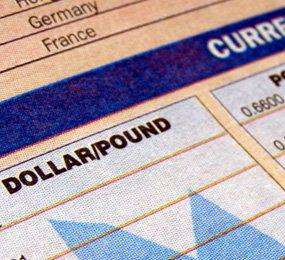

The world of finance is complex and multifaceted, with currency valuation playing a pivotal role in shaping global economic interactions. Navigating the intricacies of exchange rate systems is crucial for anyone engaged in international trade and finance. One system of particular interest is the dual exchange rate system, a mechanism where two parallel exchange rates coexist, typically involving a market-determined rate alongside a government-imposed rate. This configuration allows countries to stabilize their economies during periods of financial turbulence by controlling capital flows and stabilizing foreign exchange reserves. However, such systems also present significant challenges, including the potential emergence of arbitrage opportunities and black markets.

In exploring these concepts, we must also consider the growing influence of algorithmic trading. This technology-driven approach leverages complex mathematical algorithms to execute trades at speeds and efficiencies impossible for human traders. Algorithmic trading's integration within currency markets has revolutionized trading strategies, providing tools to cope with dynamic and volatile market conditions.



This article aims to elucidate the interplay between currency valuation, dual exchange rate systems, and algorithmic trading. By examining how these systems operate and interact, we can better understand their implications on global commerce, offering valuable insights to traders, policymakers, and academics alike.

## Table of Contents

## Currency Valuation Models

Currency valuation involves a comprehensive and intricate process for determining the exchange rates between currencies. Several models are instrumental in this process, offering distinct approaches to the analysis and prediction of currency values. Among the most recognized are the Real Effective Exchange Rate (REER), Purchasing Power Parity (PPP), and Behavioral Equilibrium Exchange Rate (BEER). Each model leverages different factors such as trade balances, price levels, productivity, and macroeconomic indicators, thereby providing unique insights into currency valuation.

The Real Effective Exchange Rate (REER) is a commonly used currency valuation model that measures a country's currency value against a basket of other currencies, adjusted for inflation differentials. This model provides a broader perspective on a currency's competitive position in the international market. It helps in assessing whether a currency is undervalued or overvalued by considering the relative cost and price levels across trading partners. Mathematically, REER can be expressed and calculated using the following formula:

$$

\text{REER} = \prod_{i=1}^{n} \left( \frac{E_{i} \times \frac{P}{P_{i}}}{W_{i}} \right)
$$

where $E_{i}$ is the nominal bilateral exchange rate with country $i$, $P$ is the domestic price level (usually using a CPI or GDP deflator), $P_{i}$ is the foreign price level, and $W_{i}$ is the trade weight with country $i$.

Purchasing Power Parity (PPP) is another fundamental model in currency valuation, based on the law of one price which suggests that in absence of transaction costs and barriers, identical goods should have the same price in different countries when prices are expressed in a common currency. The PPP model assumes that exchange rates between two currencies will adjust to reflect changes in price levels between the two countries. It is expressed as:

$$

S = \frac{P_{1}}{P_{2}} 
$$

where $S$ is the exchange rate, $P_{1}$ is the cost of good $X$ in country 1, and $P_{2}$ is the cost of the same good in country 2. While PPP is insightful for long-term assessment of currency values, its assumption of perfect markets makes it less reliable in the short-term when market imperfections play a larger role.

The Behavioral Equilibrium Exchange Rate (BEER) model combines economic fundamentals with market dynamics, aiming to determine an equilibrium exchange rate that reflects both cyclical and structural developments. The BEER approach evaluates factors such as productivity differentials, net foreign assets, and terms of trade. This model is employed to identify exchange rate misalignments and forecast future movements based on broader economic conditions.

Understanding these models is essential for anticipating misalignments and forecasting future currency values. They enable economists and financial analysts to interpret market signals, evaluate the alignment of currency prices with economic fundamentals, and guide policy decisions. By analyzing how different variables impact exchange rates, these models contribute significantly to effective currency risk management and strategic decision-making within international finance.

## Understanding Dual Exchange Rate Systems

A dual exchange rate system is a monetary policy tool where a country operates with two different exchange rates: a fixed rate and a floating rate, applied to distinct sectors or types of transactions. This system often emerges as a response to economic crises, providing governments with a mechanism to stabilize their economies by protecting foreign reserves and limiting capital flight. Under such a system, the fixed rate is typically applied to essential sectors like food and energy imports, while the floating rate is used for less critical sectors or capital transactions.

The primary advantage of this system is its ability to defend a country's foreign reserves. By maintaining a fixed exchange rate for critical imports, essential goods remain affordable despite external economic pressures. Furthermore, it can deter capital flight by controlling currency exchange in sectors prone to rapid capital movement. However, the dual exchange rate system also poses several challenges. Discrepancies between the fixed and floating rates can create opportunities for [arbitrage](/wiki/arbitrage) and the development of black markets, where currencies are exchanged at unofficial rates, leading to potential economic distortions and loss of government control over monetary policy.

An illustrative historical example of a dual exchange rate system is Argentina's experience in 2001. Faced with a severe economic crisis, Argentina implemented a dual exchange rate regime in an attempt to prevent capital flight and stabilize the economy. While initially successful in maintaining essential imports at stable prices, it soon led to the emergence of a black market for currency trading. The fixed rate became unsustainable due to inflationary pressures and a depletion of foreign reserves, eventually pushing the government to abandon the dual rate system and adopt a unified floating rate. This shift culminated in substantial currency depreciation and economic instability, highlighting the potential pitfalls of implementing dual exchange rate systems without robust complementary economic policies. Such historical experiences underscore both the potential benefits and risks associated with dual exchange rate systems, stressing the need for careful management and strategic implementation to mitigate adverse outcomes.

## Algorithmic Trading in Currency Markets

Algorithmic trading utilizes sophisticated computer programs to automate and optimize trading activities in the currency markets, enhancing both the speed and precision of transactions. These algorithms execute trades based on predefined criteria, minimizing human intervention and thus reducing the impact of emotional decision-making on trading outcomes. In the foreign exchange ([forex](/wiki/forex-system)) markets, [algorithmic trading](/wiki/algorithmic-trading) has become a cornerstone strategy due to its ability to process large volumes of data and execute trades in milliseconds.

Several core strategies are employed within algorithmic trading in forex markets, each with unique approaches and benefits:

1. **Statistical Arbitrage**: This strategy involves the use of statistical methods to identify and exploit short-term price discrepancies between currency pairs. Traders deploy models to determine the probability of a price relationship between different currencies returning to its historical mean. For instance, if two currencies have historically moved in tandem and deviate from this pattern, an algorithm might predict a reversion, executing trades to profit from the expected convergence.

2. **Trend-Following**: This strategy is based on technical analysis and the identification of trends in currency price movements. Algorithms are programmed to recognize patterns and indicators, such as moving averages or momentum indicators, to capitalize on upward or downward trends. By automatically executing trades that align with these trends, traders can systematically benefit from sustained market movements.

3. **High-Frequency Trading (HFT)**: High-frequency trading strategies rely on ultra-fast execution and access to real-time data to capitalize on small price changes across massive numbers of trades. HFT algorithms are designed to enter and exit trades within fractions of a second, requiring sophisticated infrastructure to ensure latency is minimized. This method seeks to exploit extremely short-lived market inefficiencies.

These algorithmic trading strategies offer significant advantages, including enhanced trading efficiency and the reduction of human biases that can impede decision-making. By automating trade execution, algorithms ensure consistency and speed, factors critical to success in the highly volatile and liquid forex markets. Additionally, algorithmic strategies can adapt to changing market conditions, employing real-time data feeds and advanced analytical tools to modify their actions dynamically.

The integration of algorithmic trading into currency markets underscores the growing importance of technology in finance. As market conditions continue to fluctuate, the demand for systems that can rapidly respond to new information and strategically position trades becomes ever more crucial for traders seeking to maintain a competitive edge.

## The Intersection of Dual Exchange Rates and Algorithmic Trading

Combining dual exchange rate systems with algorithmic trading presents both opportunities and challenges for market participants. Dual exchange rate systems, which employ different exchange rates for various sectors or transactions, can introduce market inefficiencies. These inefficiencies may arise due to discrepancies between the fixed and floating rates, providing potential arbitrage opportunities for traders. Algorithmic trading, characterized by rapid execution speeds and minimal human intervention, can be strategically used to identify and exploit these discrepancies by deploying sophisticated models that analyze price differentials and execute trades with precision.

However, the advantages of algorithmic trading in a dual exchange rate environment are counterbalanced by inherent risks. Volatility is a significant concern; the abrupt changes in exchange rates can dramatically impact trading strategies. Algorithmic systems rely on historical data and patterns, but sudden shifts in rate policies or economic conditions could lead to unexpected outcomes. Traders employing algorithmic techniques must therefore design systems that can adapt quickly to new information and volatile conditions, without incurring excessive losses.

In addition to market [volatility](/wiki/volatility-trading-strategies), regulatory changes pose a substantial risk. Governments may introduce adjustments to dual exchange rates with little or no warning, significantly affecting market dynamics. Algorithmic traders operating in these environments need to ensure compliance with evolving regulations while maintaining system agility. This often involves constant monitoring of policy announcements and updating algorithmic parameters in real time.

Success in leveraging algorithmic trading within dual exchange rate systems hinges on advanced analytical tools. Machine learning and [artificial intelligence](/wiki/ai-artificial-intelligence) can enhance predictive accuracy by processing vast amounts of market data and identifying subtle patterns often invisible to human traders. These technologies enable the development of adaptive algorithms that can dynamically adjust to new market conditions, thereby increasing the likelihood of profitable trades.

In summary, while the intersection of dual exchange rate systems and algorithmic trading brings unique opportunities to capitalize on market inefficiencies, it also demands a high level of adaptability and technological sophistication. Traders must remain vigilant in the face of rapid market changes and regulatory developments, employing cutting-edge tools and strategies to navigate this complex landscape successfully.

## Case Studies and Real-World Applications

Analyzing case studies such as Venezuela and Zimbabwe provides insights into dual exchange rate systems' real-world applications and outcomes. These countries offer illustrative examples of the challenges and implications of implementing dual exchange rate systems under economic distress.

### Venezuela

Venezuela implemented a dual exchange rate system as a response to economic hardships and hyperinflation. The government set official rates for essential imports while a parallel market rate accommodated other financial transactions. This system was intended to protect foreign reserves by prioritizing crucial imports and curbing capital flight. However, the discrepancy between official and parallel market rates created significant economic distortions. Businesses struggled to operate within a system rife with inconsistencies, often resorting to the black market to meet financial needs. The dual rate eventually exacerbated inflation and led to further economic instability, underscoring the potential pitfalls of such systems if not carefully managed.

### Zimbabwe

Zimbabwe's experience with a dual exchange rate system emerged during a period of hyperinflation and economic collapse. In an attempt to stabilize the economy, the Zimbabwean government used a fixed official exchange rate alongside a flexible parallel rate. Like Venezuela, this system aimed to manage foreign currency for critical imports and services. However, rampant inflation coupled with policy mismanagement resulted in widespread currency devaluation and the proliferation of a black market. This system's failure highlighted the importance of aligning exchange rate policies with transparent economic reforms to avoid further disenchantment and economic decline.

### Algorithmic Trading Firms

In contrast to the macroeconomic-focused challenges faced by countries like Venezuela and Zimbabwe, algorithmic trading firms operate on microeconomic efficiencies. Successful firms leverage technology to optimize trading strategies and execute trades with precision. For instance, firms employing high-frequency trading models capitalize on minute price disparities across different exchanges, [earning](/wiki/earning-announcement) profits from rapid, automated transactions. The application of statistical models and [machine learning](/wiki/machine-learning) algorithms allows for adaptive strategies, accommodating real-time market dynamics.

Code Example:

```python
import pandas as pd
from sklearn.linear_model import LinearRegression

# Example: Using Linear Regression to model currency price prediction
data = pd.read_csv('currency_data.csv')
X = data[['feature1', 'feature2', 'feature3']]
y = data['currency_price']

model = LinearRegression().fit(X, y)

predicted_prices = model.predict(X)
```

This pairing of technology and trading exemplifies how adaptive algorithms enhance market efficiency, providing firms with a competitive edge.

### Lessons Learned

By studying Venezuela and Zimbabwe, it is evident that dual exchange rate systems need careful calibration to prevent economic imbalance. The lessons drawn emphasize the necessity of transparent policy implementation and coherent economic strategies to mitigate adverse outcomes. Meanwhile, the success of algorithmic trading firms demonstrates the transformative potential of technology in currency markets. These insights underscore the importance of integrating sound economic principles with cutting-edge technology to address the complexities of modern currency valuation and trading.

## Conclusion

Currency valuation and exchange rate systems are integral components of international finance, significantly influencing global trade and investment dynamics. The mechanisms by which currencies are valued and exchanged shape the flow of capital across borders, affecting economic stability and growth. Within this complex framework, dual exchange rate systems offer a unique approach to managing a nation's financial exposure and stability. By applying different exchange rates to varied transactions or sectors, countries can mitigate adverse economic impacts during crises, deter capital flight, and conserve foreign reserves. However, these systems also pose challenges, such as the potential emergence of parallel markets and inconsistencies in economic signals.

In parallel, the evolution of technology has ushered in sophisticated tools such as algorithmic trading, which have reshaped currency trading practices. By utilizing advanced computer algorithms to execute trades at optimal speeds and efficiency, this technological innovation addresses human limitations like bias and inefficiency. The ability to harness data, identify patterns, and swiftly react to market changes allows traders to navigate the complexities of currency markets more adeptly.

Combining these innovations—dual exchange systems and algorithmic trading—presents both opportunities and challenges. Algorithmic trading can exploit the inefficiencies inherent in dual systems, yet it requires an astute understanding of market risks, including volatility and regulatory shifts. Traders and policymakers must remain vigilant, equipped with sophisticated analytical tools and strategies to maintain a competitive edge and safeguard economic interests.

As technology advances and policy landscapes evolve, staying informed and adaptable is crucial. The rapid pace of change necessitates that stakeholders continuously refine their approaches to currency valuation and exchange rate management. This adaptability will ensure the effective navigation of modern financial markets, supporting both national economic objectives and robust international trade.

## References & Further Reading

[1]: Krugman, P., & Obstfeld, M. (2014). ["International Economics: Theory and Policy."](https://www.pearson.com/se/Nordics-Higher-Education/subject-catalogue/economics/International-Economics-Theory-and-Policy-Krugman.html) Pearson Education.

[2]: Calvo, G. A., & Reinhart, C. M. (2002). ["Fear of Floating."](https://www.nber.org/papers/w7993) The Quarterly Journal of Economics, 117(2), 379-408.

[3]: Lo, A. W., & MacKinlay, A. C. (1999). ["A Non-Random Walk Down Wall Street."](https://www.jstor.org/stable/j.ctt7tccx) Princeton University Press.

[4]: Jouini, E., & Napp, C. (2006). ["Heterogeneous Beliefs and Asset Pricing in Discrete Time: An Analysis of Kreps-Porteus Specifications."](https://journals.sagepub.com/doi/10.1177/01461672221125619?icid=int.sj-full-text.citing-articles.34) The Review of Economic Studies, 73(4), 957-984.

[5]: Mehrling, P. (2011). ["The New Lombard Street: How the Fed Became the Dealer of Last Resort."](https://www.jstor.org/stable/j.ctt7sgxz) Princeton University Press.