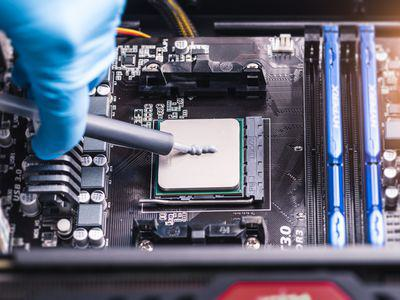

In recent years, technological advancements have significantly transformed payment systems, particularly with the emergence of contactless payments. These innovations offer a rapid and efficient transaction method through the use of dual interface chip cards. Dual interface cards are sophisticated payment instruments integrating smart technology that enables both contact and contactless transactions, effectively addressing the evolving needs of consumers for speed and convenience.

Contactless payment technology employs dual interface chip cards that utilize embedded chips and antennas, allowing secure and swift transactions via Radio Frequency Identification (RFID) or Near Field Communication (NFC). This capability supports the seamless shift from traditional payment methods, such as swiping or inserting cards, to a more streamlined, tap-and-go experience. This adoption reflects consumer preferences for quicker exchanges and minimal physical interaction, factors that have been further amplified by the global emphasis on contactless interactions during events such as the COVID-19 pandemic.

Parallel to changes in payment systems, advancements in financial technology, specifically algorithmic trading, also exemplify technology's profound impact on finance. Algorithmic trading leverages computational algorithms to execute trades at high velocities, optimizing decision-making in financial markets. This advancement in trading is part of the broader fintech revolution, underscoring how technology reshapes various facets of the financial industry.

This article examines the intricate technology behind dual interface chip cards and its significant role in transforming contactless payments and algorithmic trading. As these technologies progress, they promise to enhance user experiences and play a crucial part in the ongoing modernization of financial services. Understanding these advancements is crucial for stakeholders looking to remain competitive and responsive in a rapidly evolving financial landscape.

## Table of Contents

## Understanding Dual Interface Chip Cards

Dual interface chip cards serve as a crucial link between traditional and modern payment systems, offering flexibility and convenience through their dual functionality. These cards are engineered to support both contact and contactless transactions, meeting the diverse needs of today's consumers. 

At the core of dual interface chip cards is the EMV chip, which adheres to the Europay, Mastercard, and Visa (EMV) standards. This chip is responsible for secure contact-based transactions when inserted into a card reader. The EMV chip contains a microprocessor that provides authentication through advanced cryptographic techniques, significantly enhancing the security of transactions by reducing the likelihood of card cloning and fraud.

In parallel, dual interface cards incorporate an embedded antenna that enables contactless transactions via Radio Frequency Identification (RFID) or Near Field Communication (NFC) technology. This antenna facilitates communication between the card and payment terminal without physical contact, allowing for faster transaction speeds. In a typical NFC transaction, the card is held within a few centimeters of the terminal, and data is transmitted wirelessly through electromagnetic fields.

The integration of these technologies within a single card not only improves convenience but also elevates transaction efficiency. Contactless transactions reduce processing time as they typically do not require a Personal Identification Number (PIN) for small value transactions, streamlining consumer experience in high-[volume](/wiki/volume-trading-strategy) retail environments.

Additionally, dual interface chip cards enhance payment security by using dynamic data authentication, which generates a unique code for each transaction. This mechanism significantly diminishes the risks associated with static data, such as that found on traditional magnetic stripe cards, further safeguarding consumer information.

The adoption of dual interface chip cards reflects a broader shift towards more adaptable and resilient payment systems. Their design anticipates the future needs of consumers by providing a versatile tool capable of adapting to varied transactional settings, whether in physical retail locations or emerging digital ecosystems.

## The Rise of Contactless Payments

Contactless payments have emerged as a popular choice among consumers due to their convenience and rapid processing times. Unlike traditional payment methods, which often require physical contact and additional processing steps, contactless payments utilize near-field communication (NFC) technology to facilitate transactions almost instantaneously. This advancement reduces the need for swiping or inserting cards, thereby streamlining the payment process.

The COVID-19 pandemic significantly propelled the adoption of contactless payment technologies. As public health concerns highlighted the importance of minimizing physical interactions, both consumers and businesses sought safer alternatives to cash and contact-based transactions. In response, global financial institutions and retailers accelerated the implementation of contactless systems, witnessing a marked increase in their usage. According to a report by Visa, contactless payment volumes surged by as much as 30% during the pandemic, underscoring a pronounced shift in consumer behavior.

In this evolving payment landscape, dual interface chip cards play a critical role. These cards are equipped with a microprocessor chip for contact payments and an antenna for contactless transactions, combining flexibility and user convenience. By supporting both methods, dual interface chip cards cater to diverse user preferences, ensuring seamless transactions in varying contexts. Consequently, these cards have become instrumental in meeting the burgeoning demand for contactless payments.

Market projections indicate significant growth potential for contactless payment systems. Transparency Market Research forecasts that the global contactless payment market, valued at approximately $6.70 billion in 2019, is expected to reach $20.03 billion by 2027, reflecting a compound annual growth rate (CAGR) of over 11%. This expansion is driven by increasing consumer preference for speed and safety, coupled with ongoing advancements in payment technology.

The future of contactless payments looks promising as financial institutions continue to innovate and improve user experience. Continual enhancements in security protocols, coupled with technological advancements, are likely to further establish contactless systems as a primary payment method worldwide. This transformation not only aligns with current consumer expectations but also sets the foundation for a more efficient and interconnected financial ecosystem.

## Technological Impact on Financial Services: Algo Trading

Algorithmic trading has emerged as a pivotal advancement within financial services, driven by rapid technological progress. This form of trading relies on sophisticated algorithms capable of executing complex trading strategies with speed and precision that far surpasses human capabilities. By analyzing vast datasets and processing information quickly, [algorithmic trading](/wiki/algorithmic-trading) optimizes decision-making, leading to potentially higher returns and minimized risks.

The core advantage of algorithmic trading stems from its ability to reduce manual intervention, thereby eliminating human errors and emotional bias. Trading algorithms utilize specific sets of instructions based on timing, price, and quantity, which enables traders to automatically execute thousands of trades per second. The backbone of these systems often involves high-frequency trading ([HFT](/wiki/high-frequency-trading-strategies)), characterized by an immense number of orders executed at lightning speed to capitalize on minute price discrepancies.

Moreover, the synergy between fintech developments and financial markets has further propelled the capabilities of algorithmic trading. The incorporation of [machine learning](/wiki/machine-learning) and [artificial intelligence](/wiki/ai-artificial-intelligence) into trading algorithms allows for enhanced prediction accuracy through pattern recognition and data analysis. This not only refines trading strategies but also supports real-time adjustments to market conditions.

Smart card technology, although primarily associated with secure payment transactions, plays a role in safeguarding algorithmic trading platforms as well. The integration of secure authentication methods and encryption ensures that these trading systems are fortified against unauthorized access and potential cyber threats.

The continuous evolution of technology in financial services expands the strategic tools available for traders. By leveraging computational advances, algorithmic trading systems can efficiently analyze multidimensional data and execute trades that reflect optimized pricing models. The financial industry now relies heavily on these technological innovations to shape trading strategies, offering a competitive edge that hinges on massive data analysis and rapid execution.

As algorithmic trading systems grow more complex, they also create a dynamic landscape requiring ongoing technological enhancements. For instance, high-speed data feeds, low latency networks, and powerful computing capabilities are essential components for maintaining trading performance. Through the adoption of cutting-edge technology, financial institutions continually enhance their trading frameworks to remain competitive.

In conclusion, the integration of technology substantially influences financial services, with algorithmic trading epitomizing this transformation. By embracing technological innovations, the financial industry adapts its strategies and execution methods, maintaining its pace with evolving market demands and enhancing its service offerings.

## Challenges and Opportunities

Contactless payments and algorithmic trading bring several advantages, but they also raise significant challenges. One of the primary concerns is the security vulnerabilities inherent in these technologies. Contactless payments, while convenient, are susceptible to various forms of cybercrime such as data theft and skimming. Malicious actors can exploit the wireless nature of these transactions to intercept card information, highlighting the need for robust encryption and security protocols. According to a study by Kaspersky Lab, contactless cards can, in some instances, be cloned using readily available tools if not adequately protected.[^1]

The dual interface chip cards used in contactless payments come with higher production costs. The integration of both an EMV chip and a radio frequency antenna into a single card requires advanced manufacturing processes and materials, impacting the overall cost. For card issuers, this means balancing the initial investment against long-term benefits like increased customer satisfaction and transaction efficiency.

Widespread infrastructure updates pose another substantial challenge. Many businesses need to upgrade or replace existing payment terminals to accept contactless payments, which can be costly and time-consuming. This requirement is particularly challenging for small businesses with limited financial resources. Nevertheless, the expansion of contactless infrastructure is crucial to fully leverage the technology's benefits.

Despite these challenges, the opportunities presented by contactless payments and algorithmic trading are significant. For businesses and consumers, these technologies facilitate a more connected and agile financial ecosystem. Contactless payments enhance the transaction process, reducing bottlenecks at the point of sale and improving overall customer experience. This efficiency can translate into higher sales volumes and increased customer loyalty for businesses that adopt the technology.

Algorithmic trading, leveraging advanced software algorithms, optimizes trading decisions and execution speed, providing competitive advantages in financial markets. This technology attracts both institutional and retail investors by offering more precise market predictions and reduced transaction costs. As a result, financial entities that embrace algorithmic trading can enhance their performance and profitability.

In conclusion, navigating the challenges and seizing the opportunities presented by contactless payments and algorithmic trading are crucial for financial services. Addressing security vulnerabilities, managing production costs, and updating infrastructure are fundamental steps toward maximizing the potential of these technologies. By doing so, businesses and consumers alike can partake in a more efficient, secure, and dynamic financial landscape.

[^1]: Kaspersky Lab. "The Cost of Convenience: Security Risks of Contactless Payment." 2020.

## Conclusion

As dual interface chip cards and contactless payment technologies continue to evolve, their integration within payment and trading systems is expected to expand significantly. This evolution reflects a broader trend towards the digitization of financial services, driven primarily by consumer demand for streamlined, efficient, and secure transaction methods.

The introduction of dual interface chip cards has played a crucial role in enhancing user experience by providing a hybrid solution that combines the practicality of traditional card payments with the convenience of contactless technology. The dual interface capability allows these cards to support both EMV (Europay, MasterCard, and Visa) standards for physical transactions and RFID/NFC technologies for contactless interactions. This design not only facilitates quicker and frictionless transactions but also improves security measures through advanced encryption and the ability to operate in both online and offline environments.

Looking ahead, it is imperative for financial entities, including banks and trading firms, to embrace these technological advancements. By doing so, they can remain competitive and better align with the evolving expectations of consumers who increasingly favor contactless solutions for their speed and simplicity. Furthermore, the integration of such technology into algorithmic trading systems exemplifies the potential for increased efficiency and accuracy in executing trades, thereby optimizing market strategies.

In conclusion, the growing influence of contactless payments and algorithmic trading signifies a transformative shift within the financial services industry. These developments are not just peripheral enhancements but core components of a broader modernization effort. Financial institutions that prioritize the adoption of these technologies will be better positioned to capitalize on new opportunities, secure customer loyalty, and maintain a leading edge in an increasingly digital marketplace.

## References & Further Reading

[1]: ["The Impact of EMV Chip Technology on Fraudulent Transactions."](https://evssolutions.com/insights/the-impact-of-emv-chip-and-pin-on-fraud/) EMVCo.

[2]: Visa. ["Contactless Payments: The Future of Transaction."](https://navigate.visa.com/na/spending-insights/tapping-into-the-future-of-payments/)

[3]: Transparency Market Research. ["Contactless Payment Market - Global Industry Analysis."](https://www.transparencymarketresearch.com/contactless-payments-market.html)

[4]: Kaspersky Lab. ["The Cost of Convenience: Security Risks of Contactless Payment."](https://media.kaspersky.com/pdf/it-risks-survey-report-cost-of-security-breaches.pdf)

[5]: ["Algorithmic Trading and DMA: An Introduction to Direct Access Trading Strategies"](https://www.amazon.com/Algorithmic-Trading-DMA-introduction-strategies/dp/0956399207) by Barry Johnson

[6]: ["High-Frequency Trading: A Practical Guide to Algorithmic Strategies and Trading Systems"](https://www.ahmetbeyefendi.com/wp-content/uploads/2020/07/High-Frequency-Trading-Irene-Aldridge.pdf) by Irene Aldridge