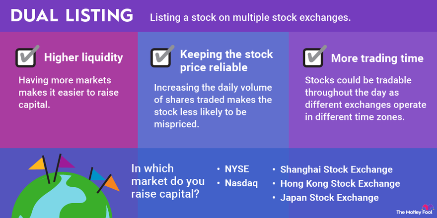

## Table of Contents

## What is a dual-listed company?

A dual-listed company is when one company is listed on two different stock exchanges at the same time. This means people can buy and sell the company's shares in two different countries. For example, a company might be listed on both the New York Stock Exchange and the London Stock Exchange. This can help the company reach more investors and make it easier for people from different countries to invest in the company.

There are a few reasons why a company might choose to be dual-listed. One reason is to increase its visibility and attract more investors from around the world. Another reason is to make it easier for the company to do business in different countries. Being listed on multiple exchanges can also help the company raise more money by selling its shares to a larger pool of investors. However, being dual-listed can also be more complicated and expensive for the company because it has to follow the rules of both stock exchanges.

## How does a dual-listed company differ from a merged company?

A dual-listed company and a merged company are different in how they are set up and operate. A dual-listed company is when one company decides to list its shares on two different stock exchanges at the same time. This means the same company has its stocks available for trading in two different countries. For example, a company might list its shares on both the New York Stock Exchange and the Tokyo Stock Exchange. The company remains one entity but its shares can be bought and sold in two different markets.

On the other hand, a merged company is created when two separate companies decide to combine into one new company. This means that the two companies no longer exist as separate entities; instead, they form a completely new company. For example, if Company A and Company B merge, they might become Company C. The shareholders of the original companies usually get shares in the new company. The goal of merging is often to combine resources, reduce competition, or achieve other strategic benefits.

In summary, the key difference is that a dual-listed company is still one company operating under its original structure but with shares traded on multiple exchanges, while a merged company involves the creation of a new entity from two previously separate companies. Both approaches have their own advantages and challenges, depending on the goals of the companies involved.

## What are the benefits of listing a company on two stock exchanges?

Listing a company on two stock exchanges can help the company reach more investors. When a company is listed on exchanges in different countries, people from those countries can easily buy and sell the company's shares. This can attract more investors and increase the demand for the company's stock. More investors can also mean more money for the company, which it can use to grow and expand its business.

Another benefit is that listing on multiple exchanges can make it easier for the company to do business in different countries. For example, if a company is listed on both the New York Stock Exchange and the London Stock Exchange, it might find it easier to attract customers and partners in both the United States and the United Kingdom. This can help the company grow its business in new markets and increase its global presence. However, listing on multiple exchanges can also be more complicated and expensive because the company has to follow the rules of both exchanges.

## Can you provide examples of dual-listed companies?

One example of a dual-listed company is BHP Group. BHP Group is a big mining company that is listed on both the Australian Securities Exchange and the London Stock Exchange. This means people in Australia and the UK can buy and sell BHP Group's shares. By being listed on two exchanges, BHP Group can reach more investors and do business more easily in both countries.

Another example is Unilever. Unilever is a company that makes food, drinks, and cleaning products. It is listed on both the London Stock Exchange and the Euronext Amsterdam. This helps Unilever attract investors from the UK and the Netherlands. Being on two exchanges can help Unilever grow its business in Europe and around the world.

These examples show how dual-listing can help companies reach more people and expand their business. But it can also be more work and cost more money because the companies have to follow the rules of both exchanges.

## What challenges might a company face when becoming dual-listed?

When a company decides to become dual-listed, it can face some challenges. One big challenge is the cost. Listing on two stock exchanges means the company has to pay fees to both exchanges. It also needs to hire lawyers and accountants who know the rules of both places. This can be expensive and take a lot of time.

Another challenge is following different rules. Each stock exchange has its own set of rules that companies must follow. For example, the rules in New York might be different from the rules in London. The company has to make sure it follows all the rules of both exchanges, which can be hard and confusing. If the company makes a mistake, it could get in trouble with one or both exchanges.

Lastly, there can be challenges with managing shareholders. When a company is listed on two exchanges, it might have shareholders in different countries. These shareholders might have different expectations and needs. The company has to communicate well with all its shareholders and make sure everyone feels valued and informed. This can be tricky, especially if there are language or cultural differences between the shareholders.

## How does the process of becoming dual-listed work?

When a company wants to become dual-listed, it first needs to choose the two stock exchanges where it wants to list its shares. The company usually picks exchanges in countries where it wants to do more business or reach more investors. Once the exchanges are chosen, the company has to follow the rules of both places. This means filling out a lot of paperwork and working with lawyers and accountants who know the rules of both exchanges. The company also has to pay fees to both exchanges, which can be expensive.

After the paperwork is done and the fees are paid, the company's shares start trading on both exchanges. This means people in both countries can buy and sell the company's shares. The company has to keep following the rules of both exchanges, which can be hard. It also has to communicate well with shareholders in both countries, who might have different expectations and needs. Even though becoming dual-listed can be challenging, it can help the company reach more investors and grow its business in new markets.

## What are the regulatory requirements for a dual-listed company?

When a company decides to become dual-listed, it must follow the rules of both stock exchanges where it wants to list its shares. Each exchange has its own set of rules that the company must follow. For example, the company might need to provide certain financial reports, follow specific trading rules, and meet certain standards for corporate governance. The company has to make sure it understands and follows all these rules, which can be hard because the rules might be different in each country.

To become dual-listed, the company also has to go through a process that involves a lot of paperwork and working with lawyers and accountants. The company has to fill out applications for both exchanges and pay fees to list its shares on them. Once the company is approved, it has to keep following the rules of both exchanges. This means the company needs to keep good records and communicate well with regulators in both countries. Even though it can be challenging, following these rules helps the company stay in good standing on both exchanges and build trust with its investors.

## How do dual listings affect shareholders?

When a company becomes dual-listed, it can affect shareholders in different ways. One way is by giving them more chances to buy and sell the company's shares. Because the shares are listed on two stock exchanges, shareholders can trade them in different countries. This can make it easier for them to manage their investments, especially if they live in one of the countries where the shares are listed. Also, more people might want to buy the shares, which could make the price go up. This could be good for shareholders because their shares might be worth more money.

But there are also some challenges for shareholders of dual-listed companies. They might have to deal with different rules and regulations from both stock exchanges. This can make things more complicated, especially if the rules are different in each country. Shareholders might also have to pay more fees or taxes when they buy or sell shares on different exchanges. And sometimes, the price of the shares can be different on each exchange, which can be confusing. Overall, being a shareholder in a dual-listed company can offer more opportunities, but it can also be more work and come with extra costs.

## What is the impact of currency fluctuations on dual-listed companies?

When a company is listed on two stock exchanges in different countries, it has to deal with currency fluctuations. This means the value of money in one country can go up or down compared to the money in another country. For a dual-listed company, this can affect how much its shares are worth. If the currency in one country gets weaker, the price of the company's shares in that country might go down. But if the currency gets stronger, the share price might go up. This can make it hard for the company to know what its shares are really worth.

Currency fluctuations can also affect how the company does business. If a company makes money in one country but has to pay bills in another, changes in currency values can make a big difference. For example, if the company earns money in US dollars but has to pay for things in euros, a stronger euro can make those bills more expensive. This can make it harder for the company to plan and budget. But if the company can handle these changes well, it might be able to use currency fluctuations to its advantage, like buying things when the currency is weaker or selling when it's stronger.

## How do dual-listed companies manage corporate governance across different jurisdictions?

Dual-listed companies have to follow the rules of both stock exchanges where they are listed. This means they have to make sure their corporate governance practices meet the standards of both places. For example, one country might have different rules about how the board of directors should work or what information the company has to share with its shareholders. The company has to find a way to follow all these rules at the same time, which can be hard. They often need to have good lawyers and accountants who know the rules of both countries.

To manage this, dual-listed companies usually set up special teams or committees that focus on corporate governance. These teams make sure the company is following all the rules and that everyone in the company knows what they need to do. They also have to communicate well with shareholders in both countries, who might have different expectations. Even though it's challenging, good corporate governance helps the company keep the trust of its investors and run smoothly in both places.

## What are the tax implications for a dual-listed company?

When a company is listed on two stock exchanges in different countries, it has to deal with tax rules from both places. This can be tricky because each country might have its own tax laws. The company might have to pay taxes on its profits in both countries. Sometimes, the company can get a tax credit in one country for the taxes it paid in the other, but this depends on the tax treaties between the countries. The company needs to work with tax experts who know the rules of both places to make sure it pays the right amount of taxes and doesn't get in trouble.

Another thing to think about is the taxes that shareholders have to pay. If someone buys and sells the company's shares on different exchanges, they might have to pay taxes in both countries. This can make things more complicated for shareholders, especially if they live in a different country from where they are buying or selling the shares. The company needs to make sure its shareholders know about these tax rules so they can plan their investments well. Even though dealing with taxes can be hard, good planning can help the company and its shareholders save money and avoid problems.

## How do financial analysts value dual-listed companies compared to single-listed ones?

Financial analysts value dual-listed companies in a way that's a bit different from single-listed ones. For dual-listed companies, analysts have to look at the prices of the company's shares on both stock exchanges. Sometimes, the share prices can be different on each exchange because of currency changes or other reasons. Analysts have to figure out what the shares are really worth by looking at both prices and making sure they understand why they might be different. They also have to think about how the company does business in different countries and how that might affect its value.

For single-listed companies, the job is a bit simpler. Analysts just look at the share price on one stock exchange. They don't have to worry about different prices or currency changes. They focus on how the company is doing in one market and use that information to figure out its value. But even though it's simpler, analysts still have to look at a lot of information to make sure they get the value right. Both ways of valuing companies take a lot of work, but dual-listed companies can be trickier because there's more to think about.

## References & Further Reading

[1]: Bhansali, V. (2011). ["Beyond Risk Parity."](https://www.longtailalpha.com/wp-content/uploads/2018/03/Beyond-Risk-Parity-WhitePaper.pdf) Financial Analysts Journal, 67(1), 30-34.

[2]: Hull, J. C. (2017). ["Options, Futures, and Other Derivatives"](https://elibrary.pearson.de/book/99.150005/9781292212920). Pearson Education.

[3]: Golub, A., & Crum, C. (2010). ["Risk Management Lessons Worth Remembering from the Credit Crisis of 2007-2009."](https://papers.ssrn.com/sol3/papers.cfm?abstract_id=1508674) CFA Institute Research Foundation.

[4]: Dodd, R. (2008). ["Subprime Crisis Causes in International Perspective"](https://www.researchgate.net/publication/369872664_The_Subprime_Crisis_Cause_and_Effect). Asian Development Bank Institute Discussion Paper No. 141.

[5]: Aldridge, I. (2013). ["High-Frequency Trading: A Practical Guide to Algorithmic Strategies and Trading Systems"](https://www.ahmetbeyefendi.com/wp-content/uploads/2020/07/High-Frequency-Trading-Irene-Aldridge.pdf) (2nd Edition). Wiley Trading.

[6]: Poon, S.-H. (2005). ["A Practical Guide to Forecasting Financial Market Volatility"](https://content.e-bookshelf.de/media/reading/L-579973-01f914a25b.pdf). Wiley.