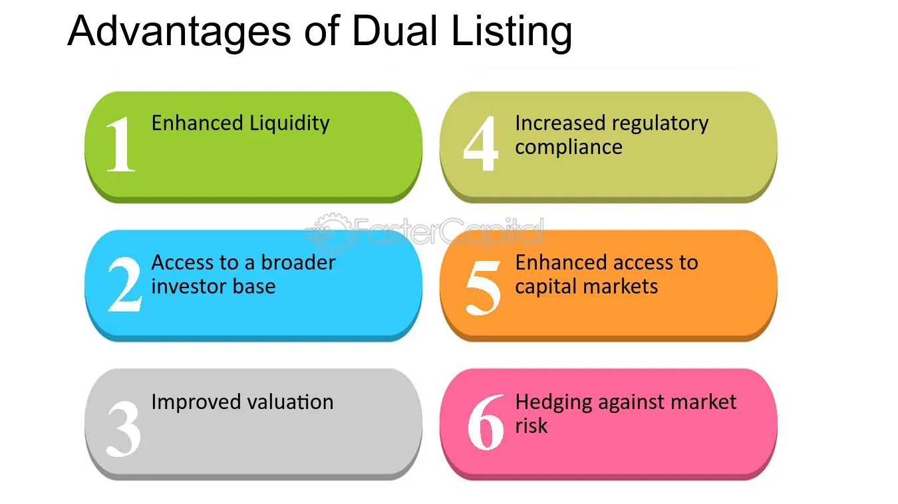

## Table of Contents

## What is dual listing?

Dual listing is when a company decides to have its stocks traded on more than one stock exchange. This means that investors from different countries can buy and sell the company's shares on their local stock market. For example, a company might be listed on both the New York Stock Exchange and the London Stock Exchange. This can help the company reach more investors and increase its visibility in different markets.

There are several reasons why a company might choose dual listing. One reason is to increase liquidity, which means more people can buy and sell the company's shares, making it easier to trade. Another reason is to raise capital from different parts of the world. By listing on multiple exchanges, a company can attract investors from various regions, which can help fund its growth and expansion. However, dual listing can also be complex and costly, as the company needs to comply with the rules and regulations of each stock exchange where it is listed.

## How does dual listing work?

Dual listing happens when a company decides to list its stocks on more than one stock exchange. This means that the same company's shares can be bought and sold in different countries. For example, a company might be listed on both the New York Stock Exchange in the United States and the Tokyo Stock Exchange in Japan. This allows investors from different parts of the world to trade the company's shares on their local stock market.

To make dual listing work, the company needs to follow the rules of each stock exchange where it is listed. This can be complicated because each exchange has its own set of rules and regulations. The company also needs to keep its shareholders informed about its performance and any important news, which can be more difficult when dealing with multiple exchanges. Despite these challenges, dual listing can help a company reach more investors and raise more money to grow its business.

## What are the primary reasons companies choose dual listing?

Companies choose dual listing mainly to reach more investors. By listing their stocks on more than one stock exchange, they can attract people from different countries who want to buy and sell their shares. This can help the company raise more money to grow and expand its business. For example, if a company is listed on both the New York Stock Exchange and the London Stock Exchange, it can attract investors from both the United States and the United Kingdom.

Another reason for dual listing is to increase the [liquidity](/wiki/liquidity-risk-premium) of the company's shares. Liquidity means how easily shares can be bought and sold. When a company's shares are traded on multiple exchanges, more people can trade them, which makes it easier and faster to buy and sell the shares. This can make the shares more attractive to investors because they know they can quickly turn their investment into cash if they need to. However, dual listing can also be complex and costly because the company needs to follow the rules of each stock exchange where it is listed.

## Can you list some examples of companies that have opted for dual listing?

Some companies that have chosen dual listing include BHP Group and Unilever. BHP Group, a big mining company from Australia, is listed on both the Australian Securities Exchange and the London Stock Exchange. This helps them reach investors in both countries and raise more money for their mining projects. Unilever, a company that makes food and personal care products, is listed on the London Stock Exchange and the Euronext Amsterdam. By being listed in these two places, Unilever can attract investors from the UK and the Netherlands, which helps them grow their business.

Another example is Barrick Gold Corporation, a Canadian mining company that is listed on both the Toronto Stock Exchange and the New York Stock Exchange. This dual listing helps Barrick Gold reach investors in both Canada and the United States, making it easier for them to raise money for their gold mining operations. These examples show how dual listing can help companies from different industries and countries expand their investor base and grow their businesses.

## What are the advantages of dual listing for a company?

One big advantage of dual listing for a company is that it can reach more investors. When a company lists its stocks on more than one stock exchange, people from different countries can buy and sell the company's shares. This means the company can get money from investors all over the world, which can help it grow and expand its business. For example, if a company is listed on both the New York Stock Exchange and the London Stock Exchange, it can attract investors from both the United States and the United Kingdom.

Another advantage is that dual listing can increase the liquidity of the company's shares. Liquidity means how easily shares can be bought and sold. When a company's shares are traded on multiple exchanges, more people can trade them, making it easier and faster to buy and sell the shares. This can make the shares more attractive to investors because they know they can quickly turn their investment into cash if they need to. However, dual listing can also be complex and costly because the company needs to follow the rules of each stock exchange where it is listed.

## What are the potential disadvantages of dual listing?

One big disadvantage of dual listing is that it can be really complicated and expensive for a company. When a company decides to list its stocks on more than one stock exchange, it has to follow the rules and regulations of each exchange. This means more paperwork, more lawyers, and more accountants, which can cost a lot of money. It also means the company has to keep up with different reporting requirements and make sure they're doing everything right in each country, which can be hard and time-consuming.

Another disadvantage is that dual listing can sometimes confuse investors. When a company's shares are traded on multiple exchanges, the prices of the shares can be different on each exchange. This can make it hard for investors to know which price is the right one to buy or sell at. Plus, if something goes wrong in one country, like a financial crisis, it can affect the company's stock price on all the exchanges where it's listed, even if the company is doing well overall. This can make the company's stock more risky for investors.

## How does dual listing affect a company's stock price?

Dual listing can affect a company's stock price in a few ways. When a company lists its stocks on more than one stock exchange, it can attract more investors from different countries. This can increase the demand for the company's shares, which might make the stock price go up. For example, if a company is listed on both the New York Stock Exchange and the London Stock Exchange, investors from both the United States and the United Kingdom can buy the shares, which can push the price higher.

However, dual listing can also make things more complicated. Sometimes, the stock prices on different exchanges can be different, which can confuse investors. If the price is lower on one exchange, investors might sell their shares there and buy them on another exchange where the price is higher, trying to make a quick profit. Also, if something bad happens in one country, like a financial crisis, it can affect the company's stock price on all the exchanges where it's listed, even if the company is doing well overall. This can make the stock price go down and make it more risky for investors.

## What are the regulatory considerations for dual listing in different countries?

When a company decides to list its stocks on more than one stock exchange in different countries, it has to follow the rules and regulations of each country. Each stock exchange has its own set of rules that the company must obey. This can be hard because the rules might be different in each place. For example, one country might require the company to share more information about its finances, while another country might have different rules about how the company can buy back its own shares. The company needs to make sure it understands and follows all these rules to avoid getting in trouble.

Another thing to think about is that the company might need to work with different regulators in each country. These regulators make sure that companies follow the rules and protect investors. The company might need to report its financial information to these regulators in different ways, which can be a lot of work. Plus, if the company breaks a rule in one country, it could face penalties there, even if it's doing everything right in the other countries where it's listed. This can make dual listing more complicated and costly, but it's something the company has to deal with to reach more investors around the world.

## How do shareholders benefit from a company's decision to dual list?

When a company decides to list its stocks on more than one stock exchange, shareholders can benefit in several ways. One big benefit is that dual listing can make it easier for shareholders to buy and sell the company's shares. Because the shares are traded on different exchanges, more people can buy and sell them, which means there are more buyers and sellers. This can make the shares more liquid, meaning shareholders can turn their investment into cash more quickly if they need to. Also, having the shares listed on multiple exchanges can attract more investors from different countries, which can increase demand for the shares and potentially drive up their price.

Another way shareholders can benefit is through increased visibility and access to different markets. When a company is listed on multiple exchanges, it gets more attention from investors around the world. This can help the company grow and expand its business, which can be good for shareholders because a bigger, more successful company usually means higher stock prices and better returns on their investment. However, shareholders should also know that dual listing can make things more complicated. The company has to follow the rules of each exchange, and if it messes up in one country, it could affect the stock price on all the exchanges where it's listed. So, while there are benefits, there are also risks that shareholders should be aware of.

## What are the costs associated with setting up and maintaining a dual listing?

Setting up and maintaining a dual listing can be expensive for a company. When a company decides to list its stocks on more than one stock exchange, it has to pay fees to each exchange. These fees can be high and can include listing fees, annual fees, and fees for any changes the company makes to its listing. The company also has to hire lawyers and accountants to help with all the paperwork and to make sure it follows the rules of each exchange. This can cost a lot of money because the rules might be different in each country.

Another cost is the time and effort the company needs to spend on keeping up with the requirements of each stock exchange. The company has to report its financial information to the regulators in each country, which can be a lot of work because the reporting might be different in each place. If the company makes a mistake or breaks a rule in one country, it could face penalties, which can be costly. All these costs add up, and the company needs to make sure that the benefits of dual listing, like reaching more investors, are worth the money and effort it takes to set up and maintain the listings.

## How does dual listing impact a company's corporate governance?

When a company decides to list its stocks on more than one stock exchange, it has to follow the rules of each exchange. This means the company might need to change how it makes decisions and keeps its shareholders informed. For example, one country might have different rules about how the company's board of directors should work or what information the company needs to share with its investors. This can make things more complicated for the company, but it can also make the company's governance better by making it more open and responsible.

Another way dual listing can affect a company's corporate governance is by making it more visible to investors around the world. When a company is listed on multiple exchanges, more people can see what the company is doing and how it's being run. This can put more pressure on the company to be fair and honest in its dealings. However, it also means the company has to work harder to make sure it's following all the rules and keeping everyone happy, which can be challenging.

## What are the strategic considerations a company should evaluate before pursuing dual listing?

Before a company decides to list its stocks on more than one stock exchange, it should think about whether it will help the company reach more investors. By listing on multiple exchanges, the company can attract people from different countries who want to buy and sell its shares. This can help the company raise more money to grow and expand its business. However, the company also needs to think about the costs. Listing on multiple exchanges can be expensive because the company has to pay fees to each exchange and hire lawyers and accountants to make sure it follows all the rules. The company needs to decide if the benefits of reaching more investors are worth the costs.

Another thing the company should consider is how dual listing will affect its corporate governance. When a company lists its stocks on more than one exchange, it has to follow the rules of each exchange, which can be different. This means the company might need to change how it makes decisions and keeps its shareholders informed. The company should think about whether it can handle these extra rules and responsibilities. Also, dual listing can make the company more visible to investors around the world, which can be good because it can make the company more open and responsible. But it can also be challenging because the company has to work harder to make sure it's following all the rules and keeping everyone happy.

## References & Further Reading

[1]: Bergstra, J., Bardenet, R., Bengio, Y., & Kégl, B. (2011). ["Algorithms for Hyper-Parameter Optimization."](https://dl.acm.org/doi/10.5555/2986459.2986743) Advances in Neural Information Processing Systems 24.

[2]: ["Advances in Financial Machine Learning"](https://www.amazon.com/Advances-Financial-Machine-Learning-Marcos/dp/1119482089) by Marcos Lopez de Prado

[3]: ["Evidence-Based Technical Analysis: Applying the Scientific Method and Statistical Inference to Trading Signals"](https://www.amazon.com/Evidence-Based-Technical-Analysis-Scientific-Statistical/dp/0470008741) by David Aronson

[4]: ["Machine Learning for Algorithmic Trading"](https://github.com/stefan-jansen/machine-learning-for-trading) by Stefan Jansen

[5]: ["Quantitative Trading: How to Build Your Own Algorithmic Trading Business"](https://github.com/LucindaYa/quant-resources/blob/master/Quantitative%20Trading%20How%20to%20Build%20Your%20Own%20Algorithmic%20Trading%20Business.pdf) by Ernest P. Chan