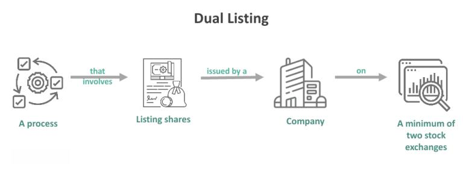

Understanding the intricacies of financial markets is essential for both investors and businesses as they navigate an increasingly complex economic landscape. Financial markets encompass a wide array of activities, including the buying, selling, and trading of financial instruments, which are crucial for resource allocation, capital formation, and risk management. Key components of these markets, such as stock exchanges, dual listings, and algorithmic trading, are integral to modern economic systems.

Stock exchanges are fundamental structures within financial markets, serving as organized platforms where securities like stocks and bonds can be bought and sold. They facilitate price discovery, ensuring transparency and liquidity, which are vital for market stability. In recent years, globalization and technological advancements have significantly transformed traditional stock exchanges, introducing new exchanges and electronic trading systems, thus broadening access and improving efficiency.



Dual listing, another salient feature of financial markets, involves a company listing its shares on more than one stock exchange. This practice can enhance a company's visibility and attract a more diverse investor base, thereby improving liquidity and potentially reducing the cost of capital. However, dual listings also come with challenges, including meeting varying regulatory requirements and managing operations in multiple jurisdictions.

Algorithmic trading represents a pivotal evolution in the financial markets, leveraging computer algorithms to execute trades at high speed and volume. This high-frequency trading method has revolutionized market dynamics by increasing the precision and speed of transactions while also contributing to reduced transaction costs. Nonetheless, it has sparked debate due to its role in market volatility and incidents such as flash crashes.

As these mechanisms evolve, their interrelation becomes increasingly pronounced. The intersection of dual listings and algorithmic trading showcases the synergy and complexity of participating in multiple exchanges while utilizing advanced trading strategies. Technological advancements continue to shape these interactions, underscoring the need for robust systems and regulatory frameworks.

This article aims to provide a comprehensive overview of stock exchanges, dual listings, and algorithmic trading. By analyzing their roles, interactions, and future trends, we seek to elucidate these complex but vital financial mechanisms. Ultimately, a clear understanding of these concepts is crucial for anyone engaged in financial markets, whether as an investor, a business leader, or a policymaker.

## Table of Contents

## The Role of Stock Exchanges in Financial Markets

Stock exchanges are integral components of financial markets, providing a structured environment where buyers and sellers can exchange securities like stocks, bonds, and derivatives. Their primary roles include facilitating price discovery—the process through which the market determines the price of securities—and ensuring [liquidity](/wiki/liquidity-risk-premium), which allows assets to be bought and sold quickly without causing drastic price changes.

**Price Discovery and Liquidity**

Price discovery on a stock exchange results from the collective actions of market participants. The interactions between buyers and sellers, based on their expectations and available information, determine the prices of securities. Liquidity is crucial for the smooth functioning of financial markets as it provides the ability to enter and [exit](/wiki/exit-strategy) positions swiftly, reducing the bid-ask spread and operational costs for investors.

**Major Stock Exchanges: NYSE, NASDAQ, and Others**

Different stock exchanges around the world, such as the New York Stock Exchange (NYSE) and NASDAQ, are distinguished by their operational models and types of securities traded. The NYSE is known for its auction-based trading system where a physical trading floor houses brokers executing orders. Conversely, NASDAQ operates as an electronic exchange without a physical trading location, utilizing market makers to provide liquidity. These differences influence market dynamics, impacting investor preferences and strategies.

**Impact on Economy and Investor Sentiment**

Stock exchanges significantly impact the broader economy. They serve as barometers of economic performance; rising stock indices often indicate economic growth, while declines may signal economic challenges. Investor sentiment, affected by factors like earnings reports and geopolitical developments, can lead to fluctuations in stock prices. Exchanges thus play a pivotal role in shaping economic outlooks and policy decisions.

**Operational Aspects: Listing Requirements and Trading Hours**

Operationally, stock exchanges have specific listing requirements that companies must meet to be eligible for trading. These criteria ensure that only companies with requisite financial health and operational transparency are listed, thereby protecting investors. For instance, the NYSE mandates a minimum market capitalization and [earning](/wiki/earning-announcement) thresholds, while NASDAQ has different tiers with varying requirements.

Trading hours also vary across exchanges, influenced by geographic location. For example, the NYSE and NASDAQ typically operate from 9:30 AM to 4:00 PM Eastern Time, aligning with the U.S. business day, while exchanges in Asia and Europe adhere to their local time zones. These variations can introduce complexities for investors operating globally, requiring strategies that consider different market hours.

In summary, stock exchanges are crucial for efficient financial markets, facilitating price discovery, and ensuring liquidity. Their operations, marked by distinct listing requirements and trading practices, significantly influence global economic activities and investor behaviors. Understanding these factors is essential for investors and businesses engaging with financial markets.

## What is Dual Listing?

Dual listing enables a company to be listed on more than one stock exchange simultaneously, providing several strategic advantages. This approach is often motivated by the desire to enhance liquidity and expand the investor base. By being accessible to a more extensive range of investors across different geographical areas, companies can potentially command higher stock valuations and improve capital access.

One of the primary reasons for dual listing is increased liquidity. When a company is listed on multiple exchanges, its shares become available to a broader range of investors, which can lead to enhanced trading activity and more robust price discovery. This can be particularly advantageous in times of market [volatility](/wiki/volatility-trading-strategies), as the added liquidity can help stabilize share prices. For the companies, the ability to tap into a diverse pool of investors across various time zones can mitigate risks associated with market fluctuations in a single region.

Dual listings also allow companies to broaden their investor base by tapping into markets beyond their domestic boundaries. By listing on foreign exchanges, companies can attract institutional and retail investors who may not have access to foreign markets directly. This can be especially beneficial for companies in developing countries seeking to reach investors in more mature markets.

Despite these benefits, dual listings come with their own set of challenges. Maintaining listings in multiple jurisdictions requires compliance with the regulatory frameworks of each exchange, which can be both time-consuming and costly. Companies need to adhere to varying disclosure requirements, corporate governance standards, and reporting obligations, which may differ significantly from one jurisdiction to another. Additionally, there are ongoing administrative and legal expenses associated with maintaining multiple listings.

Several renowned companies have effectively leveraged dual listings to fuel their growth. For instance, multinational corporations like Unilever and HSBC Holdings have listings on both the New York Stock Exchange (NYSE) and the London Stock Exchange (LSE). These dual listings have allowed these companies to draw capital from both U.S. and European markets, demonstrating the strategic advantages of having a presence on multiple exchanges.

From a regulatory perspective, dual listing demands meticulous navigation through compliance requirements. Companies must frequently update their filings and ensure transparency to meet the expectations of regulators and investors. In some cases, cross-listing agreements or mutual recognition arrangements between countries may simplify these requirements, but the complexity remains substantial.

In summary, dual listing presents both opportunities and obstacles. While it enhances liquidity and extends a company's reach to a broader investor audience, it also necessitates stringent adherence to regulatory frameworks. Companies pursuing this strategy must weigh these factors carefully, balancing the benefits of increased market access against the challenges of regulatory compliance.

## Algorithmic Trading: Revolutionizing the Markets

Algorithmic trading represents a significant transformation in the way financial markets operate, leveraging computer-driven strategies to execute trades at high speeds and volumes. It has evolved substantially since its inception, fundamentally altering market dynamics and contributing to increased trading efficiency.

The history of [algorithmic trading](/wiki/algorithmic-trading) dates back to the 1970s with the advent of electronic trading systems. Over the decades, advancements in technology and computing power have paved the way for more sophisticated algorithms. By the 2000s, algorithmic trading had become a dominant force in global markets, significantly influencing trading volumes on many exchanges.

There are various types of algorithms used in trading, each serving different purposes. High-frequency trading ([HFT](/wiki/high-frequency-trading-strategies)) stands out for its ability to execute thousands of transactions in fractions of a second. HFT capitalizes on even the smallest price discrepancies, contributing to market liquidity but also posing regulatory and ethical questions. Market-making algorithms provide liquidity by continuously quoting buy and sell prices, earning profits from the bid-ask spread. Other strategies include [arbitrage](/wiki/arbitrage), [statistical arbitrage](/wiki/statistical-arbitrage), and [trend following](/wiki/trend-following), each utilizing different market signals and price patterns.

The advantages of algorithmic trading are manifold. Algorithms operate with precision and speed beyond human capability, minimizing the likelihood of emotional and erroneous decision-making. Reduced transaction costs and the ability to backtest strategies using historical data are additional benefits that have made algorithmic trading appealing to both institutional and retail investors.

However, algorithmic trading is not without its criticisms and risks. One major concern is market volatility; algorithm-driven orders can amplify price swings, especially in illiquid markets. Flash crashes, sudden and severe market declines, are often linked to algorithms executing trades in unison. The 2010 Flash Crash serves as a stark reminder of the vulnerabilities posed by high-speed trading systems. Regulatory bodies worldwide have responded by developing mechanisms such as circuit breakers to mitigate these risks and ensure market stability.

As tech and financial landscapes continue to evolve, algorithmic trading is expected to become even more integral to financial markets. Despite its complexity and associated risks, its contribution to market liquidity, efficiency, and its potential for generating alpha make it a critical area of focus for market participants and regulators alike.

## Interconnection: Dual Listing and Algorithmic Trading

Dual listings and algorithmic trading, two pivotal elements of modern financial markets, intersect in complex ways, offering both opportunities and challenges to investors and companies alike.

### Influence of Dual Listings on Algorithmic Trading Strategies

When a company is listed on multiple stock exchanges, it creates a unique set of conditions that can significantly affect algorithmic trading strategies. Dual listings provide multiple venues for price discovery, compelling algorithmic traders to account for price discrepancies and arbitrage opportunities across these markets. Algorithms can be optimized to exploit the small differences in stock prices between the exchanges, known as arbitrage. For instance, if a stock is priced slightly lower on one exchange than another, an algorithm can execute a buy order on the cheaper exchange and a sell order on the more expensive one, capturing the price difference as profit.

### Synergies and Complexities in Multiple Exchanges

Dual-listed companies experience increased liquidity and a broader investor base, which can lead to enhanced trading volumes and stability in stock prices. However, they also face challenges such as regulatory compliance across jurisdictions and the risk of mispricing due to varying market conditions. Algorithmic traders need to design and deploy more sophisticated models that [factor](/wiki/factor-investing) in these multi-market dynamics. Strategies like statistical arbitrage become more pertinent, leveraging mathematical models to forecast future price movements across different exchanges.

### Role of Technology in Managing Complexities

Advanced technology plays a crucial role in managing the complexities inherent in dual listings and algorithmic trading. High-speed trading platforms and cloud-based solutions allow traders to synchronize their activities across various markets in real-time. Machine learning models can be used to predict market movements more accurately by analyzing vast amounts of historical trading data. These technologies enable traders to execute transactions at lightning speeds, thereby minimizing the risks associated with latency and maximizing profit potential.

```python
import numpy as np
from sklearn.linear_model import LinearRegression

# Example: A simple linear regression model to predict stock prices based on historical data
# prices is an array of historical stock prices on different exchanges
prices = np.array([...])
X = prices[:-1].reshape(-1, 1)  # Features: previous prices
y = prices[1:]  # Target: next day's price

model = LinearRegression()
model.fit(X, y)
predicted_price = model.predict(np.array([[latest_price]]))
```

### Real-world Examples

Companies like Unilever and Royal Dutch Shell have successfully harnessed dual listings to their advantage. These corporations maintain listings in both European and US markets, allowing traders to apply algorithmic strategies that capitalize on time zone differences and diverse market opening times. This strategy not only optimizes liquidity but also mitigates risk by spreading it across various economic environments.

### Future Outlook

The interplay between dual listings and algorithmic trading is set to become more pronounced with ongoing technological advancements and market globalization. As exchanges around the world become more interconnected, the pressure on algorithmic trading systems to accommodate and leverage these dynamics will increase. Future developments may include the integration of [artificial intelligence](/wiki/ai-artificial-intelligence) to seamlessly execute cross-market trades and adapt to real-time changes in market sentiment.

Overall, understanding the synergies between dual listings and algorithmic trading will be essential for investors and companies looking to optimize their strategies in an increasingly complex global marketplace.

## Conclusion

Throughout this article, we have explored the significant roles of stock exchanges, dual listings, and algorithmic trading within financial markets. Each of these elements contributes uniquely to the efficiency and functionality of markets. Stock exchanges provide the necessary infrastructure for the trading of securities, ensuring liquidity and facilitating price discovery across global economies. By understanding the distinctions among major exchanges like the NYSE and NASDAQ, investors can better navigate market opportunities and challenges.

Dual listings offer companies the strategic advantage of accessing broader investor bases and increasing liquidity by listing on multiple exchanges. This practice enhances a company's visibility and investor reach, though it comes with its own set of regulatory challenges and compliance requirements. Successful dual listings exemplify the balance of leveraging opportunities while managing complexities.

Algorithmic trading, characterized by the use of sophisticated algorithms to execute trades at high speed and [volume](/wiki/volume-trading-strategy), has revolutionized the trading landscape. These technological advancements have introduced greater precision and reduced transaction costs, despite raising concerns about market volatility and flash crashes.

The interconnection between dual listing and algorithmic trading opens new avenues for strategic financial maneuvers, harnessing the synergies of multiple market platforms and advanced trading technologies. Companies exploiting these opportunities must effectively manage the technological and regulatory intricacies involved.

As financial markets continue evolving, driven by globalization and technological progress, ongoing innovations are expected to further reshape the landscape. Investors and businesses alike need to stay well-informed about these developments to make informed decisions and capitalize on emerging trends. Understanding these fundamental concepts remains crucial for anyone engaged in financial markets, ensuring adaptability in a rapidly changing global economy.

## References & Further Reading

[1]: Bergstra, J., Bardenet, R., Bengio, Y., & Kégl, B. (2011). ["Algorithms for Hyper-Parameter Optimization."](https://dl.acm.org/doi/10.5555/2986459.2986743) Advances in Neural Information Processing Systems 24.

[2]: ["Advances in Financial Machine Learning"](https://www.amazon.com/Advances-Financial-Machine-Learning-Marcos/dp/1119482089) by Marcos Lopez de Prado

[3]: ["Evidence-Based Technical Analysis: Applying the Scientific Method and Statistical Inference to Trading Signals"](https://www.amazon.com/Evidence-Based-Technical-Analysis-Scientific-Statistical/dp/0470008741) by David Aronson

[4]: ["Machine Learning for Algorithmic Trading"](https://github.com/stefan-jansen/machine-learning-for-trading) by Stefan Jansen

[5]: ["Quantitative Trading: How to Build Your Own Algorithmic Trading Business"](https://github.com/LucindaYa/quant-resources/blob/master/Quantitative%20Trading%20How%20to%20Build%20Your%20Own%20Algorithmic%20Trading%20Business.pdf) by Ernest P. Chan