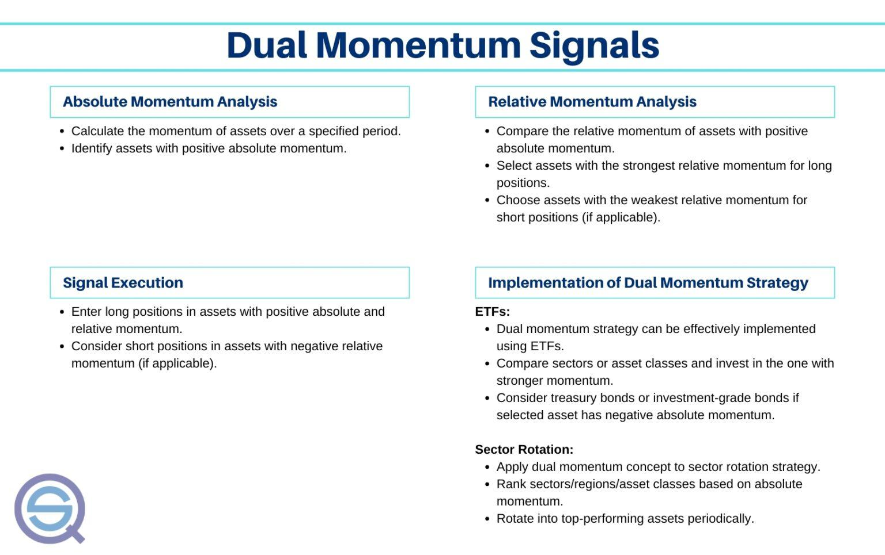

## Table of Contents

## What is the Dual Momentum Trading Strategy?

The Dual Momentum Trading Strategy is a way to pick investments by looking at two types of momentum. The first type is absolute momentum, which checks if an investment is doing better than it did before. The second type is relative momentum, which compares how well an investment is doing compared to others. By using both types of momentum, this strategy helps investors decide which investments to buy and when to buy them.

This strategy was created by Gary Antonacci and is used to try to get better returns while also managing risk. Investors using this strategy first look at absolute momentum to see if the overall market is doing well. If it is, they then use relative momentum to pick the best investments within that market. If the market isn't doing well, they might choose to invest in safer options like bonds. This way, they aim to make money when the market is up and protect their money when the market is down.

## How does the Dual Momentum Strategy differ from other momentum strategies?

The Dual Momentum Strategy is different from other momentum strategies because it uses two kinds of momentum instead of just one. Most momentum strategies only look at relative momentum, which means they compare how well different investments are doing against each other. They pick the ones that are doing the best. But the Dual Momentum Strategy also looks at absolute momentum. This means it checks if an investment is doing better than it did before, not just better than other investments. By using both types of momentum, the Dual Momentum Strategy tries to make smarter choices about when and what to invest in.

Another way the Dual Momentum Strategy stands out is how it manages risk. Many momentum strategies can be risky because they keep money in the market all the time, even when the market is going down. But the Dual Momentum Strategy has a safety net. If the market isn't doing well, it might switch to safer investments like bonds. This way, it tries to protect the money when things are not going well. So, while other momentum strategies might focus only on making money, the Dual Momentum Strategy also focuses on not losing money.

## What are the two types of momentum used in the Dual Momentum Strategy?

The first type of momentum used in the Dual Momentum Strategy is called absolute momentum. This is when you look at how an investment is doing compared to how it did before. It's like checking if a stock is doing better now than it was last month or last year. If the investment is doing better, it has positive absolute momentum. This helps decide if it's a good time to stay in the market or move to safer investments.

The second type of momentum is called relative momentum. This is when you compare how different investments are doing against each other. For example, you might look at different stocks and see which one is going up the most. If one stock is doing better than the others, it has good relative momentum. The Dual Momentum Strategy uses this to pick the best investments when the overall market is doing well.

## How do you calculate absolute momentum?

To calculate absolute momentum, you look at how an investment is doing now compared to how it did in the past. A common way to do this is by comparing the current price of an investment to its price a certain time ago, like 6 or 12 months back. If the current price is higher than the price from the past, the investment has positive absolute momentum. If it's lower, it has negative absolute momentum. This helps you see if the investment is getting better or worse over time.

For example, if you want to check the absolute momentum of a stock, you might look at its price today and compare it to its price one year ago. If the stock's price today is higher than it was a year ago, it has positive absolute momentum. This means the stock is doing better now than it did before. If the price today is lower than it was a year ago, it has negative absolute momentum, meaning the stock is not doing as well as it used to. This simple comparison helps you decide if it's a good time to keep your money in that investment or move it somewhere safer.

## How do you calculate relative momentum?

To calculate relative momentum, you compare how different investments are doing against each other over a certain time. For example, you might look at the returns of several stocks over the last year. You find out which stock has gone up the most during that time. The one with the highest return has the best relative momentum. It's like a race where you pick the winner based on who ran the fastest, not just if they ran faster than they did before.

Let's say you are looking at three stocks: Stock A, Stock B, and Stock C. Over the past year, Stock A went up by 10%, Stock B by 15%, and Stock C by 5%. Stock B has the best relative momentum because its return of 15% is higher than the returns of the other stocks. By comparing these returns, you can see which stock is doing the best compared to the others. This helps you pick the investment that is leading the pack.

## What are the steps to implement the Dual Momentum Trading Strategy?

To start using the Dual Momentum Trading Strategy, first, you need to check the absolute momentum of the overall market. This means looking at how the market is doing now compared to a few months ago, like 6 or 12 months. If the market is doing better now, you move to the next step. If it's not, then you might want to switch your money to safer investments like bonds. This step helps you decide if it's a good time to be in the market or not.

If the market has positive absolute momentum, the next step is to look at relative momentum. This is when you compare different investments, like stocks, to see which one is doing the best. You look at their returns over the same time period, like the past year, and pick the one with the highest return. This helps you choose the investment that is leading the pack. By following these two steps, you use both types of momentum to make smarter investment choices and manage your risk.

## What assets are typically used in a Dual Momentum portfolio?

In a Dual Momentum portfolio, investors often use a mix of different types of assets to spread out their risk and try to make more money. The most common assets are stocks and bonds. Stocks are used when the market is doing well because they have the potential to grow a lot. Bonds are used when the market is not doing well because they are safer and help protect the money that's been invested.

Sometimes, investors also use other types of assets like real estate investment trusts (REITs) or commodities. These can add more variety to the portfolio and help it do well in different market conditions. The key is to keep checking the momentum of these assets and switch between them based on how they're doing compared to each other and how the overall market is doing.

## How often should you rebalance a Dual Momentum portfolio?

You should rebalance a Dual Momentum portfolio every month. This means you check how the market and your investments are doing every month and make changes if needed. By doing this often, you can keep your money in the best investments and switch to safer ones when the market is not doing well.

Rebalancing every month helps you use the Dual Momentum Strategy better. It lets you keep up with changes in the market and make sure your money is always in the right place. If you wait too long between checks, you might miss out on good opportunities or stay in bad investments too long.

## What are the potential risks and drawbacks of using the Dual Momentum Strategy?

Using the Dual Momentum Strategy can have some risks and drawbacks. One big risk is that it relies a lot on past performance to predict the future. Just because an investment did well before doesn't mean it will keep doing well. If the market changes suddenly, the strategy might not catch it in time, and you could lose money. Also, looking at momentum means you might buy investments when they're already expensive and sell them when they're cheap, which can hurt your returns.

Another drawback is that the strategy needs you to check and change your investments every month. This can be a lot of work and might cost you more in fees if you're buying and selling often. Some people might also find it hard to stick to the strategy, especially if they see their investments going down for a while. It takes discipline to keep following the rules even when things don't look good right away.

## Can the Dual Momentum Strategy be automated, and if so, how?

Yes, the Dual Momentum Strategy can be automated. You can use computer programs or special software to do the work for you. These programs can check the market's performance and compare different investments every month. If the market is doing well, the software can pick the best investments based on their returns. If the market is not doing well, it can switch your money to safer options like bonds. This way, you don't have to do the calculations and decisions yourself.

Automating the Dual Momentum Strategy can save you time and help you stick to the plan more easily. You just need to set up the software with the right rules for checking absolute and relative momentum. Once it's set up, the software will do the rest, making changes to your portfolio every month without you needing to do anything. This can be really helpful if you don't want to spend a lot of time managing your investments or if you want to make sure you're following the strategy exactly as it's supposed to be done.

## How has the Dual Momentum Strategy performed historically compared to other investment strategies?

The Dual Momentum Strategy has done well compared to other ways of investing over time. Studies show that it has beaten the stock market and other momentum strategies. For example, Gary Antonacci, who created the strategy, looked at how it did from 1974 to 2011. He found that it made more money and lost less during bad times than just [picking](/wiki/asset-class-picking) stocks based on how well they were doing compared to each other. This means the strategy did a good job of growing money and keeping it safe.

But, it's important to know that past results don't promise the same for the future. The Dual Momentum Strategy might not always be the best choice. It depends a lot on how the market is doing and what other strategies people are using. Still, many people like it because it tries to make money when the market is up and protect money when the market is down. This mix of making and keeping money is what makes it different from other ways of investing.

## What advanced techniques can be used to enhance the Dual Momentum Strategy?

To make the Dual Momentum Strategy even better, you can use something called risk parity. This means you spread your money out based on how risky each investment is, not just how much you think they'll grow. By doing this, you can keep your money safer while still trying to make more. Another way to improve the strategy is by using stop-loss orders. These are like safety nets that automatically sell your investments if they start to lose too much value. This can help you not lose as much money if the market suddenly goes down.

You can also use more types of investments to make your portfolio stronger. Instead of just stocks and bonds, you might add things like real estate or commodities. This can help your money grow in different ways and protect it from big drops in the market. Another advanced technique is to use more data and smarter math to pick your investments. This can mean looking at more than just the last year's performance, like how an investment has done over many years or how it reacts to different market conditions. By using these extra pieces of information, you can make even better choices about where to put your money.

## What is Understanding Dual Momentum?

Dual momentum is a sophisticated trading strategy that combines two forms of momentum to make investment decisions: absolute momentum and relative momentum. Understanding these two components is crucial to implementing the dual momentum approach effectively.

Absolute momentum refers to an asset's own historical performance. It is typically assessed over a designated time frame. For instance, a trader might examine the past 12 months of an asset's returns. If the asset's return is positive over this period, it indicates that it has been appreciating in value and therefore demonstrates positive absolute momentum. Mathematically, absolute momentum can be calculated as the difference between the asset's return over a given period and a benchmark return, often set to zero or the risk-free rate. The formula for absolute momentum can be expressed as:

$$
AM = \text{Return}_{\text{asset}, t} - \text{Return}_{\text{benchmark}, t}
$$

Relative [momentum](/wiki/momentum), on the other hand, involves comparing the performance of an asset against other assets within the same category or against a relevant benchmark. This form of momentum identifies which asset among a group performs best over the set time window. The relative momentum can be calculated by comparing the returns of two assets or an asset against a benchmark index:

$$
RM = \text{Return}_{\text{asset}, t} - \text{Return}_{\text{peer/benchmark}, t}
$$

The dual momentum strategy combines these two metrics to identify securities that are not only trending upwards but also outperform their peers. By integrating both absolute and relative momentum, traders aim to choose investments that are demonstrating robust positive trends, enhancing the potential for profit while mitigating risk exposure.

Through this combined approach, dual momentum ensures that investments are placed in assets exhibiting strong behavioral traits, regardless of varying economic conditions or market environments. Dual momentum, therefore, poses a comprehensive method for determining asset selection by exploiting the persistence and outperformance traits observed in financial markets.

## References & Further Reading

[1]: Antonacci, G. (2014). ["Dual Momentum Investing: An Innovative Strategy for Higher Returns with Lower Risk."](https://www.amazon.com/Dual-Momentum-Investing-Innovative-Strategy/dp/0071849440) McGraw-Hill Education.

[2]: ["Quantitative Momentum: A Practitioner's Guide to Building a Momentum-Based Stock Selection System"](https://books.google.com/books/about/Quantitative_Momentum.html?id=K2npCgAAQBAJ) by Wesley R. Gray and Jack R. Vogel

[3]: Jegadeesh, N., & Titman, S. (1993). ["Returns to Buying Winners and Selling Losers: Implications for Stock Market Efficiency."](https://onlinelibrary.wiley.com/doi/abs/10.1111/j.1540-6261.1993.tb04702.x) The Journal of Finance, 48(1), 65-91.

[4]: ["Momentum Strategies"](https://www.fidelity.com/learning-center/trading-investing/trading/momentum-trading-strategies) by Antonacci, G.

[5]: ["Financial Trading and Investing"](https://shop.elsevier.com/books/financial-trading-and-investing/teall/978-0-323-90955-6) by John L. Teall