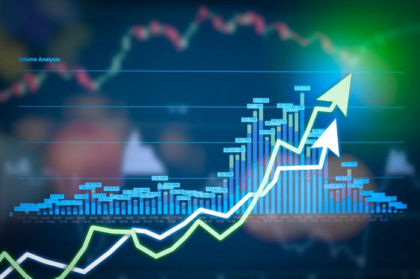

## Table of Contents

## What is a dual exchange rate system?

A dual exchange rate system is when a country has two different exchange rates for its currency. One rate is used for certain transactions, like trade or official government business, and the other rate is used for everything else, like personal transactions or tourism. This system is often used by countries to control their economy better. For example, they might want to make their exports cheaper by using a lower rate for trade, while keeping a higher rate for other transactions.

Countries might use a dual exchange rate system to protect their economy from sudden changes in the global market. By having two rates, they can manage how much of their currency is used and how it is valued in different situations. However, this system can also create problems. It can be confusing for people and businesses, and it might encourage illegal activities like black market trading, where people try to take advantage of the difference between the two rates.

## What is a multiple exchange rate system?

A multiple exchange rate system is when a country uses more than two different exchange rates for its currency. Each rate is used for different kinds of transactions. For example, one rate might be for importing essential goods, another for exporting products, and yet another for tourists exchanging money. This system allows a country to control its economy more precisely by setting different rates for different purposes.

Countries might use a multiple exchange rate system to protect their economy from global market changes. By having different rates, they can manage how their currency is used and valued in various situations. For instance, they might set a lower rate for exports to make their products cheaper and more competitive in the global market, while using a higher rate for luxury imports to limit how much people buy. However, this system can be complicated and confusing for people and businesses, and it can lead to problems like black market trading, where people try to take advantage of the differences between the rates.

## How do dual and multiple exchange rate systems differ from a single exchange rate system?

A single exchange rate system means a country uses just one rate to change its money into other countries' money. This makes things simple because everyone uses the same rate, whether they are buying things from other countries, selling things, or traveling. It's easy for businesses and people to plan because they know exactly how much their money is worth.

Dual and multiple exchange rate systems are different because they use more than one rate. In a dual system, there are two rates: one for things like trade and government business, and another for everything else, like personal spending or tourism. A multiple system has even more rates, each for different kinds of transactions. These systems can help a country control its economy better, but they can also be confusing and might lead to problems like black market trading, where people try to use the different rates to make money.

## What are the common reasons for implementing dual or multiple exchange rate systems?

Countries sometimes use dual or multiple exchange rate systems to help control their economy. They might want to make their exports cheaper by using a lower rate for trade, which can help them sell more products to other countries. At the same time, they might use a higher rate for other transactions, like buying things from abroad or for tourists, to keep more money in the country. This way, they can manage how much of their currency is used and how it is valued in different situations.

However, using more than one exchange rate can also cause problems. It can be confusing for people and businesses because they have to keep track of different rates for different things. This can lead to mistakes and make planning harder. Also, it might encourage illegal activities like black market trading, where people try to take advantage of the differences between the rates to make money. So, while dual or multiple exchange rate systems can help a country control its economy, they also come with challenges.

## What are the economic impacts of using dual or multiple exchange rate systems?

Using dual or multiple exchange rate systems can help a country control its economy. By setting different rates for different kinds of transactions, like trade or personal spending, a country can make its exports cheaper and more competitive. This can help the country sell more products to other countries and keep more money at home. For example, a lower rate for exports can make goods cheaper for buyers in other countries, while a higher rate for imports can limit how much people buy from abroad.

However, these systems can also cause problems. They can be confusing for people and businesses because they have to keep track of different rates for different things. This can lead to mistakes and make planning harder. It might also encourage illegal activities like black market trading, where people try to take advantage of the differences between the rates to make money. This can hurt the economy by making it less stable and fair.

Overall, while dual or multiple exchange rate systems can give a country more control over its economy, they come with challenges. They can help manage how much of the currency is used and how it is valued in different situations, but they can also create confusion and lead to illegal activities. It's important for countries to carefully consider these impacts when deciding whether to use such systems.

## Can you provide historical examples of countries that have used dual or multiple exchange rate systems?

In the past, many countries have used dual or multiple exchange rate systems to help control their economies. One example is Argentina. In the 1980s and 1990s, Argentina used a dual exchange rate system to manage its currency. They had one rate for trade and another for other transactions. This helped them keep their exports competitive and control how much money left the country. However, it also led to a lot of confusion and black market trading, where people tried to make money from the difference between the rates.

Another example is Egypt. In the 1960s and 1970s, Egypt used a multiple exchange rate system. They had different rates for different kinds of transactions, like importing essential goods, exporting products, and for tourists. This helped them manage their economy better by controlling how their currency was used in different situations. But, like Argentina, it also caused problems because it was hard for people and businesses to keep track of the different rates, and it led to illegal trading.

These examples show that while dual and multiple exchange rate systems can help countries control their economies, they can also create challenges. Both Argentina and Egypt faced issues with confusion and illegal activities because of the different rates. This shows the importance of carefully thinking about the impacts of using such systems.

## What are the advantages of dual and multiple exchange rate systems for a country's economy?

Dual and multiple exchange rate systems can help a country's economy by giving the government more control over how money is used. By setting different rates for different kinds of transactions, like trade or personal spending, a country can make its exports cheaper. This means their products can be more competitive in the global market, helping them sell more to other countries. At the same time, a higher rate for imports can limit how much people buy from abroad, keeping more money in the country. This can help the economy by managing how much of the currency is used and how it is valued in different situations.

However, these systems can also create challenges. They can be confusing for people and businesses because they have to keep track of different rates for different things. This can lead to mistakes and make planning harder. It might also encourage illegal activities like black market trading, where people try to take advantage of the differences between the rates to make money. This can hurt the economy by making it less stable and fair. So, while dual or multiple exchange rate systems can give a country more control over its economy, they come with challenges that need to be carefully managed.

## What are the disadvantages or challenges associated with dual and multiple exchange rate systems?

Dual and multiple exchange rate systems can be hard to use because they can confuse people and businesses. When a country has different rates for different things, like trade and personal spending, it's not easy to keep track of them all. This can lead to mistakes and make planning harder. For example, a business might not know which rate to use when they are buying something from another country, which can mess up their plans and budgets.

These systems can also cause problems like black market trading. When there are different rates, some people might try to take advantage of the differences to make money. They might buy things at the lower rate and sell them at the higher rate, which is not fair and can hurt the economy. This kind of illegal trading can make the economy less stable and can lead to more problems for the country.

Overall, while dual and multiple exchange rate systems can help a country control its economy, they come with big challenges. They can make things confusing and lead to illegal activities, which can hurt the economy in the long run. It's important for countries to think carefully about these challenges before deciding to use such systems.

## How do dual and multiple exchange rate systems affect international trade and foreign investment?

Dual and multiple exchange rate systems can make international trade harder. When a country uses different rates for different kinds of transactions, like trade and personal spending, it can be confusing for businesses from other countries. They might not know which rate to use when buying or selling things, which can make planning and budgeting more difficult. This confusion can lead to fewer trades because businesses might not want to deal with the extra hassle. Also, if a country uses a lower rate for exports, it can make their products cheaper and more competitive, but this might upset other countries that think it's not fair.

These systems can also affect foreign investment. Investors from other countries might be scared away if they think the different rates will make their investments less predictable. They might worry that the government will change the rates in a way that hurts their profits. This uncertainty can make them less likely to put money into the country, which can slow down the economy. On the other hand, if the rates are set in a way that makes investing more attractive, like a lower rate for bringing money into the country, it might encourage more foreign investment. But it's a tricky balance to get right.

## What role do black markets play in economies with dual or multiple exchange rates?

In countries with dual or multiple exchange rates, black markets often become a big problem. When there are different rates for different things, like trade and personal spending, some people try to make money by buying things at the lower rate and selling them at the higher rate. This is called black market trading. It's not fair and can hurt the economy because it takes money away from the official markets and makes them less stable.

Black markets can make it hard for the government to control the economy. When a lot of people are using the black market, the government's plans to manage the currency and the economy don't work as well. This can lead to more problems, like making it harder for businesses to plan and for the economy to grow. So, while dual or multiple exchange rate systems can help a country in some ways, they can also create big challenges because of black market trading.

## How can dual and multiple exchange rate systems be managed effectively to minimize negative impacts?

To manage dual and multiple exchange rate systems effectively and minimize negative impacts, a country needs to keep things clear and simple. The government should make sure everyone knows which rate to use for different kinds of transactions, like trade or personal spending. They can do this by having clear rules and good communication. It's also important to watch the markets closely and be ready to change the rates if needed to stop big differences that could lead to black market trading. By being fair and transparent, the government can help keep the economy stable and make it easier for businesses and people to plan.

Another way to manage these systems well is to make sure the rates don't stay too different for too long. If the rates are too far apart, it can encourage people to try to make money from the difference, which can lead to black market trading. The government can help by slowly bringing the rates closer together over time. They can also work with other countries to make sure their trade rules are fair and don't upset other countries. By doing these things, a country can use dual or multiple exchange rate systems to help its economy without causing too many problems.

## What are the current global trends regarding the use of dual and multiple exchange rate systems?

Right now, fewer countries are using dual and multiple exchange rate systems than before. Many countries have moved to single exchange rate systems because they are simpler and easier for everyone to understand. Single rates make it easier for businesses to plan and for the economy to grow. Countries like Argentina and Egypt, which used to have these systems, have tried to move away from them to make their economies more stable and fair.

Even though fewer countries use dual or multiple exchange rates, some still do, especially in tough economic times. These countries might use different rates to help their exports or to control how much money leaves the country. But it's a tricky balance because these systems can cause problems like confusion and black market trading. So, while some countries still see the benefits, the overall trend is moving towards simpler, single exchange rate systems to help the global economy work better together.

## References & Further Reading

[1]: Bergstra, J., Bardenet, R., Bengio, Y., & Kégl, B. (2011). ["Algorithms for Hyper-Parameter Optimization."](https://dl.acm.org/doi/10.5555/2986459.2986743) Advances in Neural Information Processing Systems 24.

[2]: ["Advances in Financial Machine Learning"](https://www.amazon.com/Advances-Financial-Machine-Learning-Marcos/dp/1119482089) by Marcos Lopez de Prado

[3]: ["Evidence-Based Technical Analysis: Applying the Scientific Method and Statistical Inference to Trading Signals"](https://www.amazon.com/Evidence-Based-Technical-Analysis-Scientific-Statistical/dp/0470008741) by David Aronson

[4]: ["Machine Learning for Algorithmic Trading"](https://github.com/stefan-jansen/machine-learning-for-trading) by Stefan Jansen

[5]: ["Quantitative Trading: How to Build Your Own Algorithmic Trading Business"](https://www.amazon.com/Quantitative-Trading-Build-Algorithmic-Business/dp/1119800064) by Ernest P. Chan