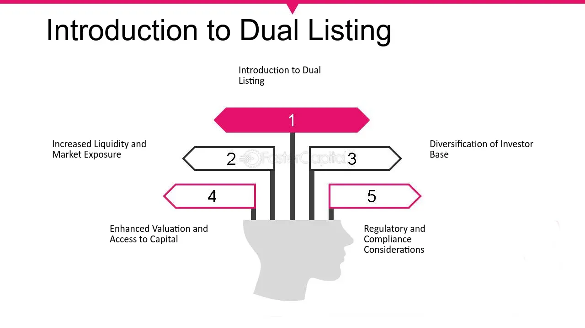

## Table of Contents

## What is dual trading?

Dual trading refers to a situation where a person or a firm is allowed to trade the same financial instrument on two different markets or exchanges. This can happen in commodities, futures, or other financial products. For example, a trader might buy a commodity on one exchange and sell it on another, taking advantage of price differences between the two markets. This practice can be controversial because it might lead to conflicts of interest or market manipulation.

In some cases, dual trading is regulated to prevent unfair practices. Regulators might set rules to ensure that traders do not use information from one market to unfairly influence another. For instance, in the United States, the Commodity Futures Trading Commission (CFTC) oversees dual trading to maintain fair and transparent markets. By managing dual trading, regulators aim to protect investors and maintain the integrity of the financial system.

## How does dual trading work?

Dual trading happens when someone can trade the same thing on two different markets. For example, a trader might buy wheat on one exchange and sell it on another. They do this to make money from the difference in prices between the two places. This can be good for traders because they can find the best prices and make more money. But it can also cause problems if traders use information from one market to unfairly affect the other.

To keep things fair, there are rules about dual trading. In the United States, a group called the Commodity Futures Trading Commission (CFTC) watches over this. They make sure traders don't cheat or use inside information. By doing this, they help keep the markets honest and protect people who are investing their money. So, while dual trading can be a way to make more money, it's important that it's done in a way that is fair for everyone.

## What are the benefits of dual trading for traders?

Dual trading can help traders make more money. They can buy something on one market where it's cheaper and sell it on another market where it's more expensive. This is called taking advantage of price differences. By doing this, traders can increase their profits. It also gives them more choices on where to trade, so they can find the best deals and opportunities.

Another benefit is that dual trading can help traders spread out their risks. If one market has problems, they can still trade on the other market. This means their money is safer because they are not putting all their eggs in one basket. So, dual trading can be a smart way for traders to make more money and keep their investments safer.

## What are the risks associated with dual trading?

Dual trading can be risky because it might lead to conflicts of interest. If a trader knows something about one market, they might use that information to make unfair trades on the other market. This can make the markets less fair and hurt other people who are trading. Regulators worry about this a lot and try to stop it from happening, but it's still a big risk.

Another risk is that dual trading can be hard to manage. Traders need to keep track of prices and rules on two different markets at the same time. If they make a mistake, they could lose a lot of money. Also, if something goes wrong on one market, like a big drop in prices, it can affect the other market too. So, even though dual trading can help traders make more money, it also comes with a lot of risks that they need to be careful about.

## How is dual trading regulated in different countries?

In the United States, dual trading is watched over by the Commodity Futures Trading Commission (CFTC). They make rules to stop traders from using information from one market to unfairly affect another. This helps keep the markets fair and protects people who are investing their money. The CFTC checks to make sure traders follow these rules and can punish them if they don't.

In other countries, like the United Kingdom, the Financial Conduct Authority (FCA) does a similar job. They set rules to stop unfair trading and make sure that markets are honest. Different countries might have different rules, but the main goal is the same everywhere: to keep trading fair and protect investors. Regulators around the world work together to share information and make sure that dual trading is done the right way.

## What are the key differences between dual trading and other trading practices?

Dual trading is when a trader can trade the same thing on two different markets. This is different from other trading practices like single market trading, where a trader only buys and sells on one market. In single market trading, traders don't have the chance to take advantage of price differences between markets, which is a big part of dual trading. Dual trading also involves more risk because traders need to keep track of rules and prices on two markets at the same time.

Another key difference is between dual trading and [arbitrage](/wiki/arbitrage). Arbitrage is when a trader buys something in one market and sells it in another to make money from the price difference, but it's usually done quickly and often in the same type of market. Dual trading, on the other hand, can involve trading over a longer period and across different types of markets. Both practices aim to make money from price differences, but they work in different ways and have different levels of complexity and risk.

## Can you explain the mechanism of dual trading in detail?

Dual trading happens when a trader can buy and sell the same thing on two different markets. For example, a trader might buy wheat on one exchange where it's cheaper and then sell that wheat on another exchange where it's more expensive. The goal is to make money from the difference in prices between the two markets. To do this, the trader needs to watch the prices on both markets very closely. They need to know when to buy on one market and when to sell on the other to get the best deal. This means they have to be good at understanding how prices move and making quick decisions.

But dual trading is not just about making money. It also comes with risks and rules. One big risk is that the trader might make a mistake and lose money if they don't keep track of both markets well. Another risk is that if something goes wrong on one market, like a big price drop, it could affect the other market too. To keep things fair, there are rules about dual trading. In the United States, the Commodity Futures Trading Commission (CFTC) makes sure traders don't cheat or use inside information from one market to unfairly affect the other. These rules help protect other people who are trading and keep the markets honest.

## What historical events have influenced the regulation of dual trading?

In the past, dual trading was not as regulated as it is now. One big event that changed this was the Hunt brothers' attempt to corner the silver market in the late 1970s and early 1980s. The Hunt brothers, Nelson Bunker Hunt and William Herbert Hunt, tried to control the price of silver by buying a lot of it on different markets. This caused big problems and made people worry about how dual trading could be used to manipulate markets. As a result, regulators started to pay more attention to dual trading and made new rules to stop this kind of thing from happening again.

Another event that influenced dual trading regulation was the 1987 stock market crash, also known as Black Monday. On that day, stock markets around the world dropped a lot, and it showed how connected and risky trading could be. People saw that dual trading could make these problems worse if it was not watched closely. After the crash, regulators around the world worked together to make new rules to keep trading fair and protect investors. These events showed that dual trading needed to be carefully managed to keep markets safe and honest.

## How do exchanges monitor and enforce rules related to dual trading?

Exchanges keep a close eye on dual trading to make sure traders follow the rules. They use special computer systems to watch the trades happening on their markets. These systems check for any strange patterns or signs that someone might be trying to cheat. If they see something that looks wrong, they can start an investigation. Exchanges also have rules that traders must follow, like not using information from one market to unfairly affect another. If a trader breaks these rules, the exchange can punish them, like by fining them or even stopping them from trading.

To help make sure everything is fair, exchanges work with regulators like the Commodity Futures Trading Commission (CFTC) in the United States. They share information and work together to stop any bad behavior. Regulators can also step in if they think an exchange is not doing a good job of watching dual trading. This teamwork helps keep the markets honest and protects people who are investing their money. By working together, exchanges and regulators try to make sure dual trading is done the right way.

## What are the ethical considerations surrounding dual trading?

Dual trading can bring up a lot of ethical questions. One big worry is that it might lead to conflicts of interest. If a trader knows something about one market, they could use that information to make unfair trades on another market. This can hurt other traders who don't have the same information. It's not fair if some people can use secret information to make more money while others can't. Regulators try to stop this by making rules, but it's still a big concern.

Another ethical issue is that dual trading might be used to manipulate markets. If traders buy and sell the same thing on different markets, they could try to control the prices to make more money. This can cause big problems for everyone who trades on those markets. It's important for exchanges and regulators to watch out for this kind of behavior and stop it. By doing this, they can help make sure that trading is fair and honest for everyone.

## How has technology impacted the practice of dual trading?

Technology has made dual trading easier and faster. Traders can now use computers and special software to keep track of prices on different markets at the same time. This means they can quickly see when there's a good chance to buy on one market and sell on another to make money from the price difference. Before, traders had to call or visit different places to get this information, which was slow and hard. Now, with technology, they can do it all from their computer or phone, making dual trading more efficient and accessible.

But technology also brings new challenges. It can make it easier for traders to use information from one market to unfairly affect another. Regulators use technology too, with special systems to watch for any strange trading patterns that might be cheating. They can catch problems faster and stop them before they cause big issues. So, while technology helps traders do dual trading better, it also means they have to be more careful to follow the rules and keep trading fair for everyone.

## What future trends might affect the regulation and practice of dual trading?

In the future, technology might change how dual trading works and how it's watched. More computers and smart programs could help traders see prices on different markets even faster. This could make dual trading easier and more common. But it could also make it harder for regulators to keep an eye on everything. They might need new tools and rules to stop cheating and keep trading fair.

Another trend could be more countries working together to make rules about dual trading. As trading happens more and more around the world, it's important for different countries to agree on how to keep it honest. This could mean new laws and more sharing of information between countries. By working together, they can better stop people from using dual trading to trick others and make sure everyone has a fair chance to trade.

## References & Further Reading

[1]: Kang, J. (2016). ["The Regulation of Conflicts of Interest Affecting Financial Markets Intermediaries."](https://www.iosco.org/library/pubdocs/pdf/IOSCOPD342.pdf) International & Comparative Law Quarterly, 25(4), 788-818.

[2]: CFTC. (2016). ["Regulation Automated Trading Proposal."](https://www.federalregister.gov/documents/2016/11/25/2016-27250/regulation-automated-trading) Commodity Futures Trading Commission.

[3]: SEC. (2010). ["Market Access Rule (SEC Rule 15c3-5)."](https://www.sec.gov/files/rules/final/2010/34-63241.pdf) Securities and Exchange Commission.

[4]: Hendershott, T., & Riordan, R. (2013). ["Algorithmic Trading and the Market for Liquidity."](https://www.jstor.org/stable/43303831) Review of Financial Studies, 26(7), 1640-1661.

[5]: Aldridge, I. (2013). ["High-Frequency Trading: A Practical Guide to Algorithmic Strategies and Trading Systems."](https://books.google.com/books/about/High_Frequency_Trading.html?id=6l0DDQAAQBAJ) Wiley Trading.

[6]: Cumming, D. J., Johan, S., & Li, D. (2011). ["Exchange Trading Rules and Stock Market Liquidity."](https://papers.ssrn.com/sol3/papers.cfm?abstract_id=1328553) Journal of Financial and Quantitative Analysis, 46(4), 1091-1115.