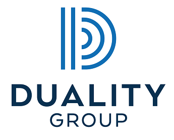

Algorithmic trading has fundamentally transformed the landscape of financial markets over the past few decades. It utilizes mathematical models and complex algorithms to make high-speed, data-driven trading decisions, thus offering advantages in speed, accuracy, and efficiency over traditional methods. This approach now accounts for a significant portion of trading volumes in major global exchanges, with its impact continually expanding due to advances in technology and the increasing availability of market data.

The Duality Group has emerged as a significant player in this dynamic field, deploying sophisticated algorithmic strategies to enhance trading performance. Leveraging cutting-edge technology and deep market insights, Duality Group stands out in the algorithmic trading space by focusing not only on maximizing returns but also on innovation and strategy refinement. The firm's unique edge lies in its ability to combine robust quantitative research with practical trading applications, paving the way for novel financial solutions.

Algorithms are now integral to modern financial strategies, offering the ability to process large volumes of data and execute trades swiftly in response to market conditions. They enhance decision-making by identifying patterns and trends that are not immediately evident through human analysis alone. In this context, Duality Group aims to revolutionize the trading landscape by continually refining its strategies to adapt to and anticipate market movements. Their approach is rooted in a commitment to developing systems that are both technologically advanced and adaptable to changing market dynamics.

Duality Group's distinctiveness and competitive advantage are characterized by its focus on proprietary algorithm development and implementation, supported by a team of experts in quantitative finance, data science, and technology. The company's commitment to innovation and excellence not only sets it apart from its competitors but positions it as a leader in the future trajectory of algorithmic trading. Through the integration of advanced analytics and real-time processing capabilities, Duality Group is well-equipped to offer tailored trading solutions that cater to the specific needs of its clients, ultimately driving success in increasingly competitive markets.

## Table of Contents

## Understanding Algorithmic Trading

Algorithmic trading, also known as algo trading, refers to the use of computer algorithms to automate trading decisions and execute trades based on predefined criteria. These algorithms can analyze market data at speeds and efficiencies beyond human capability, capitalizing on small market movements with minimal human intervention. The primary role of algorithmic trading in the financial sector is to enhance operations by reducing transaction costs, improving accuracy, and increasing the speed at which trades are conducted.

The benefits of using algorithms over traditional trading methods are numerous. First, they offer significant speed advantages, as computers can process data and execute trades much faster than humans. Secondly, algorithms can analyze data and make decisions without the influence of emotions, biases, or fatigue, which are common human challenges. Furthermore, they allow for greater diversification as they can manage multiple trades across various markets simultaneously, taking advantage of price discrepancies that may exist for only a short duration.

The technologies involved in [algorithmic trading](/wiki/algorithmic-trading) include sophisticated trading algorithms, vast data feeds, and market connectivity solutions. These components work together to interpret large volumes of market data, identify trading opportunities, and execute trades almost instantaneously. High-frequency trading ([HFT](/wiki/high-frequency-trading-strategies)), a subset of algorithmic trading, focuses on executing a large number of orders at extremely high speeds, often within microseconds. Technologies like co-location and direct market access (DMA) help in reducing latency, ensuring that trading systems respond to market changes as quickly as possible.

Artificial Intelligence (AI) and [machine learning](/wiki/machine-learning) have significantly impacted algorithmic trading. These technologies enable the development of adaptive and predictive models that can learn from historical data and improve over time. Machine learning algorithms can identify patterns and correlations that might not be evident through traditional statistical methods, allowing for more sophisticated trading strategies. For example, [reinforcement learning](/wiki/reinforcement-learning) can be employed to create models that learn optimal trading strategies by interacting with the market environment.

Current trends in algorithmic trading include the growing adoption of AI-driven strategies, the use of [alternative data](/wiki/best-alternative-data) sources such as social media and satellite data, and the increased focus on ethical and transparent trading practices. Additionally, cloud computing and quantum computing are emerging as potential game-changers in the space. Cloud computing facilitates the processing and storage of massive datasets while reducing infrastructure costs. Quantum computing, although still in its infancy, holds the promise of solving complex computational problems much more efficiently than classical computers, potentially revolutionizing algorithmic trading.

In the future, algorithmic trading is expected to become even more prevalent, with advancements in technology further reducing latency, increasing computational power, and enhancing data analysis capabilities. As financial markets continue to evolve, algorithmic trading will likely play an increasingly critical role in optimizing trading strategies and improving market efficiencies.

## About Duality Group

Duality Group stands as a prominent entity in the field of algorithmic trading, having established itself as a powerhouse through strategic development and innovation. Originating from a merger of industry veterans and technologically adept experts, the company has cultivated a reputation for leadership in creating advanced trading solutions. 

The leadership of Duality Group is spearheaded by key figures who bring a wealth of experience and vision to the company. Their collective expertise is a blend of finance, technology, and strategic management, positioning the company strategically within the competitive landscape of financial markets. The leadership team is committed to steering the company towards achieving sustainable growth while fostering innovation in algorithmic trading.

Duality Group’s mission is to revolutionize trading by harnessing the full potential of technology to deliver superior strategic solutions. Their vision revolves around advancing the integration of cutting-edge technology and financial acumen to optimize trading performance and enhance decision-making processes for their clients. This mission and vision are deeply embedded in their operations, driving the company to continuously evolve and enhance their offerings.

The expertise within Duality Group is notably diverse, encompassing fields such as quantitative finance, computer science, data analytics, and machine learning. This multidisciplinary approach enables the company to leverage a broad range of skills to develop proprietary trading algorithms and systems that are tailored to meet the dynamic needs of the market. The firm’s collaborative culture ensures that ideas are exchanged freely, fostering an environment conducive to groundbreaking innovations.

Milestones achieved by Duality Group underscore their impact and growth within the industry. The company has set several benchmarks, from developing state-of-the-art trading algorithms to achieving significant market penetration through their robust and reliable trading systems. Their journey is marked by strategic expansions and technological advancements that have fortified their position as leaders in algorithmic trading. Over the years, Duality Group has built a distinguished record of accomplishments that reflect their commitment to excellence and innovation in creating value for their clients.

Through a combination of strategic leadership, innovative technology, and a commitment to their core mission and vision, Duality Group continues to elevate standards in the algorithmic trading industry, establishing a path of success and continued growth for the future.

## Duality Group's Algorithmic Trading Solutions

Duality Group has established itself as a formidable entity in the field of algorithmic trading by employing a robust suite of trading strategies designed to optimize performance in diverse financial markets. These strategies are supported by the development of proprietary algorithmic systems that enable the efficient execution of trades, risk management, and market analysis.

At the core of Duality Group's offerings are its proprietary algorithms, which are crafted by leveraging advanced computational techniques and the latest advancements in financial technology. These systems are engineered to process vast volumes of market data with great speed and precision. Through the implementation of machine learning models and statistical methods, Duality Group's algorithms demonstrate the ability to identify and capitalize on profitable trading opportunities while minimizing risk exposure. The use of predictive analytics and sophisticated pattern-recognition capabilities enhances the effectiveness of these algorithms.

Risk management constitutes a fundamental aspect of Duality Group's algorithmic trading solutions. The company employs a robust framework that integrates quantitative risk assessment models to evaluate potential downsides and ensures that trading strategies remain aligned with the desired risk-return profile. Techniques such as Value-at-Risk (VaR) and stress testing are routinely used to measure and mitigate risk, thereby safeguarding client investments.

Market analysis at Duality Group is driven by state-of-the-art data analytics and big data technologies. By harnessing the power of big data, the company can analyze massive datasets in real-time, extracting actionable insights that inform trading decisions. This data-driven approach allows for a comprehensive understanding of market trends and dynamics, enabling Duality Group to adjust strategies promptly in response to evolving market conditions.

To tailor its solutions to meet client-specific needs, Duality Group adopts a highly customized approach. The company's algorithms can be fine-tuned to accommodate the particular objectives and risk tolerance of each client. Customized dashboards and reporting tools provide clients with transparency and control over their trading activities, ensuring that they remain informed and confident in the strategies being executed on their behalf.

Through its proprietary systems, rigorous risk management, and data-driven market analysis, Duality Group offers a competitive edge in algorithmic trading, consistently delivering tailored solutions that meet the diverse needs of its clientele.

## Benefits of Choosing Duality Group for Algorithmic Trading

Duality Group offers several competitive advantages for those seeking algorithmic trading solutions. One of its primary strengths lies in the advanced technology and sophisticated algorithms that provide a distinct edge in financial markets. Clients have frequently reported increased efficiency and improved accuracy in their trading outcomes, as evidenced by numerous success stories and positive testimonials. 

One notable success involved a mid-sized [hedge fund](/wiki/hedge-fund-trading-strategies) that partnered with Duality Group to optimize its trading strategies across multiple asset classes. Through the deployment of proprietary algorithms, the fund experienced a significant increase in annual returns—a testament to Duality's proficiency in algorithmic innovation.

Cost-efficiency is another crucial benefit that clients enjoy with Duality Group. By leveraging cutting-edge technology, the group reduces the need for extensive human intervention, thereby lowering operational costs. This reduction of overhead directly impacts the bottom line, making Duality's solutions not only technologically superior but also economically viable. Algorithmic trading systems can operate with less manpower, reducing both salary and error costs. With [high frequency](/wiki/high-frequency-trading) trading (HFT), these savings and profits can multiply quickly due to the sheer [volume](/wiki/volume-trading-strategy) of trades executed.

The company's commitment to transparency and ethical trading is paramount. Duality Group employs robust compliance frameworks to ensure all algorithmic strategies adhere to regulatory standards. This commitment is integral in maintaining both market integrity and investor trust. The group continually updates its systems to align with new regulations, reflecting an adaptive approach to compliance. This minimizes the risk of legal issues for clients, circumventing potential fines or sanctions.

Moreover, Duality Group takes pride in its exhaustive monitoring and audit systems. Each algorithm is subjected to rigorous testing and performance checks, ensuring consistency and reliability. Through these measures, Duality Group protects its clients from market anomalies and unforeseen [volatility](/wiki/volatility-trading-strategies), further enhancing client security and trust.

In summary, clients gain substantial competitive advantages by choosing Duality Group for their algorithmic trading needs. The blend of profitability, cost-efficiency, transparency, and regulatory compliance fosters a reliable partnership conducive to long-term success in the financial markets.

## Client Experiences and Testimonials

Duality Group has garnered praise from a diverse range of satisfied clients who have benefited from their advanced algorithmic trading solutions. These clients span various profiles, from individual traders to large financial institutions, all of whom have experienced tailored strategies that align precisely with their needs.

One illustrative case study features a mid-sized hedge fund that sought to optimize its trading strategies to increase profitability while managing risk more effectively. Duality Group's team conducted an extensive analysis of the hedge fund's existing trading models and market exposure. They then leveraged their proprietary algorithmic systems to design a bespoke trading strategy that significantly enhanced the hedge fund’s performance. This customized approach resulted in a notable increase in the fund's Sharpe ratio—a measure of risk-adjusted return—demonstrating Duality Group's ability to balance profit maximization with risk mitigation.

The reputation of Duality Group for exceptional customer service and support is consistently highlighted by its clientele. Clients frequently commend the firm for its responsiveness and expertise, ensuring that their queries and concerns are addressed promptly and effectively. This strong focus on client support solidifies trust and fosters long-term partnerships, enabling Duality Group to continuously adapt and refine their solutions to meet evolving client requirements.

Industry experts have recognized Duality Group's substantial impact on the algorithmic trading industry. Analysts from leading financial publications have noted the firm's innovative approach in deploying [artificial intelligence](/wiki/ai-artificial-intelligence) and machine learning to enhance trading performance. The group's commitment to transparency and ethical practices has further reinforced its standing as a leader in the field, emphasizing its influence on setting new standards within the industry.

Overall, feedback from clients and industry experts underscores Duality Group's role as a pivotal player in advancing algorithmic trading technologies and methodologies, providing tangible benefits to their esteemed clientele through innovative solutions and exemplary service.

## Future Directions and Innovations

## Future Directions and Innovations

Algorithmic trading continues to evolve with rapid advancements in technology. The integration of quantum computing, blockchain, and enhanced machine learning algorithms will likely propel the industry forward. Quantum computing, in particular, offers the potential to solve complex optimization problems faster than traditional computers, thus expediting the decision-making processes in trading strategies. Quantum algorithms could efficiently handle large datasets, providing a competitive edge in portfolio management and risk assessment.

Blockchain technology also presents promising opportunities. It ensures data integrity and security, potentially transforming back-office processes, trade settlements, and regulatory compliance. By adopting blockchain, companies like Duality Group can facilitate transparent and efficient transactions, aligning with growing demands for accountability and decentralization in financial markets.

New markets are emerging for algorithmic trading firms, including the environmental and social governance ([ESG](/wiki/esg-investing)) markets. As sustainable investing gains popularity, Duality Group can leverage algorithmic models to identify ESG-focused investment opportunities. These models can analyze vast data on environmental impact, corporate governance, and social responsibility, allowing traders to align portfolios with these values while optimizing returns.

To stay ahead of competition, companies must invest in continuous research and development. Duality Group can lead by adopting cutting-edge artificial intelligence (AI) techniques. Techniques like reinforcement learning, which enables algorithms to learn optimal strategies through trial and error, can improve trading performance. Reinforcement learning models can adjust to market changes dynamically, a significant advantage in volatile markets.

Duality Group’s initiatives could further include collaborating with academic institutions and tech firms to nurture innovation. By fostering partnerships, the company can access a broader spectrum of expertise, accelerating the development of innovative trading solutions. These initiatives could involve internships, joint research projects, and tech incubation programs.

As for predictions, the financial industry is expected to embrace greater automation and data-centric approaches, driven by algorithmic trading’s efficiency and accuracy. Data analytics and AI will increasingly shape investment strategies, shifting focus from traditional analysis to predictive and prescriptive analytics. Duality Group, with its commitment to innovation, is poised to play a significant role in this evolution, shaping how financial markets operate and opening new opportunities for growth and expansion.

## Conclusion

Duality Group has significantly reshaped the algorithmic trading landscape through its innovative approaches and robust technology solutions. The company has established itself as a key player by developing proprietary algorithms and methodologies that leverage the power of big data analytics, artificial intelligence, and machine learning. These technological advancements have enabled Duality Group to offer sophisticated and effective trading strategies that yield a competitive edge in the market.

Key strengths of Duality Group include its commitment to transparency, ethical trading practices, and stringent adherence to financial regulations. The company's tailored solutions, designed to meet specific client needs, highlight its ability to deliver precise and profitable trading outcomes. Furthermore, Duality Group’s emphasis on risk management and market analysis ensures optimized trading performance and mitigated potential downsides.

Potential clients are encouraged to explore partnership opportunities with Duality Group, as aligning with their ethos and innovative practices promises enhanced trading efficiency and profitability. The company’s track record of success stories and client testimonials underscores its reputation for excellence in customer service and support, making it a reliable partner in the algorithmic trading arena.

Looking ahead, Duality Group is well-positioned to capitalize on future technological advancements in algorithmic trading. The company is actively exploring new markets and opportunities, underscored by its robust research and development initiatives. Duality Group is committed to maintaining its competitive edge by staying at the forefront of innovation, thereby continuing to play a pivotal role in the evolving financial industry.

In conclusion, embracing technology with partners like Duality Group is essential for those looking to optimize their financial strategies. By harnessing the full potential of algorithmic trading, investors and institutions can achieve superior results, driven by technology, expertise, and a forward-thinking approach.

## References & Further Reading

[1]: Treleaven, P., Galas, M., & Lalchand, V. (2013). ["Algorithmic Trading Review."](https://www.researchgate.net/publication/262239006_Algorithmic_Trading_Review) Journal of Financial Markets, 16(3), 326-336.

[2]: Aldridge, I. (2010). ["High-Frequency Trading: A Practical Guide to Algorithmic Strategies and Trading Systems."](https://www.amazon.com/High-Frequency-Trading-Practical-Algorithmic-Strategies/dp/1118343506) Wiley.

[3]: López de Prado, M. (2018). ["Advances in Financial Machine Learning."](https://www.amazon.com/Advances-Financial-Machine-Learning-Marcos/dp/1119482089) Wiley.

[4]: Chan, E. P. (2009). ["Quantitative Trading: How to Build Your Own Algorithmic Trading Business."](https://github.com/ftvision/quant_trading_echan_book) Wiley.

[5]: Aronson, D. R. (2007). ["Evidence-Based Technical Analysis: Applying the Scientific Method and Statistical Inference to Trading Signals."](https://onlinelibrary.wiley.com/doi/book/10.1002/9781118268315) Wiley.

[6]: Jansen, S. (2020). ["Machine Learning for Algorithmic Trading: Second Edition."](https://www.amazon.com/Machine-Learning-Algorithmic-Trading-alternative-ebook/dp/B08D9SP6MB) Packt Publishing.

[7]: Kissell, R. (2014). ["The Science of Algorithmic Trading and Portfolio Management."](https://www.sciencedirect.com/book/9780124016897/the-science-of-algorithmic-trading-and-portfolio-management) Academic Press.