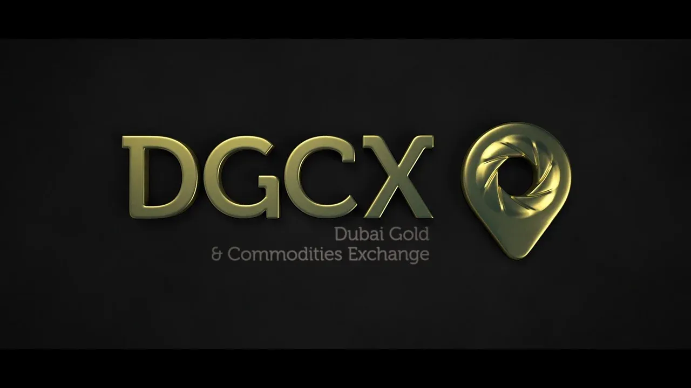

## Table of Contents

## What is the Dubai Gold & Commodities Exchange (DGCX)?

The Dubai Gold & Commodities Exchange (DGCX) is a financial marketplace located in Dubai, United Arab Emirates. It was established in 2005 to provide a platform for trading commodities like gold, silver, and other metals, as well as currencies and energy products. The DGCX helps businesses and investors buy and sell these products easily and safely.

The exchange is important because it helps set prices for commodities that are used around the world. It also makes it easier for people to invest in these commodities without having to physically own them. The DGCX is regulated by the Dubai Financial Services Authority, which ensures that trading is fair and transparent. This makes it a trusted place for people to trade.

## When was the DGCX established and why?

The DGCX was set up in 2005. It was created to give people and businesses a place to trade things like gold, silver, and other important materials. Before the DGCX, it was harder for people to buy and sell these items because they had to deal with physical products. The DGCX made it easier by letting people trade without having the actual items.

The main reason for starting the DGCX was to help set prices for these materials that are used all over the world. It also makes it easier for people to invest in these materials without having to own them physically. The DGCX is watched over by the Dubai Financial Services Authority to make sure everything is fair and clear. This helps people trust the DGCX and use it to trade safely.

## What types of commodities are traded on the DGCX?

The DGCX is a place where people trade different kinds of things. They trade gold and silver, which are precious metals. They also trade other metals like copper and zinc. These metals are important for making things like electronics and buildings.

Besides metals, the DGCX also trades energy products. This includes things like [crude oil](/wiki/crude-oil) and natural gas. These are used for fuel and heating. The DGCX also lets people trade currencies, which are different kinds of money from around the world. This helps businesses and investors deal with money from different countries.

## How does trading work on the DGCX?

Trading on the DGCX works by people buying and selling things like gold, silver, and other stuff without actually having them. They do this through something called futures contracts. A futures contract is like a promise to buy or sell a certain amount of a commodity at a set price on a future date. Traders use these contracts to guess what prices might be in the future and make money from the difference. The DGCX has a special computer system where all these trades happen. This system makes sure everything is fair and everyone can see what's happening.

The DGCX is open for trading during certain hours each day. During these times, traders can place orders to buy or sell. These orders go into the computer system, and if someone wants to buy at the same price someone else wants to sell, a trade happens. The DGCX also has rules to make sure trading is safe and fair. For example, they check to make sure people have enough money to cover their trades. This helps keep the market stable and trustworthy.

## Who can trade on the DGCX and what are the membership requirements?

Anyone who wants to trade on the DGCX can do so, but they need to be a member or work with a member. Members are usually big companies or banks that have the money and knowledge to trade. There are different types of members, like trading members who can trade for themselves and their clients, and clearing members who handle the money part of the trades. To become a member, a company needs to fill out an application and show that they have enough money and meet the DGCX rules.

The DGCX checks the money part very carefully. They want to make sure that members can pay for their trades. This keeps the market safe and fair. If someone wants to trade but isn't a member, they can work with a member who will do the trading for them. This way, even people who aren't members can still use the DGCX to buy and sell things like gold and silver.

## What are the trading hours of the DGCX?

The DGCX has specific times when people can trade. These times are called trading hours. The main trading hours are from 7:00 AM to 11:30 PM Dubai time, Monday to Friday. This means traders have a big window of time to buy and sell things like gold, silver, and other stuff.

There are also special trading sessions called the Pre-Open Session and the Pre-Close Session. The Pre-Open Session starts at 6:45 AM and lasts until 7:00 AM. This is when people can get ready for the main trading time. The Pre-Close Session happens from 11:30 PM to 11:45 PM. This is a time to wrap up any last trades before the market closes for the day.

## How does the DGCX contribute to the global commodities market?

The DGCX helps the global commodities market by giving people a place to trade things like gold, silver, and energy products easily. It makes it simpler for people all over the world to buy and sell these items without having to move them physically. This is important because it helps set prices that everyone can use. When people from different countries trade on the DGCX, it brings the world closer together and makes the market work better.

The DGCX also makes the global commodities market more trustworthy. It is watched over by the Dubai Financial Services Authority, which makes sure everything is fair and clear. This helps people feel safe when they trade on the DGCX. By having strict rules and a good system, the DGCX helps keep the market stable. This stability is good for everyone because it makes it easier to plan and do business with commodities around the world.

## What are the key benefits of trading on the DGCX?

Trading on the DGCX has many good things for people who want to buy and sell things like gold, silver, and energy. One big benefit is that it's easy to trade without having the actual stuff. You can use futures contracts to guess what prices will be in the future and make money from the difference. This means you don't need to store or move heavy metals or other stuff, which saves time and money. The DGCX also helps set prices that everyone around the world can use, making it easier for businesses to plan and make deals.

Another good thing about the DGCX is that it's safe and fair. The Dubai Financial Services Authority watches over it to make sure everything is done right. This makes people trust the DGCX and feel safe when they trade. The DGCX also has a good computer system that keeps everything clear and open. This helps keep the market stable, which is good for everyone who trades there. By being a trusted place to trade, the DGCX helps the global market work better.

## Can you explain the role of the DGCX in risk management for commodity traders?

The DGCX helps commodity traders manage their risks by letting them use futures contracts. These contracts let traders agree on a price for a commodity today, but buy or sell it later. This can protect them from big price changes in the future. For example, if a trader thinks the price of gold might go up, they can buy a futures contract now at a lower price. If the price does go up, they can sell the gold at the higher price and make money. If the price goes down, they still have to buy it at the agreed price, but they won't lose as much as if they had bought it right away.

The DGCX also has rules and a good computer system to make sure trading is fair and safe. This helps traders feel confident that they can manage their risks well. The DGCX checks to make sure everyone has enough money to cover their trades. This keeps the market stable and helps traders plan better. By giving traders a trusted place to manage their risks, the DGCX helps them protect their money and make smarter decisions about buying and selling commodities.

## What are the major developments or expansions that have occurred at the DGCX since its inception?

Since it started in 2005, the DGCX has grown a lot. It began by trading just gold and silver, but now it trades many other things like copper, zinc, crude oil, and different kinds of money. The DGCX has also made it easier for people from all over the world to trade by working with other big exchanges and setting up rules that everyone can follow. This has helped the DGCX become a bigger and more important part of the global market.

One big change was in 2016 when the DGCX started trading Indian rupee futures. This was a new way for people to trade money from India, and it made the DGCX even more useful for traders. The DGCX also keeps making its computer system better to handle more trades and make everything faster and safer. These changes have helped the DGCX keep up with the growing needs of traders and stay a trusted place for buying and selling commodities.

## How does the DGCX ensure market transparency and integrity?

The DGCX works hard to make sure that trading is fair and clear for everyone. They do this by having strict rules that everyone must follow. The Dubai Financial Services Authority watches over the DGCX to make sure these rules are followed. This helps traders feel safe and trust that the market is honest. The DGCX also uses a good computer system that shows all the trades happening in real time. This means everyone can see what's going on, which helps keep everything open and fair.

Another way the DGCX makes sure the market is honest is by checking that traders have enough money to cover their trades. They do this to keep the market stable and stop big problems from happening. The DGCX also keeps improving its computer system to make trading faster and safer. By doing all these things, the DGCX helps make sure that trading is done the right way and everyone can trust the market.

## What future trends or innovations can we expect from the DGCX in the commodities trading sector?

The DGCX is always looking for new ways to make trading easier and better. One trend we might see is more use of technology, like using computers and the internet to trade. This can make trading faster and let more people from around the world join in. The DGCX might also start trading new kinds of things, like green energy products or other stuff that's becoming more important. This would help people invest in things that are good for the planet.

Another thing we might see is the DGCX working more with other big exchanges around the world. This can help make trading smoother and give people more choices. The DGCX could also use new technology to make sure trading is even safer and more fair. For example, they might use special computer programs to watch for any cheating or mistakes. By doing these things, the DGCX can keep being a trusted place for people to trade and help the global market grow.

## References & Further Reading

[1]: ["The Handbook of Commodity Investing"](https://archive.org/details/handbookofcommod0000fabo) by Frank J. Fabozzi and Roland Fuss

[2]: ["Commodities and Commodity Derivatives: Modeling and Pricing for Agriculturals, Metals and Energy"](https://www.amazon.com/Commodities-Commodity-Derivatives-Modelling-Agriculturals/dp/0470012188) by Helyette Geman

[3]: Dubai Gold and Commodities Exchange: [Official Website](https://www.dgcx.ae/) 

[4]: Emirates Securities and Commodities Authority: [Official Website](https://www.sca.gov.ae/en/home.aspx)

[5]: IOSCO Principles for Financial Market Infrastructures: [IOSCO Website](https://www.iosco.org/library/pubdocs/pdf/IOSCOPD377-PFMI.pdf)